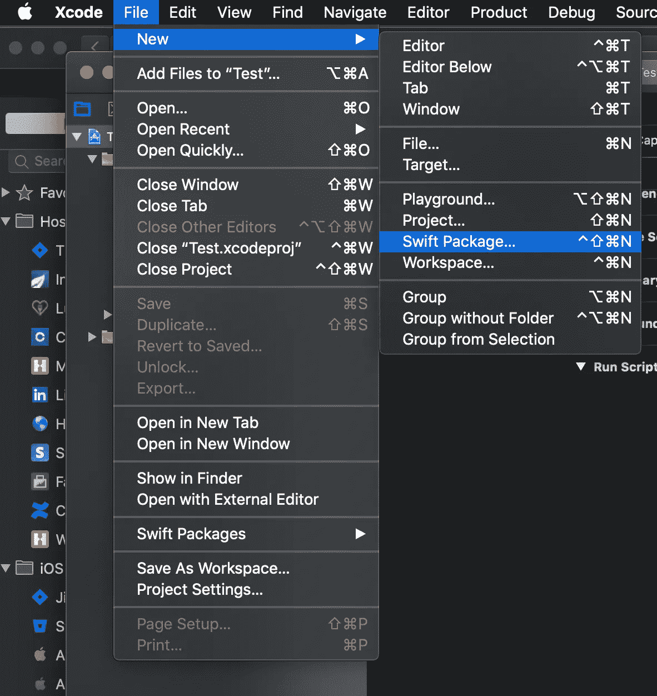
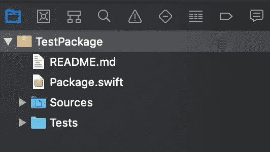
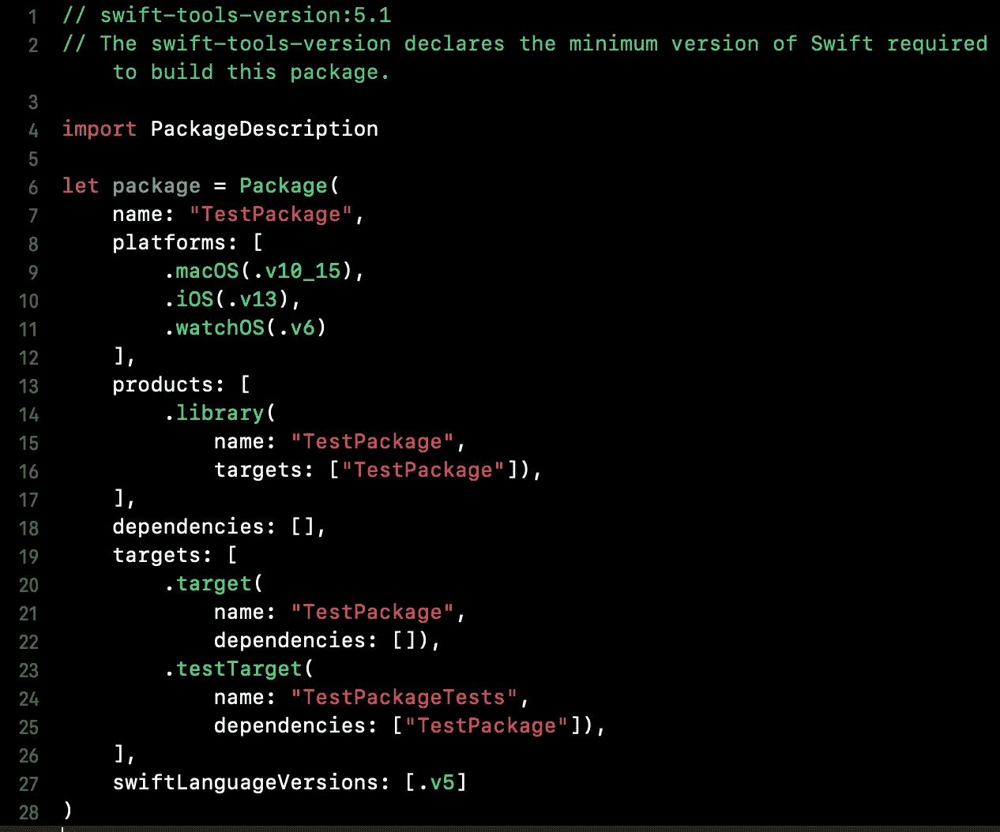
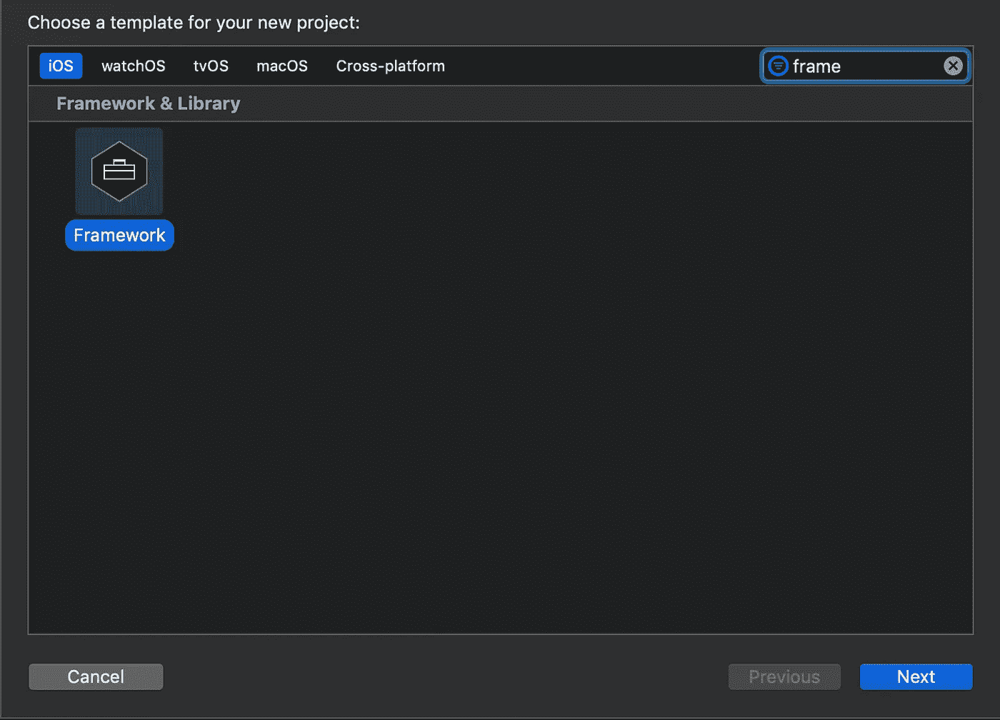
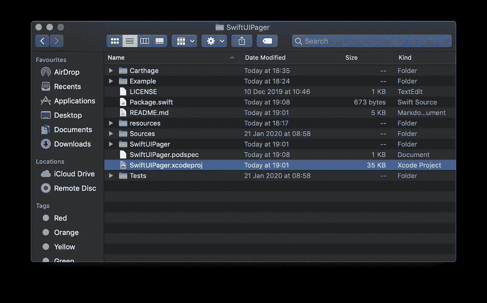
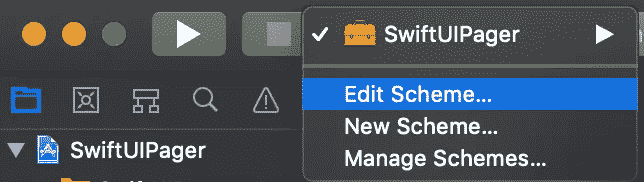
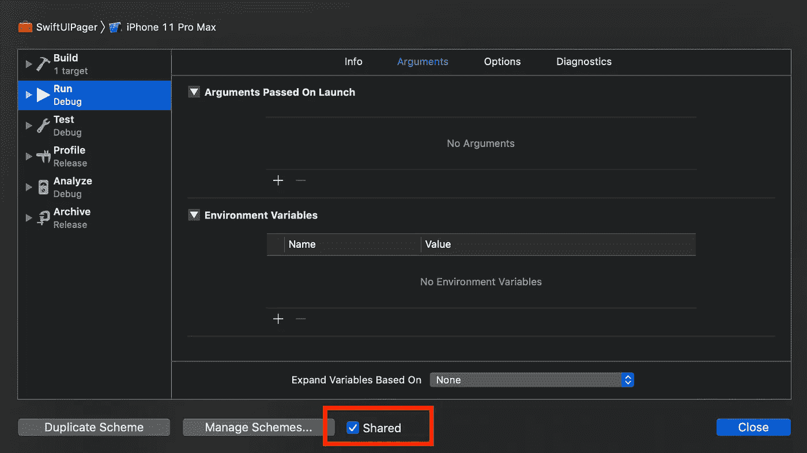
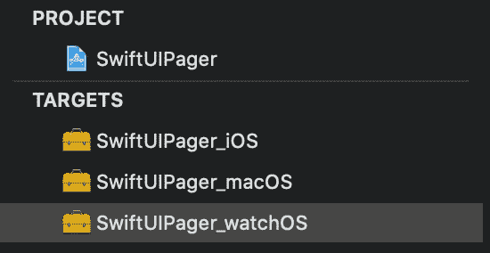

# 通过 Swift Package Manager、CocoaPods 和 Carthage 分发您的 Swift 包

> 原文：<https://betterprogramming.pub/distribute-your-swift-package-with-swift-package-manager-cocoapods-and-carthage-c924e2db4b7f>

## 让其他人可以访问您的框架


# 介绍

您最近是否创建了一个框架，并且想要发布，但是不确定如何发布？你是不是失去了理智，试图用不同的依赖管理器来支持你的框架？

请继续阅读，因为这是为你准备的教程。

在本文中，我将解释如何将您的包分发到:

*   [Swift 包管理器](https://swift.org/package-manager/)
*   [迦太基](https://github.com/Carthage/Carthage)
*   [椰子](https://cocoapods.org/)

我不会告诉你任何关于 Git 或如何处理你的库的细节。我将把重点放在分发包所需的文件/结构上。你可以在这里找到一个例子:

[](https://github.com/fermoya/SwiftUIPager) [## fermoya/SwiftUIPager

### SwiftUIPager 提供了一个用 SwiftUI 本机组件构建的 Pager 组件。寻呼机是一个视图，它呈现一个可滚动的…

github.com](https://github.com/fermoya/SwiftUIPager) 

# 要求

要学习本教程，您需要安装:

*   椰子足类
*   迦太基

如果不是这样，您可以随时使用[自制软件](https://brew.sh/index_es):

```
brew install carthage
brew install cocoapods
```

# Swift 软件包管理器

如果你还没有创建一个 repo，我建议你先在 Xcode 中创建一个 Swift 包，然后上传 Xcode 创建的文件夹结构。如果没有，就在你的文件夹中创建一个类似的结构。简单来说:

*   创建一个`Package.swift`文件。
*   将所有文件添加到 repo 根目录下的一个`Sources`文件夹中。

如果你还没有开始你的回购，进入 Xcode 点击文件->新建-> Swift 包…



使用最适合您的包的名称。观察 Xcode 创建的结构:



将您的所有文件添加到`/Sources`文件夹下，然后进入`Package.swift`。

该文件将告诉 Swift Package Manager 您支持的平台、构建您的包所需的依赖项以及要编译的 Swift 版本等。



正如您可能已经猜到的，这里指定的依赖项必须支持 Swift Package Manager。

就这样，你有一个 Swift 包可以参考了！您只需要在 repo 中创建一个新标签，并指定一个版本号。

# 椰子足类

转到 repo 根文件夹，创建一个扩展名为. podspec 的文件。文件名通常应该是您的包名，但这不是必需的。

在该文件中，添加以下内容:

这些是基本的。你可以去掉那些你不需要的。例如，如果您的包不依赖于任何其他 pod，您就不需要添加任何`spec.dependency`条款。

CocoaPods 是一个中央存储库，所以请确保您已经创建了一个标签，并且`spec.source`正确地引用了这个标签。例如，如果你的标签叫做`v1.1`，那么*下面的代码就不会工作*:

```
spec.version      = "1.1"
spec.source       = { :git => "https://link_to_my_repository.git", :tag => "#{spec.version}" }
```

下面的代码也不会:

```
spec.version      = "1.1.0"
spec.source       = { :git => "https://link_to_my_repository.git", :tag => "v#{spec.version}" }
```

在第一个代码片段中，规范中参数化的`tag`解析为`1.1`，而在第二个示例中，它解析为`v1.1.0`。都不符合`v1.1`。

注意奇怪的字符，如重音符`*`*`而不是单引号`*’*`。这些很难发现，有时`pod`命令不会给出明确的错误信息。

要将您的框架上传到 CocoaPods，请转到您的终端，`cd`到您的`podspec`文件所在的文件夹，并使用:

```
pod trunk register myEmail@example.com
```

验证您的电子邮件，然后:

```
pod trunk push myPackage.podspec
```

如果失败，运行以下命令找出原因:

```
pod spec lint myPackage.podspec --verbose
```

# 迦太基

要用 Carthage 创建一个分布式框架，你需要一个共享框架。进入 Xcode，文件->新建->项目，寻找 CocoaFramework:



给框架起一个和你的包一样的名字，确保它在你的库的同一个根目录下。它应该是这样的:



点击您的`xcodeproj`文件，在 Xcode 中打开项目，并将您的文件添加到您的框架中。

请记住，它们应该位于与您的`xcodeproj`文件相同的文件夹`Sources`中。确保将它们添加为引用，这样它们就不会被复制。

现在，仔细检查您的 Cocoa 框架是否有一个共享方案。进入您的方案->编辑方案…:



并确保*共享*复选框处于启用状态:



如果您的框架支持多个平台，请根据需要多次复制您的目标和方案:



每个目标都应该进行适当的配置:

*   基础 SDK
*   支持的平台
*   共享方案
*   部署目标
*   所有文件都链接到目标
*   …

要检查一切是否正常，您可以运行:

```
carthage build --no-skip-current
```

这将在您的`root`文件夹中生成一个`Carthage`文件夹，并为每个支持的平台生成一个`.framework`文件:


如果出现任何问题，Carthage 会为您生成一个日志。

最有可能的是，它将与目标配置有关。您可以尝试在运行命令时关闭 Xcode，这可能会达到目的。有时，不同的机器也有帮助。

不要忘记创建一个包含这个项目的标签。剩下的就看迦太基了。

# 结论

在我们讨论的三个依赖管理器中，Swift Package Manager 无疑是最容易处理的一个。毕竟，它是由苹果公司开发的，他们已经确保它与 Xcode 很好地集成在一起。

椰子兽和迦太基都可能很难对付，尤其是你第一次和它们打交道的时候。

在设置它们的时候很容易忘记一些事情:毕竟，你处理的是一个纯文本文件或者一个项目文件…好的一点是，一旦设置好了，它们很可能不会改变。

# 资源

*   [使用 Xcode 创建独立的 Swift 包](https://developer.apple.com/documentation/xcode/creating_a_standalone_swift_package_with_xcode)
*   [规格和规格回购](https://guides.cocoapods.org/making/specs-and-specs-repo.html)
*   [制作椰子](https://guides.cocoapods.org/making/making-a-cocoapod.html)
*   [为你的框架支持 Carthage】](https://github.com/Carthage/Carthage#supporting-carthage-for-your-framework)