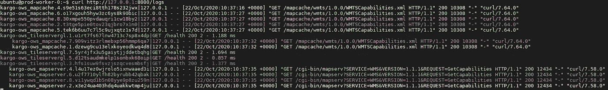

# Docker 简化了分布式即时日志

> 原文：<https://betterprogramming.pub/distributed-instant-logs-made-easy-with-docker-b5e7f501f045>

## 如何在 Slack 上轻松通知您的微服务基础架构中出现的错误


在微服务基础设施上，日志监控仍然是一个具有挑战性的问题

[微服务架构风格](http://searchmicroservices.techtarget.com/definition/microservices)为开发团队提供了一种更加分散的构建软件的方法，每个服务都被独立地隔离、构建、部署和管理。因此，[容器](https://medium.com/swlh/what-exactly-is-docker-1dd62e1fde38)已经成为包装个人服务的事实上一致且资源高效的标准。然后出现了编排工具，如 [Docker Swarm](https://docs.docker.com/engine/swarm/) 、 [Kubernetes](https://kubernetes.io/) 和 [Nomad](https://www.nomadproject.io/) 。这些工具有助于自动化扩展、部署和容器管理。

尽管由于这些突破，微服务管理的复杂性正在降低，但一些挑战仍然存在，如对此类基础设施的平稳轻松监控。例如， [ELK 堆栈](https://blog.jhink.com/centralize-docker-logs-using-elastic-stack-e55670bfb714)通常用于满足这种需求。解决方案也作为[托管](https://docs.aws.amazon.com/AmazonCloudWatch/latest/monitoring/ContainerInsights.html) [服务](https://www.dynatrace.com/technologies/docker-monitoring/)存在于云中。

然而，如果您想要管理自己的基于 Docker 的基础架构，而不引入太多的复杂性或太多的工具，同时限制对云提供商的依赖，那么剩下的选择就很少了。本文介绍了 [Logspout](https://github.com/gliderlabs/logspout) 和一个新的 [Slack adapter](https://github.com/kalisio/logspout-slack) 作为 Docker 容器的轻量级日志监控替代方案，您可以快速配置和部署它。

# 一言以蔽之

Logspout 是 Docker 容器的日志路由器，在 Docker 内部运行。它附加到主机上的所有容器，然后将它们的日志路由到目的地。它在每个 Docker 实例上充当非侵入式代理，从每个运行的守护进程收集日志。使用 [httpstream 模块](http://github.com/gliderlabs/logspout/blob/master/httpstream)，您可以简单地在给定的实例上连接 curl，以实时查看您的本地聚合日志:



来自我们的一个基础架构的聚合日志输出

这已经是一个有趣的替代方案，例如， [Docker Swarm 服务日志](https://docs.docker.com/engine/reference/commandline/service_logs/)，其中来自不同基础设施实例的交错日志并不总是易于阅读。

Logspout 是模块化的，允许您通过适配器导出各种格式的日志。最常见的方法是获取所有的日志并将它们发送到一个远程的 [syslog](https://en.wikipedia.org/wiki/Syslog) ，比如 [Papertrail](https://www.papertrail.com/) 。除了内置适配器，您还会发现[社区驱动的适配器](https://github.com/gliderlabs/logspout#third-party-modules)。一旦选择了适配器，Logspout 的部署非常简单:

```
docker run --name="logspout" \
	--volume=/var/run/docker.sock:/var/run/docker.sock \
	gliderlabs/logspout \
	syslog+tls://logs.papertrailapp.com:55555
```

它还为您提供了根据名称和输出类型(`stdout`、`stderr`或两者)过滤要记录的容器的能力:

```
docker run --name="logspout" \
	--volume=/var/run/docker.sock:/var/run/docker.sock \
	gliderlabs/logspout \
	syslog+tls://logs.papertrailapp.com:55555?filter.sources=stdout%2Cstderr&filter.name=*my_container*'
```

**注意:**您必须对参数值进行 URL 编码，这样逗号和名称过滤器就不是正则表达式，而是一个[路径模式](https://godoc.org/path#Match) *。*

# Logspout 松弛适配器

Logspout 的这个[极简适配器](https://github.com/kalisio/logspout-slack)背后的想法非常简单:发送重要的日志(意外错误、警告等)。)作为对你懈怠的通知，使用[网钩](https://api.slack.com/messaging/webhooks)。

首先，您可以使用`SLACK_WEBHOOK_URL`环境变量定义您的 web hook URL/路径。然后，有不同的[配置选项](https://github.com/kalisio/logspout-slack#configuration-options)作为一组环境变量来定制您如何过滤和格式化通知:

*   `SLACK_MESSAGE_FILTER`:转到 [regex](https://godoc.org/regexp#Regexp.MatchString) 根据日志内容选择要发送到 Slack 的日志
*   `SLACK_TITLE_TEMPLATE`:转到[模板表达式](https://golang.org/pkg/text/template/)根据上下文格式化通知标题
*   `SLACK_LINK_TEMPLATE` : Go [模板表达式](https://golang.org/pkg/text/template/)根据上下文生成通知标题链接
*   `SLACK_MESSAGE_TEMPLATE`:进入[模板表达式](https://golang.org/pkg/text/template/)根据上下文格式化通知内容
*   `SLACK_COLOR_TEMPLATE`:转[模板表达式](https://golang.org/pkg/text/template/)根据上下文生成通知颜色

不同模板的评估上下文包括以下对象:

*   `Message`:log spout 路由器消息，除了作为`Data`字段的日志内容本身之外，它还拥有关于容器的大量信息(请参考相关的 Go 类型以了解详细信息)
*   `Env`:环境变量的映射，您可以使用模板中的[索引函数](https://golang.org/pkg/text/template/#hdr-Functions)从您的特定环境设置中提取一些信息

Logspout 模块由 [go-extpoints](https://github.com/progrium/go-extpoints) 启用，这是一种用于[反转控制](http://en.wikipedia.org/wiki/Inversion_of_control)的机制，类似于[依赖注入](http://en.wikipedia.org/wiki/Dependency_injection)。每个扩展点代表模块可以挂接的 Logspout 的一部分。更具体地说，我们依靠`AdapterFactory`来添加我们的新型路由适配器(例如`slack`)。

# 监控你自己的日志

幸运的是，分叉 Logspout 是不必要的，因为它包含了类似于 Nginx 模块的模块概念。

模块是在编译时添加或删除的功能块。按照说明构建您自己的 [Logspout 映像](https://github.com/gliderlabs/logspout/tree/master/custom)，包括我们的 Logspout Slack 适配器。简而言之，复制`custom`文件夹的内容，并在`modules.go`中的其他内容之上添加以下导入行:

```
import (
  _ "github.com/kalisio/logspout-slack"
  ...
)
```

如果您想为生产部署选择一个特定的版本，只需像这样更新`Dockerfile`:

```
ARG VERSION
FROM gliderlabs/logspout:$VERSIONONBUILD COPY ./build.sh /src/build.sh
ONBUILD COPY ./modules.go /src/modules.go
```

然后，通过提供所需的`VERSION`标记来构建您的映像:

`docker build --no-cache --pull --force-rm --build-arg VERSION=v3.2.11 -f dockerfile -t logspout:v3.2.11 .`

最后，在每个实例上使用您的配置运行它:

```
docker run --name="logspout" \
	--volume=/var/run/docker.sock:/var/run/docker.sock \
	logspout:v3.2.11 \
        -e SLACK_MESSAGE_FILTER=".*error" \
	slack://hooks.slack.com?filter.sources=stdout%2Cstderr&filter.name=*my_container*'
```

如果您使用 Docker Swarm，下面是一个更完整的 Docker 合成文件示例，以便将其部署为一个全局服务:

```
version: '3.5'

services:
  logspout:
    image: logspout:v3.2.11
    volumes:
      - /etc/hostname:/etc/host_hostname:ro
      - /var/run/docker.sock:/var/run/docker.sock
    command:
      - 'slack://hooks.slack.com?filter.sources=stdout%2Cstderr&filter.name=*app*'
    environment:
      - SUBDOMAIN
      - SLACK_TITLE_TEMPLATE={{`{{ .Message.Container.Name }}`}}
      - SLACK_MESSAGE_TEMPLATE={{`{{ .Message.Data }}`}}
      - SLACK_LINK_TEMPLATE={{`[https://app.{{](https://aktnmap.{{) index .Env "SUBDOMAIN" }}`}}
      - SLACK_WEBHOOK_URL=/services/xxx
      - SLACK_MESSAGE_FILTER=".*error"
      - BACKLOG=false
    healthcheck:
      test: ["CMD", "wget", "-q", "--tries=1", "--spider", "http://localhost:80/health"]
      interval: 30s
      timeout: 5s
      retries: 3
      start_period: 1m
    deploy:
      mode: global
      resources:
        limits:
          cpus: '0.20'
          memory: 256M
        reservations:
          cpus: '0.10'
          memory: 128M
      restart_policy:
        condition: on-failure
    networks:
      - network

networks:
  network:
    name: your_name
    external: true
```

**注意:**注意将你的模板表达式括在``{{`和``}}` 之间，因为 Docker Swarm [也将变量作为模板表达式](https://github.com/gliderlabs/logspout/issues/273)处理。

一旦部署了 Logspout 服务，您应该会在 Slack 中看到一些通知:


最终的结果是:在您的 alert Slack 通道上有一些来自您的基础设施的错误日志

# 结论

我希望你会发现这个解决方案非常简单和有用——如果是这样，请不要犹豫，在我们新的 Logspout Slack adapter [存储库中打开问题或 PR，](https://github.com/kalisio/logspout-slack)因为我们需要来自社区的一些反馈。

如果你和我们一样在 [Kalisio](http://kalisio.com/) 工作，对构建一个[基于微服务的平台](https://blog.feathersjs.com/a-use-case-of-microservices-with-feathersjs-building-a-geospatial-platform-56373604db71)感兴趣，你可以看看我们的一些[开源项目](https://github.com/kalisio)，比如:

*   [Kaabah](https://kalisio.github.io/kaabah/) ，一个构建和运营 Docker 群基础设施的解决方案
*   Kargo 是一个基于 Docker 的解决方案，用于在 Docker Swarm 基础设施上部署服务

我在本文中介绍的现在是 Kargo 内置监控栈的[部分。](https://kalisio.github.io/kargo/reference/environment.html#logspout)