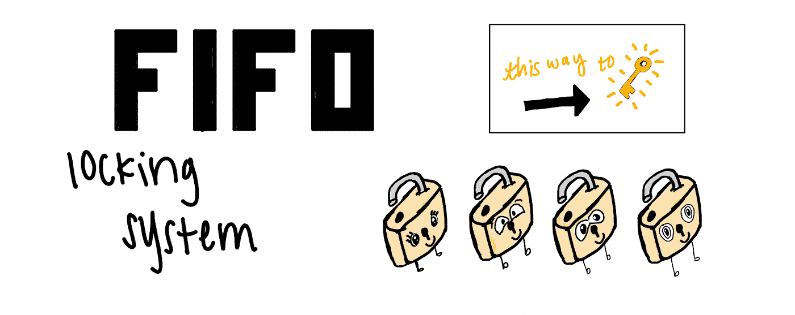
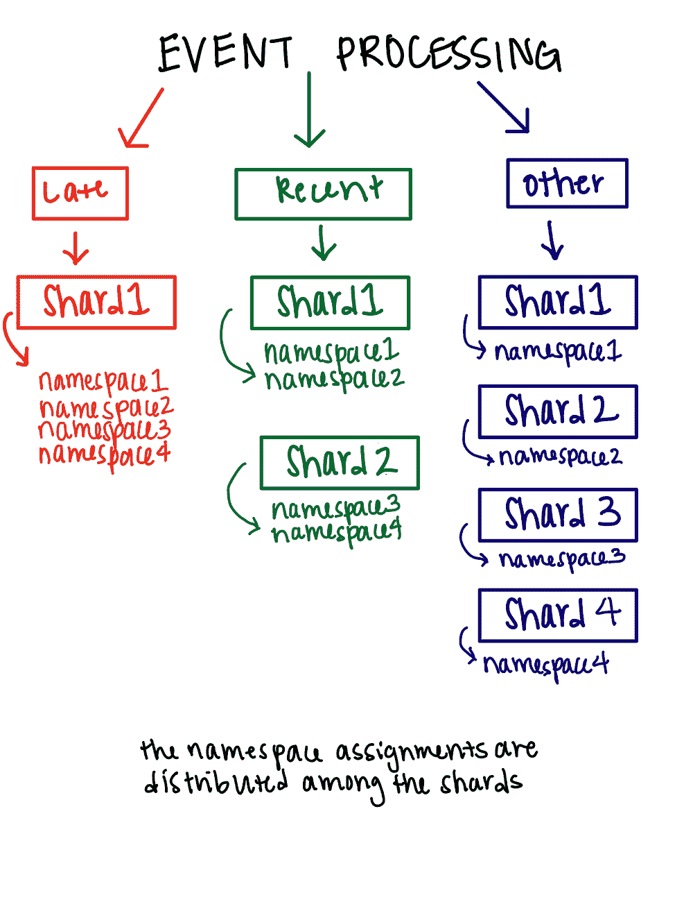
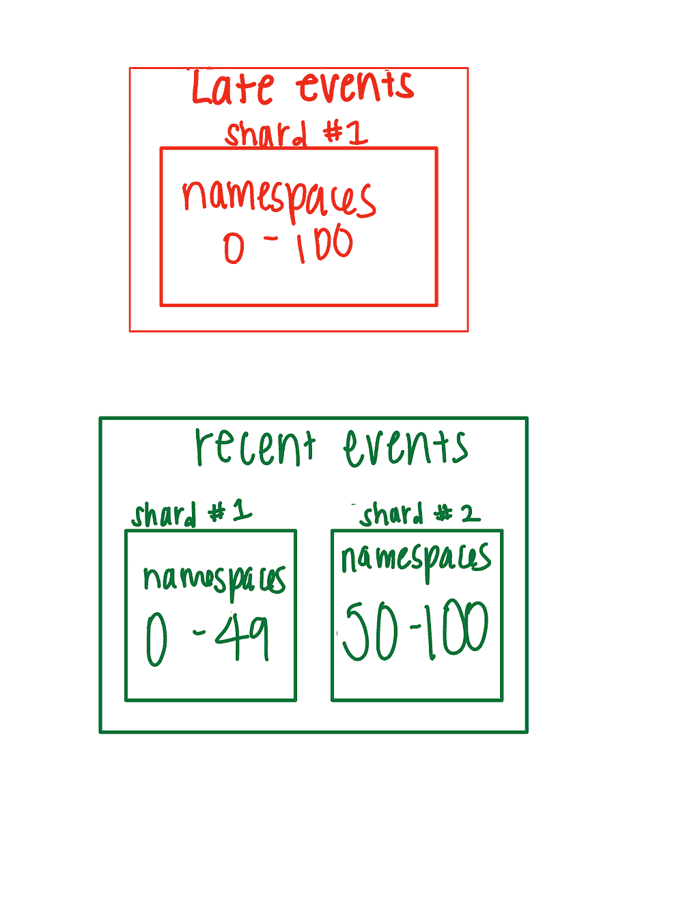
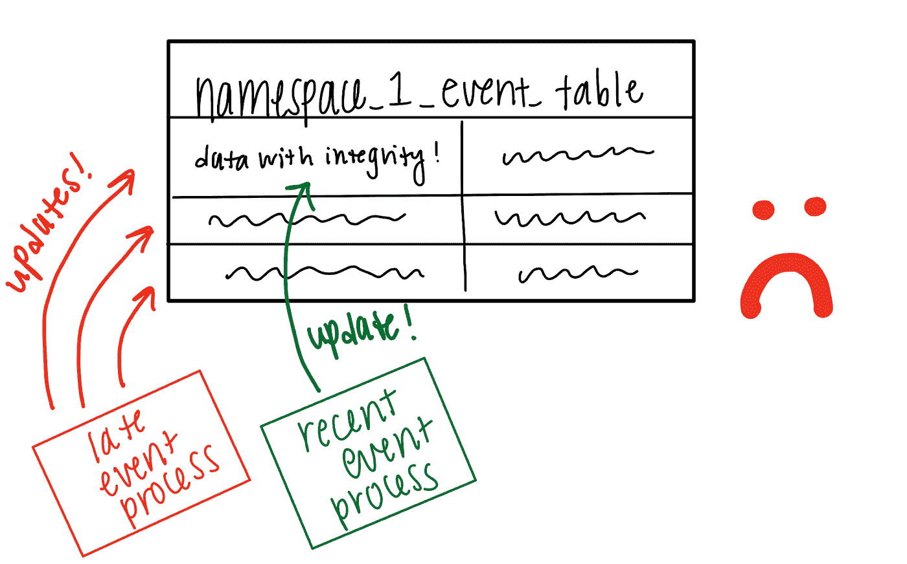
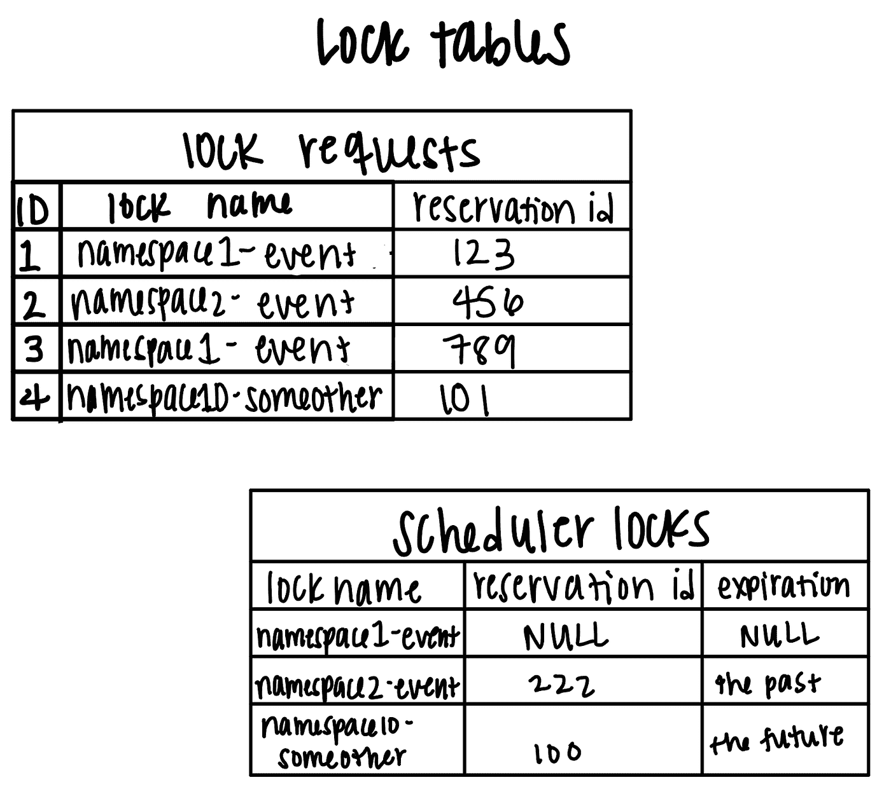
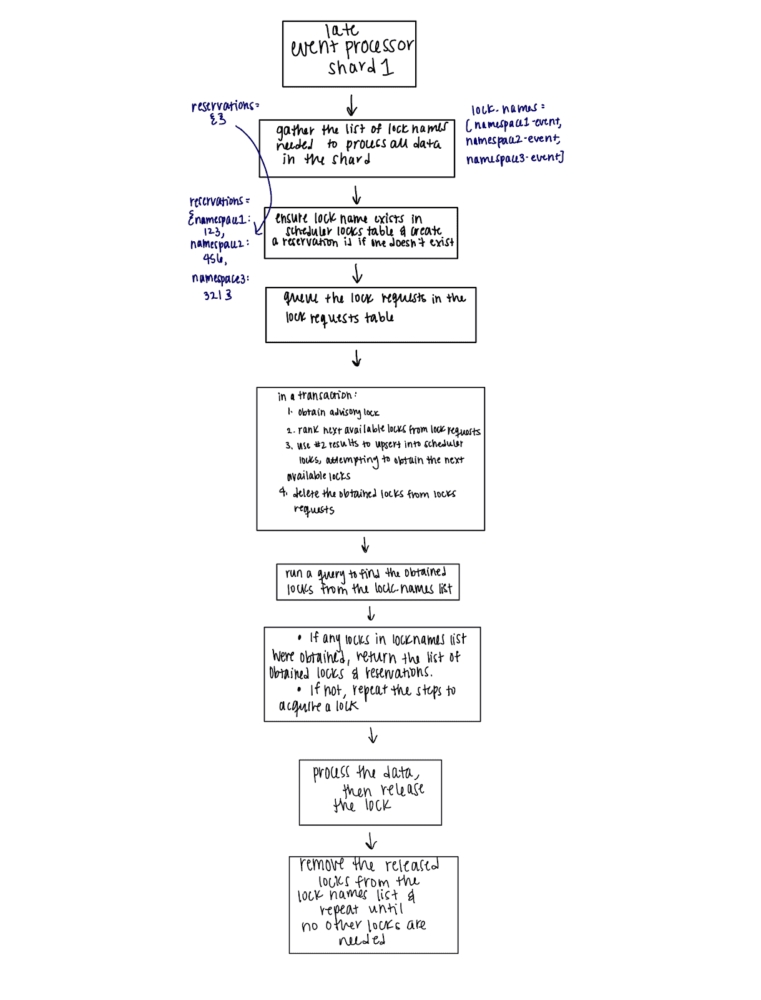

# 微批处理的分布式锁定:防止资源匮乏

> 原文：<https://betterprogramming.pub/distributed-locking-for-micro-batch-processing-preventing-resource-starvation-f3570b5df859>

## 为微批处理采用具有锁公平性的锁策略

作者图片

# 介绍

实施锁公平性的分布式锁策略对于在微批处理架构中处理迟到的和唯一的记录至关重要。本文探讨了构建先进先出(FIFO)锁定机制以防止进程饥饿的设计含义。

[Bluecore](https://medium.com/bluecore-engineering) 的分析管道从仅附加数据湖中读取数据，并写入 PostgreSQL。如果一封邮件在一月份打开，然后在二月份再次打开，我们需要认识到二月份打开并不是唯一的，因为这封邮件以前被打开过。

这种无限保留需要将记录流式传输到一个缓冲区，并以小批量更新我们的唯一计数。最近的事件存储在 Postgres 中，很容易更新，但是二月的开放来得太晚了，我们需要去 [BigQuery](https://cloud.google.com/bigquery) 获取存档的历史状态。

最近事件过程经常被安排，而最近事件过程只是偶尔被安排。分布式锁定系统应该防止这两个独立调度的进程修改相同的唯一计数。我们需要避免由于最近事件进程不断地竞争对锁的后期事件请求而意外地使不频繁的后期事件处理缺乏资源。

许多流式管道都有一个微批处理组件来处理不同类型的记录。我们实现了微批处理，作为我们的分析流管道的一部分，以处理各种类型的事件处理。

然而，当并发微批处理试图更新相同的底层数据时，数据完整性问题就会出现。锁定机制是这个问题的一个解决方案，重要的是设计锁定机制，以便资源被很好地分配，并且锁定机制本身的开销最小。

为了维护管道微批处理部分的数据完整性，我们通过[PostgreSQL](https://cloud.google.com/sql/docs/postgres/pricing)实现了一个锁定机制，该机制以先进先出的方式遵守锁定请求顺序。该机制旨在有效地持有锁，在锁可用时运行部分进程。这种锁定系统允许同时完成数百项任务，而无需大量运营成本。

# 概观

我们有三种类型的事件处理:最近、最近和其他。当事件处理需要发生时，数据流进入缓冲表。对于每种事件类型，缓冲表可能具有可变数量的碎片。碎片的数量是可调的，因此我们可以控制并行性。

我们在每个名称空间的基础上处理事件数据，每个碎片被分配一个名称空间的子集。例如，如果 late events 只有一个 shard，那么 100%的名称空间将路由到 shard #1 缓冲表。如果 recent events 有两个 shard，那么 50%的名称空间将被分配给 shard #1，另一个分配给 shard #2，作为 recent buffer。

一旦这些表达到一定的限制，处理就开始了。每种类型的事件处理都有自己的时间表。例如，最近事件处理应该比后期事件处理运行得更频繁。

图 1:有三种不同类型的事件处理。每种类型可以有不同数量的碎片。所有的名称空间都分布在各个碎片中。

# 问题是

## 高效锁定

每个进程都请求锁定它正在更新的事件数据库，这样就不会有两个进程同时更改一个名称空间的表。

我们可以让这些锁按进程类型(如`event`)或名称空间(如`namespace1-event`)获得。拥有一个事件锁是安全的，但效率低下，因为一次只有一个碎片可以处理事件，即使另一个事件碎片正在等待，并且包含当前事件碎片没有更新的名称空间。

相反，粒度锁都争用资源来获取它们的名称空间锁，这很容易导致许多许多进程并发运行，以及对锁定数据库的许多读/写。我们的解决方案实现了每个名称空间锁的粒度，而不需要数千个锁查询。

图 2:如果两个进程可以一次更新一个表，我们就冒着数据完整性的风险

## 公平分配资源

单个事件处理类型不应该独占所有的计算资源，而让其他类型落后于计划。为了确保资源在进程间公平分配，我们创建了一个遵守队列顺序的 FIFO 锁定系统。

# 事件分片进程如何请求锁

我们的系统是这样设计的，一个事件分片进程创建一个它需要获得的锁名列表。这些由名称空间和锁类型(事件)命名。有效的锁名可以是`namespace1-event`。

这个锁的作用是获得对表的单独访问。因为我们有每个名称空间的事件表，所以所有的事件类型(最近的、最近的、其他的)将为事件表请求具有相同锁名的相同锁。

我们如何区分请求锁的进程的类型是通过预留 ID 来区分的。这个过程从一个空字典开始，我们称之为 *reservations。* Reservations 持有锁名作为键，保留 ID 作为值。

当进程开始时，它将为进程对锁名的请求创建一个通用唯一标识符(UUID)。事件分片进程将引用这些 UUIDs，直到它获取了所有的锁，处理了所有的数据，并释放了它需要的所有锁。

# 实现锁公平

我们开始通过队列实现锁公平。起初，我们有一个没有队列的每个名称空间的事件锁。这意味着给定名称空间的所有事件进程都在竞争这个锁，并且没有特定的运行顺序。

为了实现排序，我们添加了一个表，用自动递增的 ID 将锁请求排队。我们使用这个 ID 来确定锁请求的一致顺序。

图 3:锁系统有两个表:锁请求和调度器锁。锁请求充当锁的队列，调度器锁包含锁的状态。注意:到期日期可以在获得锁时进行调整和设置。如果需要更多的时间，它们也可以由该过程更新。

例如，在图 3 中，与具有`789`预订 ID 和 ID`3`的`namespace1-event`锁相比，具有`123`预订 ID 和 ID`1`的`namespace1-event`锁将具有较低的 ID，因为 ID `1`首先被添加到请求表中。

`namespace2-event`锁也将作为对`namespace-2`的下一个请求返回，因为它是第一个也是唯一一个排队的`namespace2-event`锁；`namespace10-someother`也是如此。

只有当锁可用时(当前锁已过期或未使用)，获取锁才会起作用。在图像中，可以获得保留 ID 为`123`的`namespace1-event`锁，因为调度器锁表中的`namespace1-event`没有持有该锁。`namespace2-event`的截止日期已经过去，允许同时获得`namespace2-event`锁。

另一方面，`namespace-other` 锁当前被另一个具有不同预订 ID 的进程占用，并且该锁还没有到期。该进程现在无法获得此锁，但下次会再试一次。

一旦一个进程将它的锁名和预留 id 添加到队列中，它就会继续尝试获取锁。在这个事务中，事件分片进程将查询队列中下一个锁的名称，并尝试获取锁，而不管某个特定的锁是否属于该进程。

在该事务开始时使用一个 [Postgres 咨询锁](https://www.postgresql.org/docs/9.4/explicit-locking.html),以确保没有其他进程试图同时更新锁请求表。这是设计的关键部分，因为它意味着所有的进程都在积极地调度任何可用的锁。该事务完成后，该进程将检查是否在 scheduler-locks 表中获得了它的锁。

# 实现粒度锁

死锁问题(图片由作者提供)

在这一点上，锁定设计包括一个系统，其中每个碎片在继续处理之前获得分配给它的所有锁。这种设计有两个优点:(1)实现了 FIFO 顺序，以及(2)比所有事件进程使用一个共享锁要有效得多。然而，我们很快意识到这可能会导致死锁，即两个进程都在等待对方的锁变得可用。

如下面的图 4 所示，两个事件流程可能有不同数量的碎片，分割每个碎片所需的名称空间。如果总共有四个名称空间，那么 1 的 recent-events shard 1 负责所有四个名称空间。后事件碎片 1/2 负责一半——或者说前两个。如果这些进程同时请求锁，并且每个进程需要开始处理的锁的列表重叠，那么就会出现死锁。

图 4:两个进程竞争同一个锁会导致死锁

## 解决办法

我们没有要求碎片获取并保留尽可能多的锁，直到获得所有锁，而是调整了设计，允许碎片在锁可用时处理每个名称空间。

处理器将尝试获取尽可能多的锁，处理它拥有的任何已获取锁的名称空间，释放这些锁，并继续尝试获取它需要的其余锁。这允许两个重叠的进程在没有死锁的情况下互相工作。

# 设计概述

流程图展示了完整的工作流程，从一个事件流程开始(就像后期事件处理器 shard 1)。

*   该过程创建处理事件数据所需的名称空间列表
*   请求这些表的锁
*   在事务中，如果可能，设置下一个可用的锁
*   该进程检查是否获得了任何锁
*   →如果获取了任何锁，它将返回锁名，运行任务，释放锁，并从事件流程需要的锁名列表中删除锁
*   →如果在事务中没有获得锁名，它尝试再次直接获得锁
*   重复上述操作，直到获取并处理完所有锁

# 结论

总之，我们了解到，通过添加一个包含锁请求的 FIFO 队列，我们可以通过分布式锁来防止进程饥饿。

通过对所有锁请求使用带有确定性算法的队列，我们可以正确地分配下一个可用的锁。FIFO 锁定顺序和粒度锁的实现为我们的流水线微批处理部分提供了高效的数据处理。

感谢您的阅读！