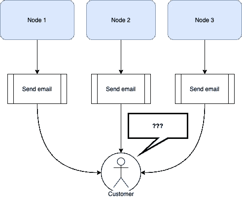
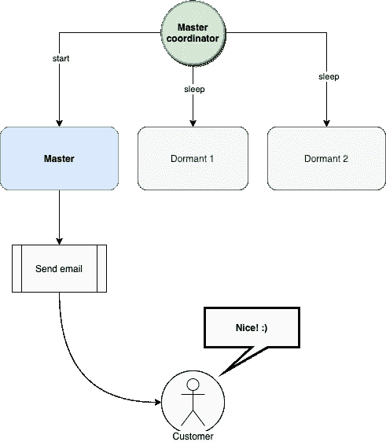
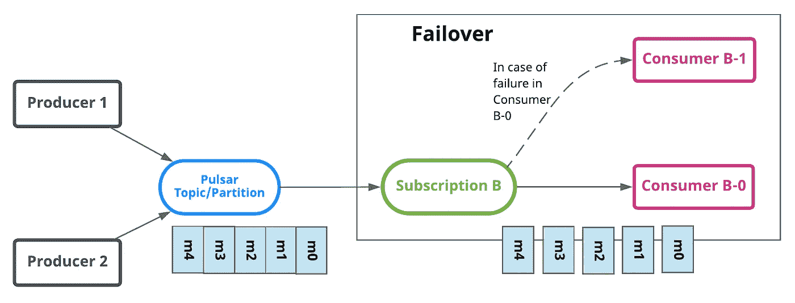
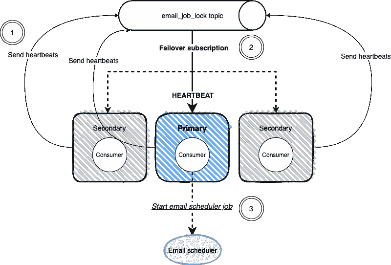
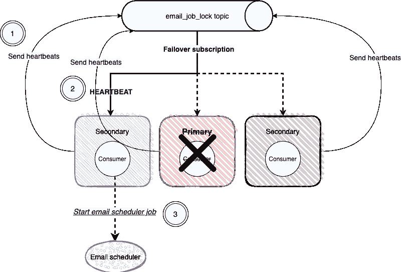

# Apache Pulsar 的分布式锁

> 原文：<https://betterprogramming.pub/distributed-locks-with-apache-pulsar-2d95a4d5ff5e>

## 节省复杂计算的时间

由[亚历山大·埃伦霍弗](https://unsplash.com/@alexeh99?utm_source=medium&utm_medium=referral)在 [Unsplash](https://unsplash.com?utm_source=medium&utm_medium=referral) 拍摄的照片

我们软件工程师有时面临的最常见的挑战之一是，如何确保在我们的分布式应用程序中，一次只有一个组件在进行特定的计算。

例如，假设我们在应用程序中运行三个节点，我们需要每天运行一个计划的作业。我们如何确保只有一个节点触发作业？如果我们在这个作业中向客户发送一封电子邮件，并且三个节点触发了任务，那么我们的客户可能会收到三封电子邮件！我们不想那样，所以我们实际上能做什么呢？

图片来源:作者

有人可能会说:“我们只运行一个节点吧！容易！”

嗯，没那么容易。在大多数情况下，我们必须确保我们的服务有足够的可用性，只运行一个节点意味着如果出现问题，我们的服务将不可用。

我们实际上需要的是一种选择某种负责这项任务的“主节点”的方法。另一个要考虑的重要方面是，如果我们的主节点出现故障，这个责任必须立即委派给一个辅助节点，以避免中断。

让我们来看看视觉上要达到什么样的效果才能看清楚。

图片来源:作者

我们需要的是一种简单的方法来“选举”一个负责这项任务的领导者，其余的节点将耐心地等待轮到他们，以防需要他们的帮助。这些节点将处于所谓的“休眠”状态；只有当主节点丢失或没有反应时，它们才会被唤醒。

# 我们如何解决这个问题？

在某些情况下，人们会决定实现一些相当复杂的实现，以确保只有其中一个人执行任务。

如今，一些数据库引擎自动支持某种`compare&set`操作，这可能是快速解决这个问题的合理方法。我们利用数据库的一个特性来解决一个挑战，而不需要我们自己重新实现它。但是如果我们的数据库不支持这样的原子操作呢？

事情会变得更复杂，因为每个节点都试图竞争获得锁，但是两个节点可以同时获得锁的值为“自由”,并且两个节点都成功地设置了值，而不会注意到另一个节点也“获取了锁”。这将意味着不是一个而是两个节点将执行该任务；在我们向客户发送电子邮件的例子中。

然而，即使我们在数据库中支持比较和设置操作，我们也需要提供一些机制来确保如果我们的主节点死亡，另一个节点将接管；类似于心跳过程，不断检查状态，并在出现故障时采取相应的行动。这是我们自己需要时间来实现的，理想情况下，我们希望利用其他人已经完成并彻底测试过的东西。

这正是我们使用 Apache Pulsar 之类的东西来解决这个挑战的原因，如果我们已经在我们的系统中使用它的话。Kafka 或许可以实现类似的解决方案，但在这个主题中，我们将重点关注 Apache Pulsar。

让我们看看它会是什么样子！

# 使用阿帕奇脉冲星

那么，我们如何利用我们系统中的 Apache Pulsar 呢？Pulsar 提供了一种叫做[故障转移](https://pulsar.apache.org/docs/en/2.3.2/concepts-messaging/#failover)的订阅类型，它基本上为我们实现了一种领导者选举机制。

图片来源:【pulsar.apache.org 

那么，我们如何利用它来保证我们计划的作业只运行一次呢？

由于这将高度依赖于您的个人用例，所以不需要深入实施的太多细节，我们可以想出一个简单的方法来实现它。赶紧来看看吧！

# 基于心跳事件的自动启动调度程序

实现我们所需要的方法之一是启动一个消费者，它首先开始监听心跳事件，然后立即开始发送心跳事件。这些用户将使用“故障转移”订阅来订阅我们的主题，因此只有其中一个用户能够启动他们的调度程序。如果我们的主节点死亡，那么我们的一个辅助节点将接管并立即启动作业。

基本上就是这个意思，让我们用一个图表来更好地理解它！

图片来源:作者

在本例中，我们有一个管理分布式锁的主题，每个消费者定期向该主题发送心跳，同时使用故障转移订阅来订阅该主题。其中只有一个将成为主要的，并将处理心跳事件。

如果主节点还没有启动电子邮件调度程序，它将在收到第一个心跳时立即启动它；对于其余的心跳，只要调度程序在运行，它们就会被忽略。

就这么简单，如果我们的主服务器死了，现在会发生什么？让我们看看那会是什么样子！

图片来源:作者

在我们的主节点死亡的情况下，Pulsar 的故障转移订阅将检测到该节点已经死亡，第二个优先节点将接管。在我们的图中，左侧的辅助节点将接收心跳，这将使它触发作业的启动。一旦之前的主节点恢复，它将耐心地等待轮到自己作为次节点。

基本就是这样，就这么简单。我们真的希望这个例子对你有用！

# 结论

我不建议仅仅为了实现分布式锁而开始使用任何新技术，但是我们通常必须设法变得聪明，利用我们系统中已经可用的东西来节省我们的时间和不必要的复杂性。

当然，我们可以自己构建自己的分布式锁，但这需要时间，也是一项容易出错的任务——通过使用 Pulsar，我们已经获得了其他工程师已经彻底测试过的功能，为我们节省了宝贵的时间和其他可能的问题。

这就是我们这次的全部内容，我们真的希望你喜欢这篇文章，我们期待着很快再次见到你！