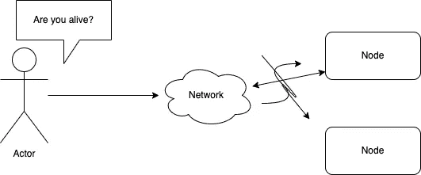
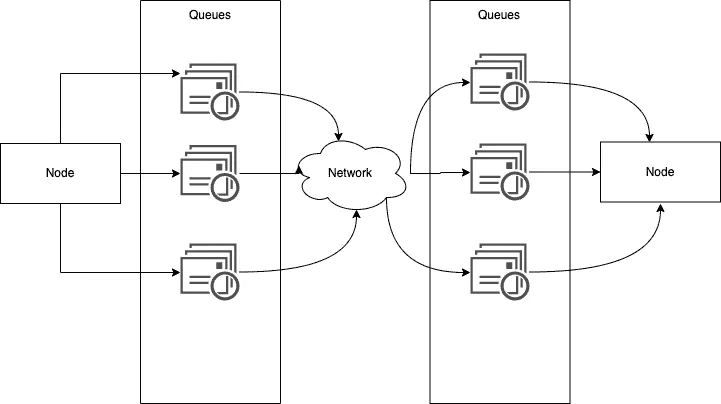
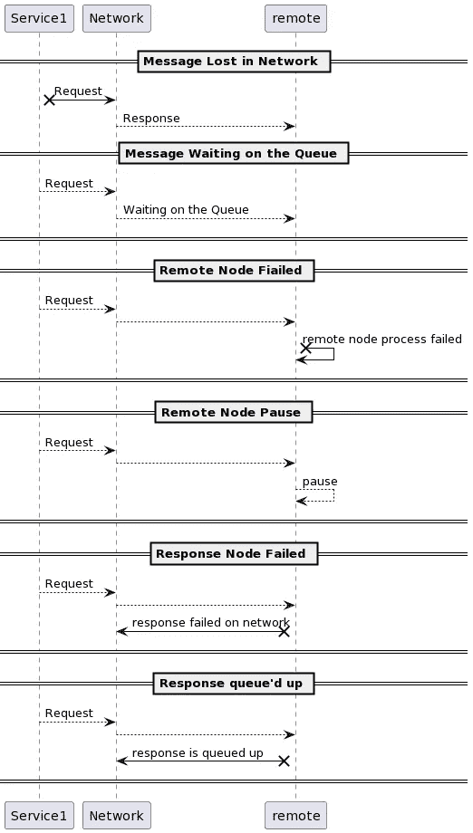
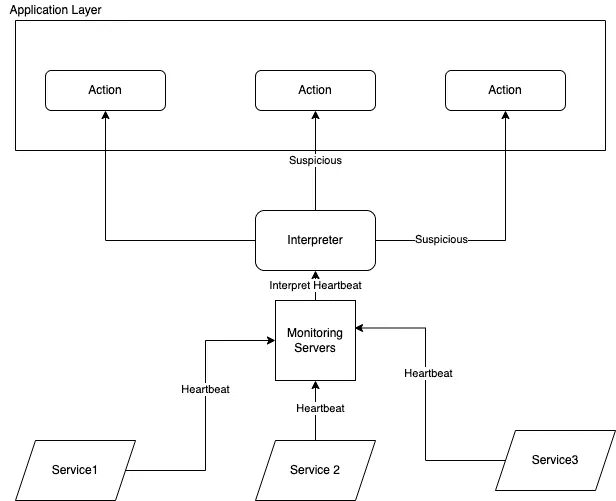
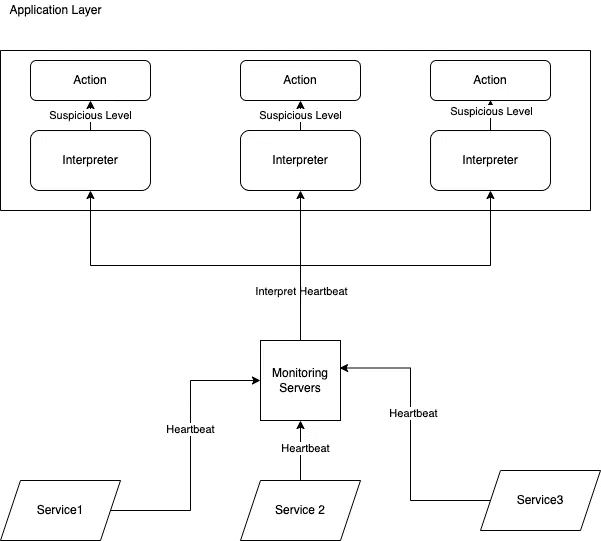

# 一个分布式系统问题:如何检测死节点

> 原文：<https://betterprogramming.pub/distributed-system-question-how-to-detect-a-dead-node-2ab830ad8161>

## 为什么会这么难

如果 AWS 只提供裸机服务器，您将需要为他们的节点检测服务按请求或按月付费。不提供这种服务对他们来说太苛刻了，但公司为这种功能付费会很昂贵。检测节点是否失效听起来是一个非常简单的过程。但是，这其实是一个很辛苦的过程。我们经常授予第三方云服务这个简单的功能来帮助我们监控节点的健康状况。

为了容忍错误，我们需要发现它们。然而，在本文中，您将看到检测节点故障是多么困难。我们还将讨论一个高级架构设计，该设计通过 phi 累积来检测节点故障。

# 了解延迟是如何发生的

网络的缓慢就像迪斯尼乐园的交通堵塞。想象你正在排队等候乘坐太空山。在队伍的前面，你看到等待时间是十分钟。你可能会对自己说，“十分钟并不算长。”因此，你排队等候。几分钟过去了。

你开始看到你几乎排在队伍的最前面，然后意识到你前面还有一个更长的队伍，需要你再等 30 秒。延迟的工作方式类似。

网络拥塞图—由作者提供

当数据包从您的机器发送到目的地机器时，它们会通过网络交换机，交换机会将它们排队，并逐个馈送到目的地网络链路。

一旦它到达目的地机器中的网络链路，如果所有 CPU 核心当前都忙，来自网络的传入请求将被操作系统排队，直到应用程序准备好处理它。

TCP 执行流量控制(背压),限制通过网络发送的节点数量，以减少网络链路中包含的节点。因此，它在网络交换层有另一层数据包队列。

# 为什么很难检测节点故障

想象一下，如果你运行一个单独的程序。即使程序没有崩溃，它也很慢，而且错误百出。程序中没有堆栈跟踪提到函数或方法的哪一部分不工作。这个程序将比以前的完全失败场景更难检测到故障。这种失败被称为部分失败。

如果你正在运行一个单独的程序，如果功能的一部分不工作，整个程序通常会崩溃。到那时，它显示了一个堆栈跟踪，您可以进一步检查以了解系统崩溃的原因。

局部故障更难检测，因为它们要么不起作用，要么不起作用。这个项目“今天过得很糟糕”的原因有很多。

因为分布式系统没有共享状态，所以部分故障总是会发生。

如果你没有得到任何回应，那并不意味着节点已经死了。以下是节点可能出现故障的一些原因:

*   消息发送到网络，但是丢失了，对方没有收到。
*   邮件可能正在队列中等待，稍后将被传递。
*   远程节点可能出现故障。
*   由于垃圾收集，远程节点可能暂时停止了响应。
*   远程节点可能已经处理了请求，但是响应在网络中丢失了。
*   远程节点可能已经被处理，它可能已经响应，但是响应被延迟了，所以它将稍后被传递。

故障场景—由作者提供

如果网络调用没有得到响应，它永远不会知道远程节点的状态。然而，你应该预料到大部分时间没有回应。负载平衡器或监控服务应该做什么？

# 超时

通常，负载平衡器会不断发送健康检查来检查服务是否处于良好的健康状态。当远程节点没有响应时，我们只能猜测数据包在过程中的某个地方丢失了。

下一个操作将是重试或等待一段时间，直到超时。如果操作不是等幂的，重试选项可能有点危险。因此，超时是一种更好的方法，因为如果没有得到响应，再做任何动作都可能导致不必要的副作用，比如重复计费。

如果我们想让超时接近，超时应该是多长时间？

如果时间太长，你可能会让客户等待。因此，在网上有不好的体验。

如果超时太短，可能会得到一个误报，将一个完全健康的节点标记为死亡。例如，如果节点是活动的，它有更长的时间来处理某些操作。过早地宣布节点失效并让其他节点接管可能会导致操作执行两次。

此外，一旦节点被声明为失效，它需要将其所有任务委派给其他节点，从而导致其他节点上的更多负载。如果另一个节点已经有很多负载，这可能会导致级联故障。

正确的超时期限基于应用程序逻辑和业务用例。

如果用户能够忍受，服务可以在 x 时间后声明操作超时。例如，如果 7 分钟不会导致糟糕的用户体验，支付服务可以将 7 分钟设置为超时期限。

许多团队通过反复试验来检测超时时间。在这种情况下，我们设置的超时通常是恒定的。例如，在七分钟或五分钟内，等等。

然而，检测超时的一个更聪明的方法是不要将超时视为一个常数值，而是由一个分布变量组成。如果我们测量一段时间内和许多机器上网络往返时间的分布，我们可以确定延迟的预期可变性。

我们可以收集平均响应时间和一些可变性(抖动)因素的所有数据。监控系统可以根据观察到的响应时间分布自动调整超时。故障检测算法的这种方法由 Phi 累积故障检测器完成，该检测器由 [Akka](https://doc.akka.io/docs/akka/current/typed/failure-detector.html) 和 Cassandra 使用。

[Phi 应计失败检测器](https://docs.hazelcast.com/hazelcast/5.0/clusters/phi-accrual-detector)利用每个心跳的采样固定窗口大小来估计信号的分布。每当一个新的实例调用远程节点的心跳时，它会将响应时间写入固定窗口。该算法将使用这个固定窗口来获得响应时间的平均值、方差和标准差。如果你感兴趣，这里有检测 phi 的[公式。](https://doc.akka.io/docs/akka/current/typed/failure-detector.html)

因此，在下一节中，我们将简要介绍节点故障检测的高级设计。

# 设计节点故障检测

我们将使用由两部分组成的节点故障检测组件:解释器和监视器。

解释器的工作是解释节点的怀疑级别。监控器的工作是接收各个节点的心跳，并将心跳时间委托给解释器。

监视器将不断地向每个远程节点发送心跳。每次它向远程节点发送健康检查时，都会在一段时间内收到响应。然后，它将响应时间发送给解释器，以检测节点的怀疑级别。

有两种放置解释器的方式:集中式和分布式。

集中—由作者提供

集中式的方法是将解释器和监视器作为自己的服务。之后，系统解释每个节点，并将信号发送到其他节点，以便采取进一步的行动。结果将是一个布尔值，无论怀疑与否。

分布式设计—由作者提供

分布式方式将解释器放在每个应用程序层，让应用程序可以自由配置怀疑级别以及在每个怀疑级别上应该采取的操作。

集中式方式的优点是更容易管理节点。然而，分布式方法可以微调或优化每个节点，以基于不同的怀疑级别表现不同。

我们可以对上一节讨论的解释器使用 Phi 累积失败算法。我们设定了 phi 的阈值。如果 phi 结果高于阈值，我们就宣布远程节点失效。如果 phi 结果低于阈值，则远程节点可用。

当监控器向远程节点发送请求时，解释器开始计时响应时间。如果远程节点的响应时间超过阈值，解释器可以停止请求并声明该节点可疑。

# 外卖食品

在设计应用程序时，我们从未想过检测节点故障，因为这是每个云提供商的内置功能。然而，检测一个节点并不是一个简单的操作。原因之一是分布式系统中的非共享状态模型。工程师需要在不可靠的网络中设计一个可靠的系统。

大多数时候，公司都是通过反复试验来检测节点故障。然而，我们可以用可变性来接近它们，而不是使用布尔值来确定一个节点是否死了。这将使用 Phi 累积故障检测器显示节点故障时的分布变化，并设置超时阈值。

最后，针对节点检测故障的高级抽象设计可以由监控组件和解释器组成。监控将不断向远程节点发送心跳，并将响应时间委托给解释器来分析怀疑级别。

如果一个节点达到了怀疑级别的某个阈值，解释器将向调用它们的服务返回一个布尔值，以指示需要的额外操作。

关于如何检测分布式系统中的节点故障，您有其他想法吗？

*最初发表于*[*【https://edward-huang.com】*](https://edward-huang.com/distributed-system/2022/03/17/how-to-detect-a-dead-node-in-a-distributed-system/)*。*