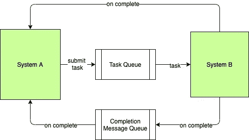
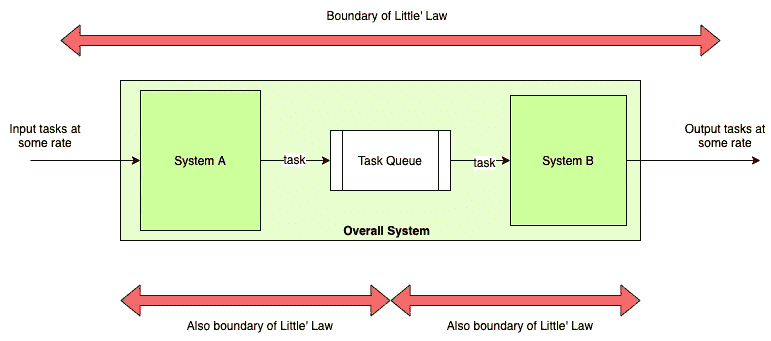

# 作为数据管道的分布式系统

> 原文：<https://betterprogramming.pub/distributed-systems-as-data-pipelines-throughput-capacity-and-backpressure-c37fd0dcedd8>

## 理解分布式异步系统中隐藏的、流式的吞吐量、容量和背压

Photo by [丁亦然](https://unsplash.com/@yiranding?utm_source=unsplash&utm_medium=referral&utm_content=creditCopyText) on [Unsplash](https://unsplash.com/s/photos/pipeline?utm_source=unsplash&utm_medium=referral&utm_content=creditCopyText)

我的上一篇文章是关于异步编程的。我暂停了将分布式系统视为数据管道的想法。让我们更深入地探讨一下，谈谈构建弹性系统中的*吞吐量、容量、*和*背压*的概念。

我们已经看到异步程序如何隐藏未完成的任务，直到有人通知它们已经完成。这可以解释为在异步调用方和被调用方之间构建一个未完成任务的*队列*。事实上，如果我们使用[线程池进行异步编程](https://www.kislayverma.com/post/asynchronous-programming-with-thread-pools)，我们必须显式地使用队列来传输任务，然后等待结果。

在[基于事件的系统中，](https://www.kislayverma.com/post/event-based-asynchronous-programming)可以通过认为调用调用者并等待结果与将任务排队并等待完成没有什么不同来做出相同的解释。

这非常类似于两个独立系统之间基于消息的通信(通过 Kafka 或 RabbitMQ 这样的消息代理)。

系统异步调用远程系统/方法，并等待调用完成。当接收到完成信号/消息时，等待终止。

从理论上讲，这两种型号没有区别。微观和宏观场景之间的共同元素是队列的概念。两者都使用队列作为缓冲区来临时隔离调用者和被调用者。

因此，所有的分布式系统，当端到端可视化时，都是流处理系统，不管它们的实现细节如何。异步系统，无论是分布式的还是非分布式的，都可以*总是*被解释为流处理系统(因为它们内置了一个切换中断模型)。

考虑到这一点，我们现在可以开始将排队论应用于我们如何看待软件系统的扩展。

# 吞吐量和容量

如果我们有一根软管——当我们使用另一端时，水从一端泵入——我们需要做什么来尽可能多地将水推出？

首先要确保水尽快从软管中流出。这可以通过使软管的消耗侧尽可能无摩擦来实现。清除所有的障碍物，很快就能把水弄出来。如果所有被推进去的水都可以以完全相同的速度排出，那么就没有瓶颈，我们可以排出越来越多的水。

用软件术语来说，这相当于增加了*的吞吐量*——也就是说，每单位工作花费的时间更少。当我们想到减少响应时间或使用更快的算法时，我们会想到吞吐量。吞吐量通常用每个请求的时间来衡量。团队在这种类型的优化上花费了大量的时间和精力——编写更好的代码、设计更智能的算法、添加缓存等等。

假设一个用户调用系统 A，系统 A 需要调用系统 B 来完成它的工作。我们假设 A 和 B 都是单线程，同步编程。用户希望尽可能频繁地调用系统 A。但是由于它的同步和单线程特性，A 一次只能接受一个请求。所以我们不能添加更多的用户，从系统中获得更多的唯一方法是让 A 和 B 都非常非常快，这样他们至少可以处理更多的请求。

将更多的水推向下游的另一种方法是使用更大/更宽的软管。这个很有意思，因为现在我们已经意识到水龙头可以开得很大，软管的另一端可以在生产水的同时把所有的水挤出来。

请注意我们现在是如何根据单位时间内的工作(与吞吐量相反)来度量的。用软件术语来说，这是处理并发性或建设能力。*容量*是一个系统可以服务多少个同时提交的任务的度量。正如类比所表明的，这是非常不同的野兽，异步编程模式在这里占有非常重要的位置——因为它们至少允许接受大量的任务而不会被锁定。

考虑上面例子中的系统 A 和 B 仍然是单线程的，但是 A 现在是异步编程的，所以它的单线程在调用 B 时不会被阻塞。这个系统可以从一开始就支持多用户，因为不被阻塞允许它承担更多的工作。

此外，在提高速度/减少延迟方面的每个优化现在对所有打开的请求都有更广泛的影响。以前一次只能有一个请求变得更快，现在系统 A 缓冲的整个请求集都受益了。我们现在有了一个更具可扩展性的系统。现在有一个问题，太多的请求同时到达 B——我们将在本文后面讨论这个问题。

# 利特尔定律

吞吐量和容量的概念在[利特尔法则](https://en.wikipedia.org/wiki/Little%27s_law)中有共同的表述。

> 在稳定状态下，排队系统中的平均项目数等于项目到达的平均速率乘以项目在系统中停留的平均时间

换句话说，软管中的水量是**单位时间内推入的水量**和**单位时间内排出的水量**的因子。我们不能仅仅根据吞吐量来定义一个稳定状态的系统——我们还需要包括它的容量或者其中可能存在的未完成工作的数量。

为什么我们在那里加入了*稳态*？一个已经崩溃和燃烧的系统——水管爆炸或弹出不是很有趣——已经坏了。*稳定状态*意味着我们试图描述一个具有稳定流程和行为的系统——也就是稳定的 SLA。

如果我们把一个分布式系统看做一个由不同大小的水管相互连接而成的网格，我们希望能够知道有多少水在哪里流动，如果一切顺利的话。这就是 SLA(多快+多少)，利特尔法则允许我们优雅地定义这些。

通过在任何一组连接的组件周围绘制边界，我们可以监控它们的进入/退出速率和容量，并计算出它们在可变负载下的行为。是的，我说的是围绕*任何一组组件。我们不仅可以在整个组件周围应用该定律，还可以递归地将其应用于组件的子集，以分析内部稳定状态。所有这些的总和等于超集。*

让我们将数据缓存视为一种优化策略。它优化了什么？它减少了完成数据读取请求所需的时间，因此我们知道我们正在优化吞吐量。

但是我们现在已经处理了所有的失败模式了吗？如果我们使用类似 Redis(单线程系统)的东西，我们知道我们无法处理并行调用的激增。现在，我们可以返回到 Redis 设置中添加一个只读从属服务器，从而使容量翻倍。我们处理请求的速度提高了一倍，系统的稳态容量也增加了两倍。

那么现在我们知道了所有这些理论，我们如何构建一个稳定的、大规模的分布式系统呢？

# 构建稳定的分布式系统

构建一个稳定的分布式系统的唯一方法是确保所有的系统和连接都是稳定的。

这就是微服务架构的真正复杂性所在——存在系统依赖性(通常是循环的),每个系统的性能都有波动，并且由于流量或故障重试等原因，负载也会有变化。

超过一个点，当一些意想不到的事情发生时，知道会发生什么变得非常困难。解决的办法是在每一步建立沟通，这样整个系统会因为反馈(积极的或消极的——通常是后者)而自动收敛到一个稳定的状态。

我们可以设计什么样的反馈来实现这一点？[约束理论](https://www.leanproduction.com/theory-of-constraints.html)在处理制造流程时，持有在制品库存是一种成本的观念。一旦你在工厂里发布了一些工作，它就是一种负担，消耗人力和材料，直到它完成并可以被发送出去销售。

如果下游的机器不工作，上游流程的工人做大量工作和生成半成品库存是没有意义的——永远不会完成。工厂车间使用这个反馈回路来控制任何时候可以完成的工作量。我们可以将同样的概念应用于软件系统管道。

# 容量

一般来说，我们总是希望有一些剩余容量(这样我们就可以优雅地处理流量的波动),而不会产生过高的成本。

增加容量的最简单方法是添加更多的硬件。但这在规模上往往不划算。正如我们在上面看到的，异步编程有助于我们在面对可变负载时建立弹性容量(因为我们有一个队列作为系统两部分之间的缓冲)，如果我们经常担心系统的容量，我们可以将更多的注意力转向提高单个组件的吞吐量。

然而，弹性只能到此为止。接受超过我们处理能力的请求总是一个坏主意，无论是在软件中还是在生活中。让我重复一遍——如果我们的系统是一个管道网，我们不能通过比最窄点允许的更多的数据。

这是异步设计中的一个大问题。调用者和被调用者之间的缓冲区对于异步来说是必不可少的，但是同一个缓冲区会阻止调用者理解被调用者正在被发送给它的工作负载所淹没。

在同步模型中，调用系统会开始看到线程阻塞，但是异步系统没有这个特性(bug？).我们可以对提交的任务设置超时，以开始减少负载，但这意味着我们将继续接受请求，只是为了以后让它们失败(导致糟糕的用户体验)。断路器可以在这方面有所帮助，但是有没有更好的方法来动态实现流量平衡呢？

# 背压

背压是一种阻止数据流通过软件系统的机制，以便在面临容量和吞吐量的局部变化时保持稳定的数据流。

我们希望通过不让太多的水以太快的速度进入来调节水的流量，从而避免损坏水管网的风险。要做到这一点，让我们反其道而行之，尝试通过系统拉数据，而不是试图推数据。

假设，从概念上讲，队列位于任务管道的生产者内部，并且它的大小是有限的。(永远不要使用无限缓冲区。永远不会。从来没有。)在这种情况下，调用者向被调用者伸出手，以从缓冲区中获取要处理的新任务。因此，吞吐量是由使用方明确控制的(这是有意义的——必须做这项工作的人应该决定他能走多快)，而容量(开放请求的度量)是由调用方通过决定我们想要保留多少未处理的任务(也称为队列大小)来确定的。

如果由于使用者运行速度不够快而导致队列已满，调用者有一个选择——他可以从队列中删除最老的(大概也是最不相关的)任务来腾出空间，或者立即停止接收更多的请求(因为它们很可能会失败)。

这不同于设置任务超时，因为我们不是说一个任务应该花费多长时间，而是限制系统作为一个整体可以有多少未完成的任务，并且仍然希望在 SLA 内完成它们。

我们还可以让被调用者拥有队列，让他拥有未完成请求的速率和数量。这在某种程度上集中了逻辑，但在流量激增期间，该系统可能会负载过重，甚至无法做出减载的决定。

实现背压有三种方式:

## *告诉打电话的人停止给新任务*

这通常是最好也是最有效的方法。

如果处于负载下的下游系统可以主动请求暂停，生产者和消费者之间的动态平衡可以很快实现。RxJava 使用了这种范式。

## *当来电者试图给新任务时阻止他们*

这略有不同，因为在这种情况下，调用者在生成新任务时面临错误情况，并且他必须在接受任务后独立决定如何处理这个错误。

像限速这样的模式适合这里。

## *开始丢弃一些任务*

根据上下文，被调用方可以开始从管道中丢弃最旧或最新的任务。

这种静默行为不是我最喜欢的，因为除非呼叫者正确地监控任务完成，否则它对系统的可见性较低，但这与赋予它价值的事情是一样的——如果呼叫者不能被影响来改变他们的行为，则被呼叫者可以独立地实现这一点。

# 结论

这是很多沉重的东西。咱们 TL；it 博士。

*   分布式系统和异步系统的行为非常相似，可以理解为计算流水线
*   吞吐量是系统中做事的速度
*   容量是指在不违反 SLA 的情况下，系统中可以保持开放的任务数量
*   SLA 是下游系统给上游系统的吞吐量和容量的联合承诺
*   背压是一种传播下游故障/问题知识的机制
*   扩展和稳定系统是在解决吞吐量问题和解决容量问题之间不断地来回转换

试试这个。回到架构的鸟瞰图，想象所有 I/O 绑定的进程都是异步的。现在的瓶颈是什么？您是否为调用者明确地确定了回退行为？如果这些失败了会发生什么？诸如此类。

我希望您从这个练习中看到的是吞吐量和容量瓶颈的组合，它们相互影响，现在您已经掌握了利特尔法则和背压，您将能够消除它们，获得一个稳定、美观的系统。

*如果你喜欢这篇文章，你可以订阅* [*我的邮件列表*](https://www.kislayverma.com/) *来获得最新消息。*