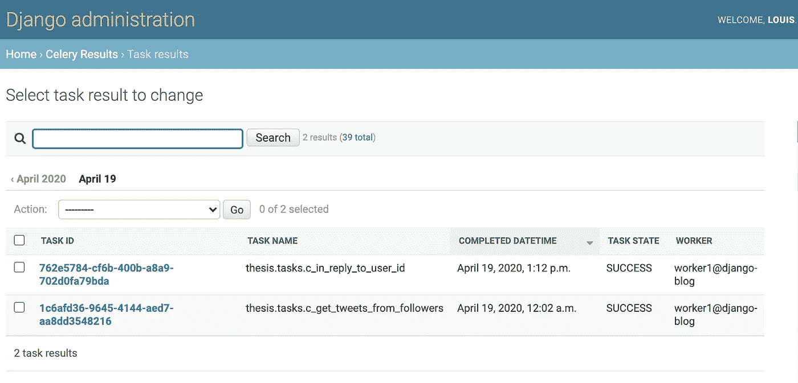
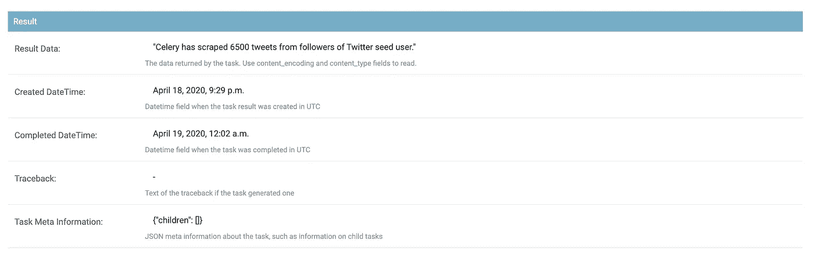
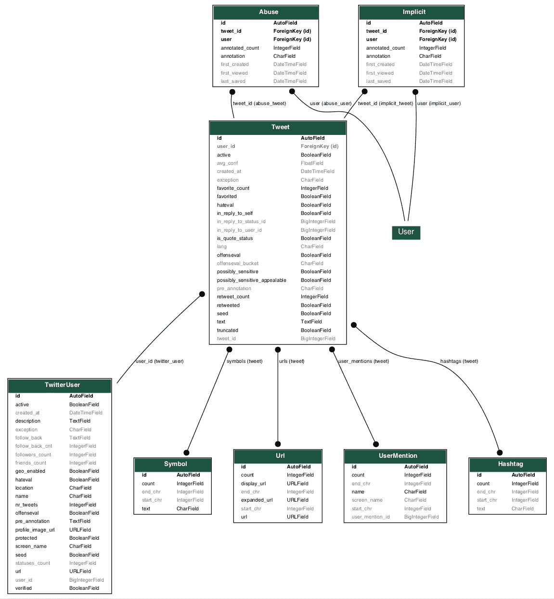

# Django、RabbitMQ 和 Celery 的分布式任务队列

> 原文：<https://betterprogramming.pub/distributed-task-queues-with-celery-rabbitmq-django-703c7857fc17>

## 了解用于发出异步 API 请求的分布式任务队列


作者图片

当用户发送请求，但是处理请求的时间比 HTTP 请求-响应周期长时，会发生什么情况？如果您正在访问多个数据库，或者想要返回一个太大而无法在时间窗口内处理的文档，该怎么办？如果您想要访问一个 API，但是请求的数量被限制为每个 *t* 时间窗口最多有 *n* 个请求，该怎么办？

这些是我硕士论文资料收集过程中提出的部分问题。在我的研究中，来自 Twitter 的微博客是通过 Twitter API 收集的。分布式任务队列解决了两个主要问题:

1.  Twitter API 将每个 15 分钟的请求窗口中的请求限制为最多 900 个获取状态/查找。数据收集包括超过 10 万个请求，或 30 多个小时。事实证明，在规划中，将这一过程转移到服务器上是不可或缺的。
2.  数据库操作，特别是在我们的服务器托管的注释工具中为注释器创建实例，超出了请求/响应时间窗口。为了能够创建这些实例，我需要使用分布式任务队列。

本文将涵盖:

*   芹菜分布式任务队列
*   兔子工人
*   Django 实施
*   创建视图
*   激活工人
*   更新和故障排除

这些步骤可以通过 localhost Django 项目离线执行，也可以在服务器上在线执行(例如，通过 DigitalOcean、Transip 或 AWS)。拥有服务器的好处是，您不需要打开计算机来运行这些分布式任务队列，对于 Twitter API 用例，这意味着 24/7 的数据收集请求。

**请注意**，分布式任务队列的实现可能有点麻烦，而且会变得相当困难。不要犹豫，去寻求帮助！本文假设对 Django 中的 MVC 架构(表单、URL 端点和视图)有一个基本的了解。

# 芹菜分布式任务队列

什么是分布式任务队列，为什么它们有用？每当您想要解决上面列举的问题时，您都在寻找异步任务队列。这些是可以在服务器上安排和/或在后台运行的任务队列。 [Celery](https://docs.celeryproject.org/en/stable/index.html) 是处理这些进程最常用的 Python 库。

任务队列的输入是一个叫做*任务*的工作单元。专用的工作进程不断地监视任务队列，寻找要执行的新工作。

Celery 通过消息进行通信，通常使用一个代理在客户和工人之间进行调解。为了启动一个任务，客户机向队列中添加一条消息，然后代理将这条消息传递给一个工人。

# 兔子工人

Celery 需要一个消息传输器，通常称为*代理*。受欢迎的经纪人包括 RabbitMQ 和 Redis。代理是发送和接收消息的解决方案。它们利用所谓的*工作器*，这些工作器被初始化来运行某个任务。这些工作人员可以运行任务并更新这些任务的状态。

# Django 实施

对于整个设置和实现，Celery 有非常好的文档。使用他们的文档。每当你遇到问题时，就用这个作为额外的补充。

Django 有一个非常棒的[管理站点](https://docs.djangoproject.com/en/3.0/ref/contrib/admin/)，我们希望在那里包含我们的芹菜应用程序。Django-celery-results 是一个扩展，使我们能够使用管理站点存储芹菜任务结果。

让我们从要安装的命令行包开始。我强烈建议您使用虚拟环境，并将包添加到虚拟环境的`requirements.txt`中。我们还为我们的用例安装了 Twitter API 的 Python 库包装器`Tweepy`。

```
$ pip install celery
$ pip install django-celery-results
$ pip install tweepy$ pip freeze > requirements.txt
```

## 安装 RabbitMQ 用户

接下来，我们将创建一个 RabbitMQ 用户。我在 DigitalOcean 的 Ubuntu 18.04 服务器上工作，但是有其他平台的[安装指南](https://www.rabbitmq.com/admin-guide.html#:~:text=Operating%20Systems%20and%20Platforms)。

```
$ sudo apt-get install rabbitmq-server
$ sudo rabbitmqctl add_user myuser mypassword
$ sudo rabbitmqctl add_vhost myvhost
$ sudo rabbitmqctl set_user_tags myuser mytag
$ sudo rabbitmqctl set_permissions -p myvhost myuser ".*" ".*" ".*"
```

## Django 项目

接下来，我们将在 Django 应用程序中创建一些文件，我们的项目结构如下所示:

```
[projectname]/
├── [projectname]/
├── ├── migrations/
├── ├── static/
├── ├── templates/
│   ├── **__init__.py**
│   ├── admin.py
│   ├── **celery.py**
│   ├── forms.py
│   ├── *models.py*
│   ├── *settings.py*
│   ├── **tasks.py** │   ├── **twitter.py** │   ├── urls.py
│   ├── *views.py*
│   ├── wsgi.py
└── manage.py
```

首先出场的是我们的`__init__.py`。

接下来，我们创建主`celery.py`文件。

在`settings.py`中，我们包含了芹菜应用的设置，也包含了 Django 管理页面中芹菜更新的`django_celery_results`包。

`'projectname'`(第 9 行)是您的 Django 项目的名称，可以替换为您自己的项目名称。

我们已经在我们的`INSTALLED_APPS`中包含了`django_celery_results`，但是我们仍然需要在我们的应用程序中迁移这个变化:

```
$ cd projectname
$ python3 manage.py makemigrations
$ python3 manage.py migrate
```

现在，当我们转到服务器的`/admin`页面时，我们可以看到任务已经被添加。


接下来，我们将为异步和分布式队列任务创建一个`tasks.py`文件。我已经包含了一个使用 Twitter API 的函数。

我在芹菜函数前面加上了一个`c_`，这样我就不会忘记它们是异步函数。第 12 行确保这是一个异步任务，在第 20 行，我们可以通过对`tweet_ids`的迭代来更新状态。在我们的 Django 管理页面中，我们将看到每次迭代中任务增量的状态。

接下来，我们将创建使用 Twitter API 的函数，并在`twitter.py`文件中获取 tweets 或状态。

Twitter API 的认证密钥保存在一个单独的`.config`文件中。Twitter API 设置需要一点时间，你可以遵循 Twitter 的部分的[安装指南。为了再现性，我还在`models.py`文件中包含了 Tweet Django 模型。](https://developer.twitter.com/en/docs/getting-started)

# 创建视图

现在我们已经有了 Celery 设置、RabbitMQ 设置和 Twitter API 设置，为了组合这些功能，我们必须在一个视图中实现所有内容。现在，我假设您知道如何在 Django 中创建一个视图、一个带有表单的 HTML 模板和一个 URL 端点。如果没有，看看[这篇文章](https://medium.com/javascript-in-plain-english/create-interactive-data-visualisations-with-django-chart-js-8c4d0b98770e)。我还使用了[消息框架](https://docs.djangoproject.com/en/3.1/ref/contrib/messages/)，这是一种在你的 Django 项目中提供用户反馈的神奇方式。

**注意**函数名和参数之间的`.delay()`。这非常重要，因为这是 Django 和 Celery 理解您调用异步函数的方式。我经常忘记这一部分，让我告诉你，这需要永远的调试。

# 激活工人

既然我们的视图中已经包含并链接了所有内容，我们将通过几个芹菜命令行命令来激活我们的工人。如果不激活我们的工作线程，任何后台任务都无法运行。确保您处于安装了 Celery 和 RabbitMQ 依赖项的虚拟环境中。

如果您正在处理一个 localhost Django 项目，那么您将需要两个终端:一个通过`$ python manage.py runserver`运行您的项目，另一个运行下面的命令。如果您是服务器托管项目的工作人员，您只需要一个终端通过 SSH 或 HTTPS 登录到服务器。

```
**$** celery -A projectname worker1 -l INFO
**$** celery -A projectname worker1 control shutdown
```

被激活的工人的名字是`worker1`，使用`-l`命令，您可以指定[日志记录级别](https://docs.python.org/3/howto/logging.html)。第二个命令是关闭 worker。


作者图片

一旦您的 worker 被激活，您应该能够运行 Django 项目中的视图。*导入种子用户*按钮激活`views.py`中的`scrape_tweets()`功能，包括使用`worker1`的分布式任务队列功能`c_get_tweets.delay()`。您可以在 Django `/admin`页面中看到这个工人被激活了。**

****

**作者图片**

**如您所见，我有其他分布式任务队列，`c_in_reply_to_user_id()`和`c_get_tweets_from_followers()`，它们类似于`c_get_tweets()`。当打开其中一个任务时，您可以看到该任务的元信息和结果。**

****

**作者图片**

**上一张图片中的`TASK STATE`在`tasks.py`的第 27 行被更新，这个函数为它正在收集的每个 tweet ID 更新`PROGRESS`中的任务状态。当任务完成时，它显示在`tasks.py`的第 32 行返回的字符串，这可以在 Django `/admin`页面的`Result Data`中看到。**

# **更新和故障排除**

**下面的命令专门用于检查状态，并在您使用上面的命令初始化 worker 后更新它。**

```
****$** celery status
**$** celery multi restart worker1 -A projectname**$** celery multi stopwait worker1 -A projectname
**$** celery multi start worker1 -A projectname**$** celery control shutdown**
```

**故障排除可能有点困难，尤其是在处理服务器托管的项目时，因为您还必须更新 Gunicorn 和守护进程。有关这方面的更多信息，请遵循[数字海洋指南](https://www.digitalocean.com/community/tutorials/how-to-set-up-django-with-postgres-nginx-and-gunicorn-on-ubuntu-16-04)。我总是用下面的命令更新这些并检查日志。**

```
****$** sudo systemctl restart gunicorn
**$** sudo systemctl daemon-reload
**$** sudo journalctl -u gunicorn --since "1 hour ago"**
```

**这就是了。我知道这很多，我花了一段时间才理解到可以使用分布式任务队列。最后，我用它来为我的论文收集数据(见下面的 SQL DB)。如果您有任何问题，请告诉我，祝您编码愉快！**

****