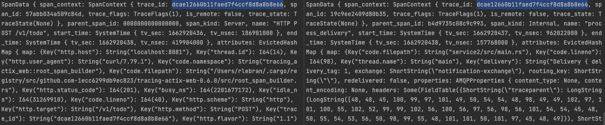
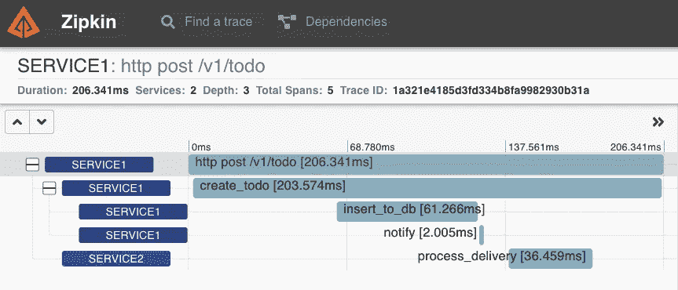

# Rust 中的分布式跟踪

> 原文：<https://betterprogramming.pub/distributed-tracing-in-rust-b8eb2af3aff4>

## 如何用 actix，rabbitmq (lapin)，tracing，opentelemetry 实现多个服务之间的分布式跟踪。


这是 Rust 中分布式跟踪的另一个例子。我在网上看到了多篇文章，但遗憾的是，没有一篇给我必要的提示，让分布式跟踪在我的环境中工作。

我想要实现的是获得一个完整的跟踪，从 API 请求到数据库，跨越通过 AMQP 通信的多个服务。

本文将指导您完成检测应用程序所需的每个步骤。

```
**Table of Contents****-** [Instrumenting your application](#644e)
- [Propagating context](#1275)
- [Testing with Zipkin](#4415)
- [Wrapping up](#2a84)
```

# 检测您的应用程序

首先，我们需要添加必要的依赖项来生成 [OpenTelemetry](https://opentelemetry.io/) 跟踪。我们需要:

*   [open telemetry](https://crates.io/crates/opentelemetry):Rust open telemetry 实现
*   [tokio](https://crates.io/crates/tokio):Rust 的异步运行时
*   [追踪](https://crates.io/crates/tracing):应用级追踪铁锈
*   [跟踪-打开遥测](https://crates.io/crates/tracing-opentelemetry):打开遥测集成进行跟踪
*   [跟踪订户](https://crates.io/crates/tracing-subscriber):用于实现和组成“跟踪”订户的实用程序

添加必要的依赖项

然后，我们创建一个负责初始化订户及其不同层的函数。

订户负责记录`span`和`events`。层是应用于跨度和事件的一种扩展。

下面我们初始化

*   OpenTelemetry 兼容的 tracer，以 Otel 格式记录量程和轨迹。
*   生成 JSON 格式跟踪的订户
*   基于提供的级别(跟踪、调试、信息、警告、错误)过滤跟踪的`EnvFilter`层

一旦完成，我们需要在每个异步函数上添加`tracing::instrument`宏，以生成一个具有跨度的仪器。

把它插在一起，我们就有了这样的东西:

# 传播语境

让我们稍微修改一下我们的`configure_tracing`函数，以便添加一个`TraceContextPropagator`作为全局文本 _ 地图 _ 传播器。

文本映射传播器负责跨流程边界注入和提取文本形式的值。

设置文本 _ 地图 _ 传播器

为了监控我们的 Actix 服务，我们需要添加一个`TracingLogger`中间件来代替默认的`Logger`。这个记录器将为服务收到的每个 HTTP 调用创建一个根服务跨度。如果上下文被正确发送，这些范围将自动与父范围相关联。

这需要一种新的依赖，`[tracing-actix-web](https://crates.io/crates/tracing-actix-web)`。

TracingLogger 中间件

为了在服务之间传播上下文，我们需要请求中的当前传递上下文。

为此，在客户端，我们实现了`Injector`特征来将上下文传递给文本映射传播器。

AMQP 注射器的实施

在服务端，我们通过实现`Extractor`特征从请求中检索上下文。

AMQP 提取器的实现

现在，当向 AMQP 发布消息时，我们需要使用上面定义的`Injector`来传播上下文。

为 AMQP 交付注入背景

在服务器端，当我们使用来自 AMQP 的消息时，我们使用`Extractor`检索上下文。

从 AMQP 交付中提取上下文

迹线现在应该正确关联了！

`Extractor`和`Injector`对于服务间的上下文传播是强制性的。Actix 的实现可以在网上找到，其他的也存在于`Request`中，但是想法总是一样的。服务器将上下文作为标题中的文本发送，客户端尽快提取。然后，当前 span 从远程父 span 继承其父 id。

# 使用 Zipkin 进行测试

但是我怎么能确定跟踪现在真的有效呢？

查看 stdout 日志，我们可以看到服务之间的跟踪 id 匹配。



服务 1 和服务 2 之间的跟踪 id 相同

然而，很难看到和理解我们看到的数据。要查看跟踪信息，我们可以生成一个 Zipkin 实例，并将跟踪信息推送给它。

首先，我们需要将`text_map_propagator`改为`opentelemetry_zipkin::Propagator`。然后我们需要安装`opentelemetry_zipkin`管线。

设置 Zipkin 跟踪

现在，如果我们看一下 Zipkin(在 [localhost:9411](http://localhost:9411) 上)，我们可以看到我们的踪迹被正确地传播了。



Zipkin 服务之间的分布式跟踪

我们看到了如何在 rust 中配置服务间的分布式跟踪。完整的例子，可以在 GitHub 库中找到源代码。

我希望这篇文章是有帮助的！