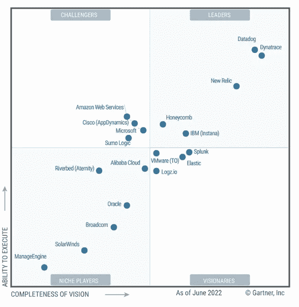
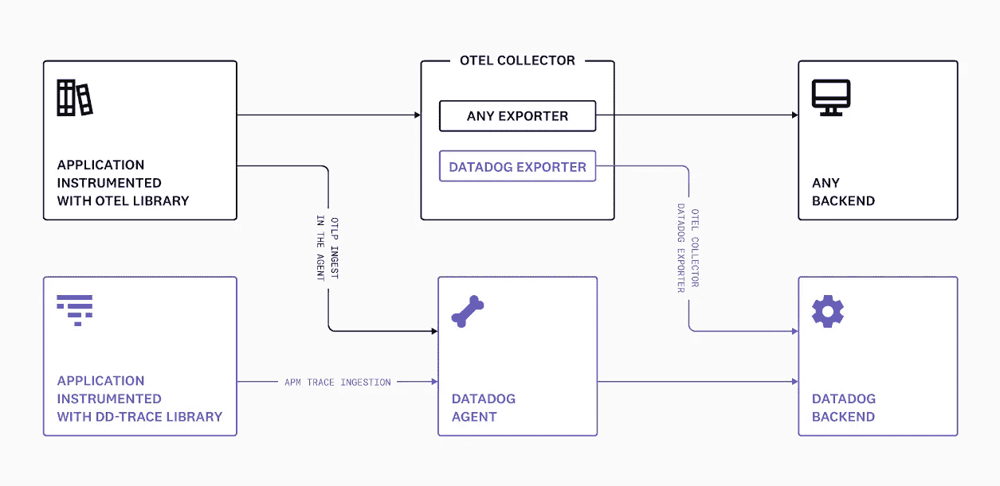
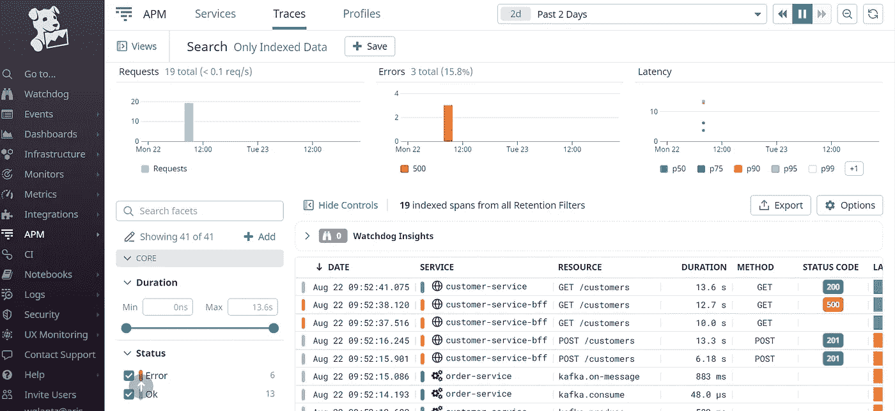
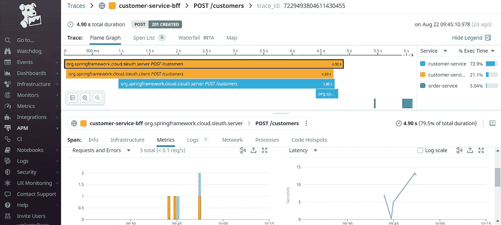
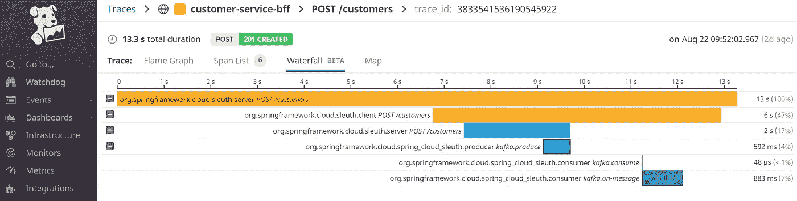
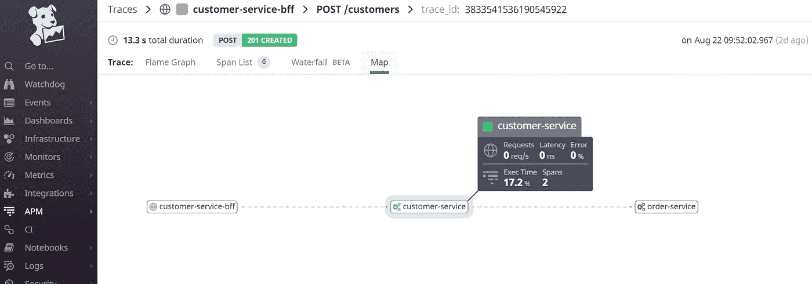

# 使用 OpenTelemetry 和 Datadog 进行分布式跟踪

> 原文：<https://betterprogramming.pub/distributed-tracing-with-opentelemetry-and-datadog-712f8f4d520b>

## 如何将 Datadog 配置为 OpenTelemetry tracer 后端

作者照片

这篇文章是我之前发表的题为[使用 OpenTelemetry、Spring Cloud Sleuth、Kafka 和 Jaeger 进行分布式跟踪](/distributed-tracing-with-opentelemetry-spring-cloud-sleuth-kafka-and-jaeger-939e35f45821?sk=6a06ec87c72e860ec7bbda144922eb6b)的文章的后续，在这篇文章中，我们探讨了如何使用 OpenTelemetry (OTel)、Spring Cloud Sleuth、Kafka 和 Jaeger 实现分布式跟踪。在本文中，我们将探讨如何将 Datadog 配置为 OTel 收集器的接收器后端。

根据 [2022 年 Gartner APM 和可观察性魔力象限](https://www.dynatrace.com/monitoring/platform/comparison/dynatrace-vs-datadog-watch-a-demo/?utm_source=google&utm_medium=cpc&utm_term=why-dynatrace-dd-st&utm_campaign=us-why-dynatrace&utm_content=none&gclid=Cj0KCQjw9ZGYBhCEARIsAEUXITUJgrj3DfZKstsWx682j_67MHrpMWfEUyj78wrXWBQp8iDhIYGUJVUaAuoTEALw_wcB&gclsrc=aw.ds)，Datadog 是该魔力象限的领导者。其 SaaS 平台提供了可观察性和安全性解决方案。它通过 AI/ML 提供强大的平台组合和分析可用性，以简化监控云原生架构的复杂性。它还在真实用户监控(RUM)中提供漏斗分析，以更好地了解最终客户行为。

图片来源: [2022 年 Gartner APM 和可观察性魔力象限](https://www.dynatrace.com/monitoring/platform/comparison/dynatrace-vs-datadog-watch-a-demo/?utm_source=google&utm_medium=cpc&utm_term=why-dynatrace-dd-st&utm_campaign=us-why-dynatrace&utm_content=none&gclid=Cj0KCQjw9ZGYBhCEARIsAEUXITUJgrj3DfZKstsWx682j_67MHrpMWfEUyj78wrXWBQp8iDhIYGUJVUaAuoTEALw_wcB&gclsrc=aw.ds)

Datadog 支持多种开放标准，包括 [OpenTelemetry](https://opentelemetry.io/docs/) 和 [OpenTracing](https://opentracing.io/docs/) 。根据 Datadog 的网站，“如果您的应用程序和服务配备了 OpenTelemetry 库，您可以选择两种途径将跟踪数据发送到 Datadog 后端”:

1.  [向 OpenTelemetry collector 发送轨迹，并使用 Datadog exporter 将其转发给 Datadog](https://docs.datadoghq.com/tracing/setup_overview/open_standards/otel_collector_datadog_exporter/) 。
2.  [使用数据狗代理摄取踪迹，该代理为数据狗](https://docs.datadoghq.com/tracing/setup_overview/open_standards/otlp_ingest_in_the_agent/)收集踪迹。

图片来源:[https://docs . data dog HQ . com/tracing/setup _ overview/open _ standards/# open telemetry-collector-data dog-exporter](https://docs.datadoghq.com/tracing/setup_overview/open_standards/#opentelemetry-collector-datadog-exporter)

让我们探索第一条路线，跟踪数据通过 OTel Collector 并添加 Datadog Exporter 以将跟踪数据导出到 Datadog 后端。

# Datadog OTel 导出器实现

基于上一篇文章中的[代码，需要修改两个区域来将 Datadog Exporter 添加到我们的原始实现中，以便可以将跟踪数据导出到 Datadog 中。](https://github.com/wenqiglantz/opentelemetry-sleuth-kafka-jaeger)

## OTel 收集器 docker 图像

我们现在需要在`docker-compose.yml`中使用`otel/opentelemetry-collector-contrib:0.58.0`，而不是原始图像`otel/opentelemetry-collector:0.47.0`，它包含 OTel 收集器中的 Datadog Exporter 实现。所以`docker-compose.yml`中的`otel-collector`现在定义如下。请注意第 2 行中图像名称的变化，以及对`jaeger-all-in-one`的依赖性的移除。

## OTel 配置

OTel 配置文件`otel-config.yaml`中的一些变化。请看下面的片段。由于我们不再需要 Jaeger，我们可以删除`exporters`部分和跟踪管道的`exporters`列表下的 Jaeger 配置部分。我们现在需要在`exporters`部分和跟踪管道`exporters`列表下添加 Datadog 配置细节。

*   第 15 行`processors.batch.timeout`:需要`10s`的`timeout`设置(10 秒)。表示十秒钟跟踪的批处理是 Datadog 的 API 获取跟踪相关统计数据的一个约束。如果没有此`timeout`设置，随着时间的推移，不同服务和服务资源的跟踪相关指标(包括`.hits`、`.errors`和`.duration`)将会不准确。
*   第 20–27 行数据狗导出器的配置`datadog`。这是我们指定 Datadog 导出器细节的地方，包括 API 密钥和站点。在测试此概念验证之前，请确保用您的实际密钥替换 API 密钥。
*   第 34 行，将`datadog`添加到出口商列表中。

配置完成后，我们可以通过运行`docker-compose up -d`来启动 docker-compose，调出所有八个容器(我们删除了`docker-compose.yml`中的`jaeger-all-in-one`，因为我们不再需要 Jaeger 作为跟踪后端)，并测试我们的流，以从`customer-service-bff`创建一个新客户，它流经`customer-service`和`order-service`。让我们看看跟踪数据在 Datadog 中是什么样子的。

## 数据狗 APM

Datadog APM 是我们可以查看跟踪数据的地方，还有许多其他功能。为了检索我们的跟踪数据，我们输入一些搜索标准，比如`env:poc`、`service:customer-service`。我们使用`poc`作为`env`，因为这是上面`otel-config.yaml`中定义的。

现在让我们看看我们的跟踪数据在 Datadog 中是什么样子的。

向下钻取到火焰图以查看轨迹和跨度的详细信息，显示如下:

Span list 详细说明了这个特定示例中所有应用程序的跨度数、平均持续时间和执行时间，并创建了一个客户 API 调用:

瀑布图以可视化的形式概述了这些 API 调用跟踪。这是一张图片:

地图视图向我们展示了每个应用程序之间的交互方式。

如您所见，Datadog 确实为不同格式的跟踪数据提供了非常复杂的表示。的确令人印象深刻。

# 限制

请注意，当连接 OpenTelemetry 日志和跟踪时，由于 OTel 和 Datadog 之间的命名约定不同，有一些限制需要额外的步骤来协调。详细说明可以在这里找到[https://docs . datadoghq . com/tracing/connect _ logs _ and _ traces/open telemetry/](https://docs.datadoghq.com/tracing/connect_logs_and_traces/opentelemetry/)。

# 摘要

在本文中，我们探索了 Datadog 作为分布式跟踪的开放式遥测收集器接收器后端。我们查看了 OTel 配置文件中与 Datadog 相关的配置细节。然后，我们将应用程序投入运行，并触发 API 调用，通过火焰图和一系列其他格式来跟踪 Datadog 中的流，以便从不同的角度查看跟踪数据。

本文中提到的 POC 的源代码可以在我的 [GitHub repo](https://github.com/wenqiglantz/opentelemetry-sleuth-kafka-jaeger/tree/datadog) 中找到。Datadog 集成可以在该回购的 [datadog 分支](https://github.com/wenqiglantz/opentelemetry-sleuth-kafka-jaeger/tree/datadog)中找到。

编码快乐！

# 参考

https://www.gartner.com/doc/reprints?id=1-2A8Q59D0&CT = 220608&ST = sb

 [## Dynatrace 与 Datadog | Dynatrace

### 通过更快、更精确地了解您的 web 级混合云的性能，更高效地工作…

www.dynatrace.com](https://www.dynatrace.com/monitoring/platform/comparison/dynatrace-vs-datadog-watch-a-demo/?utm_source=google&utm_medium=cpc&utm_term=why-dynatrace-dd-st&utm_campaign=us-why-dynatrace&utm_content=none&gclid=Cj0KCQjw9ZGYBhCEARIsAEUXITUJgrj3DfZKstsWx682j_67MHrpMWfEUyj78wrXWBQp8iDhIYGUJVUaAuoTEALw_wcB&gclsrc=aw.ds)  [## 开放式遥测和开放式跟踪

### Datadog 支持各种开放标准，包括 OpenTelemetry 和 OpenTracing。如果您的应用程序和…

docs.datadoghq.com](https://docs.datadoghq.com/tracing/setup_overview/open_standards/#opentelemetry-collector-datadog-exporter)