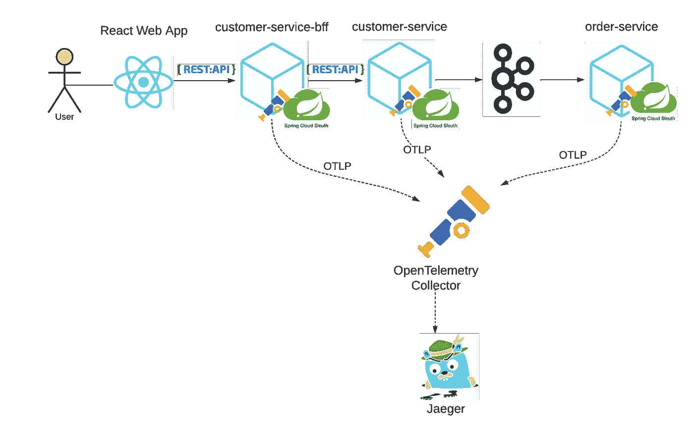
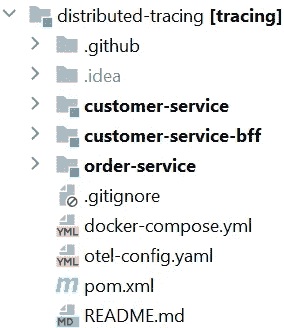
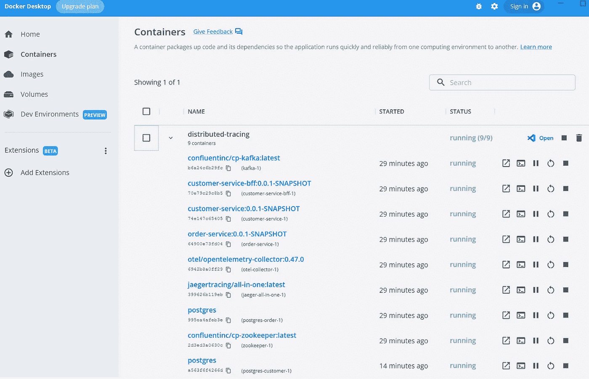
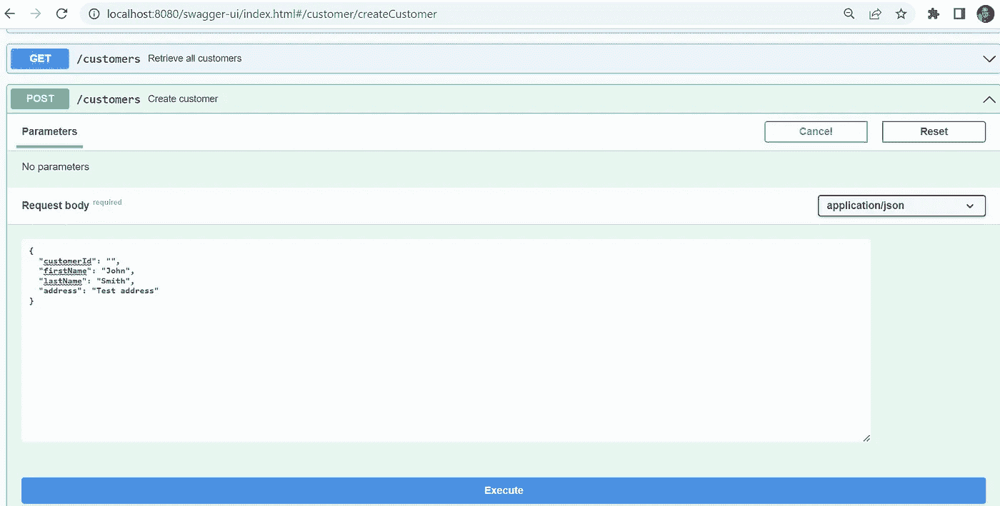
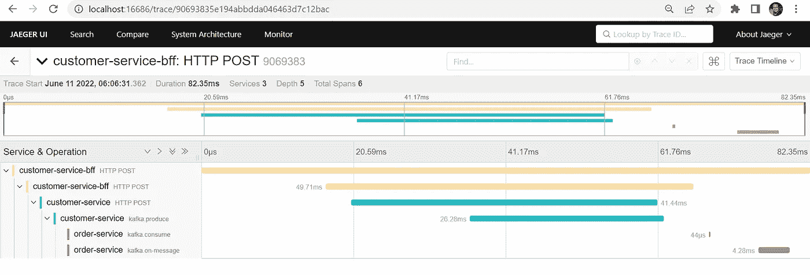
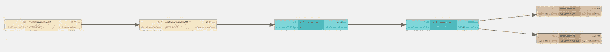
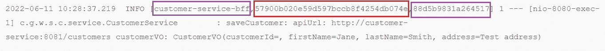
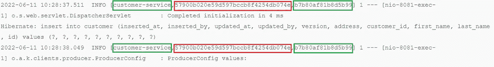
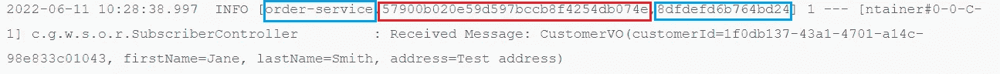
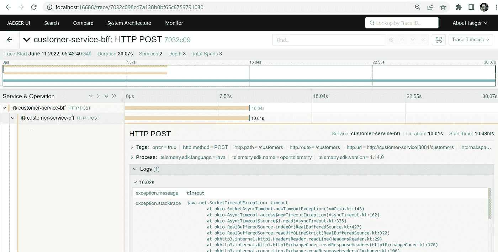

# 使用 OpenTelemetry、Spring Cloud Sleuth、Kafka 和 Jaeger 进行分布式跟踪

> 原文：<https://betterprogramming.pub/distributed-tracing-with-opentelemetry-spring-cloud-sleuth-kafka-and-jaeger-939e35f45821>

## 微服务中分布式跟踪实施的分步指南

图片由 [rud0070](https://pixabay.com/users/rud0070-1337509/?utm_source=link-attribution&amp;utm_medium=referral&amp;utm_campaign=image&amp;utm_content=2338138) 来自 [Pixabay](https://pixabay.com/?utm_source=link-attribution&amp;utm_medium=referral&amp;utm_campaign=image&amp;utm_content=2338138)

分布式跟踪使您能够深入了解特定服务作为分布式软件系统整体的一部分是如何执行的。它跟踪并记录从起点到目的地的请求，以及请求通过的系统。

在本文中，我们将使用 OpenTelemetry、Spring Cloud Sleuth、Kafka 和 Jaeger 在三个 Spring Boot 微服务中实现分布式跟踪。

让我们先来看看分布式跟踪中的一些基本术语。

Span:表示系统中的单个工作单元。跨度可以相互嵌套，以模拟工作的分解。例如，一个 span 可能调用一个 REST 端点，而另一个子 span 可能是调用另一个端点的端点，以此类推，在不同的服务中。

Trace:共享同一个根 span 的 span 的集合，或者更简单地说，是作为原始请求的直接结果而创建的所有 span。跨度的层次结构(每个跨度在根跨度旁边都有自己的父跨度)可用于形成有向非循环图，该图显示了请求通过各种组件时的路径。

# 开放式遥测

[OpenTelemetry](https://opentelemetry.io/) ，也简称 OTel，是一个厂商中立的开源可观测性框架，用于检测、生成、收集和导出遥测数据，如[轨迹](https://opentelemetry.io/docs/concepts/observability-primer/#distributed-traces)、[度量](https://opentelemetry.io/docs/concepts/observability-primer/#reliability--metrics)和[日志](https://opentelemetry.io/docs/concepts/observability-primer/#logs)。作为云原生计算基金会(CNCF)的孵化项目，OTel 旨在提供统一的供应商无关库和 API 集——主要用于收集数据并将其传输到某个地方。OTel 正在成为生成和管理遥测数据的世界标准，并被广泛采用。

# 春云侦探

[Sleuth](https://spring.io/projects/spring-cloud-sleuth) 是由 Spring Cloud 团队管理和维护的项目，旨在将分布式跟踪功能集成到 Spring Boot 应用程序中。它作为一个典型的`Spring Starter`捆绑在一起，因此只需将其作为一个依赖项添加，自动配置就可以处理整个应用程序的所有集成和工具。这里有一些现成的侦探工具:

*   在 Spring MVC 控制器(REST 端点)上接收的请求
*   通过 Kafka 或 MQ 等消息传递技术的请求
*   使用`RestTemplate`、`WebClient`等提出请求。

Sleuth 添加了一个拦截器来确保所有的跟踪信息都在请求中传递。每次调用时，都会创建一个新的 Span。它在收到响应时关闭。

Sleuth 能够跟踪您的请求和消息，因此您可以将该通信与相应的日志条目相关联。您还可以将跟踪信息导出到外部系统，以直观显示延迟。

# 贼鸥

Jaeger 最初由优步的团队建造，然后在 2015 年开源。它于 2017 年被接受为云原生孵化项目，并于 2019 年毕业。作为 CNCF 的一部分，Jaeger 是云原生架构中公认的项目。它的源代码主要是用 Go 编写的。耶格的架构包括:

*   检测库
*   收集者
*   查询服务和 web 用户界面
*   数据库存储

与 Jaeger 类似，Zipkin 也在其架构中提供了相同的组件集。虽然 Zipkin 是一个较老的项目，但 Jaeger 有一个更现代和可扩展的设计。对于这个例子，我们选择了 Jaeger 作为后端。

# 跟踪系统设计

让我们设计三个 Spring Boot 微服务:

*   `customer-service-bff`:使用`backend for frontend`模式，这个服务位于用户界面和后端之间。它由一个 UI web 应用程序调用，该应用程序又通过 REST API 调用来调用后端客户服务。
*   `customer-service`:简单的客户 CRUD 服务。除了在 CRUD 操作时将数据保存到数据库之外，它还在创建、更新或删除客户记录时将事件发布到 Kafka。
*   `order-service`:监听 Kafka 主题，消费客户创建/更新/删除的事件。

这三种微服务旨在:

*   通过 REST API ( `customer-service-bff`和`customer-service`)进行通信
*   通过 Kafka ( `customer-service`和`order-service`)经由事件驱动的发布/订阅进行通信

这是为了观察 OpenTelemetry 结合 Spring Cloud Sleuth 如何处理代码的自动插装，并生成和传输跟踪数据。上面的虚线捕获了跟踪数据的路径，由微服务导出，通过 OTLP (OpenTelemetry Protocol)传输到 OpenTelemetry 收集器，收集器反过来处理并导出跟踪数据到后端 Jaeger 进行存储和查询。

使用 monorepo，我们的项目结构如下:

# 步骤 1:添加 POM 依赖项

这是使用 OTel 和 Spring Cloud Sleuth 实现分布式跟踪的关键。我们的目标是不需要手动检测我们的代码，所以我们依靠这些依赖来做它们被设计来做的事情——自动检测我们的代码，除了跟踪实现，将遥测数据导出到 OTel 收集器，等等。

*   `spring-cloud-dependencies`:春云相依
*   `spring-cloud-sleuth-otel-dependencies`:春云 Sleuth OpenTelemetry 依赖
*   `spring-cloud-starter-sleuth` : Sleuth 通过`spring-cloud-sleuth-brave`模块中可用的桥与 OpenZipkin Brave tracer 集成。由于我们将在示例中使用 OpenTelemetry tracer，我们从`spring-cloud-starter-sleuth`依赖项中排除了`spring-cloud-sleuth-brave`,而是添加了`spring-cloud-sleuth-otel-autoconfigure`依赖项。这将基于 [Brave](https://github.com/openzipkin/brave/tree/master/brave) 的默认追踪实现替换为基于 OpenTelemetry 的实现。
*   `opentelemetry-exporter-otlp-trace`:这是 Spring Cloud Sleuth OTel 中向 OpenTelemetry 收集器发送跟踪的组件。

# 步骤 2:打开遥测配置

## 打开遥测收集器端点

对于每个微服务，我们需要在`application.yml`中添加以下配置(参见下一节中的示例片段)。`spring.sleuth.otel.exporter.otlp.endpoint`主要是配置 OTel 收集器端点。它告诉导出器，在我们的例子中是 Sleuth，通过 OTLP 将跟踪数据发送到指定的收集器端点`[http://otel-collector:4317](http://otel-collector:4317.)`。注意端点 URL 中的`otel-collector`来自`otel-collector`图像的 docker-compose 服务。

## 追踪数据概率抽样

`spring.sleuth.otel.config.trace-id-ratio-based`属性定义了跟踪数据的采样概率。它根据提供给采样器的部分采样一小部分轨迹。概率抽样允许 OpenTelemetry tracing 用户通过使用随机抽样技术降低跨度收集成本。如果该比率小于 1.0，某些轨迹将不会导出。对于本例，我们将采样配置为 1.0，100%。

有关其他 OTel Spring Cloud Sleuth 属性，请参见[通用应用程序属性](https://spring-projects-experimental.github.io/spring-cloud-sleuth-otel/docs/current/reference/html/appendix.html#common-application-properties)。

## 打开遥测配置文件

我们需要在项目根目录下有一个 OTel 配置文件`otel-config.yaml`。内容如下。这个配置文件定义了 OTel 接收器、处理器和导出器的行为。正如我们所看到的，我们定义了我们的接收器来监听 gRPC 和 HTTP，处理器使用 batch，导出器使用 jaeger 和 logging。

# 第三步:docker-compose 将所有内容串在一起

让我们来看看为了运行这三个微服务并观察它们的分布式跟踪，我们需要启动的 docker 容器，前三个微服务在上一节中已有解释。

*   `customer-service-bff`
*   `customer-service`
*   `order-service`
*   `postgres-customer`:用于`customer-service`的数据库
*   `postgres-order`:用于`order-service`的数据库
*   `jaeger-all-in-one`:运行所有 Jaeger 后端组件和 UI 的单一映像
*   `otel-collector`:open telemetry tracing 的引擎，接收、处理并导出跟踪数据到后端
*   `zookeeper`:跟踪 Kafka 集群中节点的状态，维护 Kafka 主题和消息列表
*   `kafka`:发布/订阅事件流处理平台

运行`docker-compose up -d`调出所有九个容器:

# 步骤 4:跟踪运行中的数据

## 快乐之路

现在，让我们启动我们的`customer-service-bff`，流程的入口点，来创建一个新客户。

启动 Jaeger UI，`[http://localhost:16686/](http://localhost:16686/,)` [，](http://localhost:16686/,)按服务搜索`customer-service-bff`，点击`Find Traces`按钮，这里是我们看到的创建客户跟踪:它跨越了三个服务，总共跨越了六个，持续时间 82.35 毫秒

除了跟踪时间线视图(上面的截图)，Jaeger 还提供了一个图形视图(在右上方的下拉菜单中选择`Trace Graph`):

docker 中三个微服务的日志输出显示了相同的 trace id，以红色突出显示，而不同的 span id 根据它们的应用程序名称而不同(应用程序名称及其对应的 span id 以匹配的颜色突出显示)。在`customer-service`的例子中，相同的 span id 从 REST API 请求传递到 Kafka publisher 请求。

## 错误场景

让我们暂停 docker 中的`customer-service` PostgreSQL 数据库，并从`customer-service-bff`开始重复创建客户流。我们得到了`500 internal server error`，不出所料。在 Jaeger 中，我们看到了下面的跟踪，除了 stacktrace 抱怨`SocketTimeoutException`之外，还是和预期的一样。

## 识别长期跨度

Jaeger UI 允许我们搜索超过指定最大持续时间的轨迹。例如，我们可以搜索所有耗时超过 1000 毫秒的轨迹。然后，我们可以深入长期运行的跟踪，调查它们的根本原因。

# 摘要

在本文中，我们从 OpenTelemetry、Spring Cloud Sleuth 和 Jaeger 的角度展开了分布式跟踪，在 REST API 调用和 Kafka pub/sub 中验证了分布式跟踪的自动检测。我希望这个故事能让你更好地理解这些跟踪框架和工具，尤其是 OpenTelemetry，以及它如何从根本上改变我们在分布式系统中的可观测性。

这个故事的源代码可以在[我的 GitHub repo](https://github.com/wenqiglantz/opentelemetry-sleuth-kafka-jaeger.git) 中找到。

有关如何将 DataDog 与 OpenTelemetry 集成用于分布式跟踪的说明，请查看我的故事[使用 OpenTelemetry 和 DataDog 的分布式跟踪](/distributed-tracing-with-opentelemetry-and-datadog-712f8f4d520b?sk=37f65dd5977968bae9c98bdcac9b047d)。

编码快乐！

# 参考

[https://opentelemetry.io/docs/](https://opentelemetry.io/docs/)

[https://docs . spring . io/spring-cloud-sleuth/docs/current/reference/html/getting-started . html # getting-started](https://docs.spring.io/spring-cloud-sleuth/docs/current/reference/html/getting-started.html#getting-started)

[https://storiesfromtheerd . com/unpacking-observability-the-observability-stack-93d 4733 e2a 72](https://storiesfromtheherd.com/unpacking-observability-the-observability-stack-93d4733e2a72)

[https://medium . com/dzerolabs/observability-journey-understanding-logs-events-traces-and-spans-836524d 63172](https://medium.com/dzerolabs/observability-journey-understanding-logs-events-traces-and-spans-836524d63172)

[https://ryanharrison . co . uk/2021/08/06/distributed-tracing-spring-boot-jaeger . html](https://ryanharrison.co.uk/2021/08/06/distributed-tracing-spring-boot-jaeger.html)

[https://towardsdev . com/open telemetry-spring-boot-Kafka-and-jaeger-in-action-8ef 1912 c 8044](https://towardsdev.com/opentelemetry-spring-boot-kafka-and-jaeger-in-action-8ef1912c8044)

[https://reflectoring.io/spring-boot-tracing](https://reflectoring.io/spring-boot-tracing)