# 如何使用 Swift 软件包管理器分发 iOS 库

> 原文：<https://betterprogramming.pub/distributing-ios-swift-libraries-with-swift-package-manager-3c9630149bb3>

## 向椰子说再见

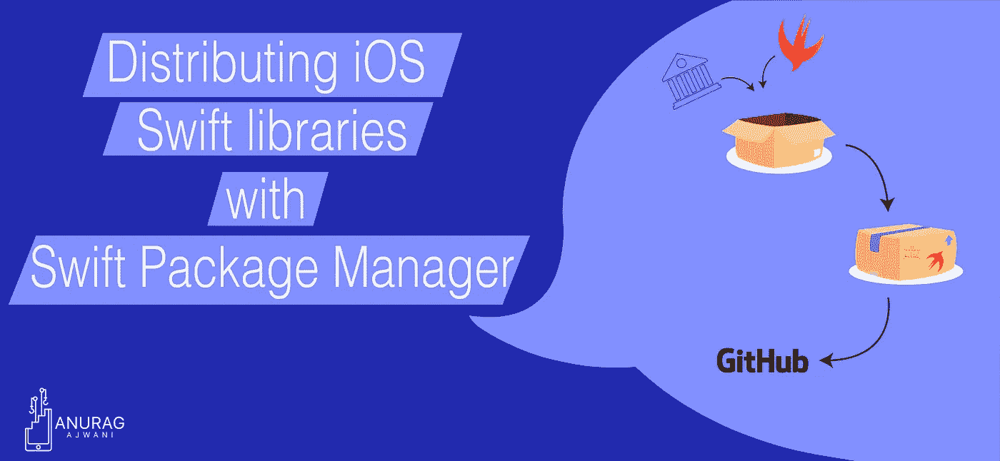

矢量图形来源于[https://www.vecteezy.com](https://www.vecteezy.com)

向集成商分发 Swift 库有几种方式， [CocoaPods](https://medium.com/onfido-tech/distributing-swift-frameworks-via-cocoapods-152002b41783) 是最受欢迎的方式之一。直到最近，使用的工具都是由开源社区创建和维护的。在 Swift 3 Apple 中，Swift 社区引入了 Swift Package Manager。

在本文中，我们将介绍为什么您应该支持 Swift Package Manager。然后，我们将介绍如何在 iOS 应用上使用 Swift 包管理器分发和使用静态库的步骤。

我假设读者已经熟悉 Swift、Swift 静态库和 Xcode。我还假设读者熟悉 [Git](https://git-scm.com) 版本控制系统和 [GitHub](https://github.com) 。

*我在本文中使用了 Swift 5.2 和 Xcode 11.4.1。*

# 为什么您应该以 Swift 包的形式发布您的库

开源社区已经支持了依赖/包管理器，那么我们为什么还需要另外一个呢？

首先，现有的工具必须单独下载、维护和安装。Swift 软件包管理器包含在 Swift 和 Xcode 中。这意味着不需要额外安装。

第二，和流行的第三方工具一样，Swift Package Manager 是[开源的](https://github.com/apple/swift-package-manager)。然而，大多数第三方工具使用的语言并不快捷。Swift 包管理器是用 Swift 写的。用 Swift 编写使得 Swift 开发人员更容易阅读、理解，甚至为项目做出贡献。

第三，Xcode 用户界面支持 Swift Package Manager。这意味着我们可以在不离开 Xcode 的情况下完成大多数操作。其他工具没有本机 Xcode UI 集成。

最后，Swift 包管理器得到了苹果的支持。过去，Xcode 的新版本偶尔会破坏第三方工具集成。这意味着要么你不能升级到最新的 Xcode，要么你不得不放弃不再兼容的第三方工具。由于 Swift Package Manager 由 Apple 维护，该工具与 Xcode 的新版本发生冲突的风险较小。

因此，Swift 包管理器:

*   不需要额外下载、安装和维护第三方工具
*   使参与项目变得容易
*   允许您在不离开 Xcode 的情况下运行工具
*   由苹果公司维护

# 如何向 Swift 包管理器发布静态库

在本节中，我们将发布一个现有的 iOS 静态库作为 Swift 包。需要一个 [GitHub](https://github.com/) 帐户来发布此部分的包。

在本节中，我们将:

1.  检索起始项目
2.  创建包声明
3.  创建本地 Git 存储库
4.  设置 GitHub 帐户
5.  发布到 GitHub

## 1.检索起始项目

首先，让我们下载启动项目。打开终端并执行以下命令:

```
cd $HOME
curl [https://github.com/anuragajwani/distributing_swift_lib_spm/archive/starter.zip](https://github.com/anuragajwani/distributing_swift_lib_spm/archive/starter.zip) -o swift_lib.zip -L -s
unzip -q swift_lib.zip
cd distributing_swift_lib_spm-starter/MyStaticLib
```

starter 项目包含一个 Swift 静态库，其中只有一个文件和函数。库的功能对于本文并不重要。

## 2.创建包声明

接下来，让我们把我们的库做成一个 Swift 包。Xcode 有一个方便的选项，可以轻松创建新的包。然而，Xcode 没有一个方便的选项来将现有的库打包。我们将从头开始创建我们的包声明。

首先，我们需要创建一个名为`Package.swift`的文件。回到终端并执行以下命令:

```
touch Package.swift
```

接下来，我们将创建包规范。执行以下命令:

`Package.swift`文件的第一行(`EOF`之间的内容)声明了使用该包所需的 Swift 工具链的最低版本。在撰写本文时，我正在使用 Xcode 11.4.1，其中包括 Swift toolchain 版本`5.2.2`。您可以通过运行以下命令来查找工具链版本:

```
swift --version
```

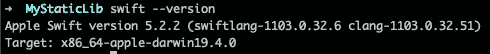

获得 swift 版本

第二行，`import PackageDescription`，声明了`[Package](https://developer.apple.com/documentation/swift_packages/package)` [框架](https://developer.apple.com/documentation/swift_packages/package)的使用。这已经与 Xcode 和 Swift 捆绑在一起。

接下来是包声明本身。

首先是包本身的名字。接下来，让我们覆盖目标。目标包含一组要构建的源文件。我们可以精确地指定[包括哪些源](https://developer.apple.com/documentation/swift_packages/target/2880339-sources)或[排除](https://developer.apple.com/documentation/swift_packages/target/2880334-exclude)，或者如果没有指定，则指定一个路径下所有符合条件的文件。在这种情况下，我们将编译`MyStaticLib`目录下的所有源文件。

最后说一下产品。我们宣布该包将构建的[产品](https://developer.apple.com/documentation/swift_packages/product)。目前，产品既可以是库，也可以是可执行文件。对于本文，我们将只关注一个库。请注意，我们已经指定了`MyStaticLib`产品将构建`MyStaticLib`目标。您可以构建一个包含多个目标的产品，但是在这种情况下，我们只有一个目标。

关于可执行文件的一个快速提示:如果您想构建一个命令行工具，请使用它。

这就是申报包裹所需要的一切。

## 3.创建本地 Git 存储库

接下来，我们将创建一个本地 Git 库`MyStaticLib`。我们需要这作为在 GitHub 托管的远程存储库中发布我们的包的一个步骤。

对于这一步，我们将通过终端创建本地 Git 存储库。打开终端并执行以下命令:

```
cd $HOME/distributing_swift_lib_spm-starter/MyStaticLib
git init
git add --all
git commit --message "Initial commit"
```

## 4.设置 GitHub 帐户

继续之前，请确保您有一个 GitHub 帐户。此外，我们需要将 GitHub 帐户添加到 Xcode 帐户中。若要将 GitHub 帐户链接到 Xcode，请打开 Xcode 并从菜单中选择 Xcode >偏好设置。

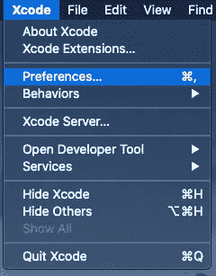

然后点击账户选项卡。接下来，点击加号图标“ **+** ”。

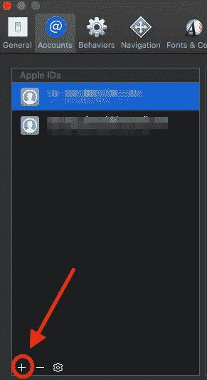

当提示“选择您想要添加的帐户类型”时，选择 GitHub 并点按“继续”。

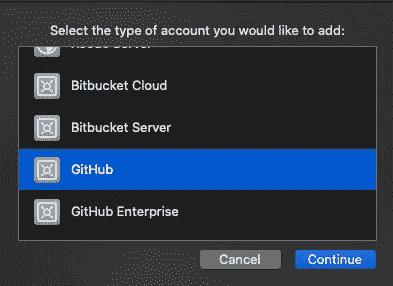

接下来，您需要一个 GitHub 帐户的个人访问令牌。要创建一个，请遵循[这些步骤](https://help.github.com/en/github/authenticating-to-github/creating-a-personal-access-token-for-the-command-line)。创建个人访问令牌时，请确保检查“repo”范围。

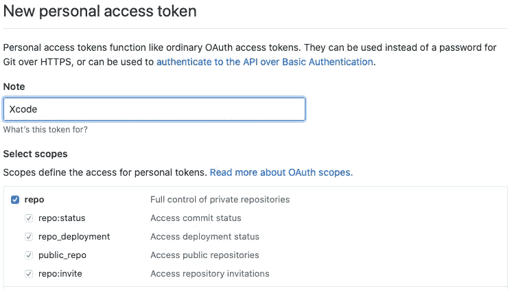

创建新的个人访问令牌

然后在“登录您的 GitHub 帐户”提示中输入您的帐户名称和个人令牌访问。接下来点击登录。

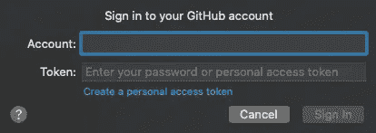

您现在可以关闭偏好设置窗口了。

## 5.发布到 GitHub

接下来我们把`MyStaticLib`发布到 GitHub 上。我们将通过 Xcode 来实现这一点。

首先，让我们用 Xcode 打开我们的 Swift 包。打开终端并执行以下命令:

```
open ~/distributing_swift_lib_spm-starter/MyStaticLib/Package.swift
```

接下来，让我们在 GitHub 中创建 Git 存储库。从菜单中，选择“视图”>“导航器”>“显示源代码管理导航器”。

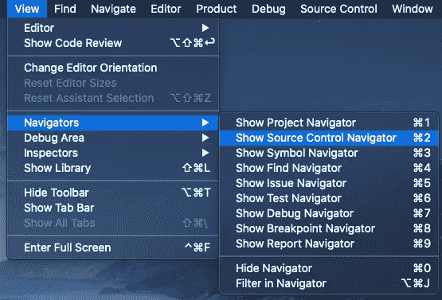

在导航区域中，右键单击“MyStaticLib master ”,然后单击“创建 MyStaticLib”Remote。

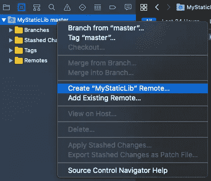

当提示“创建‘MyStaticLib’remote”时，您可以选择将该存储库保持为私有还是公共。本文我选择 Private，因为我们仅展示如何发布和消费 Swift 软件包。然后单击创建。

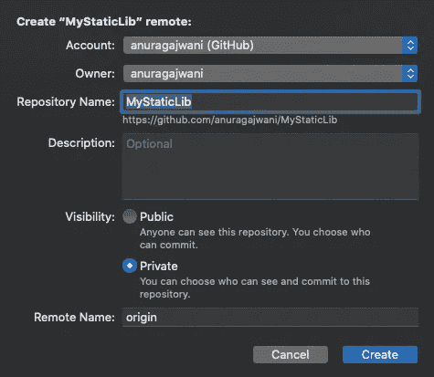

Swift 包使用 Git 标签来获取所需版本的 Swift 包。Swift 包版本控制遵循[语义版本控制](https://semver.org)标准。此时不需要语义版本化的知识，因为我们将只发布一个版本。

让我们为我们的第一个版本创建一个 Git 标签。在导航区域再次右键单击“MyStaticLib master”，然后单击“标记‘master’”。

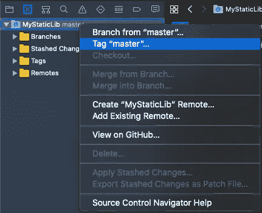

当提示“从版本创建新标签”时，将`1.0.0`输入标签字段。接下来，单击创建。

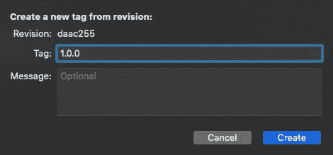

标记现在在本地创建。让我们将这个标签推送到 GitHub 中的远程 Git 存储库。从菜单中选择源代码管理>推送。

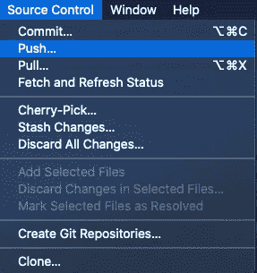

当提示“将本地更改推送到”时，选中“包括标签”复选框。然后点击推送。

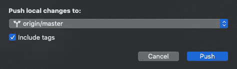

现在这个标签可以在我们的 GitHub 库中找到了。`MyStaticLib` Swift 套餐现已推出！

# 如何使用已发布的静态库

在本节中，我们将学习如何使用我们在上一节中创建的 Swift 产品包。

在本节中，我们将:

1.  创建一个 iOS 应用程序来消费`MyStaticLib`
2.  将`MyStaticLib` Swift 包添加到应用程序中
3.  消费`MyStaticLib`

让我们创建一个使用我们的 Swift 产品包的应用程序。打开 Xcode，从菜单中选择“文件”>“新建”>“项目”。

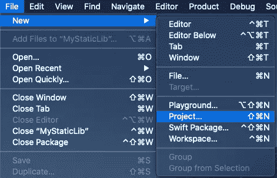

当提示“为新项目选择模板”时，选择单视图应用程序，然后点按“下一步”。

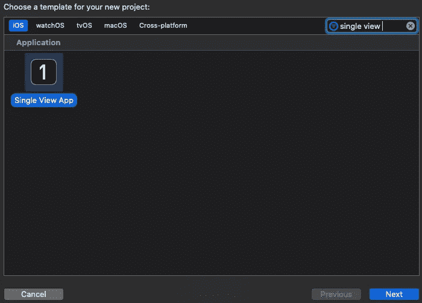

当提示“为您的新项目选择选项”时，在产品名称字段中命名您的产品`SwiftPackageDemo`。所有其他选项都可以保持原样。单击下一步。

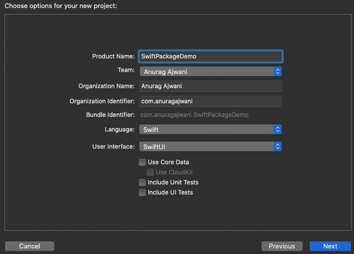

把它保存在你认为合适的地方。单击创建。

接下来，从菜单中选择文件> Swift 软件包>添加软件包相关性。

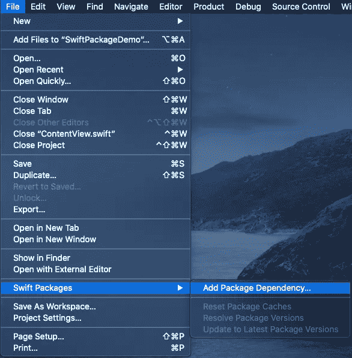

当提示“选择包存储库”时，搜索并选择您拥有的`MyStaticLib`。单击下一步。

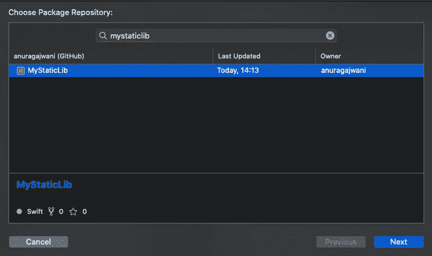

当提示“选择软件包选项”时，Xcode 已经为您选择了版本`1.0.0`。单击下一步。

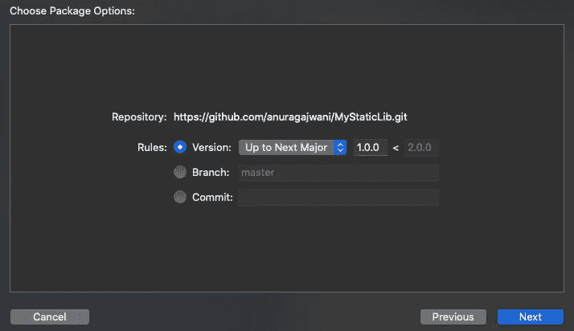

当提示“将包添加到 SwiftPackageDemo”时，确保为`SwiftPackageDemo`应用程序选中了`MyStaticLib`。单击完成。

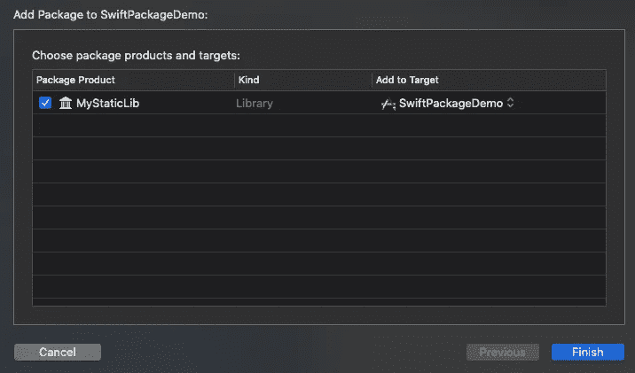

`MyStaticLib`现已添加为`SwiftPackageDemo`应用的依赖项。

接下来，您将在我们的应用程序中使用`MyStaticLib`代码。打开`AppDelegate.swift`，在`import UIKit`后，添加以下一行:

```
import MyStaticLib
```

接下来，将下面一行添加到函数`application(_ application: UIApplication, didFinishLaunchingWithOptions launchOptions: [UIApplication.LaunchOptionsKey: Any]?) -> Bool`中，在`return true`之前:

```
functionA()
```

最后，在模拟器中运行应用程序。

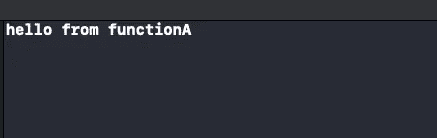

现在，您应该看到静态库中的函数将一条消息打印到控制台。仅此而已！

# 摘要

在本文中，您已经了解到:

*   为什么您应该以 Swift 包的形式发布您的库
*   如何发布 Swift 包
*   如何消费 Swift 套餐

# 最终注释

你可以在 GitHub 上找到本文的[完整源代码。](https://github.com/anuragajwani/distributing_swift_lib_spm)

在本文中，我们已经讨论了以 Swift 包的形式发布静态库。然而，Swift 动态框架呢？通过查看[文档](https://developer.apple.com/documentation/swift_packages/product/2878196-library)，我们能够将 Swift 包作为动态库发布。我们可以通过改变[库类型](https://developer.apple.com/documentation/swift_packages/product/library/librarytype)来做到这一点。不过，这个我自己没试过。

关于 Swift Package Manager 的另一个值得注意的限制是，我们不能发布动态框架。有什么含义？简而言之，我们不能捆绑图像、xib 或故事板文件等资源。

用 Swift Package Manager 分发编译过的静态库或者编译过的动态框架怎么样？我们也还不能这么做。然而，[该功能正在](https://github.com/apple/swift-evolution/blob/master/proposals/0272-swiftpm-binary-dependencies.md)上工作。

因此，Swift Package Manager 不能:

*   分配资源
*   构建动态框架
*   分发编译的库