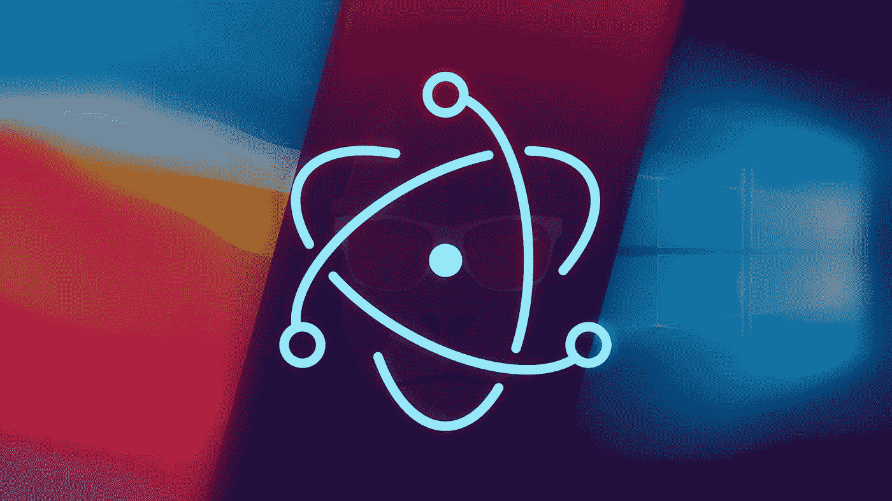
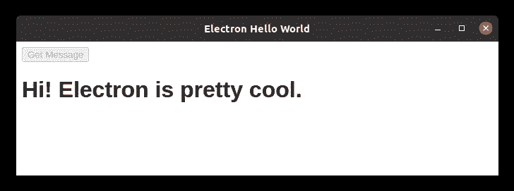

# 潜心研究电子

> 原文：<https://betterprogramming.pub/dive-into-electron-552df2fac084>

## 使用 Node.js 和 Web 技术为 Windows、MacOS 和 Linux 构建应用程序，所有这些都来自一个代码库。



作者照片。

如果你是一名网络开发者，你现在可能已经知道了[电子](https://www.electronjs.org/)。对于门外汉来说，Electron 是一种半争议性的技术，它允许开发者使用 web 技术和单一代码库创建可以在 Windows、macOS 和 Linux 上运行的应用程序。尽管开发的应用程序被认为比本地应用程序更慢、更重，但 Electron 允许 web 开发人员针对所有三大 PC 平台——否则这可能会过于昂贵或耗时。事实上，一些最广泛使用的桌面应用程序(包括 Visual Studio 代码、Slack 和 Discord)都是用 Electron 构建的。

在本指南中，我们将设置一个简单的电子应用程序。因为 electronic 是基于 [Node.js](https://nodejs.org/en/) 的，你需要先熟悉它，因为我不会在这里讨论它。您还需要了解 [Express](https://expressjs.com/) 库的基础知识。作为奖励，我们将使用 [TypeScript](https://www.typescriptlang.org/) 而不是 JavaScript。相信我，你永远不会想回 JS。

# 概观

电子应用程序本质上运行在与大多数 web 应用程序相同的前端/后端模型上，除了前端运行在自己的窗口而不是浏览器中，后端是本地运行而不是在服务器上运行的节点应用程序。

制作过程可以分为以下几个主要部分:

1.  设置环境
2.  设置类型脚本
3.  创建后端
4.  创建前端
5.  测试应用程序
6.  构建应用程序

> **关于安全性的说明:**我将使用一个 Express 服务器来实现后端和前端之间的通信。这使我们能够创建一些在开发中易于使用的东西，并允许您现有的 Web 应用程序轻松地移植到 electronic。不过，在生产中，你应该总是使用[电子 IPC](https://www.tutorialspoint.com/electron/electron_inter_process_communication.htm) 来达到这个目的。

就这样，让我们开始吧。

# 1.设置环境

首先，确保节点安装在您的计算机上。

接下来，为您的电子应用程序创建一个新文件夹，然后启动终端并导航到新文件夹。在那里，运行`npm init`来初始化一个新的节点项目。回答每个提示，不确定时保留默认值。

*注意:虽然不是强制性的，但是在这一点上你可能需要设置*[*Git*](https://git-scm.com/)*版本控制。如果你这样做，确保它忽略了* `*/dist*` *和* `*/build*` *文件夹，因为这些文件夹将包含转换的代码和编译的可执行文件。*

## 安装依赖项

从项目文件夹的根目录运行以下命令来安装所需的依赖项:

```
npm i --save-dev electron electron-packager typescript ts-node-dev
npm i express @types/express
```

# 2.设置类型脚本

在项目文件夹中，创建一个名为`tsconfig.json`的文件，并将以下内容粘贴到其中:

`compilerOptions`是一组选项，告诉 TypeScript 如何解释你的代码并将其转换成 JavaScript。请记住，虽然 TypeScript 是一种很好的编码语言，但在用于生产之前，它仍然必须转换成普通的旧 JavaScript。虽然我们不会在这里深入讨论每个选项的细节，但是您应该注意`outDir`选项。这告诉我们最终的 JS 代码将保存在哪里。对于本指南，我们将指示 TS 将代码放在项目文件夹根目录下名为`dist`的文件夹中。

`include`选项告诉 transpiler 在哪里寻找 TS 代码文件，而`exclude`选项明确地告诉它应该避免什么。

## 源目录

注意`tsconfig.json`中的`include`选项提到了一个名为`src`的文件夹。这还不存在，所以您应该在项目文件夹中创建它。这是您所有后端代码的位置。您还应该创建一个`frontend` 文件夹:


这是您的项目文件夹现在应该看起来的样子。

## Package.json 更改

我们需要修改`package.json`文件。打开它并用以下内容替换`"scripts"`属性:

```
"scripts": {
    "transpile": "tsc",
    "watch": "ts-node-dev --respawn --poll ./src/main.ts",
    "app": "electron .",
    "build": "electron-packager . --out=build --overwrite"
},
```

这些脚本定义了我们可以在项目中运行的命令。`transpile`命令将把类型脚本代码转换成 JavaScript。

`watch`命令持续监视您的 TypeScript 代码，并在您进行更改时直接自动运行它，而无需先将它转换成 JavaScript。这在测试过程中非常有用。

`app`命令运行电子应用程序进行测试，而`build`命令将为当前平台编译最终的可执行版本，并将其保存到`build`文件夹中。

所有这三个命令都可以从终端以下列格式运行:`npm run <command>`(例如`npm run transpile`)。

最后，将`"main"`属性的值更改为`"dist/main.js"`。这告诉 Electron 在其主进程中运行`main.js`文件。当然，这个文件不是由我们直接编写的，而是稍后从我们的 TypeScript 代码转换而来的。

# 3.创建后端

普通的节点后端只包含处理来自客户端的 HTTP 请求的代码。电子后端包含所有这些，加上处理电子流程本身所需的代码。

在`src`文件夹中创建一个名为`main.ts`的新文件，并将以下代码粘贴到其中:

让我们看一下代码。我们首先导入必要的模块。从`electron`开始，我们需要导入`app`来与应用程序交互，导入`BrowserWindow`来管理 GUI。除此之外，我们还导入了必要的`express`和`path`模块来服务前端。

接下来，我们设置一个`const PORT`变量来设置服务器将监听的端口。这是一个任意的数字，几乎可以设置为任何值，但我建议使用 49152–65535 范围内的值，以避免与[保留或常用的](https://en.wikipedia.org/wiki/List_of_TCP_and_UDP_port_numbers)端口冲突。

在这一点上，我们开始研究电子。我们首先定义一个`win`变量，它将保存一个代表应用程序窗口的对象。也可能是`null`没有 app 窗口存在。

然后，我们定义一个名为`createWindow`的函数，它将创建一个新的应用程序窗口，并将其保存在`win`变量中。我们使用各种选项来设置窗口的大小和标题，我们使用`win.loadURL`函数来指示窗口加载和显示`localhost:7259`，这是我们的前端 HTML 文件(我们还没有创建)的来源。我们在这个函数中做的最后一件事是定义一个`win.on`回调，当窗口关闭时，这个回调将`win`对象设置回`null`。

到目前为止，我们的代码告诉 Electron 如何处理应用程序窗口，但没有告诉它如何管理应用程序进程本身。这就是第 30 到 50 行的用武之地。这些代码行使用`app.on`定义了三个回调函数，当特定事件发生时会调用这些函数。

当首次初始化电子应用程序流程时，触发了`ready`事件，我们创建了一个新的应用程序窗口，并使用`createWindow`函数显示它。

当所有先前打开的窗口关闭时，触发`window-all-closed`事件。当这种情况发生在 Windows 或 Linux 上时，我们假设用户打算永远退出应用程序，所以我们调用`app.quit`来关闭整个应用程序。然而，在 macOS 上，应用程序通常会一直在后台运行，直到用户明确地从 dock 中退出它们，所以我们在`if`语句中说明了这种特殊情况。

最后，我们处理`activate`事件。当应用程序从后台被带到前台时，就会调用这个函数。当然，这应该只发生在 macOS 上，因为这是我们首先允许应用程序在后台运行的唯一平台。当该事件被触发时，使用`createWindow`功能再次创建一个新的应用程序窗口。

你熟悉 Node 和 Express，所以我们就不涉及第 52 行之后的代码了。

此时，我们有了启动电子应用程序和在后台运行 Express 服务器所需的代码。我们仍然需要一个可以与服务器交互的前端。

# 4.创建前端

注意，上面的后端代码引用了一个`index.html`文件。尽管您可以使用任何您想要的前端技术，但是对于本指南的目的来说，一个简单的 HTML 文件就足够了。

将此代码粘贴到项目文件夹根目录下的`index.html`文件中:

这里没有什么特别的——只是一个简单的 HTML 页面，样式简单，与我们的后端交互。请注意，前端发出的任何 HTTP 请求都应该有正确的端口号。

# 5.测试应用程序

此时，应用程序已经准备好构建了。当然，在确保一切正常工作之前，您不应该浪费时间构建最终的可执行文件。

运行`npm run watch`来运行你的代码并持续观察它的变化。然后，在浏览器中打开`index.html`文件。虽然电子应用程序通常不会在浏览器中运行，但它们的核心是 web 应用程序，因此为了方便起见，我们可以在测试期间使用浏览器。Electron 基于 Chromium 渲染引擎，因此最好使用 Chrome、Edge 或其他一些基于 Chromium 的浏览器。

测试您的应用程序，并根据需要进行任何更改。对前端代码进行任何更改后，请务必刷新浏览器窗口。

虽然从技术上来说，在浏览器和电子容器中运行应用程序应该没有什么区别，但为了确保万无一失，你可以使用`npm run app`在电子容器中运行它。

当你确定一切正常时，进入下一部分。

# 6.构建应用程序

此时，所有的部分都已就绪，剩下的就是为最终用户编译应用程序了。运行`npm run transpile`以确保你的代码的最新版本已经被转换成 JavaScript。然后，使用`npm run build`来构建你的应用程序的最终可执行版本。请注意，虽然这只是为您当前的操作系统创建了一个应用程序，但是您可以查看`electron-packager`命令选项，看看如何为其他平台编译，然后相应地更改`package.json`脚本。

你应该在一个新的`build`文件夹中找到编译好的应用程序。



运行编译后的应用程序。

# 结论

我希望这个指南能帮助你开始用 Electron 开发桌面应用程序。感谢阅读！