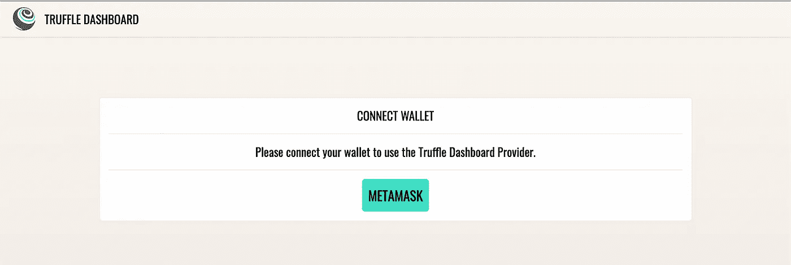
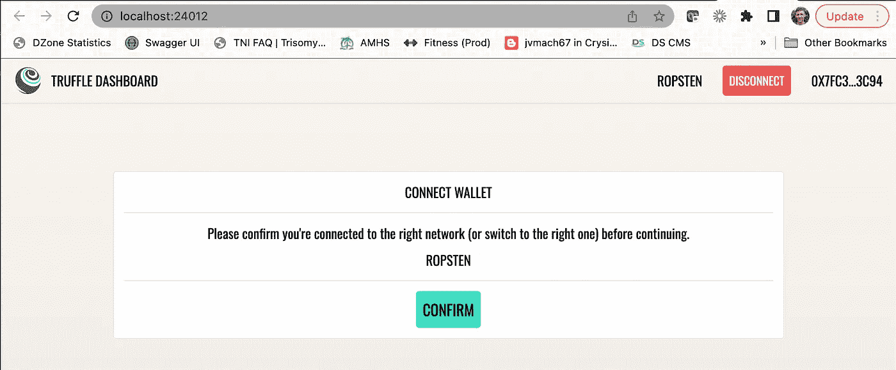
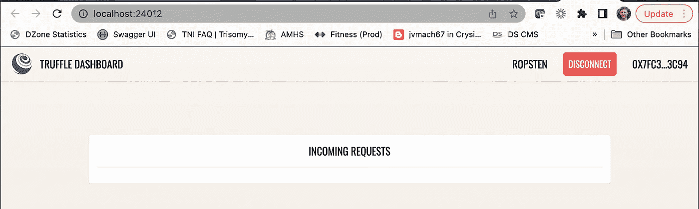
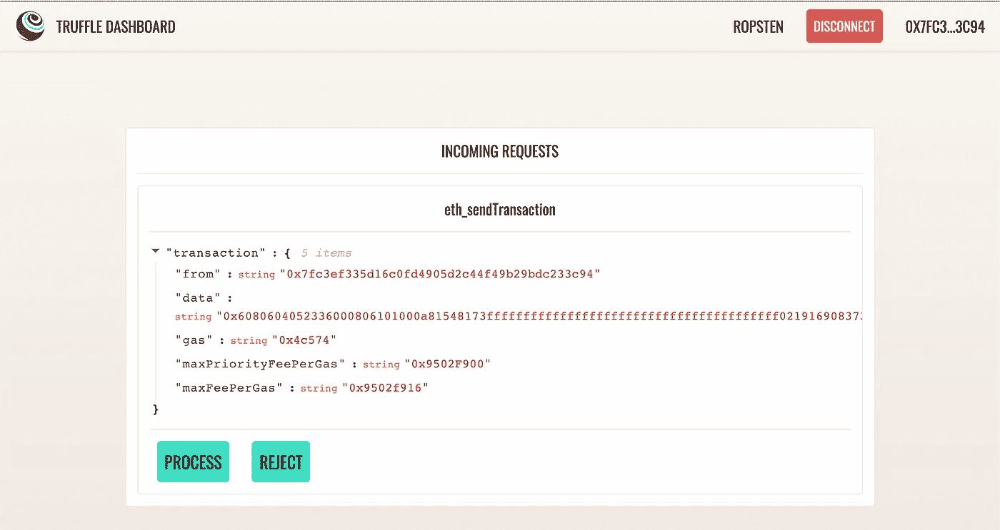
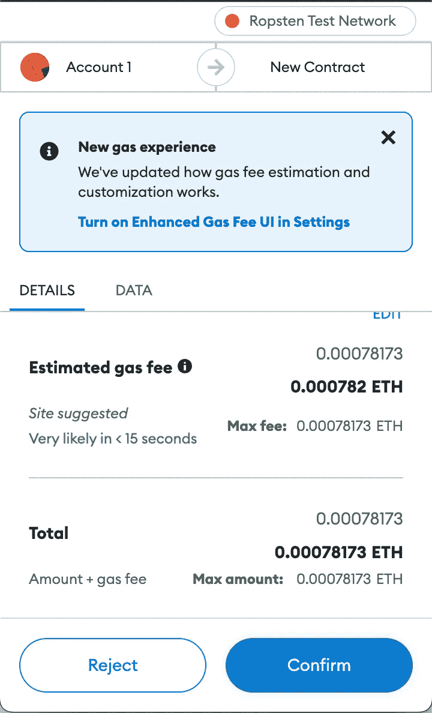
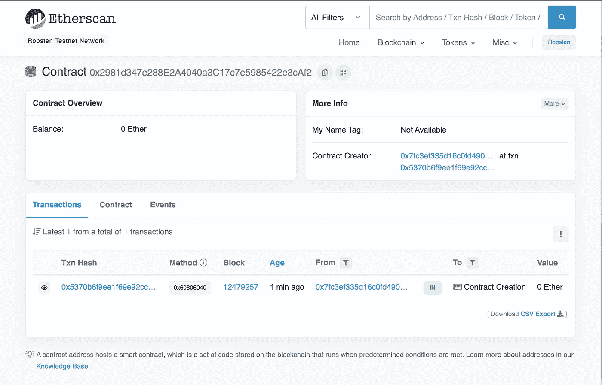
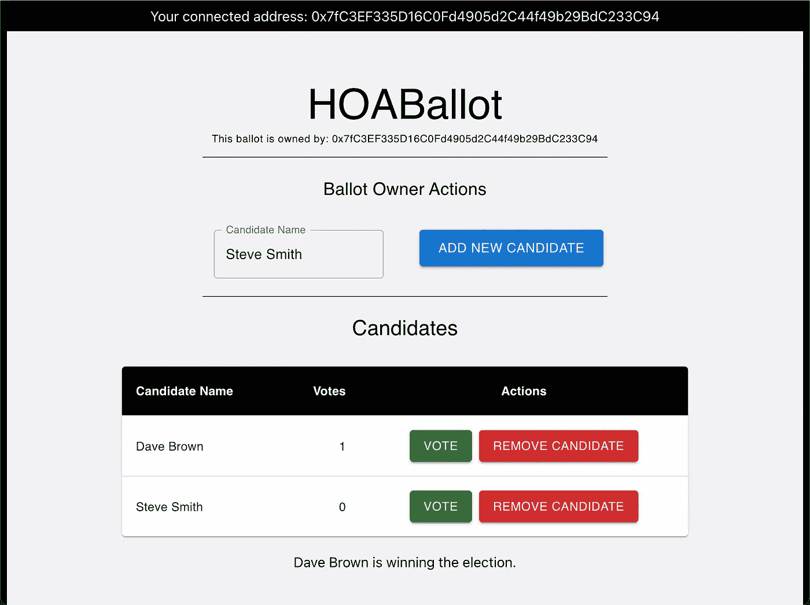

# 构建 HOA 选票智能合同应用程序

> 原文：<https://betterprogramming.pub/diving-deep-into-smart-contracts-6e0dfcfa51f2>

## 通过使用 Solidity、OpenZeppelin、Truffle、MetaMask 和 React，达成更少争议的协议


克雷格·怀特黑德在 [Unsplash](https://unsplash.com?utm_source=medium&utm_medium=referral) 上的照片

“[从全栈开发者到 Web3 先锋](/moving-from-full-stack-developer-to-web3-pioneer-13bf8b415dc9)”的故事提供了一个高层次的概述，让全栈开发者一瞥 Web3 开发的世界。如果您还没有机会阅读那篇文章，可以考虑看一看，因为它也提供了对 Web3 的很好的介绍。

我最初文章的最终结果展示了一个业主协会(HOA)如何使用 Web3 技术来主持他们的选举投票。原始设计的问题是，基础智能合约只允许一个是或否的答案。这是为了简化智能合同，同时引入使用 Web3 技术创建 HOA 选票所需的其他概念。

本文旨在更深入地研究智能合约，以构建一个应用程序，该应用程序不仅可以捕获 HOA 选票的实际需求和功能，还可以设计一个可以在一次选举到下一次选举之间重用的应用程序。

# 关于智能合约

在我们开始之前，让我们定义一个智能合同:

> “智能合同是在以太坊上的一个地址运行的程序。它们由可以在接收事务时执行的数据和函数组成。这是一份智能合同的概述。
> 来源[ethereum.org](https://ethereum.org/en/developers/docs/smart-contracts/anatomy/#top)

# 口香糖贩卖机

信不信由你，在一个简单的口香糖贩卖机中可以找到一个智能合同的简单例子:


人们很容易理解从口香糖贩卖机购买的相关成本。正常情况下，这是一个(美国)季度。这里需要指出的是，顾客是匿名的，因为口香糖贩卖机在给顾客一块香喷喷的口香糖之前不需要知道顾客是谁。

匿名消费者将货币放入口香糖贩卖机并旋转转盘以接受合同条款。这一步很重要，因为交易是透明的，是点对点的:在你和机器之间。交易也是安全的，因为您必须提供预期的货币才能使用口香糖机。

一旦货币落入口香糖贩卖机，合同条款被接受，一个口香糖球滚向机器底部，允许顾客接收他们的购买。至此，合同完全执行完毕。

顾客必须接受所提供的东西，也就是说，他们不能退回口香糖或倒转拨号盘来取回他们的货币。同样，智能合同通常是不可撤销和不可修改的。

# 智能合同用例

除了财务驱动的例子之外，一些不可逆和不可修改的匿名的、不可信的、分散的和透明的交互可以被实现的场景如下:

*   临床试验—独立测试的结果
*   选举——参与者投票
*   身份—允许个人决定与谁共享身份
*   保险单——个人保单和条款
*   产品和供应跟踪—生产和供应跟踪的状态跟踪
*   房地产和土地-与房地产和土地相关的契约，可用于在任何时间点得出当前所有者
*   录音信息——官方记录和抄本(比如葛底斯堡演说)

在每种情况下，智能合同的内容都可以尽可能经常地被调用和检查，而不能改变或修改结果。上面的每个用例都将智能合约作为底层信息的记录系统。

# 多聪明的合同不是

在这个时间点上，除了少数例外，智能合同不是具有法律约束力的协议。这意味着，如果你对智能合同的结果不满意，在某些法院系统中向法官提出你的问题是不可能的。

也有一些例外，比如在亚利桑那州，智能合同被认为具有法律约束力。此外，如果您在加利福尼亚州，并且您的结婚证包含在智能合同中，则该协议也具有法律约束力。预计未来会有更多政府将智能合同视为具有法律约束力的协议。

# 用例:创建一个真实的 HOA 选票

基于“从全栈开发人员到 Web3 先锋”出版物中的简单二元(是/否)智能契约，让我们向前迈进一步，假设对于只有一个职位需要填补的社区的 HOA 投票存在以下要求:

*   选择 HOA 总统

理想情况下，目标应该是每次 HOA 选举都使用单一的智能合同。那些竞选总统职位的人预计会在一次又一次的选举中发生变化。

现在，让我们开始制定一个智能合同来处理我们的需求。

# 定义我们的新智能合同

使用 Solidity，我与[保罗·麦卡维尼](https://twitter.com/paul_can_code)一起工作，他为 HOA 投票精心制作了我们的[智能合同](https://github.com/paul-mcaviney/smart-contract-deep-dive)，如下所示:

```
// SPDX-License-Identifier: MIT
pragma solidity ^0.8.13;

/********************************************************/
/* For learning purposes ONLY. Do not use in production */
/********************************************************/

// Download into project folder with `npm install @openzeppelin/contracts`
import "@openzeppelin/contracts/access/Ownable.sol";

// Inherits the Ownable contract so we can use its functions and modifiers
contract HOABallot is Ownable {

    // Custom type to describe a Presidential Candidate and hold votes
    struct Candidate {
        string name;
        uint256 votes;
    }

    // Array of Presidential Candidates
    Candidate[] public candidates;

    // Add a President Candidate - onlyOwner
    function addCandidate(string memory _name) public onlyOwner {
        require(bytes(_name).length > 0, "addCandidate Error: Please enter a name");
        candidates.push(Candidate({name: _name, votes: 0}));
    }

    // Remove a Candidate - onlyOwner
    function removeCandidate(string memory _name) public onlyOwner {
        require(bytes(_name).length > 0, "removeCandidate Error: Please enter a name");
        bool foundCandidate = false;
        uint256 index;
        bytes32 nameEncoded = keccak256(abi.encodePacked(_name));

        // Set index number for specific candidate
        for (uint256 i = 0; i < candidates.length; i++) {
            if (keccak256(abi.encodePacked(candidates[i].name)) == nameEncoded) {
                index = i;
                foundCandidate = true;
            }
        }

        // Make sure a candidate was found
        require(foundCandidate, "removeCandidate Error: Candidate not found");

        // shift candidate to be removed to the end of the array and the rest forward
        for (uint256 i = index; i < candidates.length - 1; i++) {
            candidates[i] = candidates[i + 1];
        }

        // remove last item from array
        candidates.pop();
    }

    // Reset the President Vote Counts - onlyOwner
    function resetVoteCount() public onlyOwner {
        for (uint256 p = 0; p < candidates.length; p++) {
            candidates[p].votes = 0;
        }
    }

    // Add a vote to a candidate by name
    function addVoteByName(string memory _name) public {
        require(bytes(_name).length > 0, "addVoteByName Error: Please enter a name");
        // Encode name so only need to do once
        bytes32 nameEncoded = keccak256(abi.encodePacked(_name));

        for (uint256 i = 0; i < candidates.length; i++) {
            // solidity can't compare strings directly, need to compare hash
            if (keccak256(abi.encodePacked(candidates[i].name)) == nameEncoded) {
                candidates[i].votes += 1;
            }
        }
    }

    // Returns all the Presidential Candidates and their vote counts
    function getCandidates() public view returns (Candidate[] memory) {
        return candidates;
    }

    function getWinner() public view returns (Candidate memory winner) {
        uint256 winningVoteCount = 0;
        for (uint256 i = 0; i < candidates.length; i++) {
            if (candidates[i].votes > winningVoteCount) {
                winningVoteCount = candidates[i].votes;
                winner = candidates[i];
            }
        }

        return winner;
    }

}
```

以下是与智能合同设计相关的一些关键项目:

*   默认情况下，选票上没有候选人。
*   可以使用`addCandidate()` 功能添加候选人(仅由智能合同所有者添加)。
*   类似地，可以使用`removeCandidate()`功能删除候选人(仅由智能合同所有者删除)。
*   投票将利用 `getCandidates()`函数，该函数可以在相应的 Dapp 中用来调用`addVoteByName()`函数。
*   可以调用同样的`getCandidates()`方法来确定当前的投票数。
*   OpenZeppelin 的 Ownable 契约启用了契约的所有权，以及将所有权转移到另一个地址的能力。

现在，让我们准备好使用智能合约。

# 准备使用智能合同

为了能够使用我们的智能契约，我们将构建一个简单的 Truffle 项目，并将该契约部署到 Ropsten testnet。为此，我们首先需要最新版本的块菌。随着 [NPM 安装](https://docs.npmjs.com/downloading-and-installing-node-js-and-npm)，运行命令:

```
npm install -g truffle
```

安装最新版本将使我们能够访问 [Truffle Dashboard](https://trufflesuite.com/docs/truffle/getting-started/using-the-truffle-dashboard/) ，这将使部署我们的智能合同变得更加容易和安全，因为我们不必分享我们的私人钱包钥匙或助记短语。不过，我们稍后会谈到这一点。

接下来，创建一个新目录并初始化一个新的 Truffle 项目。

```
mkdir hoa-ballot-contract && cd hoa-ballot-contract
truffle init
```

这将创建一个准系统智能合同项目，我们可以填写我们认为合适的。因此，在您最喜欢的代码编辑器中打开项目，让我们开始吧！

为了利用 OpenZeppelin，还需要在项目文件夹中执行以下命令:

```
npm install @openzeppelin/contracts
```

打开`truffle-config.js`文件，我们将在`networks`对象中添加松露仪表板。除了所有被注释掉的样板文件，我们的对象现在应该是这样的:

```
networks: {
  dashboard: {
    port: 24012,
  }
}
```

下一步，我们将创建一个新的智能合同文件。在`contracts`文件夹中，创建一个新文件并命名为`HOABallot.sol`。从这里开始，我们只需粘贴上面的智能合同。

在部署这个契约之前，我们需要做的最后一件事是设置部署脚本。使用下面的内容，我们需要在`migrations`文件夹中创建一个名为`2_hoaballot_migration.js`的新文件。

```
const HOABallot = artifacts.require("HOABallot");

Module.exports = function (deployer) {
  deployer.deploy(HOABallot);
}
```

现在我们已经准备好将我们的合同部署到 Ropsten testnet。在新的终端窗口中，键入以下命令启动仪表板:

```
truffle dashboard
```

一旦它运行，我们的浏览器应该会弹出一个界面，要求我们连接我们的钱包。如果这没有为您弹出，请导航到`localhost:24012`。



单击“元掩码”按钮将通过浏览器插件启动元掩码。如果你没有安装钱包浏览器扩展，你可以在 [metamask.io](https://metamask.io/) 获得一个。按照步骤创建帐户，然后返回到 Truffle 仪表板进行连接:


输入有效密码并使用“解锁”按钮后，Truffle 仪表盘会确认要使用的网络:



点击“确认”按钮后，Truffle 仪表板现在正在监听请求:



我们需要 Ropsten Eth 来执行部署。如果你没有，你可以[在这个水龙头](https://faucet.egorfine.com/)要求一些。

我们现在要做的就是部署合同。在原来的终端窗口中，确保您位于项目文件夹中，并键入命令:

```
truffle migrate --network dashboard
```

Truffle 将自动编译我们的智能合同，然后通过仪表板发送请求。每个请求将遵循下面列出的相同流程。

首先，Truffle 仪表板要求确认处理请求:



按下“PROCESS”按钮后，MetaMask 插件也会要求确认:



“确认”按钮将允许从相关联的钱包中取出资金来处理每个请求。

该过程完成后，用于发出 truffle migrate 命令的终端窗口中将出现以下信息:

```
2_hoaballot_migration.js
========================

   Deploying 'HOABallot'
   ---------------------
   > transaction hash:    0x5370b6f9ee1f69e92cc6289f9cb0880386f15bff389b54ab09a966c5d144f59esage.
   > Blocks: 0            Seconds: 32
   > contract address:    0x2981d347e288E2A4040a3C17c7e5985422e3cAf2
   > block number:        12479257
   > block timestamp:     1656386400
   > account:             0x7fC3EF335D16C0Fd4905d2C44f49b29BdC233C94
   > balance:             41.088173901232893417
   > gas used:            1639525 (0x190465)
   > gas price:           2.50000001 gwei
   > value sent:          0 ETH
   > total cost:          0.00409881251639525 ETH

   > Saving migration to chain.
   > Saving artifacts
   -------------------------------------
   > Total cost:     0.00409881251639525 ETH

Summary
=======
> Total deployments:   1
> Final cost:          0.00409881251639525 ETH
```

现在，使用`contract address`值，我们可以使用以下 URL 来验证智能合约:

`[https://ropsten.etherscan.io/address/0x2981d347e288E2A4040a3C17c7e5985422e3cAf2](https://ropsten.etherscan.io/address/0x2981d347e288E2A4040a3C17c7e5985422e3cAf2)`。



现在我们可以切换并开始构建 Dapp。

# 使用 React 创建 HOA 选票 Dapp

我将使用 React CLI 创建一个名为`hoa-ballot-client`的 React 应用程序:

```
npx create-react-app hoa-ballot-client
```

接下来，我将目录更改到新创建的文件夹中，并执行以下命令将 web3 和 OpenZepplin 依赖项安装到 React 应用程序中:

```
cd hoa-ballot-client
npm install web3npm install @openzeppelin/contracts —save
```

随着核心 React 应用程序准备就绪，需要建立一个契约应用程序二进制接口(ABI ),以允许我们的 Dapp 与以太坊生态系统上的契约进行通信。

基于`HOABallot.sol`智能契约文件的内容，我导航到 build/contracts 文件夹并打开`HOBallot.json`文件，然后使用`abi.js`文件的`hoaBallot`常量的“abi”属性值，如下所示:

```
export const hoaBallot = [
  {
    "anonymous": false,
    "inputs": [
      {
        "indexed": true,
        "internalType": "address",
        "name": "previousOwner",
        "type": "address"
      },
      {
        "indexed": true,
        "internalType": "address",
        "name": "newOwner",
        "type": "address"
      }
    ],
    "name": "OwnershipTransferred",
    "type": "event"
  },
  {
    "inputs": [
      {
        "internalType": "uint256",
        "name": "",
        "type": "uint256"
      }
    ],
    "name": "candidates",
    "outputs": [
      {
        "internalType": "string",
        "name": "name",
        "type": "string"
      },
      {
        "internalType": "uint256",
        "name": "votes",
        "type": "uint256"
      }
    ],
    "stateMutability": "view",
    "type": "function",
    "constant": true
  },
  {
    "inputs": [],
    "name": "owner",
    "outputs": [
      {
        "internalType": "address",
        "name": "",
        "type": "address"
      }
    ],
    "stateMutability": "view",
    "type": "function",
    "constant": true
  },
  {
    "inputs": [],
    "name": "renounceOwnership",
    "outputs": [],
    "stateMutability": "nonpayable",
    "type": "function"
  },
  {
    "inputs": [
      {
        "internalType": "address",
        "name": "newOwner",
        "type": "address"
      }
    ],
    "name": "transferOwnership",
    "outputs": [],
    "stateMutability": "nonpayable",
    "type": "function"
  },
  {
    "inputs": [
      {
        "internalType": "string",
        "name": "_name",
        "type": "string"
      }
    ],
    "name": "addCandidate",
    "outputs": [],
    "stateMutability": "nonpayable",
    "type": "function"
  },
  {
    "inputs": [
      {
        "internalType": "string",
        "name": "_name",
        "type": "string"
      }
    ],
    "name": "removeCandidate",
    "outputs": [],
    "stateMutability": "nonpayable",
    "type": "function"
  },
  {
    "inputs": [],
    "name": "resetVoteCount",
    "outputs": [],
    "stateMutability": "nonpayable",
    "type": "function"
  },
  {
    "inputs": [
      {
        "internalType": "string",
        "name": "_name",
        "type": "string"
      }
    ],
    "name": "addVoteByName",
    "outputs": [],
    "stateMutability": "nonpayable",
    "type": "function"
  },
  {
    "inputs": [],
    "name": "getCandidates",
    "outputs": [
      {
        "components": [
          {
            "internalType": "string",
            "name": "name",
            "type": "string"
          },
          {
            "internalType": "uint256",
            "name": "votes",
            "type": "uint256"
          }
        ],
        "internalType": "struct HOABallot.Candidate[]",
        "name": "",
        "type": "tuple[]"
      }
    ],
    "stateMutability": "view",
    "type": "function",
    "constant": true
  },
  {
    "inputs": [],
    "name": "getWinner",
    "outputs": [
      {
        "components": [
          {
            "internalType": "string",
            "name": "name",
            "type": "string"
          },
          {
            "internalType": "uint256",
            "name": "votes",
            "type": "uint256"
          }
        ],
        "internalType": "struct HOABallot.Candidate",
        "name": "winner",
        "type": "tuple"
      }
    ],
    "stateMutability": "view",
    "type": "function",
    "constant": true
  }
];
```

这个文件被放到 React 应用程序的 src 文件夹中一个新创建的`abi`文件夹中。

现在，我们需要更新 React `Apps.js`文件。让我们首先从文件的顶部开始，它需要如下所示进行配置:

```
import React, { useState } from "react";
import { hoaBallot } from "./abi/abi";
import Web3 from "web3";
import "./App.css";

const web3 = new Web3(Web3.givenProvider);
const contractAddress = "0x2981d347e288E2A4040a3C17c7e5985422e3cAf2";
const storageContract = new web3.eth.Contract(hoaBallot, contractAddress);
```

`contractAddress`可以通过多种方式找到。在本例中，我使用了 truffle — migrate CLI 命令中的结果。另一个选择是使用 Etherscan 网站。

现在，剩下的就是创建标准的 React 代码来完成以下事情:

*   增加一名 HOA 总统候选人
*   罢免 HOA 总统候选人
*   得到 HOA 总统候选人的名单
*   投票给 HOA 总统候选人
*   确定 HOA 总统

在我的“从全栈开发人员转向 Web3 先锋”出版物中，我也添加了 Nav 组件，因此投票人的地址会显示出来以便于参考。

更新后的 React 应用程序现在如下所示:

```
const web3 = new Web3(Web3.givenProvider);
const contractAddress = "0x2981d347e288E2A4040a3C17c7e5985422e3cAf2";
const storageContract = new web3.eth.Contract(hoaBallot, contractAddress);
const gasMultiplier = 1.5;

const useStyles = makeStyles((theme) => ({
  root: {
    "& > *": {
      margin: theme.spacing(1),
    },
  },
}));

const StyledTableCell = styled(TableCell)(({ theme }) => ({
  [`&.${tableCellClasses.head}`]: {
    backgroundColor: theme.palette.common.black,
    color: theme.palette.common.white,
    fontSize: 14,
    fontWeight: 'bold'
  },
  [`&.${tableCellClasses.body}`]: {
    fontSize: 14
  },
}));

function App() {
  const classes = useStyles();
  const [newCandidateName, setNewCandidateName] = useState("");
  const [account, setAccount] = useState("");
  const [owner, setOwner] = useState("");
  const [candidates, updateCandidates] = useState([]);
  const [winner, setWinner] = useState("unknown candidate");
  const [waiting, setWaiting] = useState(false);

  const loadAccount = async(useSpinner) => {
    if (useSpinner) {
      setWaiting(true);
    }

    const web3 = new Web3(Web3.givenProvider || "http://localhost:8080");
    const accounts = await web3.eth.getAccounts();
    setAccount(accounts[0]);

    if (useSpinner) {
      setWaiting(false);
    }
  }

  const getOwner = async (useSpinner) => {
    if (useSpinner) {
      setWaiting(true);
    }

    const owner = await storageContract.methods.owner().call();
    setOwner(owner);

    if (useSpinner) {
      setWaiting(false);
    }
  };

  const getCandidates = async (useSpinner) => {
    if (useSpinner) {
      setWaiting(true);
    }

    const candidates = await storageContract.methods.getCandidates().call();

    updateCandidates(candidates);

    await determineWinner();

    if (useSpinner) {
      setWaiting(false);
    }
  };

  const determineWinner = async () => {
    const winner = await storageContract.methods.getWinner().call();

    if (winner && winner.name) {
      setWinner(winner.name);
    } else {
      setWinner("<unknown candidate>")
    }
  }

  const vote = async (candidate) => {
    setWaiting(true);

    const gas = (await storageContract.methods.addVoteByName(candidate).estimateGas({
      data: candidate,
      from: account
    })) * gasMultiplier;

    let gasAsInt = gas.toFixed(0);

    await storageContract.methods.addVoteByName(candidate).send({
      from: account,
      data: candidate,
      gasAsInt,
    });

    await getCandidates(false);

    setWaiting(false);
  }

  const removeCandidate = async (candidate) => {
    setWaiting(true);

    const gas = (await storageContract.methods.removeCandidate(candidate).estimateGas({
      data: candidate,
      from: account
    })) * gasMultiplier;

    let gasAsInt = gas.toFixed(0);

    await storageContract.methods.removeCandidate(candidate).send({
      from: account,
      data: candidate,
      gasAsInt,
    });

    await getCandidates(false);

    setWaiting(false);
  }

  const addCandidate = async () => {
    setWaiting(true);

    const gas = (await storageContract.methods.addCandidate(newCandidateName).estimateGas({
      data: newCandidateName,
      from: account
    })) * gasMultiplier;

    let gasAsInt = gas.toFixed(0);

    await storageContract.methods.addCandidate(newCandidateName).send({
      from: account,
      data: newCandidateName,
      gasAsInt,
    });

    await getCandidates(false);

    setWaiting(false);
  }

  React.useEffect(() => {
    setWaiting(true);
    getOwner(false).then(r => {
      loadAccount(false).then(r => {
        getCandidates(false).then(r => {
          setWaiting(false);
        });
      });
    });

    // eslint-disable-next-line react-hooks/exhaustive-deps
  },[]);

  return (
      <div className={classes.root}>
        <Nav />
        <div className="main">
          <div className="card">
            <Typography variant="h3">
              HOABallot
            </Typography>

            {(owner && owner.length > 0) && (
                <div className="paddingBelow">
                  <Typography variant="caption" >
                    This ballot is owned by: {owner}
                  </Typography>
                </div>
            )}

            {waiting && (
                <div className="spinnerArea" >
                  <CircularProgress />
                  <Typography gutterBottom>
                    Processing Request ... please wait
                  </Typography>
                </div>
            )}

            {(owner && owner.length > 0 && account && account.length > 0 && owner === account) && (
                <div className="ownerActions generalPadding">
                  <Grid container spacing={3}>
                    <Grid item xs={12}>
                      <Typography variant="h6" gutterBottom>
                        Ballot Owner Actions
                      </Typography>
                    </Grid>
                    <Grid item xs={6} sm={6}>
                      <TextField id="newCandidateName"
                                 value={newCandidateName}
                                 label="Candidate Name"
                                 variant="outlined"
                                 onChange={event => {
                                   const { value } = event.target;
                                   setNewCandidateName(value);
                                 }}
                      />
                    </Grid>
                    <Grid item xs={6} sm={6}>
                      <Button
                          id="addCandidateButton"
                          className="button"
                          variant="contained"
                          color="primary"
                          type="button"
                          size="large"
                          onClick={addCandidate}>Add New Candidate</Button>
                    </Grid>
                  </Grid>
                </div>
            )}

            <Typography variant="h5" gutterBottom className="generalPadding">
              Candidates
            </Typography>

            {(!candidates || candidates.length === 0) && (
                <div>
                  <div className="paddingBelow">
                    <Typography variant="normal">
                      No candidates current exist.
                    </Typography>
                  </div>
                  <div>
                    <Typography variant="normal" gutterBottom>
                      Ballot owner must use the <strong>ADD NEW CANDIDATE</strong> button to add candidates.
                    </Typography>
                  </div>
                </div>
            )}

            {(candidates && candidates.length > 0) && (
                <div>
                  <TableContainer component={Paper}>
                    <Table sx={{ minWidth: 650 }} aria-label="customized table">
                      <TableHead>
                        <TableRow>
                          <StyledTableCell>Candidate Name</StyledTableCell>
                          <StyledTableCell align="right">Votes</StyledTableCell>
                          <StyledTableCell align="center">Actions</StyledTableCell>
                        </TableRow>
                      </TableHead>
                      <TableBody>
                        {candidates.map((row) => (
                            <TableRow
                                key={row.name}
                                sx={{ '&:last-child td, &:last-child th': { border: 0 } }}
                            >
                              <TableCell component="th" scope="row">
                                {row.name}
                              </TableCell>
                              <TableCell align="right">{row.votes}</TableCell>
                              <TableCell align="center">
                                <Button
                                    color="success"
                                    variant="contained"
                                    onClick={() => {
                                      vote(row.name);
                                    }}
                                >
                                    Vote
                                </Button> &nbsp;
                                {(owner && owner.length > 0 && account && account.length > 0 && owner === account) &&
                                  <Button
                                      color="error"
                                      variant="contained"
                                      onClick={() => {
                                        removeCandidate(row.name);
                                      }}
                                  >
                                    Remove Candidate
                                  </Button>
                                }
                              </TableCell>
                            </TableRow>
                        ))}
                      </TableBody>
                    </Table>
                  </TableContainer>
                  <div className="generalPadding">
                    <Typography variant="normal" gutterBottom>
                      {winner} is winning the election.
                    </Typography>
                  </div>

                </div>
            )}
          </div>
        </div>
      </div>
  );
}

export default App;
```

要启动基于 React 的 Dapp，可以使用 Yarn CLI:

```
yarn start
```

编译和验证后，应用程序将出现在屏幕上，如下所示:

在视频中:

*   我验证了我是合同所有人，因为“您的关联地址”值与“此投票的所有者”值匹配，并且显示了“投票所有人操作”部分。
*   作为合同所有者，我可以看到并使用“添加新候选人”按钮来建立选举候选人。在这个例子中，我使用了戴夫·布朗和史蒂夫·史密斯的名字。
*   作为合同所有者，我也可以使用“删除候选人”按钮。
*   在创建了两个候选人之后，我使用与所需候选人相同行上的“投票”按钮为两个候选人中的一个投票。我投票给戴夫·布朗。
*   当前的选举获胜者显示在候选人表格的下方。在这种情况下，它是戴夫·布朗。



自部署智能合同以来，任何人都可以在以下 URL 查看完整的历史记录:

`[https://ropsten.etherscan.io/address/0x2981d347e288E2A4040a3C17c7e5985422e3cAf2](https://ropsten.etherscan.io/address/0x2981d347e288E2A4040a3C17c7e5985422e3cAf2)`。


# 结论

自 2021 年以来，我一直试图按照以下使命宣言生活，我觉得这可以适用于任何技术专业人士:

> “将您的时间集中在提供扩展您知识产权价值的特性/功能上。将框架、产品和服务用于其他一切。” *— J. Vester*

智能合同提供了允许双方达成协议的能力，其中合同的结果成为固定的交易正式记录。采用智能契约符合我的使命声明，因为当需要这样的契约时，底层框架避免了重新发明轮子。

同时，智能合约设计更进一步，从可重用性的角度满足了我的使命陈述。在本例中，可以使用相同的 HOA 智能合同，尽管当前选举中有不同的候选人。在这里，我们利用智能合约的功能来避免每次选举时都创建新的智能合约。

当使用 Etherscan 查找使用 Google 的 ETH to USD 转换器的交易之一的转换值时，每笔交易的成本为 0.0001348975 ETH 的 0.24 (USD)。具有讽刺意味的是，这是我小时候用口香糖贩卖机买一个普通口香糖球的价格。

如果你想了解更多关于智能合同的信息，ConsenSys 的团队已经提供了很好的资源来帮助你原型化你的想法，看看智能合同的采用是否是一个有效的用例。

如果您对本文的源代码感兴趣，可以在以下 URL 找到它:

[https://github . com/Paul-mcaviney/smart-contract-deep-dive/blob/main/Hoa ballot . sol](https://github.com/paul-mcaviney/smart-contract-deep-dive/blob/main/HOABallot.sol)

【https://gitlab.com/johnjvester/hoa-ballot-contract 

[https://gitlab.com/johnjvester/hoa-ballot-client](https://gitlab.com/johnjvester/hoa-ballot-client)

祝你今天过得愉快！