# 深入 SwiftUI(第 1 部分)

> 原文：<https://betterprogramming.pub/diving-deep-into-swiftui-a-simple-custom-tab-bar-part-1-of-5-680d05d7f99b>

## 使用 GeometryReader 构建自定义选项卡栏

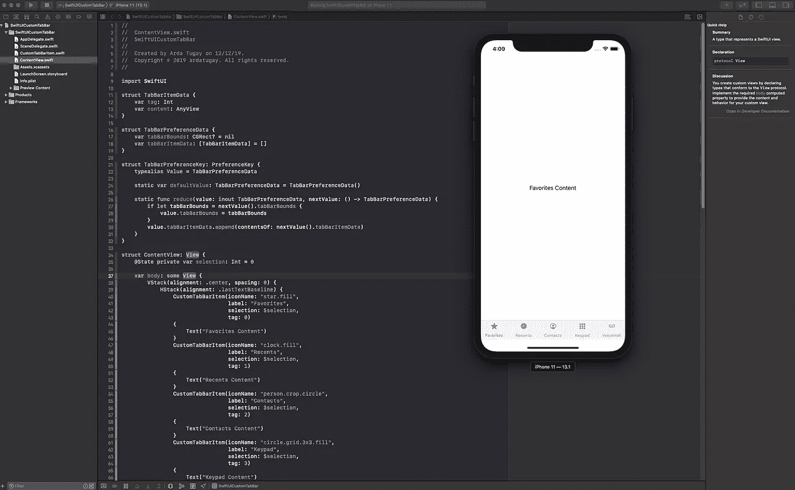

在创建简单的自定义选项卡栏的过程中。

# 介绍

在这个由五部分组成的系列中，我们将介绍`GeometryReader`和 SwiftUI 中的一个新概念:视图首选项。我们将在实现自定义选项卡栏时这样做。我为我们的例子选择了一个自定义标签栏，因为在[之前的一篇文章](https://medium.com/better-programming/working-around-the-shortfalls-of-swiftuis-tabview-ac9aa2a9d894)中，我写了 SwiftUI 的`TabView`错误，这使得它在五个标签之外不再有用。您可以使用 UIKit 中的`UITabBarController`,但是您将无法通过 SwiftUI 访问导航控制器。

这篇文章的主题很高级。如果你还没有接触过这些概念，我强烈推荐你去看看 Javier 关于 `[GeometryReader](https://swiftui-lab.com/geometryreader-to-the-rescue/)` **的文章以及那篇文章之后的三篇文章。**

*   **在第 1 部分中，我们将设置自定义标签栏项目，不使用视图首选项，只是简单使用了** `**GeometryReader**` **。我们将模仿默认 iOS 标签栏的功能。**
*   在第 2 部分的[中，我们将更深入地探讨如何使用视图首选项，并使我们的视图层次结构更像 SwiftUI。](https://medium.com/@ardactugay/diving-deep-into-swiftui-using-view-preferences-part-2-of-5-ebd8a91d6c3e)
*   在[第三部](https://medium.com/better-programming/diving-deep-into-swiftui-part-3-853173868f07)中，我们将看看用锚偏好来替换我们的一些视图偏好。

*快速提示:最初，我打算把这个系列分成 5 部分，但是自从写了这些文章，我就转向了 Flutter。然而，这些文章的所有 3 个部分中的信息仍然是相关的，所以如果您想了解更多关于 SwiftUI 的信息，请继续阅读！*

您将在这个存储库中找到提交的链接，其中也包含最终产品。我们开始吧！

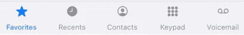

到本文结束时，您将获得什么！

# 项目设置

首先创建一个新项目。转到文件>项目。选择“单视图应用程序”，并给它起一个你喜欢的名字(我用的是“SwiftUICustomTabBar”)。确保选择“Swift”作为您的语言，选择“SwiftUI”作为用户界面。完成后，单击“下一步”,将项目保存到您选择的位置。我们准备开始编码了！

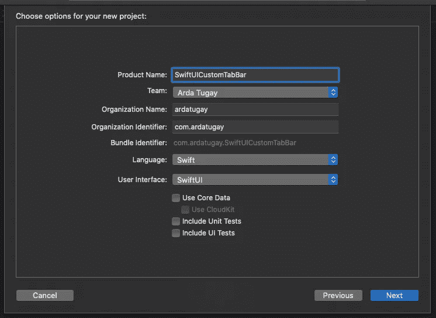

Xcode 的项目选项。

第一项工作是切换 iOS 目标版本。使用 iOS `13.1`来避免在 13.2 中引入的[错误，当在 `NavigationBarItems`中使用`NavigationLink`时会出现](https://forums.developer.apple.com/thread/124757)。最新的发行说明(写这篇文章时是 Xcode 13.3)，没有提到对的修复，所以最好稳扎稳打，用`13.1`。注意:这里的*是*对这个 bug 的一个变通办法，所以如果你一定要针对 iOS 13.2+，检查一下[这个](https://stackoverflow.com/a/59162996/4548148)(我没有尝试过这个变通办法，所以不能保证它会工作)。

这是包含到目前为止所有内容的提交。

# 创建标签栏

我们首先简单地创建标签栏，不用担心如何显示这些标签栏的内容。苹果的标签栏看起来像这样——我们要模仿它:

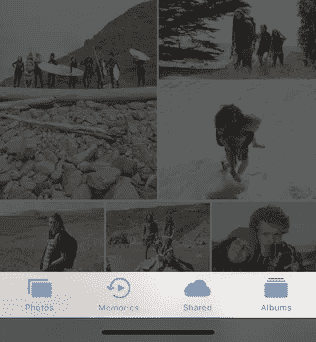

iOS 标签栏。摘自苹果公司的[人机界面指南](https://developer.apple.com/design/human-interface-guidelines/ios/bars/tab-bars/)。

## 创建选项卡栏项目

打开`ContentView.swift`，添加以下内容:

```
import SwiftUI

struct ContentView: View {
    var body: some View {
        VStack {
            Image(systemName: "clock.fill") // 1
            Text("Recents")
                .font(.caption) // 2
        }.foregroundColor(Color(UIColor.systemGray)) // 3
    }
}

struct ContentView_Previews: PreviewProvider {
    static var previews: some View {
        ContentView()
    }
}
```

`//1`图片使用苹果公司提供的图标。要找到这些图标的`systemName`，使用苹果提供的 [SF Symbols App](https://developer.apple.com/design/human-interface-guidelines/sf-symbols/overview/) 。你也可以自由使用你自己的图标！

`//2` 将字体大小设置为系统默认`.caption`，与苹果的 tab 栏紧密匹配。

`//3` 这里使用`UIColor`是因为 SwiftUI 框架中的`Color`还没有系统颜色选项。

现在，如果您运行预览，您应该会看到类似这样的内容:

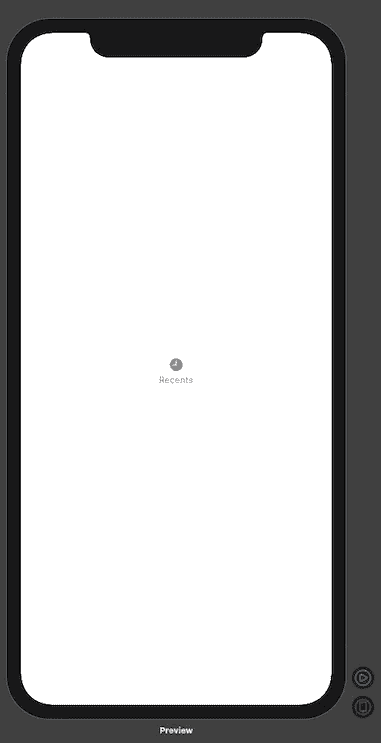

屏幕中央的一个选项卡栏项目。

你会注意到它在屏幕的中央，但是现在还可以。我们稍后会修理它。

这里是提交,包含到这里为止的所有内容。

# 重构并添加更多选项卡项目

现在您已经有了一个简单的选项卡栏项目，将其重构为自己的`View`并添加更多的选项卡项目。首先，创建一个新的 SwiftUI 视图文件，并将其命名为`CustomTabBarItem.swift`。然后，添加以下代码:

```
import SwiftUI

struct CustomTabBarItem: View {
    let iconName: String
    let label: String

    var body: some View {
        VStack {
            Image(systemName: iconName)
            Text(label)
                .font(.caption)
        }
        .foregroundColor(Color(UIColor.systemGray))
        .frame(maxWidth: .infinity) // 1
    }
}

struct CustomTabBarItem_Previews: PreviewProvider {
    static var previews: some View {
        CustomTabBarItem(iconName: "clock.fill", label: "Recents")
            .previewLayout(.fixed(width: 80, height: 80)) // 2
    }
}
```

`//1`实际上是将`ContentView.swift`中的内容剪切并粘贴到这里，并添加了两个新的实例变量，它们可以由`CustomTabBarItem`视图的调用者定制。

`//2`这是一个通过将`maxWidth`设置为`.infinity`来让视图占据其父视图中所有可用空间的技巧。你可以对高度做同样的事情，但是在这种情况下，这是不必要的。为什么会这样？因为在 SwiftUI 中，孩子们需要占用多少空间就占用多少空间。既然孩子被告知，它可以想占多少空间就占多少空间(最多“无限”)，而不贪婪，它就这么做了。

将预览的大小设置得小一些，因为您只需要看到一个选项卡栏项目是如何单独显示的——它在整个设备屏幕上的行为并不重要，因为它永远不会在没有选项卡栏的情况下使用。

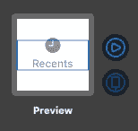

与。框架(最大宽度:。无穷大)

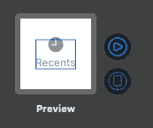

没有。框架(最大宽度:。无穷大)

如果你想知道上面的`frame`设置到底是做什么的，点击你代码中的方法。您的预览应该突出显示整个框架，如图所示。现在，移除对`frame`的调用，再次点击您的视图。请注意，视图的框架已经收缩了！

现在是使用这个新视图的时候了。返回到`ContentView.swift`，将其内容更改为:

```
struct ContentView: View {
    var body: some View {
        HStack(alignment: .lastTextBaseline) {
            CustomTabBarItem(iconName: "star.fill", label: "Favorites")
            CustomTabBarItem(iconName: "clock.fill", label: "Recents")
            CustomTabBarItem(iconName: "person.crop.circle", label: "Contacts")
            CustomTabBarItem(iconName: "circle.grid.3x3.fill", label: "Keypad")
            CustomTabBarItem(iconName: "recordingtape", label: "Voicemail")
        }.frame(maxWidth: .infinity) // 1
    }
}

// Preview hasn't changed...
```

`//1`此处增加相同的`frame`设置。然而，这并不是绝对必要的——您可以删除它，并看到没有任何变化。这是因为你告诉所有的子视图——`CustomTabBarItem`s——它们可以占据所有它们需要的空间。由于他们都想要所有的可用空间，SwiftUI 的布局系统会自动为他们所有人分配相同的空间。

现在，当您运行预览时，您将在屏幕中央看到所有选项卡栏项目:

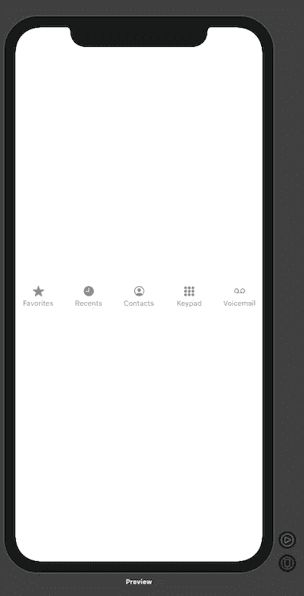

选项卡栏项目，全部显示在设备屏幕的中央。

这里是提交，包含到这里为止的所有内容。

# 粘性标签栏和背景(简介`GeometryReader)`

标签栏看起来不错，但是它在屏幕的中央，没有地方显示它的内容。我们可以通过将标签栏移动到底部，给它添加背景，并为标签栏内容留出一些空间来解决这个问题。

再次在`ContentView.swift`中，将其内容更改为如下:

```
struct ContentView: View {
    var body: some View {
        VStack {
            HStack(alignment: .lastTextBaseline) {
                CustomTabBarItem(iconName: "star.fill", label: "Favorites")
                CustomTabBarItem(iconName: "clock.fill", label: "Recents")
                CustomTabBarItem(iconName: "person.crop.circle", label: "Contacts")
                CustomTabBarItem(iconName: "circle.grid.3x3.fill", label: "Keypad")
                CustomTabBarItem(iconName: "recordingtape", label: "Voicemail")
            }
            .frame(maxWidth: .infinity)
            .background(
                GeometryReader { parentGeometry in // 2
                    Rectangle()
                        .fill(Color(UIColor.systemGray2))
                        .frame(width: parentGeometry.size.width, height: 0.5) // 3
                        .position(x: parentGeometry.size.width / 2, y: 0) // 4
                }
            )
            .background(Color(UIColor.systemGray6)) // 5
        }.frame(maxHeight: .infinity, alignment: .bottom) // 1
    }
}

// Preview hasn't changed...
```

这里发生了很多事情，这是你第一次和`GeometryReader` 打交道——所以让我们深入了解一下发生了什么。

`//1`注意，您将包含标签栏所有项目的`HStack`包装在一个`VStack`中。你需要一个方法来告诉这个`VStack`的内容去拥抱底部，你可以用`frame`方法做到。首先，将`maxHeight`设置为`.infinity`，以便`VStack`占据整个屏幕高度(因为那是它的“直接父代”)。还有一个新的设定叫做`alignment`。[让我们看看文件是怎么说的:](https://developer.apple.com/documentation/swiftui/vstack/3278357-frame)

> 此视图在结果框架内的对齐方式。`alignment`如果此视图小于结果框架给出的尺寸，则适用。

在这种情况下，这意味着`VStack`中的所有视图都将与底部对齐，这正是您想要的。它还告诉你框架包围了你调用`frame`方法的视图。所以你可以把它看作是另一个包装你的`VStack`的视图。

`//2` 在这里，您可以更好地控制视图的布局。`background`方法允许您以 SwiftUI `View`的形式添加自定义背景。

如果你还没有阅读我在本文开头链接的部分，看看 `[GeometryReader](https://developer.apple.com/documentation/swiftui/geometryreader)`的[文档:](https://developer.apple.com/documentation/swiftui/geometryreader)

> 将内容定义为其自身大小和坐标空间的函数的容器视图。

不幸的是，这不是很有帮助。但是如果你仔细阅读文档，它确实告诉我们一些事情:即`GeometryReader`也是一种类型的`View`，当初始化它时，你得到一个`GeometryProxy`结构作为参数(`init(content: (GeometryProxy) -> Content`)，这个`GeometryProxy`给你关于这个视图的大小和坐标空间的信息，相对于它的父视图。

`[GeometryProxy](https://developer.apple.com/documentation/swiftui/geometryproxy)`为您提供视图的`size`，在本例中是`HStack`的大小。在第 1 部分中，我们不会担心如何协调空间工作。

你在这里画的`Rectangle`模拟了标签栏顶部的一条较暗的线。不幸的是，虽然可以像`Rectangle`一样在`Shape`上设置边框，但是没有办法指定要绘制哪些边框，所以这是一个解决这个缺点的方法。这里的`frame`设置定义了“边框”的大小，其宽度与`HStack`视图相同，高度仅为`0.5`。

`//4``[position](https://developer.apple.com/documentation/swiftui/view/3278632-position)`方法有据可查。它将视图的中心放在特定的坐标上。在 SwiftUI 中，视图只能相对于它们的中心定位——不幸的是没有办法改变这一点，所以当你移动更大的视图时，你必须考虑到这一点。这就是为什么`parentGeometry.size.width / 2`用于`x`位置的原因。

最后，你将标签栏的整个背景颜色设置为比边框更浅的灰色。

注意，为`HStack`视图设置了两个背景。您可以设置任意多的背景。这些背景按照您在代码中看到的顺序添加到屏幕上:从上到下。也就是说，代码中最上面的背景是屏幕上最后面的背景。如果您更改背景的顺序，您将看不到边框。

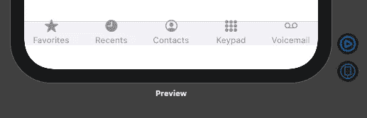

标签栏顶部外出血的图标。

那是许多信息！但是我们还没有完成。如果您运行预览，您会注意到标签栏项目在标签栏外出血。在模拟器中运行应用程序，并检查视图层次结构(通过转到 Debug > View Debugging > Capture View Hierarchy 来完成)，以查看可能发生的情况。

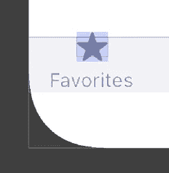

图标大于给定的界限。

单击选项卡栏中的任何图像，您会看到视图的框架以蓝色边框突出显示。请注意，这个蓝色边框小于图标的边界(用浅蓝色背景突出显示)。

我猜测这是一个 bug，但是在不知道`Image`内部工作原理的情况下很难判断。这可能只是因为苹果正在为图标设置一个固定的大小，因为在 SwiftUI 中，孩子们可以拥有他们想要的任何大小，它会流血。此外，如果你想了解更多关于框架和边界在 SwiftUI 中如何工作的信息，请查看本文[。](https://swiftui-lab.com/frame-behaviors/)

幸运的是，这个问题有一个简单的解决方法。转到`CustomTabBarItem.swift`并添加以下代码:

```
struct CustomTabBarItem: View {
    let iconName: String
    let label: String

    var body: some View {
        VStack(alignment: .center) {
            Image(systemName: iconName)
                .frame(minWidth: 25, minHeight: 25) // 1
            Text(label)
                .font(.caption)
        }
        .padding([.top, .bottom], 5) // 2
        .foregroundColor(Color(UIColor.systemGray))
        .frame(maxWidth: .infinity)
    }
}

// Preview hasn't changed...
```

`//1`指定图像框架的最小宽度将有助于克服图像边界超出框架的问题(记住，发生这种情况是因为子视图可以占用尽可能多的空间，即使大小超出了父视图提供的范围)。数字`25`不是一个神奇的数字——它是基于[苹果为标签栏项目](https://developer.apple.com/design/human-interface-guidelines/ios/icons-and-images/custom-icons/)定制的图标指南(那篇文章只显示了 2x 大小，即 50px 乘 50px。1x 我们用 25px)。

也添加一些填充，这样所有的标签栏项目周围都有一些空间，并且不会包围它们的边界。

现在，如果你回到`ContentView.swift`，你会看到标签栏看起来和苹果的几乎一模一样！

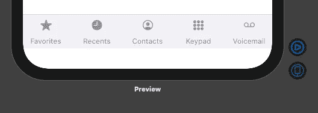

标签栏已修复，图标不再溢出边框。

[这是提交](https://github.com/tugayac/swiftui-custom-tab-bar-tutorial/commit/e563b282a083c10430e615ea36f1d9426cefca2e)，包含了到目前为止的所有内容。

# 简单的内容视图实现

从需要为每个选项卡栏项目显示的内容的简单实现开始。您所需要做的就是根据所选择的选项卡栏项目来更改内容。

首先，定义内容是什么——打开`ContentView.swift`并添加以下方法:

```
struct ContentView: View {
    // Our existing code is here...

    private func favoritesContent() -> some View {
        return Text("Favorites Content")
    }

    private func recentsContent() -> some View {
        return Text("Recents Content")
    }

    private func contactsContent() -> some View {
        return Text("Contacts Content")
    }

    private func keypadContent() -> some View {
        return Text("Keypad Content")
    }

    private func voicemailContent() -> some View {
        return Text("Voicemail Content")
    }
}
```

因为这只是一个例子，所以只返回内容的简单文本就足够了。但是，您可以返回您喜欢的任何内容视图——不仅限于文本！

返回类型`some View`是 Swift 家族的新成员，被称为“不透明返回类型”本质上，它让实现决定返回类型，并受到一些约束(你可以在这里阅读更多关于它的内容)。

现在你有了你的内容，是时候让它显示出来了。首先，去`CustomTabBarItem.swift`做一些改变:

```
struct CustomTabBarItem: View {
    let iconName: String
    let label: String
    var onTap: () -> Void = {} // 1

    var body: some View {
        VStack(alignment: .center) {
            Image(systemName: iconName)
                .frame(minWidth: 25, minHeight: 25)
            Text(label)
                .font(.caption)
        }
        .padding([.top, .bottom], 5)
        .foregroundColor(Color(UIColor.systemGray))
        .frame(maxWidth: .infinity)
        .contentShape(Rectangle()) // 3
        .onTapGesture { // 2
            self.onTap()
        }
    }
}

// Preview hasn't changed...
```

`//1`一个新的变量，可以选择性地传递到一个新的标签栏项目中，用于处理点击手势。

`//2`点击，处理手势，调用自定义点击方法。

`//3` `contentShape()`允许您设置框架内内容的形状以进行点击测试(在本例中，为点击手势)。如果你不设置这个为`Rectangle`，只有图标和文本上的点击会被注册，但是你想让用户更容易点击标签栏上的项目。

现在再次在`ContentView.swift`中，添加一个新的`@State`变量，并相应地处理所有标签栏项目上的点击手势:

```
struct ContentView: View {
    @State private var selection: Int = 0 // 1

    var body: some View {
        VStack(alignment: .center, spacing: 0) { // 2
            ZStack { // 3
                if (selection == 0) {
                    favoritesContent()
                } else if (selection == 1) {
                    recentsContent()
                } else if (selection == 2) {
                    contactsContent()
                } else if (selection == 3) {
                    keypadContent()
                } else if (selection == 4) {
                    voicemailContent()
                }
            }.frame(maxWidth: .infinity, maxHeight: .infinity, alignment: .center)
            HStack(alignment: .lastTextBaseline) {
                CustomTabBarItem(iconName: "star.fill",
                                 label: "Favorites",
                                 onTap: { self.selection = 0 }) // 4
                CustomTabBarItem(iconName: "clock.fill",
                                 label: "Recents",
                                 onTap: { self.selection = 1 })
                CustomTabBarItem(iconName: "person.crop.circle",
                                 label: "Contacts",
                                 onTap: { self.selection = 2 })
                CustomTabBarItem(iconName: "circle.grid.3x3.fill",
                                 label: "Keypad",
                                 onTap: { self.selection = 3 })
                CustomTabBarItem(iconName: "recordingtape",
                                 label: "Voicemail",
                                 onTap: { self.selection = 4 })
            }
            .frame(maxWidth: .infinity)
            .background(
                GeometryReader { parentGeometry in
                    Rectangle()
                        .fill(Color(UIColor.systemGray2))
                        .frame(width: parentGeometry.size.width, height: 0.5)
                        .position(x: parentGeometry.size.width / 2, y: 0)
                }
            )
            .background(Color(UIColor.systemGray6))
        }.frame(maxHeight: .infinity, alignment: .bottom)
    }

  // Content methods below here...   
}

// Preview hasn't changed...
```

`//1`创建一个新的`@State`变量，跟踪哪个选项卡被选中。

`//2`将`spacing`设置为`0`，使内容视图(`ZStack`)和标签栏(`HStack`)之间没有空间。另外，将`alignment`设置为`VStack`的默认值，因为不设置`alignment`就不能设置`spacing`。

`//3`使用一个`ZStack`作为内容视图。`ZStack`在内容布局方面更加灵活，这也是为什么在这里使用它的原因，但是你也可以使用任何其他的栈。在`ZStack`中有控制语句，根据用户的选择来选择呈现哪个内容视图。

`//4`为每个标签栏项目传递一个自定义的点击手势处理程序，它根据用户点击的标签栏项目设置适当的选择值。

现在运行实时预览，您将能够点击标签栏项目并观察内容变化:

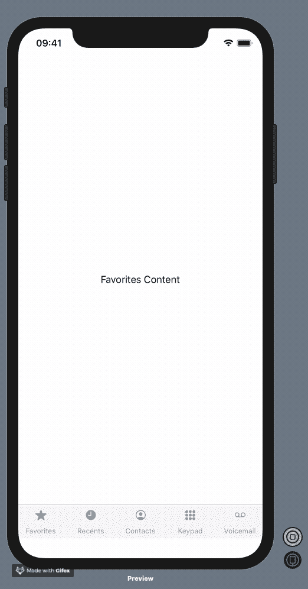

当点击不同的标签栏项目时，内容会发生变化。

这里是提交，包含到这里为止的所有内容。

# 突出显示当前选定的选项卡栏项目

通过将当前选中的选项卡栏项目突出显示为蓝色，再添加一个关键特性来显示选中了哪个选项卡栏项目。

首先，转到`CustomTabBarItem.swift`并进行一些更改:

```
struct CustomTabBarItem: View {
    let iconName: String
    let label: String
    let selection: Binding<Int> // 1
    let tag: Int // 2

    var body: some View {
        VStack(alignment: .center) {
            Image(systemName: iconName)
                .frame(minWidth: 25, minHeight: 25)
            Text(label)
                .font(.caption)
        }
        .padding([.top, .bottom], 5)
        .foregroundColor(fgColor()) // 4
        .frame(maxWidth: .infinity)
        .contentShape(Rectangle())
        .onTapGesture {
            self.selection.wrappedValue = self.tag // 3
        }
    }

    private func fgColor() -> Color {
        return selection.wrappedValue == tag ? Color(UIColor.systemBlue) : Color(UIColor.systemGray)
    }
}

struct CustomTabBarItem_Previews: PreviewProvider {
    static var selection: Int = 0
    static var selectionBinding = Binding<Int>(get: { selection }, set: { selection = $0 })

    static var previews: some View {
        CustomTabBarItem(iconName: "clock.fill", label: "Recents", selection: selectionBinding, tag: 0)
            .previewLayout(.fixed(width: 80, height: 80))
    }
}
```

`//1`这个实例变量将用于与父视图中的`@State`变量通信，并让标签栏项目知道它是否被选中

`//2`这个实例变量将告诉标签栏项目它被分配的选择值是什么。如果该标签与选择值匹配，则表明选项卡栏项目被选中。

`//3`function 参数已移除，现在您只需将选项卡栏项目的标签分配给选择绑定，这将自动更新父视图中的状态。这更像 SwiftUI 的方式，而不是在参数中传递函数。

`//4`将前景色重构为一个方法，该方法应该根据选项卡栏项目是否被选中来返回它的颜色。如果选中，颜色为蓝色，否则，像以前一样为灰色。

在`ContentView.swift`中，你只需要改变`CustomTabBarItem`初始化器调用来传递选择和它们的标签:

```
// inside var body: some View

HStack(alignment: .lastTextBaseline) {
    CustomTabBarItem(iconName: "star.fill",
                     label: "Favorites",
                     selection: $selection,
                     tag: 0)
    CustomTabBarItem(iconName: "clock.fill",
                     label: "Recents",
                     selection: $selection,
                     tag: 1)
    CustomTabBarItem(iconName: "person.crop.circle",
                     label: "Contacts",
                     selection: $selection,
                     tag: 2)
    CustomTabBarItem(iconName: "circle.grid.3x3.fill",
                     label: "Keypad",
                     selection: $selection,
                     tag: 3)
    CustomTabBarItem(iconName: "recordingtape",
                     label: "Voicemail",
                     selection: $selection,
                     tag: 4)
}

// Nothing else has changed...
```

`$selection`符号获取`@State`变量的底层`Binding`。

这是包含到目前为止所有内容的提交。

# 一个工作的自定义标签栏

至此，您已经有了一个简单的、可工作的定制选项卡栏实现。

继续第 2 部分，在那里我们将了解视图偏好以及如何让我们的代码看起来更“SwiftUI-ish”。

*注意到问题了吗？认为有更好的方法来做我上面列出的事情吗？请务必在下方留下评论或发送私信，以便我们讨论。感谢阅读——我希望你今天学到了新东西！*