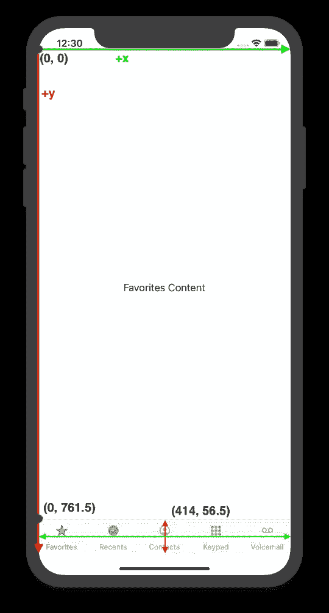
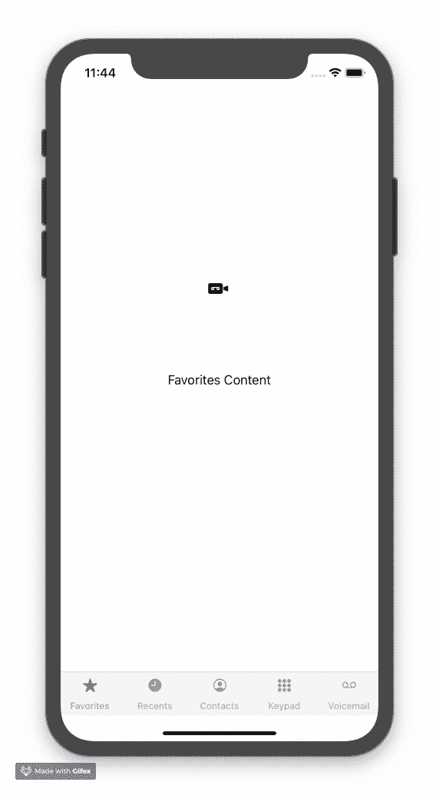

# 深入 SwiftUI(第 3 部分)

> 原文：<https://betterprogramming.pub/diving-deep-into-swiftui-part-3-853173868f07>

## 在 SwiftUI 中使用锚点首选项


[剧组](https://unsplash.com/@crew?utm_source=unsplash&utm_medium=referral&utm_content=creditCopyText)在 [Unsplash](https://unsplash.com/s/photos/computer-settings?utm_source=unsplash&utm_medium=referral&utm_content=creditCopyText) 上拍照

# 介绍

这是五部分系列的第三部分。如果您从第 2 部分以外的地方来到这里，您可以从[这个](https://github.com/tugayac/swiftui-custom-tab-bar-tutorial/commit/8fe86edaabbe91b8dcbda040b4fdcb1261f2a089)提交开始。

请注意，使用视图首选项代替锚点首选项是完全可以的。在传递与视图相关的几何体数据时，锚点首选项会隐式执行一些操作，这就是为什么当您不想详细传递几何体数据时，它们可能是首选项。

*   在[第 1 部分](https://medium.com/@ardactugay/diving-deep-into-swiftui-a-simple-custom-tab-bar-part-1-of-5-680d05d7f99b)中，我们设置了自定义选项卡栏项目，没有使用视图首选项，只简单使用了一次`GeometryReader`。我们将模仿默认 iOS 标签栏的功能。
*   在第 2 部分的[中，我们深入探讨了如何使用视图首选项，并使我们的视图层次结构更像 SwiftUI。](https://medium.com/better-programming/diving-deep-into-swiftui-using-view-preferences-part-2-of-5-ebd8a91d6c3e)
*   **在第 3 部分中，我们将研究用锚点首选项替换一些视图首选项。**

*快速提示:最初，我打算将这个系列分成 5 部分，但是自从写了这些文章，我就转向了 Flutter。然而，这些文章的所有 3 个部分中的信息仍然是相关的，所以如果您想了解更多关于 SwiftUI 的信息，请继续阅读！*

# **什么是主播偏好？**

在用锚点首选项替换视图首选项之前，我们先来讨论一下它们是什么。

*锚点首选项*是视图首选项的子集，也就是说，您可以在视图首选项中使用它们，而不是用这个新概念完全替换视图首选项。这意味着大部分代码将保持不变；您的`PreferenceKey`和偏好数据只会略有变化。

首先，我们来看文档。SwiftUI `[View](https://developer.apple.com/documentation/swiftui/view)`下有两种方法处理锚偏好:

```
func anchorPreference<A, K>(key: K.Type, value: Anchor<A>.Source, transform: (Anchor<A>) -> K.Value) -> Viewfunc transformAnchorPreference<A, K>(key: K.Type, value: Anchor<A>.Source, transform: (inout K.Value, Anchor<A>) -> Void) -> View
```

请注意，这两种方法通常与视图首选项的方法完全相同:

```
func preference<K>(key: K.Type, value: K.Value) -> Viewfunc transformPreference<K>(K.Type, (inout K.Value) -> Void) -> View
```

唯一不同的是`value: K.Value`现在是第一个类似方法的`value: Anchor<A>.Source`，并且`transform:`现在除了接收`K.Value`之外还接收`Anchor<A>`(这里的 K 值是`TabBarPreferenceData`)。

## 什么是主播？

[我们来看看文档](https://developer.apple.com/documentation/swiftui/anchor):

> 从定位点源和特定视图派生的不透明值。
> 
> `struct Anchor<Value>`
> 
> 通过使用`LayoutContext`指定目标视图，可以将锚点转换为目标视图坐标空间中的`Value`。

在这里帮不上什么忙，但我们确实得到了一些我们应该四处搜索的信息:

*   有一种价值来源于“锚源”和“特定视图”这意味着锚点以某种方式与视图相关。
*   我们可以通过使用一个叫做`LayoutContext`的东西来指定这个目标视图，将锚点转换为目标视图的“坐标空间”中的一个值。这意味着锚偏好以某种方式与视图的坐标空间一起工作。这个`Anchor<A>`允许我们将一些锚点转换成我们可以在指定视图的坐标空间中使用的值。

谢天谢地，在文档的底部，我们可以转到另一个相关的主题，`[Anchor.Source](https://developer.apple.com/documentation/swiftui/anchor/source)`。去那里给了我们更多的信息:

> 产生给定类型的锚定值的类型擦除几何值。
> 
> `struct Anchor<Value>.Source`
> 
> SwiftUI 通过首选项键在视图树中传递锚定的几何图形值。然后通过`LayoutContext`将它们转换回本地坐标系，例如在布局的`situate(_:updating:in:)`功能中。

现在开始变得更有意义了。概述为我们提供了重要信息:

> SwiftUI 通过首选项键在视图树中传递锚定的几何图形值。然后将它们转换回本地坐标系。

还有更多；如果你看文档的底部，你会看到更多的类型属性，比如`bottom`和`bounds`。

我们可以推导出锚偏好，允许我们检索关于视图的边界和锚信息(底部、尾部等)，相对于视图的坐标空间，而不必在我们的视图层次上指定一个`coordinateSpace(name:)`。

从这个信息中我们还知道`Anchor<Value>`中的`Value`不是`CGPoint`就是`CGRect`。

`Source`是用于导出您正在寻找的几何信息的源视图。

尽管如此，我们仍然不知道`LayoutContext`是什么或者`situate(_:updaing:in:)`是做什么的(没有关于这些的官方文档)。这些都是 SwiftUI 内部的，我们无法访问源代码。不过没关系；它们只是实现细节，我们不需要了解它们就可以使用 anchor 参数。

# 使用锚点首选项

你只需要做最小的改变就可以让锚点首选项工作。您将在`ContentView.swift`中进行所有更改。

首先，用以下内容替换`TabBarPreferenceData`中的`tabBarBounds`类型:

```
var tabBarBounds: Anchor<CGRect>? = nil
```

但是我怎么知道为类型参数指定什么呢？因为我们在寻找标签栏的边界，所以它必须是一个`CGRect`。但你不用猜。如果您查看`Anchor<A>.Source`文档，正如我们在上面看到的，您会看到下面的类型属性:

```
static var bounds: Anchor<CGRect>.Source
```

SwiftUI 为`bounds`锚提供了一个`CGRect`。

接下来，您需要用`transformAnchorPreference(key:value:transform:)`替换`overlay(_:alignment:)`方法。该文件中只有一个`overlay`方法，因此您可以搜索它并进行以下更改:

将首选项更改为锚点首选项

`value`参数的用法已经改变，现在有一个`transform`参数:

*   `value`:此参数允许您选择您想要访问当前视图的锚值。这里的值是 `[Anchor<A>.Source](https://developer.apple.com/documentation/swiftui/anchor/source)` [文档](https://developer.apple.com/documentation/swiftui/anchor/source)中列出的[类型属性之一。在这种情况下，您使用`.bounds`,因为您需要标签栏视图的边界。](https://developer.apple.com/documentation/swiftui/anchor/source)
*   `transform`:该参数给出了您选择使用的`value`和现有的`TabBarPreferenceData`对象，它希望您根据需要转换首选项。

但是为什么需要用`transformAnchorPreference`方法而不是`anchorPreference`方法呢？因为在到达这个方法之前，子视图(T8)已经初始化了 T9。如果您使用`anchorPreference`，那么您将用`nil`替换所有由孩子设置的数据，并且当使用该首选项时，将没有任何内容要显示。因此需要使用`transformAnchorPreference`。

然而，如果您仍然使用`overlay`方法，您可以使用`anchorPreference`，因为覆盖图会在子视图之前被初始化。

此外，您不再需要`GeometryReader`的`GeometryProxy`值，这就是您完全替换`overlay`方法的原因。锚点首选项隐式读取您调用它们的视图的几何图形，因此不再需要`GeometryReader`。

此外，您不再需要在主视图的末尾定义一个`coordinateSpace(name:)`，因此您也可以删除它。坐标空间是通过锚点首选项隐式管理的。

最后，你必须改变`createTabBarContentOverlay(_:_:)`方法的第一部分来考虑锚的偏好:

替换方法的第一部分以使用锚点首选项

您只需要更改`tabBarBounds`变量来使用锚点首选项。这里需要使用`geometry`,因为没有几何参考系，`Anchor`值没有任何意义。

你在这里看到的符号，`geometry[preferences.tabBarBounds!]`，是迅捷的`[subscript](https://docs.swift.org/swift-book/LanguageGuide/Subscripts.html)`符号。[你可以在](https://developer.apple.com/documentation/swiftui/geometryproxy) `[GeometryProxy](https://developer.apple.com/documentation/swiftui/geometryproxy)` [文档中看到它的列表；](https://developer.apple.com/documentation/swiftui/geometryproxy)它返回`CGRect`，因为方法签名是`subscript<T>(Anchor<T>) -> T`。

## 坐标空间与几何代理下标

您可能想知道是否可以使用任何几何图形来获取选项卡栏的 bounds 锚点值。您可以使用任何祖先视图的几何图形来获得相对于该视图几何图形的锚点值。然而，值得注意的是，我还没有在兄弟几何体上尝试过，所以在使用锚点首选项时要考虑到这一点。

在当前的几何和锚点使用方式下，选项卡栏边界看起来是这样的:



标签栏边界

绿色和红色坐标轴表示`ContentView`中根视图的正 *x* 和 *y* 轴，即`VStack`。

因为您正在调用`geometry[preferences.tabBarBounds!]`，所以您将获得相对于`VStack`视图的几何图形的标签栏边界。在这种情况下，标签栏的左上角坐标是(0，761.5)，其宽度和高度是(414，56.5)。如果你要提供一个不同的几何图形，那么它的边界会改变，它会显示在该几何图形的参照系中。

你可以这样想:如果你在你用来定义坐标空间的层次上得到一个几何图形的锚值，那么你将得到和我们在第 2 部分中用`geometry.frame(in:)`调用所做的一样的答案。因此，我们在这里对锚点首选项所做的与我们在第 2 部分中对坐标空间和首选项所做的一样。

# 相同的功能，更少的代码

就是这样！现在运行应用程序，您应该会看到什么都没有改变。然而，我们现在让 SwiftUI 在内部处理一些几何相关的功能。



视觉上不是很令人兴奋，但是同样的功能用更少的代码总是更好

这里是提交,包含到这里为止的所有内容。

感谢阅读！