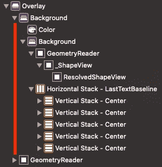
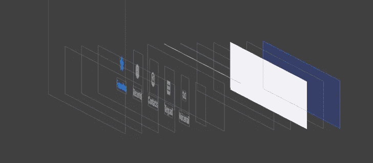
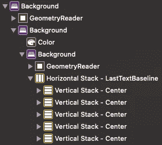
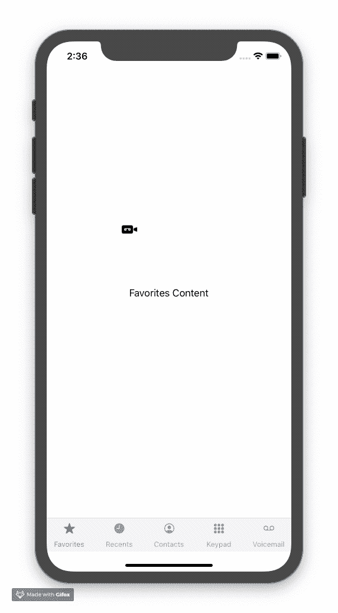

# 深入 SwiftUI(第 2 部分)

> 原文：<https://betterprogramming.pub/diving-deep-into-swiftui-using-view-preferences-part-2-of-5-ebd8a91d6c3e>

## 在 SwiftUI 中使用视图首选项


# 介绍

这是五部分系列的第二部分。如果您从第 1 部分以外的地方来到这里，您可以从[这个](https://github.com/tugayac/swiftui-custom-tab-bar-tutorial/commit/7da95b88365d79a12bb0668d0e64d22d04a9c287)提交开始。

*   在第 1 部分的[中，我们设置了自定义标签栏项目，没有使用视图首选项，只简单使用了一次`GeometryReader`。我们将模仿默认 iOS 标签栏的功能。](https://medium.com/@ardactugay/diving-deep-into-swiftui-a-simple-custom-tab-bar-part-1-of-5-680d05d7f99b)
*   **在第 2 部分中，我们将深入探讨如何使用视图首选项，并使我们的视图层次结构更像 SwiftUI。**
*   在第 3 部分中，我们将研究用锚偏好替换我们的一些视图偏好。

*快速提示:最初，我打算将这个系列分成 5 部分，但是自从写了这些文章之后，我就转向了 Flutter。然而，这些文章的所有 3 个部分中的信息仍然是相关的，所以如果您想了解更多关于 SwiftUI 的信息，请继续阅读！*

# 具有视图首选项的高级内容视图实施

到目前为止，您所做的一切都足够好，并且会很好地工作，但感觉不太“快捷”。我的意思是标签栏项目的内容看起来与代码中的标签栏项目没有联系。如果我们能这样做就更好了:

```
CustomTabBarItem(...) {Text("This is my content view")}
CustomerTabBarItem(...) {Text("This is another content view")}
```

这在理论上听起来很简单，但是如何在视图层次结构中的其他地方显示`CustomTabBarItem`下的内容呢？这就是**视图偏好**非常有用的地方。

## **什么是视图偏好？**

视图首选项本质上允许子视图将数据向上传递给它们的父视图。您将在编码时进行一些调试，以了解 SwiftUI 层次结构中的数据流。我们开始吧！

首先，你如何应对偏好的变化？如果您查看 `[View](https://developer.apple.com/documentation/swiftui/view)`的[文档，您会看到在“响应视图首选项”部分有三个选项:](https://developer.apple.com/documentation/swiftui/view)

`*func onPreferenceChange<K>(K.Type, perform: (K.Value) -> Void) -> View*`

这将添加一个在指定首选项的值更改时要执行的操作。

`*func backgroundPreferenceValue<Key, T>(Key.Type, (Key.Value) -> T) -> View*`

这将使用视图中指定的首选项值来生成另一个视图，作为第一个视图的背景。

`*func overlayPreferenceValue<Key, T>(Key.Type, (Key.Value) -> T) -> View*`

这将使用视图中指定的首选项值来生成另一个视图，作为第一个视图的覆盖图。

你不能使用`onPreferenceChange`,因为它的`perform`函数参数不返回任何东西，这意味着你不能从它返回任何`View`——这取决于另外两个。既然你一直在使用`background`，那就用`overlayPreferenceValue`，尽管在这种情况下，`backgroundPreferenceValue`也可以。

# 使用`overlayPreferenceValue`

让我们仔细看看`overlayPreferenceValue`。文档非常简单，但是它没有告诉您它实际上会对偏好值的变化做出反应。稍后你会看到。[进一步深入其文档，](https://developer.apple.com/documentation/swiftui/view/3278625-overlaypreferencevalue)您可以看到该声明如下所示:

```
func overlayPreferenceValue<Key, T>(_ key: Key.Type = Key.self, _ transform: @escaping (Key.Value) -> T) -> some View where Key : PreferenceKey, T : View
```

看起来您必须首先创建一个新的实现`[PreferenceKey](https://developer.apple.com/documentation/swiftui/preferencekey)`协议的`struct`。继续在`ContentView.swift`中添加一个采用该协议的结构:

```
struct Placeholder {

}

struct TabBarPreferenceKey: PreferenceKey {
    typealias Value = Placeholder

    static var defaultValue: Placeholder = Placeholder()

    static func reduce(value: inout Placeholder, nextValue: () -> Placeholder) {
        value = nextValue()
    }
}

// ContentView hasn't changed...
```

在继续之前，我们先来看看`[PreferenceKey](https://developer.apple.com/documentation/swiftui/preferencekey)` [文档](https://developer.apple.com/documentation/swiftui/preferencekey)。概述指出:

> 具有多个子视图的视图会自动将其给定首选项的值合并成对其祖先可见的单个值。

这是个好消息！这意味着您可以拥有一个单独的`PreferenceKey`，它可以包含您的子视图的所有首选项的数组。事实上，这就是为什么它需要由协议采用者实现`reduce`方法的原因。记住这一点，想想你需要什么:

*   为了绘制内容视图，您需要知道选项卡栏的边界，这样内容视图的大小才刚刚好，不会覆盖选项卡栏。
*   为了让您的代码看起来更快捷，您需要让`CustomTabBarItem`通过 preferences 将其内容传递给`overlayPreferenceValue`。

记住这一点，更新`TabBarPreferenceKey`和`Placeholder`:

```
struct TabBarItemData { // 2
    var tag: Int
    var content: AnyView
}

struct TabBarPreferenceData { // 1
    var tabBarBounds: CGRect? = nil
    var tabBarItemData: [TabBarItemData] = []
}

struct TabBarPreferenceKey: PreferenceKey {
    typealias Value = TabBarPreferenceData // 3

    static var defaultValue: TabBarPreferenceData = TabBarPreferenceData() // 4

    static func reduce(value: inout TabBarPreferenceData, nextValue: () -> TabBarPreferenceData) { // 5
        value.tabBarItemData.append(contentsOf: nextValue().tabBarItemData) // 6
    }
}

// ContentView hasn't changed...
```

`//1`这是`struct`，它将保存你需要的数据。

`//2`因为你只需要一个标签栏的数据，所以它的数据存储在`TabBarPreferenceData`中一个名为`tabBarBounds`的`CGRect`变量中。因为有多个标签栏条目，所以它们有一个独立的数据结构，它们的所有信息都存储在`tabBarItemData`下的一个数组中。

`//3`这是您通过定义自定义`PreferenceKey`将保存的数据类型来满足所采用的协议的地方。在这种情况下，它是一个`Array`。原因就像你在上面的文档中看到的那样:

> 具有多个子视图的视图会自动将其给定首选项的值合并成对其祖先可见的单个值。

`//4` [根据`PreferenceKey`的文档](https://developer.apple.com/documentation/swiftui/preferencekey/3272135-defaultvalue)，这是`defaultValue`的作用:

> 没有显式键值的视图会生成此默认值。

当使用`transformPreference`时，调用此`defaultValue`，而不是首先调用`preference`，即给首选项一个“默认值”。两者的区别在于，`transformPreference`让你更新一个偏好值，而`preference`直接设置偏好值，覆盖任何现有的值。

`//5`当 SwiftUI 合并具有多个子视图的视图时，调用`reduce`方法，这些子视图的首选项设置为同一个`PreferenceKey`，在本例中为`TabBarPreferenceData`。因此，任何正在监视这个首选项的祖先实际上将只获得一个值，这个值已经用`reduce`方法实现减少了。

`//6`这可能看起来很奇怪，但你实际上是在合并`TabBarPreferenceData`偏好。如果不合并，您将丢弃旧数据并用新数据替换它，本质上是丢弃其他兄弟视图的偏好数据。现在还不要担心`tabBarBounds`(这就是为什么它还没有被设置)——我们稍后会回来讨论这个问题。

# 可选步骤:如何设置首选项值？

为了理解上面的项目`//5`和`//6`是如何工作的，让我们做一些调试来理解偏好值是如何设置的。转到`CustomTabBarItem.swift`并添加对`preference`方法的调用:

```
var body: some View {
    VStack(alignment: .center) {
        Image(systemName: iconName)
            .frame(minWidth: 25, minHeight: 25)
        Text(label)
            .font(.caption)
    }
    .padding([.top, .bottom], 5)
    .foregroundColor(fgColor())
    .frame(maxWidth: .infinity)
    .contentShape(Rectangle())
    .onTapGesture { self.selection.wrappedValue = self.tag }
    .preference(key: TabBarPreferenceKey.self,
                value: TabBarPreferenceData(
                    tabBarItemData: [TabBarItemData(tag: tag,
                                                    content: AnyView(Text("Arda"))
                    )]
                )
    )
}

// Nothing else has changed...
```

转到`ContentView.swift`，在`TabBarPreferenceData`中，添加以下初始化程序:

```
struct TabBarPreferenceData {
    var tabBarBounds: CGRect? = nil
    var tabBarItemData: [TabBarItemData] = []

    init(tabBarBounds: CGRect? = nil, tabBarItemData: [TabBarItemData] = []) {
        self.tabBarBounds = tabBarBounds
        self.tabBarItemData = tabBarItemData

        print(tabBarItemData)
    }
}
```

回想一下在`ContentView.swift`中，您按照以下顺序创建`CustomTabBarItem` s:

```
CustomTabBarItem(iconName: "star.fill",
                 label: "Favorites",
                 selection: $selection,
                 tag: 0)
CustomTabBarItem(iconName: "clock.fill",
                 label: "Recents",
                 selection: $selection,
                 tag: 1)
CustomTabBarItem(iconName: "person.crop.circle",
                 label: "Contacts",
                 selection: $selection,
                 tag: 2)
CustomTabBarItem(iconName: "circle.grid.3x3.fill",
                 label: "Keypad",
                 selection: $selection,
                 tag: 3)
CustomTabBarItem(iconName: "recordingtape",
                 label: "Voicemail",
                 selection: $selection,
                 tag: 4)
```

最后，给`ContentView.swift`中的顶层`VStack`添加一个`overlayPreferenceValue`方法，并在`return`语句行放置一个断点:

```
VStack {
  // Views...
}
.frame(maxHeight: .infinity, alignment: .bottom)
.overlayPreferenceValue(TabBarPreferenceKey.self) { preferences in
    return Rectangle().fill(Color.clear)
}
```

您已经准备好在模拟器中运行应用程序了。

到达断点后，展开日志。您应该会看到类似这样的内容:

```
[SwiftUICustomTabBar.TabBarItemData(tag: 0, content: SwiftUI.AnyView(storage: SwiftUI.(unknown context at $1070824d4).AnyViewStorage<SwiftUI.Text>))][SwiftUICustomTabBar.TabBarItemData(tag: 1, content: SwiftUI.AnyView(storage: SwiftUI.(unknown context at $1070824d4).AnyViewStorage<SwiftUI.Text>))][SwiftUICustomTabBar.TabBarItemData(tag: 2, content: SwiftUI.AnyView(storage: SwiftUI.(unknown context at $1070824d4).AnyViewStorage<SwiftUI.Text>))][SwiftUICustomTabBar.TabBarItemData(tag: 3, content: SwiftUI.AnyView(storage: SwiftUI.(unknown context at $1070824d4).AnyViewStorage<SwiftUI.Text>))][SwiftUICustomTabBar.TabBarItemData(tag: 4, content: SwiftUI.AnyView(storage: SwiftUI.(unknown context at $1070824d4).AnyViewStorage<SwiftUI.Text>))][]
```

仔细观察`tag` s:它们的顺序和我们在代码中看到的一样！**这意味着 SwiftUI 可能会按照它们在您的代码**、**中被调用的顺序来初始化首选项，但是请注意这只是一个假设——没有关于这种行为的文档。**

最后一个`[]`呢？那个对我来说是个谜。我的猜测是 SwiftUI 正在创建一个空的首选项来合并包含我们的`CustomTabBarItem`的`HStack`下的所有首选项，但是我不能确定(如果你已经知道为什么会这样，请告诉我！).

现在，在调试器中，键入`p preferences`然后运行这个调试语句。您应该得到以下内容:

```
(SwiftUICustomTabBar.TabBarPreferenceKey.Value) $R0 = {
  tabBarBounds = nil
  tabBarItemData = 5 values {
    [0] = {
      tag = 0
      content = (storage = 0x000060000311adc0)
    }
    [1] = {
      tag = 1
      content = (storage = 0x00006000031fc980)
    }
    [2] = {
      tag = 2
      content = (storage = 0x00006000031c3840)
    }
    [3] = {
      tag = 3
      content = (storage = 0x00006000031e1e80)
    }
    [4] = {
      tag = 4
      content = (storage = 0x00006000031e2280)
    }
  }
}
```

您已经从子视图中获得了所需的所有信息！

你可以删除`TabBarPreferenceData`中的初始化器，因为我们不再需要它了。其他的都可以留下。

# 使用 overlayPreferenceValue(续)

首先，转到`CustomTabBarItem.swift`，进行以下更改:

```
struct CustomTabBarItem<Content: View>: View { // 2
    let iconName: String
    let label: String
    let selection: Binding<Int>
    let tag: Int
    let content: () -> Content

    init(iconName: String,
         label: String,
         selection: Binding<Int>,
         tag: Int,
         @ViewBuilder _ content: @escaping () -> Content) { // 1
        self.iconName = iconName
        self.label = label
        self.selection = selection
        self.tag = tag
        self.content = content
    }

    var body: some View {
        VStack(alignment: .center) {
            Image(systemName: iconName)
                .frame(minWidth: 25, minHeight: 25)
            Text(label)
                .font(.caption)
        }
        .padding([.top, .bottom], 5)
        .foregroundColor(fgColor())
        .frame(maxWidth: .infinity)
        .contentShape(Rectangle())
        .onTapGesture { self.selection.wrappedValue = self.tag }
        .preference(key: TabBarPreferenceKey.self,
                    value: TabBarPreferenceData(
                        tabBarItemData: [TabBarItemData(tag: tag,
                                                        content: AnyView(self.content()) // 3
                        )]
                    )
        )
    }

    private func fgColor() -> Color {
        return selection.wrappedValue == tag ? Color(UIColor.systemBlue) : Color(UIColor.systemGray)
    }
}

struct CustomTabBarItem_Previews: PreviewProvider {
    static var selection: Int = 0
    static var selectionBinding = Binding<Int>(get: { selection }, set: { selection = $0 })

    static var previews: some View {
        CustomTabBarItem(iconName: "clock.fill", label: "Recents", selection: selectionBinding, tag: 0) {
            Text("Empty View")
        }
        .previewLayout(.fixed(width: 80, height: 80))
    }
}
```

`//1`使用该参数，您可以做所有其他 SwiftUI 视图所做的事情:它允许您在自己的视图中使用您一直用于 SwiftUI 视图的类似 DSL 的语法(@ViewBuilder 实际上是一个*函数构建器*，这是 Swift 5.1 中的一个新的实验性功能。你可以在这里了解更多！`@escaping`属性基本上允许这个参数“逃离”初始化器并在别处被调用。

`//2`因为您指定了一个从`content`实例变量返回的泛型类型`Content`，所以您需要在该结构上指定一些约束。所有的`Content`必须是 SwiftUI `View`。

`//3`这是您设置首选项的地方。您指定之前创建的键，然后为它赋予一个值*，对于这个视图只有* (当 SwiftUI 调用`reduce`方法时，合并会在稍后自动发生。在这个子视图中就不用担心这个了)。注意，您将内容包装在`AnyView`中，这是 SwiftUI 视图的一个[类型擦除器](https://medium.com/swiftworld/swift-world-type-erasure-5b720bc0318a)，以便它们可以在运行时传递。

现在转到`ContentView.swift`。你要在这里做几处改动，所以我把它分成几块。首先，更新`TabBarPreferenceKey`:

```
struct TabBarPreferenceKey: PreferenceKey {
    typealias Value = TabBarPreferenceData

    static var defaultValue: TabBarPreferenceData = TabBarPreferenceData()

    static func reduce(value: inout TabBarPreferenceData, nextValue: () -> TabBarPreferenceData) {
        if let tabBarBounds = nextValue().tabBarBounds {
            value.tabBarBounds = tabBarBounds
        }
        value.tabBarItemData.append(contentsOf: nextValue().tabBarItemData)
    }
}
```

您在这里添加的唯一新行是在`reduce`方法中设置`tabBarBounds`。您会注意到对`nil`值的检查:这是为了确保不会重置任何已经为`value.tabBarBounds`设置的值。在这种情况下，这是一个必需的检查，我们稍后将讨论原因(从中可以获得一些非常有用的信息)。

更新`ContentView`的`body`:

```
var body: some View {
    VStack(alignment: .center, spacing: 0) {
        HStack(alignment: .lastTextBaseline) {
            CustomTabBarItem(iconName: "star.fill",
                             label: "Favorites",
                             selection: $selection,
                             tag: 0)
            {
                Text("Favorites Content") // 1
            }
            CustomTabBarItem(iconName: "clock.fill",
                             label: "Recents",
                             selection: $selection,
                             tag: 1)
            {
                Text("Recents Content")
            }
            CustomTabBarItem(iconName: "person.crop.circle",
                             label: "Contacts",
                             selection: $selection,
                             tag: 2)
            {
                Text("Contacts Content")
            }
            CustomTabBarItem(iconName: "circle.grid.3x3.fill",
                             label: "Keypad",
                             selection: $selection,
                             tag: 3)
            {
                Text("Keypad Content")
            }
            CustomTabBarItem(iconName: "recordingtape",
                             label: "Voicemail",
                             selection: $selection,
                             tag: 4)
            {
                Text("Voicemail Content")
            }
        } // 2
        .background(
            GeometryReader { parentGeometry in
                Rectangle()
                    .fill(Color(UIColor.systemGray2))
                    .frame(width: parentGeometry.size.width, height: 0.5)
                    .position(x: parentGeometry.size.width / 2, y: 0)
            }
        )
        .background(Color(UIColor.systemGray6))
        .overlay(
            GeometryReader { geometry in
                Rectangle()
                    .fill(Color.clear)
                    .preference(key: TabBarPreferenceKey.self,
                                value: TabBarPreferenceData(tabBarBounds: geometry.frame(in: .named("customTabBar"))) // 5
                    )
            }
        ) // 3
    }
    .frame(maxHeight: .infinity, alignment: .bottom)
    .overlayPreferenceValue(TabBarPreferenceKey.self) { (preferences: TabBarPreferenceData) in
        return GeometryReader { geometry in
            self.createTabBarContentOverlay(geometry, preferences) // 6
        }
    }
    .coordinateSpace(name: "customTabBar") // 4
}
```

您不再需要返回视图内容的函数！每个选项卡栏项目现在都有一个传递给它的 SwiftUI 视图层次结构，就像您使用 SwiftUI 框架提供的视图一样。看起来干净多了，不是吗？

`//2`这里曾经有一个`frame`方法调用。不再需要，因此您可以将其移除。

`//3`调用`overlay`方法并传递一个空的`Rectangle`给它。这可能看起来不太直观，但这是有原因的:您需要一种方法来读取将包含内容的视图的几何结构，以便您可以设置`tabBarBounds`。你可以通过创建一个透明的`Rectangle`(用户甚至不会知道它的存在)，然后在其中设置`tabBarBounds`首选项。由于`Rectangle`是视图层次结构的一部分，首选项也将是层次结构的一部分。

`//4` `coordinateSpace`定义了调用`GeometryProxy`的`frame`方法时的具体坐标参考系。在这种情况下，在正在绘制`overlay`的父对象上定义一个自定义坐标参考框架。

`//5`在这里使用(4)中定义的`coordinateSpace`，获取标签栏相对于其父标签栏的大小和位置，并保存在首选项中。

`//6`您已经创建了`overlayPreferenceValue`方法调用，但是现在您要用一个私有方法替换它(稍后您将定义它)。当所有的首选项都被初始化和合并(如果需要的话)时，以及当这些首选项改变时，将调用 `overlayPreferenceValue` **方法，尽管在我们的例子中它们不应该改变。**

# 可选:`Using Overlay` vs `Background and How it Affects Preferences`

我想更深入地研究一下在`HStack`上调用的`overlay`方法。如果你使用`background`方法，你认为会发生什么？让我们来了解一下！

在`TabBarPreferenceKey`结构的`reduce`方法中放置一个`print`语句，打印如下内容:

```
print(value.tabBarItemData.count, value.tabBarBounds)
```

现在在模拟器中运行应用程序。您应该会看到类似这样的内容:

```
2 nil
3 nil
4 nil
5 nil
5 Optional((0.0, 761.5, 414.0, 56.5))
```

第一个数字显示已经保存的标签栏项目首选项的数量。注意，它从`2`开始，意味着两件事:

*   只有在视图层次结构中的同一个首选项键上设置了`2`或更多的值时，才会调用`reduce`方法。
*   只有当另一个视图为与另一个视图相同的首选项设置了一个值时，才会调用`reduce`方法，以便将任何现有的首选项与新设置的首选项合并。

现在记住`PreferenceKey`的文档:

> 具有多个子视图的视图会自动将其给定首选项的值合并成对其祖先可见的单个值。

**上面的发现表明，这种说法不仅适用于单个视图的兄弟视图，也适用于整个视图层次结构**。这是个好消息，因为 SwiftUI 将自动为我们合并所有这些偏好。



使用覆盖时查看层次结构。

当您使用`overlay`时，视图层次看起来像您在左边看到的。这有点令人困惑，因为它看起来不完全像我们的 SwiftUI 代码。然而，它包含了很多信息:当有多个`background`调用时，每个后续的`background`调用都会包装前一个调用——因为层次结构中更深层次的视图会出现在那些没有的视图之上。当您还调用`overlay`来获取边界时，该覆盖包装了所有内容，并将其自身作为兄弟添加到最后一个`background`中。

**这向我们表明，当有兄弟视图时，靠近视图子元素数组末尾的视图会出现在那些没有的视图之上。在这种情况下，我们的覆盖将出现在标签栏上的所有内容之上，因为它是覆盖层次结构中的最后一个兄弟。**



蓝色突出显示的框是“覆盖”。

通过视觉化可能更容易看出发生了什么。突出显示的蓝色方框是视图层次调试器中的`Overlay`视图。在最前面的截图之外扩展的大框架是`GeometryReader`——`Overlay`的直接子代。它看起来覆盖了标签栏，但那是因为视图层次显示了`GeometryReader`正在读取其几何图形的视图。

现在从`TabBarPreferenceKey`中的`reduce`方法中删除以下几行:

```
if let tabBarBounds = nextValue().tabBarBounds {
    value.tabBarBounds = tabBarBounds
}
```

运行应用程序。这一次，您应该会看到`tabBarBounds`没有像预期的那样设置好:

```
2 nil
3 nil
4 nil
5 nil
5 nil
```

但是如果`overlay`是`background`方法呢？当您更改它并再次运行应用程序时，您应该会看到以下内容:

```
2 nil
3 nil
4 nil
5 nil
5 Optional((0.0, 761.5, 414.0, 56.5))
```

这很有趣，因为您不再在`reduce`方法中设置`tabBarBounds`。它是如何设置的？首先检查视图层次结构。



靠近顶部的`GeometryReader`是用来获取标签栏大小的。另一个包含标签栏的上边框。从你打印的内容来看，**似乎孩子的偏好总是在父母设定偏好之前就设定好了。然而，** `background` **和** `overlay` **在设置首选项时的区别似乎在于，** `background` **视图首选项在合并时不必减少，而** `overlay` **首选项会减少。**

但是为什么呢？让我们潜入更深的地方。向`TabBarPreferenceData`添加如下初始化式:

```
init(tabBarBounds: CGRect? = nil, tabBarItemData: [TabBarItemData] = []) {
    self.tabBarBounds = tabBarBounds
    self.tabBarItemData = tabBarItemData

    print(tabBarItemData.first?.tag, tabBarBounds)
}
```

现在运行应用程序。您应该会看到以下内容:

```
Optional(0) nil
Optional(1) nil
Optional(2) nil
Optional(3) nil
Optional(4) nil
nil Optional((0.0, 761.5, 414.0, 56.5))
2 nil
3 nil
4 nil
5 nil
5 Optional((0.0, 761.5, 414.0, 56.5))
```

看起来 SwiftUI 在合并它们之前初始化了所有的首选项。另外，好像在调用 `reduce`之前，`background`内视图上设置的首选项是设置在传递给`reduce` *的`inout` `value`上，而`overlay`内视图上设置的首选项是*而不是传递给`reduce`的`inout` `value`上设置的*并且*必须在减速器中处理*，因为它是作为`nextValue`传递的。*不过注意，这只是推测，没有任何文档，所以要谨慎使用这些信息。**

您可以继续并删除此调试部分中添加的任何内容。

# 使用 overlayPreferenceValue(续)

我们还有一件事要做:创建`createTabBarContentOverlay`方法。再次在`ContentView.swift`中，在`ContentView`结构中添加以下内容:

```
private func createTabBarContentOverlay(_ geometry: GeometryProxy,
                                        _ preferences: TabBarPreferenceData) -> some View {
    let tabBarBounds = preferences.tabBarBounds != nil ? preferences.tabBarBounds! : .zero // 1
    let contentToDisplay = preferences.tabBarItemData.first(where: { $0.tag == self.selection }) // 2

    return ZStack {
        if contentToDisplay == nil { // 3
            Text("Empty View")
        } else {
            contentToDisplay!.content // 4
        }
    }
    .frame(width: geometry.size.width,
           height: geometry.size.height - tabBarBounds.size.height,
           alignment: .center) // 5
    .position(x: geometry.size.width / 2,
              y: (geometry.size.height - tabBarBounds.size.height) / 2) // 6
}

// Nothing else has changed...
```

`//1`因为`tabBarBounds`是可选的，你必须确保它已经被设置。你可以使用一个防护，但是不要什么都不做就退出函数。相反，我们使用默认值`CGRect`，所有值都设置为`0`，以便稍后提供默认视图。

`//2`创建一个可选变量，尝试查找当前选定选项卡的首选项。

`//3` SwiftUI 视图在其内容中接受条件语句，因此检查以确保有内容要显示。如果没有要显示的内容，返回显示“空视图”的`Text`。注意，不能使用`EmptyView`，因为它没有实现`View`协议(而`else`语句中的视图实现了)，所以返回一个表示“空视图”的东西。另外，你不能在这里使用一个`guard`语句，因为`@ViewBuilder`函数构建器不理解它们。

`//4`如果代码到了这里，你就知道肯定有内容要显示，那就强制解开，显示在这里。

请记住，框架包围了它们被调用的视图。在这里，您显式地设置了它的高度，这样当定位时，它不会覆盖底部的标签栏。你在这里处理的`geometry`是包裹一切的`VStack`的几何图形，它恰好也覆盖了整个屏幕。

`//6`您必须重新定位该视图，因为覆盖图会自动在屏幕上居中，就像堆栈中的所有其他视图一样。注意，`[position](https://developer.apple.com/documentation/swiftui/view/3278632-position)`总是在被调用的视图的中心工作。在 SwiftUI 中没有办法改变视图的“定位锚”,所以在重新定位视图时要考虑视图的`geometry`。

# 一个高级的工作自定义标签栏

你完了！是时候运行应用程序，看看标签栏是什么样子了:



所有的努力都有了回报！

这里是提交，包含了到这里为止的所有内容。

**第 3 部分即将推出，届时我们将介绍如何使用锚点首选项！**

*注意到一个问题？认为有更好的方法来做我上面列出的事情吗？请务必在下方留下评论或发送私信，以便我们讨论。感谢阅读——我希望你今天学到了新东西！*