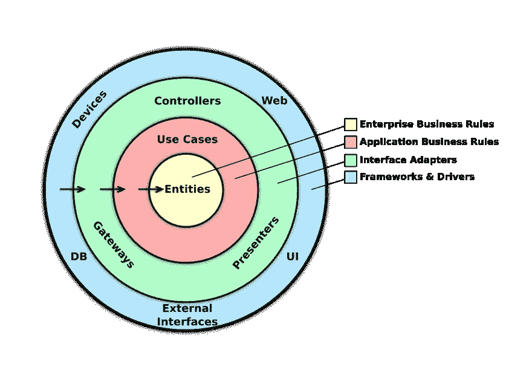
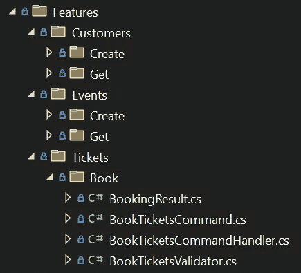

# 走进干净的建筑

> 原文：<https://betterprogramming.pub/diving-into-clean-architecture-2769ced23802>

## 事件驱动应用的架构设计

[阿德里安·匡威](https://unsplash.com/@adrienconverse?utm_source=medium&utm_medium=referral)在 [Unsplash](https://unsplash.com?utm_source=medium&utm_medium=referral) 上的照片

随着从共享代码的单一应用程序向更基于消息的方法的转变，架构范式发生了巨大的变化。虽然[的三层架构](https://en.wikipedia.org/wiki/Multitier_architecture)是单片应用的虚拟架构，但事实证明它不太适合事件驱动的应用。

从单一应用程序的转变已经持续了好几年，行业领导者如 [Spotify 已经概述了他们向云原生的转变](https://engineering.atspotify.com/2016/02/spotifys-event-delivery-the-road-to-the-cloud-part-i/)，以及他们如何在不中断的情况下处理每天数十亿个事件。

当你想到事件驱动的架构时，也许一个将音乐流式传输到你的设备的应用程序并不是第一个跃入脑海的——这正是它如此强大的原因。

你几乎可以将任何事情定义为一个事件。发邮件？转账？授权进入某个超级机密的电脑系统？实现什么并不重要；它只是应用程序核心的一个事件和处理程序。

在过去的几年中，出现了几种以不同方式处理这种复杂性的架构模式。三个值得注意的是洋葱建筑，六边形建筑和干净的建筑。

三者都有相似的不同之处。它们都专注于将基础设施移动到外层，非常适合事件驱动的应用程序。

它们都值得拥有自己的文章，但是在这一篇中，我们将专门深入到干净的架构中。

# 建筑

Clean architecture 最初是由 Robert c . Martin 定义的，像洋葱和六角形架构一样，它非常注重基础设施细节的外部化，如数据库、消息传递等。

识别基础设施组件并将它们移动到应用程序的外层，确保它们不会意外地与业务规则或其他应用程序代码混淆，从而产生依赖性。

在一个干净的架构中，依赖关系总是指向内部。如果我们看下面的图表，这意味着`Web`组件可以引用`Controllers`组件，而不是相反。

干净的建筑，罗伯特·c·马丁的作品

因为内层永远不会知道外层的任何细节(或者它们的存在)，所以接口被用来跨边界公开功能。数据传输对象(d to)通常用于跨层传输数据。

## 理解分层

假设您有一个实体，该实体需要一个存储库来管理其存储需求。我们可以在上图中的实体级别声明存储库的接口，因为它处理实体，它不知道我们最终将使用的特定存储机制，也不关心。

它只是从一些存储中检索实体，稍后再放回去。它就知道这么多。接口代表功能。这个接口可以被任何外层使用。

当实现接口时，我们必须决定我们的存储介质。让我们假设我们使用一个 SQL 数据库来存储我们的实体。

我们不可能将存储库的实现添加到实体层，因为这将意味着实体层现在完全偏向于 SQL 数据库，这是我们希望避免的全部事情。

我们使用的存储在某种程度上是为了支持应用程序。它不为业务提供直接价值，也不是应用程序特性或用例。这是一个强有力的指标，表明它可能是应用程序基础结构的一部分。

因此，实现在实体层声明的存储库接口应该在最外面的基础设施层。这确保了实体如何存储的实现细节不会污染实体或应用程序本身。

照片由 [CHUTTERSNAP](https://unsplash.com/@chuttersnap?utm_source=medium&utm_medium=referral) 在 [Unsplash](https://unsplash.com?utm_source=medium&utm_medium=referral) 上拍摄

# 应用程序业务规则

在上一节中，我们谈到了实体和基础设施层。实体表示业务对象、客户及其相关数据、准备发货的订单等。他们更有可能因内部变化而改变，而不是外部变化。

我们的基础设施层处理实现细节。我们如何存储对象，我们使用什么服务来发送电子邮件，等等。？

应用层，或用例层，处理业务逻辑并指导实体的流程。如果您正在设计一个航班预订系统，并且有一个业务规则规定您可以超额预订航班，那么应用层就是您定义该规则的地方。

这是众所周知的神奇发生的一层。如果日常操作发生变化，或者必须向系统添加新功能，这很可能意味着应用层的变化。

虽然架构没有明确指定，但这一层通常使用[命令——查询分离](https://en.wikipedia.org/wiki/Command%E2%80%93query_separation)来构建，它与事件紧密联系在一起。每个事件要么是命令，要么是查询，由命令或事件处理程序处理。这些消息交互中的每一个都可以代表一个用例或特性。

## 尖叫的建筑

定义干净架构的另一个有趣的方面是它鼓励所谓的[尖叫架构](https://blog.cleancoder.com/uncle-bob/2011/09/30/Screaming-Architecture.html)。

尖叫架构的基本前提很简单:每个应用程序都应该尖叫它做什么。不是用什么语言写的，不是用什么框架，而是应用程序支持什么功能？

根据您的编程语言，这可能会以不同的方式实现。但是它通常以非常容易识别的代码组织形式出现，如下所示:

不会错的。

甚至不用查看项目中的任何其他内容，您就可以看出您正在查看某种活动预订系统。

# 易测性

由于分层方法，实现干净架构的应用程序很容易测试。您可以确信您的测试不会被模糊的实现细节所阻碍，比如特定的数据库或一些迟钝的邮件服务。

这意味着测试可以实现内存中的数据库，而不是依赖于 SQL 数据库。不需要邮寄服务？嘲笑他们，然后忘掉它。

我经常看到 clean architecture 应用程序专注于测试它们的用例，而不是更传统的单元测试。在端到端测试应用层时，您可以确保应用程序的核心功能按预期运行，而不必单独测试每一行。

# 结论

我们只接触了干净的建筑和它所提供的东西。如果要我总结的话，clean architecture 是一个可测试的、以事件为中心的、分层的架构，如果你不清楚你在构建什么，这是一个非常好的架构。

由于分层和缺乏依赖性，您拥有了各种各样的灵活性。例如，您可以以整体方式启动您的应用程序。当您对外部世界有了更好的了解后，您可以毫不费力地将事件、处理程序和实体拆分到微服务中。如果你愿意，你甚至可以把它提升一个档次，进入领域驱动。

如果你对这个话题感兴趣，我推荐罗伯特·c·马丁的《[干净的建筑》(我所链接的博文就是他写的)。](https://www.amazon.com/Clean-Architecture-Craftsmans-Software-Structure/dp/0134494164)

你也可以看看我写的一个例子项目，叫做 [Clean Tickets](https://github.com/aevitas/CleanTickets) 。这是实现 clean 架构的事件票务系统的一个相对较小的实现。

感谢你的阅读，我希望我已经设法激起你的兴趣！