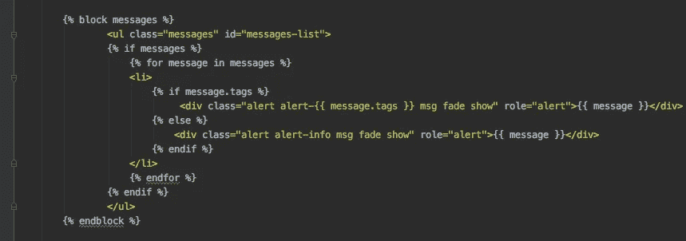
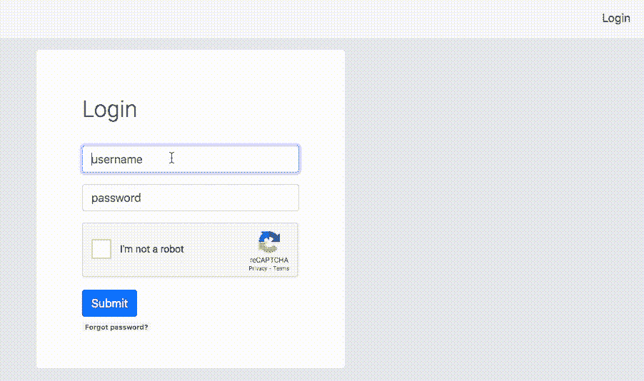
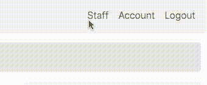

# Django 的简讯

> 原文：<https://betterprogramming.pub/django-flash-messages-6afbccd1b457>

## 如何在 Django 中使用、格式化和淡化“flash”消息，包括页面重载和异步 JavaScript 提交



作者照片。

在本文中，您将了解到 [Django messages framework](https://docs.djangoproject.com/en/3.1/ref/contrib/messages/) 是如何工作的，以及如何使用它的强大功能，包括在通过 JavaScript 提交表单时淡化消息而无需重新加载页面的方法。



作者 GIF。

> “Django 为匿名和认证用户提供了对基于 cookie 和基于会话的消息传递的全面支持。messages 框架允许您在一个请求中临时存储消息，并在随后的请求(通常是下一个请求)中检索消息以供显示。每条消息都标有确定其优先级的特定`**level**`(例如`**info**`、`**warning**`或`**error**`)— [姜戈的文件](https://docs.djangoproject.com/en/3.1/ref/contrib/messages/)

*注意:这篇文章介绍了设置、视图、CSS、HTML 以及一些 JS 脚本。它假设您对 Django 框架中这些文件之间的相互作用有基本的了解。*

# 消息级别

如文档中的[所述，“消息框架基于可配置的层次架构，类似于](https://docs.djangoproject.com/en/3.1/ref/contrib/messages/) [Python 日志模块](https://medium.com/better-programming/write-better-python-scripts-ce58c1ebf690#a4e1)。”它使用相同的级别。

```
**DEBUG** Development-related messages (ignored in production)
**INFO** Informational messages for the user
**SUCCESS** An action was successful
**WARNING** A failure did not occur but may be imminent
**ERROR** An action was **not** successful or some other failure occurred
```

# 设置

Django 消息框架是通过中间件和上下文实现的。在你的`INSTALLED_APPS`里，加上`django.contrib.messages`。在中间件和模板中，将下面代码中的第 8-22 行添加到 Django 项目的`settings.py`中:

# 视图

在您的`views.py`中使用以下代码将消息添加到您的视图中:

```
**from** **django.contrib** **import** messages
messages.add_message(request, messages.INFO, 'Hello world.')
```

下面是一个例子。在第 8 行，当用户注销并被重定向到主页时，会向用户添加一条消息。这还表明消息在会话中工作，因此对经过身份验证和未经身份验证的用户都是如此。

# HTML 前端

接下来是在你的网页上显示信息。我使用了一个`base.html`文件，其中包含了我想在每个页面上显示的所有 HTML 部分，比如页眉、页脚和 Django 的 flash messages 等元素:

消息级别在`messages.tags`属性中。我使用 Bootstrap 的 HTML 框架，其中 Python 层对应于 [Bootstrap 层](https://getbootstrap.com/docs/4.0/components/alerts/)，这意味着我可以使用 Bootstrap 的能力格式化我的消息！成功消息为绿色，信息消息为蓝色，依此类推。



作者 GIF。

# CSS 样式

消息可以显示在每个页面上。当显示消息时，我不希望我的内容移动。相反，它们应该被设计在右上角，与页面内容重叠，并在彼此之下显示后续消息。

# JavaScript 提交

但是，当您想通过 AJAX、jQuery 或普通 JavaScript 使用异步提交提交内容并返回 flash 消息*而不*重新加载页面时，该怎么办呢？

为此，我使用包含快速消息的`level`和`content/text`的响应属性`msg`。然后，我将这条消息附加到`messages-list`(我的消息列表的 ID，如`messages.html`所示):

# JavaScript 褪色消息

然后我调用一个定制函数`fade_alerts()`,它类似于 Django 页面重新加载消息周期的正常褪色效果。这个自定义函数使用一些 jQuery(由于 Bootstrap，我加载了这个函数，但是也可以使用 [vanilla JS](https://stackoverflow.com/questions/29017379/how-to-make-fadeout-effect-with-pure-javascript) )淡出元素。

# 结论

本文向您展示了如何在传统的 Django messages 框架中使用 flash 消息，以及如何在异步表单提交中使用 flash 消息作为 Django 项目中用户操作的反馈。

更多 Django 的技巧和窍门，请看下面我的其他文章。编码快乐！

[](https://medium.com/better-programming/custom-view-decorators-in-django-af50ea9b3994) [## 如何在 Django 中使用定制视图@decorators

### 防止未经授权的用户访问视图，并使用@decorator 方法提供反馈，例如 RECAPTCHA…

medium.com](https://medium.com/better-programming/custom-view-decorators-in-django-af50ea9b3994) [](https://medium.com/better-programming/distributed-task-queues-with-celery-rabbitmq-django-703c7857fc17) [## Django、RabbitMQ 和 Celery 的分布式任务队列

### 了解用于发出异步 API 请求的分布式任务队列

medium.com](https://medium.com/better-programming/distributed-task-queues-with-celery-rabbitmq-django-703c7857fc17) [](https://medium.com/javascript-in-plain-english/create-interactive-data-visualisations-with-django-chart-js-8c4d0b98770e) [## 用 Django & Chart.js 创建交互式数据可视化

### 如何用交互式图形可视化您的数据

medium.com](https://medium.com/javascript-in-plain-english/create-interactive-data-visualisations-with-django-chart-js-8c4d0b98770e)