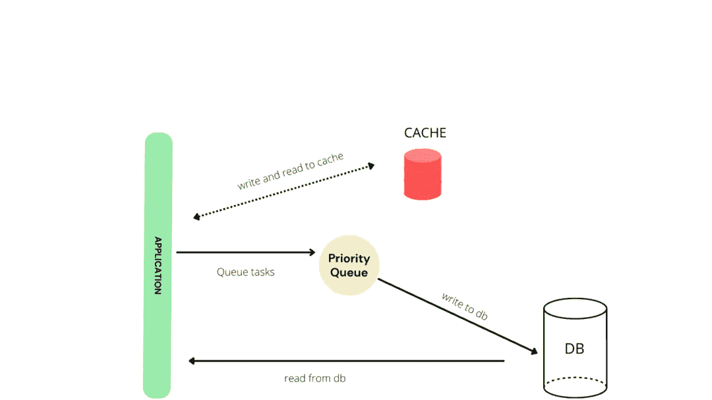
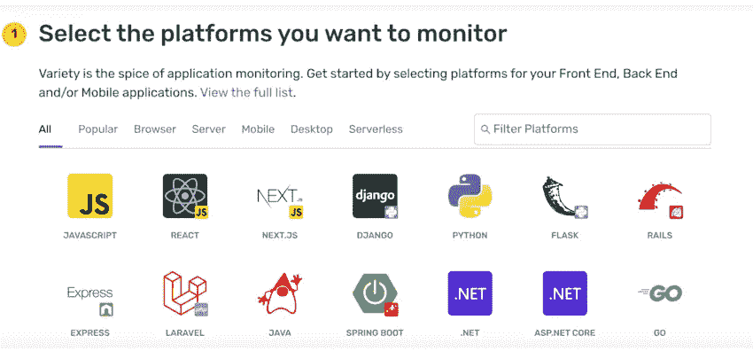
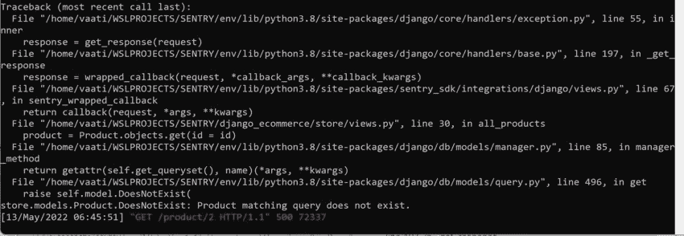
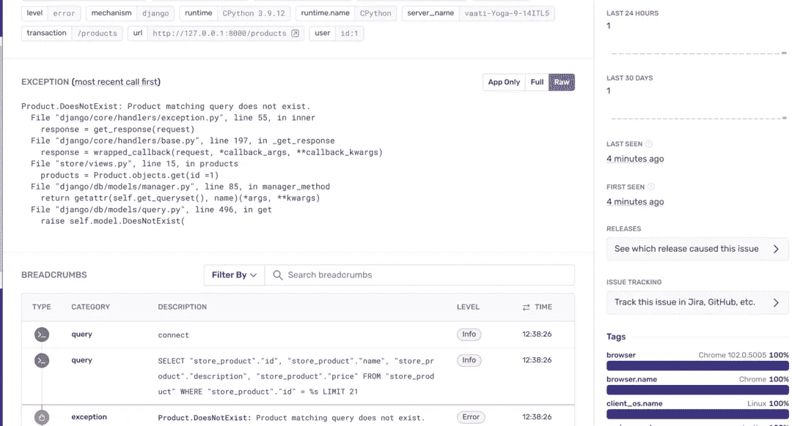
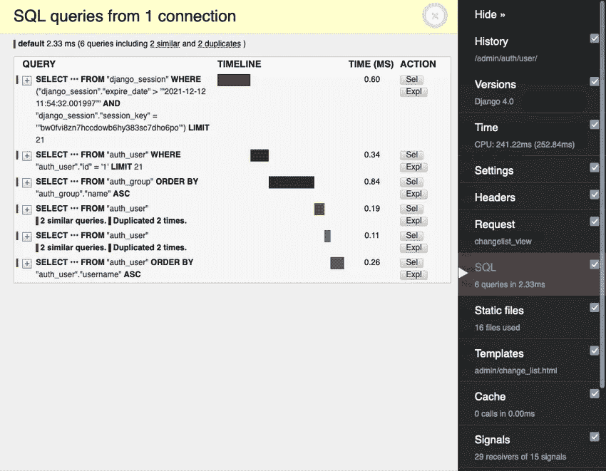

# Django 性能改进—优化数据库

> 原文：<https://betterprogramming.pub/django-performance-improvements-f9d0324f9f45>

## 第 1 部分，共 4 部分


[伊万·迪亚兹](https://unsplash.com/@ivvndiaz?utm_source=medium&utm_medium=referral)在 [Unsplash](https://unsplash.com?utm_source=medium&utm_medium=referral) 上的照片

Django 项目中优化的主要目标是通过确保您的项目通过充分利用系统资源来运行，从而使执行数据库查询更快。适当优化的数据库将减少响应时间，从而提供更好的用户体验。

在这个 4 部分系列中，您将学习如何优化 Django 应用程序的不同领域。

这一部分将着重于优化 Django 应用程序中的数据库速度。

# 理解查询

理解 querysets 如何工作将会产生更好的代码。在进行任何优化之前，首先要理解这些概念:

1.  Querysets 是懒惰的:您可以编写任意多的查询，但是 Django 只会在查询被求值时从数据库中查询。
2.  总是通过指定应该返回多少个值来限制从数据库中获得的结果。
3.  在 Django 中，您可以通过迭代、切片、缓存和 python 方法(如`len()`、`count()`、e.t.c)来评估您的`queryset`，因此请确保您充分利用它们。
4.  Django 在每个 queryset 中执行缓存，以最小化数据库访问。理解缓存的工作原理将使您能够编写更好、更高效的代码。
5.  只取回你需要的东西
6.  如果你认为你以后会用到它，立刻取回所有东西
7.  总是在数据库中而不是在 Python 中执行数据库工作

# 查询优化

数据库是任何应用程序的核心。与信念相反，复杂性并不总是保证效率。Postgresql 是 Django 应用程序的首选数据库，因为它是开源的，也是复杂查询的理想选择。

为了优化任何 Django 应用程序中的查询，我们将覆盖以下领域来执行数据库优化，即:

1.  数据库索引
2.  贮藏
3.  选择相关与提取相关
4.  散装法
5.  RawSql
6.  外键

# 1.数据库索引

数据库索引是一种用于在从数据库中检索记录时加速查询的技术。当处理产生大量数据的大型数据库时，索引是提高应用速度的不可避免的做法。

随着应用程序变得越来越重要，它可能会变慢，用户会注意到这一点，因为获取所请求的数据将花费相当长的时间。为了说明这一点，我们将使用一个电子商务商店的例子，该商店有一个桌子产品，型号如下所示。

随着数据库的增长，您可能会注意到检索数据需要很长时间。例如，假设您希望对 price 列应用索引以加快对该列的搜索。

```
price = models.DecimalField(decimal_places= 2,max_digits=8,db_index=True)
```

应用索引后，您需要运行迁移，以便创建索引。

同样重要的是要注意，如果表有很多行，那么创建索引就需要更长的时间。您也可以为两个字段创建单个索引:

# 2.贮藏

数据库中的缓存是快速响应的最佳方法。它确保很少调用数据库，防止数据库过载。标准缓存结构如下所示:



Django 提供了一种缓存机制，可以使用不同的缓存后端，比如 Memcached 和 Redis，这样可以避免多次运行查询。

Memcached 是一个简单而强大的开源内存系统，保证在不到一毫秒的时间内返回缓存的结果。Memcached 也易于使用和扩展。

另一方面，Redis 也是一个开放源码的缓存系统，提供与 Memcached 相同的功能。大多数离线应用程序使用已经缓存的数据，这意味着大多数请求甚至不会命中数据库。

用户会话应该存储在 Django 应用程序的缓存中，因为 redis 将数据保存在磁盘中，所以登录用户的所有会话不是来自数据库，而是来自缓存。要启用 redis 数据库缓存，您需要通过 pip 安装 redis。

```
pip install redis
```

一旦安装了 [redis](https://docs.djangoproject.com/en/4.0/topics/cache/) ，在 settings.py 文件中添加以下代码:

您还可以使用 Memcached 和 Redis 来存储用户身份验证令牌。因为每个登录的用户都必须提供一个令牌，所以所有这些操作都会导致数据库的高开销。从缓存中获取令牌将使数据库的性能更快。

# 3.选择相关与预取相关

Django 提供了优化查询集的参数，称为 select related 和`prefetch_related`。这两种方法减少了对数据库的查询次数。例如，考虑下面有两个表的模型。

person 表与 tweet 表有一对多的关系，即一个人可以有很多条 Tweet，但是一条 Tweet 只能属于一个人。假设您想找出数据库中所有 tweet 的详细信息，您首先要获取所有 tweet。

为了获得额外的信息，例如`first_names`和`last_name`，您需要进行如下额外的查询:

如上所示，这会产生 9 个查询。

## 选择 _ 相关

使用`select_related`，您可以进行单个查询，为单个实例返回一对多和一对一关系的所有相关对象。select_related 是一个在外键关系上使用的查询，用于在执行查询时检索任何附加的相关对象数据。

虽然 [select_related](https://docs.djangoproject.com/en/4.0/ref/models/querysets/#select-related) 会导致更复杂的查询，但是获得的数据会被缓存；因此，对获得的数据的操作将不需要任何额外的数据库查询。

让我们用`select_related`执行同样的查询。

```
queryset = Tweet.objects.select_related('owner').all()
```

上面的代码将一次获得所有的 tweets 和个人数据，只产生一个查询。

## 预取相关

另一方面，`prefetch_related`用于多对多和多对一的关系。它为查询中指定的所有模型和过滤器生成一个单一的查询。

例如，假设您有以下模型:

我们把所有的电影和相关演员都拿来:

正如您在上面看到的，每次迭代都会产生一个额外的查询。

现在让我们使用预取来运行相同的查询。

正如您在上面看到的，查询计数现在是 2，第一个查询获取数据库中的所有电影，第二个和第三个请求只产生一个查询。

# 4.散装法

批处理是检索查询的另一种代码性能方式。

当需要向数据库中添加多条记录时，最有效的方法是一次创建所有对象。幸运的是，Django 为此提供了`bulk_create()`方法。`bulk_create`不是一次创建一个实例，然后返回它，这会使数据库过载，而是提交所有实例并执行一个保存查询:

也可以做`[bulk_create](https://docs.djangoproject.com/en/4.0/ref/models/querysets/#bulk-update)` [和](https://docs.djangoproject.com/en/4.0/ref/models/querysets/#bulk-update) `[bulk_update()](https://docs.djangoproject.com/en/4.0/ref/models/querysets/#bulk-update)`。例如，假设您需要用一个特定值更新数据库中的一列；最有效的方法是如下使用`[bulk_update](https://docs.djangoproject.com/en/4.0/ref/models/querysets/#bulk-create)`。

```
Model.objects.filter(name= 'name').update(name='someothername')
```

# 5.RawSql

不推荐使用 RawSQL，因为 Django 提供了一流的查询机制，保证…你能想到的每一个函数。

Django ORM 可以处理您的应用程序中几乎所有需要的功能，但有时这是必要的。在数据库而不是 Python 上执行 SQL 查询会带来更快的性能。RawSQL 应该作为最后的手段使用。

# 6.外键

外键也可以用来获取数据，而不会对数据库造成额外的压力。例如，如果你想获得一条推文的拥有者，推荐且最有效的方法是:

```
tweet = Tweet.objects.get(id=1).owner
```

# 监控数据库操作

在生产中监控数据库操作是一种很好的做法。它允许您查看针对数据库运行的查询以及出现了什么错误。你可以通过不时查看你的 Postgres 或 Django 日志来做到这一点。更简单地说，Sentry 是监控数据库操作的一个很好的工具。

Sentry 提供了一个仪表板，用于监控 Django 应用程序中的数据库操作。如果出现与数据库相关的错误，您可以实时查看并在您的用户注意到之前解决它。

生产中的错误很难被发现，因为你没有调试器。Sentry 通过允许您查看数据库中的每个错误来解决这个问题。

首先，在这里创建一个哨兵账户[。您将能够选择使用哪种技术。选择 Django 然后点击**创建项目**。](https://sentry.io/signup)



接下来，通过 pip 安装 Sentry。

```
pip install --upgrade sentry-sdk
```

最后一步是添加以下代码，它将您的公钥集成到 Django 应用程序的 settings.py 文件中。

[https://gist . github . com/essykings/5fb 4630 de 1a 789219 b 27 f 143d 24 ddaae](https://gist.github.com/essykings/5fb4630de1a789219b27f143d24ddaae)

Sentry 现在准备好监控您的应用程序。

让我们在数据库中创建一个与数据库相关的错误，看看 Sentry 是否可以向我们显示原因。这是我在本地生产中遇到的一个示例错误，它是由检索数据库中不存在的产品引起的。



这个错误也将出现在您的哨兵仪表板如下所示:



Django 还提供了像 Django Debug toolbar 这样的工具，它可以监控您的数据库，您可以实时看到请求和响应过程。它还允许您查看每个响应从数据库获取数据需要多长时间。

安装 [Django 调试工具栏](https://django-debug-toolbar.readthedocs.io/en/latest/installation.html)的推荐方式是使用 pip:

```
python -m pip install django-debug-toolbar
```

一旦你安装了 Django 调试工具栏，它需要在 Django 项目中[配置](https://django-debug-toolbar.readthedocs.io/en/latest/installation.html)。

下面是显示 Django 调试工具栏运行的屏幕截图:



使用 Django 调试工具栏的缺点是在呈现页面时增加了开销，因此不适合构建。Sentry 是首选，因为它可以让您保持对 bug 的关注，给出关于数据库的详细跟踪轨迹，还可以让您解决问题。

# 结论

本教程介绍了使用 Django 提高 Django 应用程序性能的方法，这些方法也很容易实现。给他们一个机会，请继续关注本系列的第 2-4 部分。