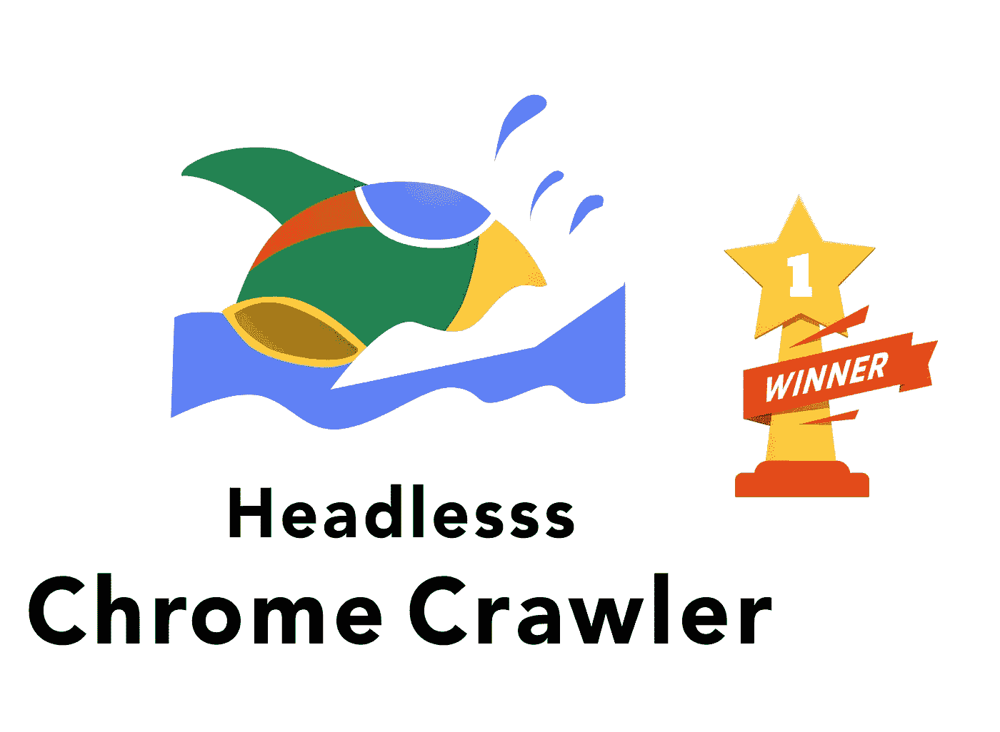
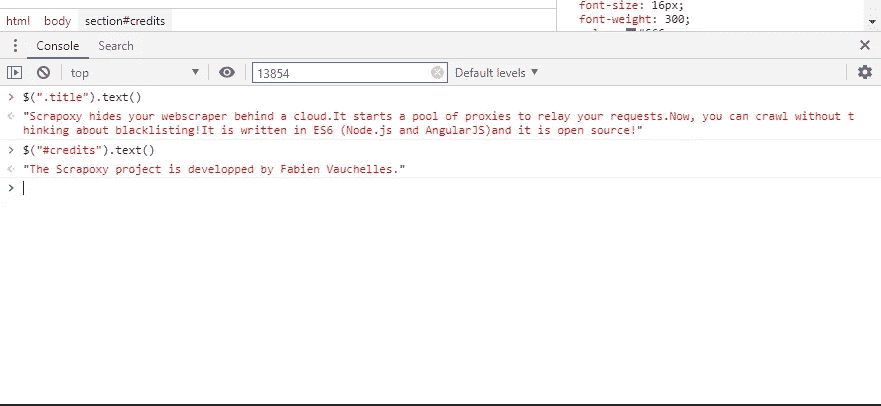

# 我需要 Python Scrapy 来构建 Web Scraper 吗？

> 原文：<https://betterprogramming.pub/do-i-need-python-scrapy-to-build-a-web-scraper-7cc7cac2081d>

## 否-使用简单的无头 chrome 爬虫


# 总是好斗

我谷歌了一下“如何构建一个网络爬虫”，第一个结果总是用 Python 写的，很多人建议使用来自 [pip](https://pypi.org/project/Scrapy/) 的 [Scrapy](https://scrapy.org) 库来构建它们。

我正在使用 Node 和 JS 构建这个特定项目的前端和后端，所以我不想切换语言，即使看起来有更多的人使用其他库或语言。

## 旁注:我不喜欢 Python


我更喜欢使用可以清楚地看到我的函数或指令开始和结束的语言，我从来不喜欢使用 Python，即使有时我真的需要在使用机器学习论文实现时处理它。

# **我的 JavaScript 爬虫之旅**

在阅读和测试 Scrapy 之后，我开始探索 [npm](https://github.com/search?l=JavaScript&o=desc&q=web+crawler&s=stars&type=Repositories) 包的图库来解决同样的问题，但是在 [Node.js](https://github.com/search?l=JavaScript&o=desc&q=web+crawler&s=stars&type=Repositories) 中:

*   [Apify](https://github.com/apifytech/apify-js):[https://github.com/apifytech/apify-js](https://github.com/apifytech/apify-js)JS+HTML+付费云
*   [无头浏览器爬虫](https://github.com/yujiosaka/headless-chrome-crawler):[https://github.com/yujiosaka/headless-chrome-crawler](https://github.com/yujiosaka/headless-chrome-crawler)JS+HTML
*   [爬虫](https://github.com/bda-research/node-crawler):[https://github.com/bda-research/node-crawler](https://github.com/bda-research/node-crawler)JS+HTML
*   [简单爬虫](https://github.com/simplecrawler/simplecrawler):[https://github.com/simplecrawler/simplecrawler](https://github.com/simplecrawler/simplecrawler)只是 HTML

# 很好，但不适合我。


我花了一个小时试图用 Apify SDK 解析一个简单的页面，试图理解如何访问 DOM 和选择器。如果你想要一个伟大的爬虫，这可能对你有用，但你需要理解它的特殊逻辑，我没有时间。

# 只是 HTML

由于速度快，我选择简单爬虫作为第一个从各种网站获取所有页面的程序。它很快，因为它只关注 html 文档，而不像其他使用 Puppeteer 的人那样拥有完整的 JavaScript 环境。

下面是一个简单爬虫的完整代码——只是纯 HTML:[https://gist . github . com/Giorat/12be 52223 c 9d 6 da 5 e 7 e 872621 BF 009 ca](https://gist.github.com/Giorat/12be52223c9d6da5e7e872621bf009ca)

```
var supercrawler = require("supercrawler");

var crawler = new supercrawler.Crawler({
    // Tme (ms) between requests
    interval: 1000,
    // Maximum number of requests at any one time.
    concurrentRequestsLimit: 5,
    // Time (ms) to cache the results of robots.txt queries.
    robotsCacheTime: 3600000,
    // Query string to use during the crawl.
    userAgent: "Mozilla/5.0 (compatible; supercrawler/1.0; +https://github.com/brendonboshell/supercrawler)",
});

crawler.addHandler("text/html", function (context) {
    var sizeKb = Buffer.byteLength(context.body) / 1024;
    console.dir(context.body.toString());
    // here you can make all the parsing to the HTML of the body of the page
    console.log("Processed", context.url, "Size=", sizeKb, "KB");
});

crawler.getUrlList()
    .insertIfNotExists(new supercrawler.Url("https://gist.github.com/discover/"))
    .then(function () {
        return crawler.start();
    });
```

在解析了页面主体并确保所有需要解析的元素都存在之后，我继续解析元素。如果需要的话，我用另一个带有 Javascript 的爬虫开始了更深入的解析，以在客户端呈现 SPA 应用程序。

# 无头 Chrome 爬虫胜出！



[HCC](https://github.com/yujiosaka/headless-chrome-crawler) 或[无头 Chrome 爬虫](https://github.com/yujiosaka/headless-chrome-crawler)让我能够毫不费力地解析所有这些客户端渲染的页面，使用 jQuery 提供的所有选择器不到五分钟。

下面是一个简单爬虫的完整代码:[https://gist . github . com/Giorat/85d 340 b 62 a 196 EB 70 C1 da 500789 cf 402](https://gist.github.com/Giorat/85d340b62a196eb70c1da500789cf402)

```
const HCCrawler = require('headless-chrome-crawler');

console.log('Starting the fetch');

const singlePage = false;
let maxDepthCrawler = 6;
if(singlePage)
      maxDepthCrawler=1;

const makeupPageUrl = 'http://scrapoxy.io/';

(async () => {
	const crawler = await HCCrawler.launch({
        userAgent: 'Mozilla/5.0 (Windows NT 10.0; Win64; x64) AppleWebKit/537.36 (KHTML, like Gecko) Chrome/70.0.3538.77 Safari/537.36',
        //headless: false,
		//slowMo: 10,
		evaluatePage: () => ({
                  title: $('title').text(),
                  //ADD here your other elements to parse from jQuery selectors
		}),
		onSuccess: (result) => {
                  const results = result.result;
                  console.log(`PRODUCT - ${results.title}.`);
                  //ACCESS here the elements evaluted inside the page from the previous section, the name have to be the same  
		}
	});

	await crawler.queue({
            url: makeupPageUrl,
            maxDepth: maxDepthCrawler,
            depthPriority: false,
            allowedDomains: [/sephora\.it$/],
	});
	await crawler.onIdle();
	await crawler.close();
})();
```

# 查找选择器的速度提高了 10 倍

为了让构建爬虫的 JavaScript 选择器的速度快十倍，我建议您安装以下浏览器扩展:

*   要在每个页面上安装 [jQuery，请安装](https://chrome.google.com/webstore/detail/jquery-injector/ekkjohcjbjcjjifokpingdbdlfekjcgi) this: [jQuery 注入器](https://chrome.google.com/webstore/detail/jquery-injector/ekkjohcjbjcjjifokpingdbdlfekjcgi)，[在每个页面上启用](https://chrome.google.com/webstore/detail/jquery-injector/ekkjohcjbjcjjifokpingdbdlfekjcgi)它。

[](https://chrome.google.com/webstore/detail/jquery-injector/ekkjohcjbjcjjifokpingdbdlfekjcgi)

## 如何找到合适的选择器？

如果您尝试解析特定节点，您需要:

*   打开你的浏览器
*   打开检查器开发工具并选择控制台选项卡
*   开始玩选择器吧！并在控制台中打印结果



# 结论

构建一个向自己提供 web 内容的爬虫应该基于一种技术，这种技术是每个网站 web 的一部分——像 Javascript 和 Node，而不是 Python！

未来对你的爬虫的改进可能是添加一个代理池来添加一个简单的负载平衡器，以减轻来自你的爬虫的所有请求，例如使用[免费 scrapoxy 库](https://github.com/fabienvauchelles/scrapoxy/):【http://scrapoxy.io/】T2

在这篇文章中，我刚刚分享了我的观点，我希望你能找到一些技巧或方法来加快你的工作，建立一个网络爬虫。如果你更喜欢使用 Scrapy，请在 twitter 上告诉我！

# **参考资料和资源**

*   [https://github.com/brendonboshell/supercrawler](https://github.com/brendonboshell/supercrawler)
*   [https://github.com/yujiosaka/headless-chrome-crawler](https://github.com/yujiosaka/headless-chrome-crawler)
*   [http://scrapoxy.io/](http://scrapoxy.io/)
*   [https://github.com/fabienvauchelles/scrapoxy/](https://github.com/fabienvauchelles/scrapoxy/)
*   [https://scrapy.org/](https://scrapy.org/)
*   [https://apify.com/](https://apify.com/)
*   [https://chrome . Google . com/web store/detail/jquery-injector/ekkjohcjbjjifokpingdbdlfekjcgi](https://chrome.google.com/webstore/detail/jquery-injector/ekkjohcjbjcjjifokpingdbdlfekjcgi)
*   [https://github.com/search?l=JavaScript&o = desc&q =网络+爬虫&s =群星&类型=仓库](https://github.com/search?l=JavaScript&o=desc&q=web+crawler&s=stars&type=Repositories)