# 用 16 行 Python 代码做配对交易

> 原文：<https://betterprogramming.pub/do-pair-trading-with-16-lines-of-python-code-d1b0fed9ad22>

## 获取相似的股票进行配对交易


[杰米街](https://unsplash.com/@jamie452?utm_source=medium&utm_medium=referral)在 [Unsplash](https://unsplash.com?utm_source=medium&utm_medium=referral) 上拍照。

[Python](https://www.python.org/) 是一种优秀的编程语言，因为它对程序员友好的行为和合理的学习曲线，所以非常方便。我们可以在 Python 中找到大量可以用来快速完成任务的库和快捷方式。

[Pandas](https://pandas.pydata.org/) 是使用最多的处理数据的 Python 模块之一。当我们谈论数据时，[时间序列数据](https://en.wikipedia.org/wiki/Time_series)总能抓住我们的注意力。我们喜欢玩时间序列数据来寻找不同的模式、趋势和预测未来。

本文将介绍我们如何利用 pandas 和其他 Python 特性来找到最相似的部分。交易者可以考虑这些套对股票进行[对交易](https://zerodha.com/varsity/chapter/pair-trading-basics/)。

*注意:本文仅用于教育目的，不包含财务建议。*

# 熟悉数据

我们将使用的数据是开源的。许多数据源如 Quandl 和 Yahoo Finance 也可以通过他们的 API 向我们提供实时的股票市场数据。其中一些提供免费的有限 API 调用，我们可以用来练习。

让我们导入一些库来加载我们的数据，并进行进一步的分析和可视化:

```
import pandas as pd
import datetime as dtimport seaborn as sns
from matplotlib import pyplot as plt
plt.style.use('ggplot')
%matplotlib inline
```

Pandas 用于加载和分析数据。 [Seaborn](https://seaborn.pydata.org/) 和 [matplotlib](https://matplotlib.org/) 用于绘制可视化效果。

```
df=pd.read_csv("cs-1.csv")
```

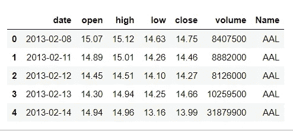

可用数据集

# 数据分析

我们将使用年度数据。让我们在日期字段中管理年份列:

```
df['date'] = pd.to_datetime(df['date'])
df['year'] =df['date'].dt.year
```

要比较两只股票，应该遵循相同的数据日期范围。我发现有些股票的日期范围较小:

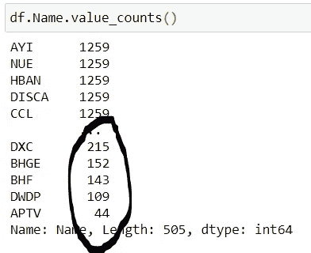

数据分析

让我们移除这些库存，继续进一步加工:

```
**count_df=pd.DataFrame(df.Name.value_counts()[:470], columns=["Name", "Count"]).reset_index()**list_valid_shares=list(count_df["index"])
**final_df=df[df.Name.isin(list_valid_shares)]**
```

现在，让我们来看看我们的数据:

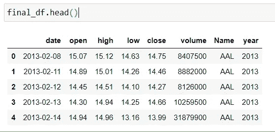

用于进一步处理的数据

我们有 2013-2019 年的数据。我们的目标是找到任何特定年份最相似的股票。我们将采用 2018 年的数据:

```
data_by_year=final_df.groupby("year")
data_2018=data_by_year.get_group(2018)
```

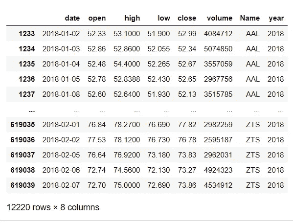

2018 年的数据

对于任何时间序列数据，我们都需要日期作为索引。让我们将日期列作为索引，并使我们的数据成为比较不同股票的枢纽:

```
pivot_df=data_2018.pivot(index="date",columns="Name", values="close")
```

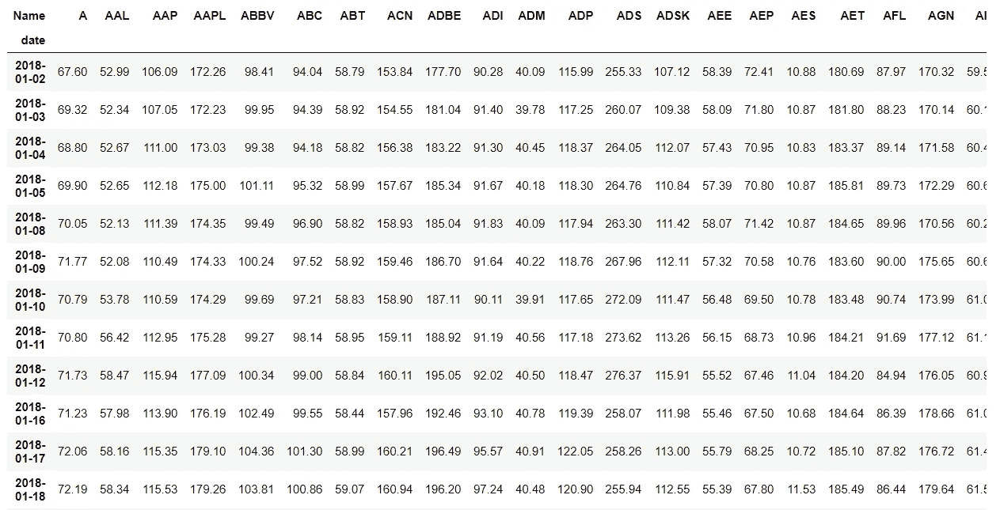

2018 年的枢纽数据

# 寻找相似之处

为了找到相似之处，我们将使用熊猫的`corr`方法:

```
corr_mat=pivot_df.corr(method ='pearson').apply(lambda x : x.abs())
```

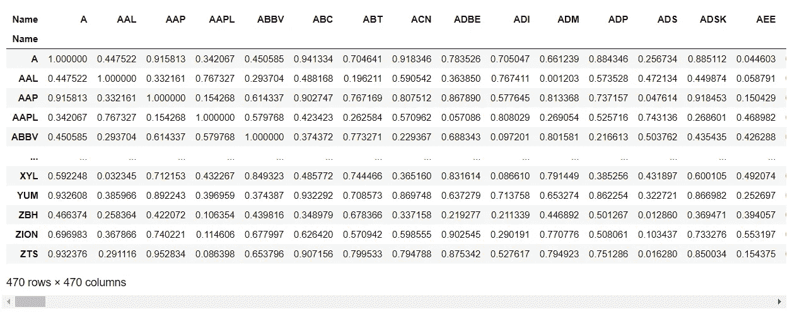

相关矩阵

现在，我们将利用`unstack`方法，它可以给我们一个更好的股票之间的关系。此外，我们可以对结果进行排序，以获得关系的最终图像。

最后，我们可以选择前十个配对，得出股票之间的前五个关系，以便进行配对交易:

```
sorted_corr = corr_mat.unstack().sort_values(kind="quicksort", ascending=False)sc=pd.DataFrame(sorted_corr, columns=["Value"])[470:480]
```

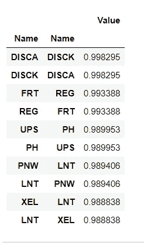

排序相关 DF

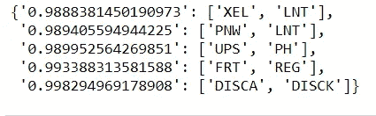

配对交易的最终前五组

# 可视化结果

我们现在将利用`matplotlib`模块来可视化最终输出，以进一步澄清我们的结果:

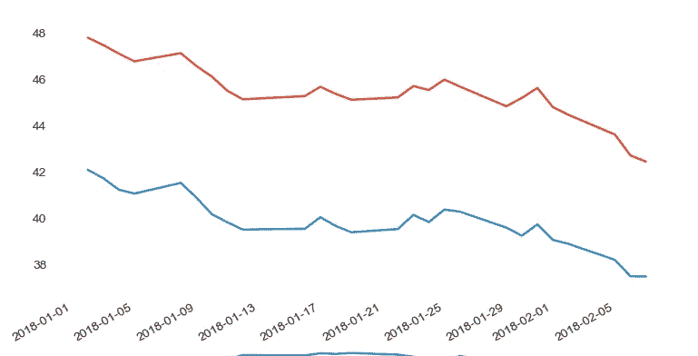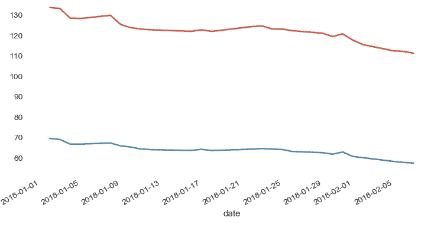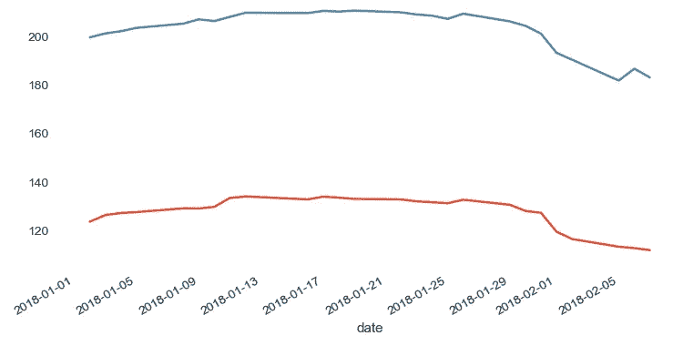

# 结论

本文到此为止。我们讨论了如何利用 Python 来寻找系列/股票之间的相似性。我希望你喜欢它。敬请关注更多文章。

感谢阅读！