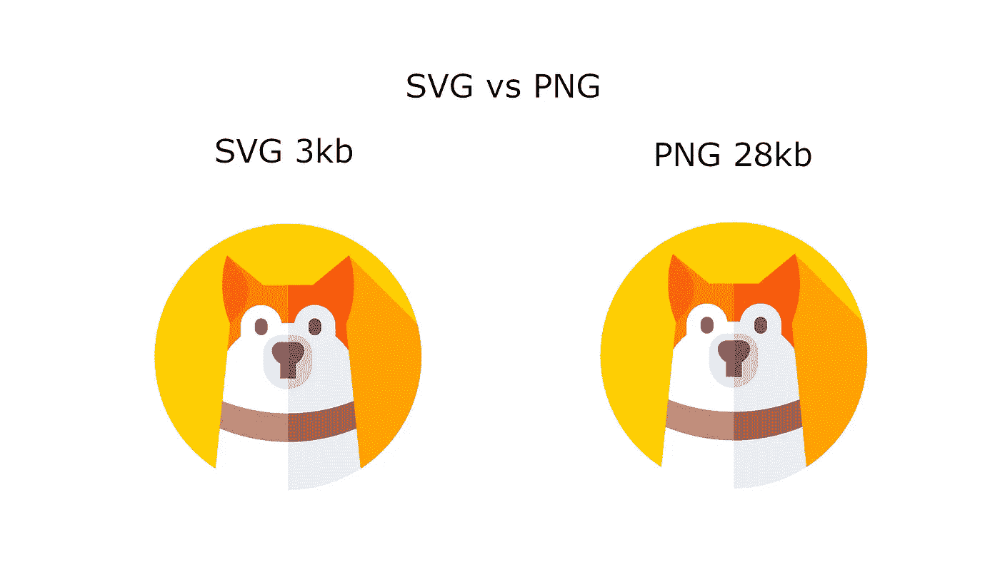
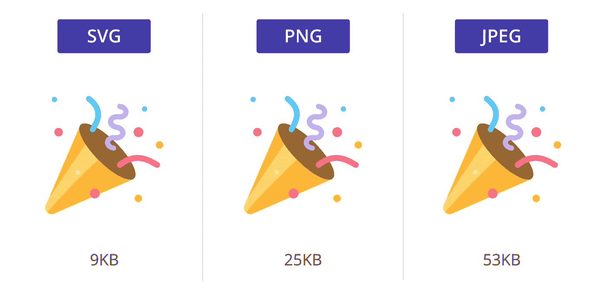
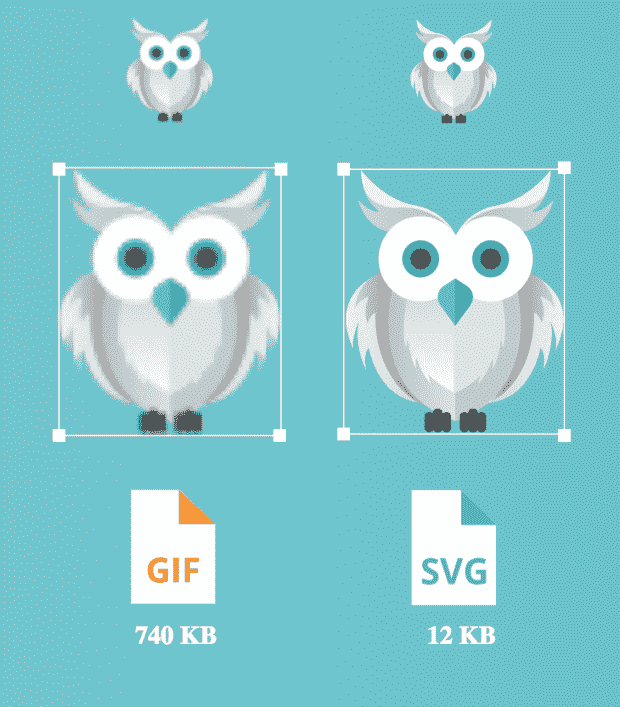

# SVG 在 Web 开发中的重要性

> 原文：<https://betterprogramming.pub/do-svgs-really-matter-154240f5435c>

## SVG 真的重要吗？


[BP Miller](https://unsplash.com/@bp_miller?utm_source=unsplash&utm_medium=referral&utm_content=creditCopyText) 在 [Unsplash](https://unsplash.com/s/photos/images?utm_source=unsplash&utm_medium=referral&utm_content=creditCopyText) 上拍摄的照片

当开发人员创建他们的应用程序时，他们对许多图标和矢量图像使用 SVG 格式。使用 SVG 代替常规的 PNG 或 JPEG 文件有很多好处。

如果你和你的团队试图制作一个响应性网站，SVG 是为你的插图、图标和图像服务的最佳选择。

# 利益

## **可扩展性**

SVG 是独立于分辨率的，所以无论它们的大小如何，我们都可以使用它们。增加和减少它们的尺寸非常容易。不像 JPG 或巴布亚新几内亚，SVG 保持其质量，无论什么大小的屏幕或分辨率是用来显示他们。

同一个文件的不同可伸缩性对响应式网页非常有帮助。作为开发人员，您可以在任何地方使用相同的文件源，只需快速调整比例。


## **文件大小**

与 PNG 或 JPEG 文件相比，除非在大屏幕上调整大小，否则 SVG 文件的大小非常小:



如你所见，巴布亚新几内亚几乎大了十倍。当你需要在你的网站上使用大量图片时，图片大小的差异是巨大的。



**注意:SVG 的大小可以在不增加文件大小的情况下增加。**

## **性能**

正如你在上面看到的，SVG 和 PNG 的大小差别很大。当你开发一个有很多图形和图像的网站时，使用 SVG 而不是 JPEGs 或 png 会有很大的不同。

如果我们的登录页面上有 30 个图像和图标，我们可以使用 JPEGs 或 png 轻松达到 4 到 5mb。使用 SVG，它将只有 100-200 kb。差别是巨大的！

相信我，当他们第一次登陆你的网页时，没有人愿意多等 15-20 秒！



## **风格控制**

使用 SVG 还有另一个好处。在编码时，你可以用一个单独的文件源随意改变它们的属性。

*   单色填充，轻松描边颜色
*   随属性改变大小
*   轻松改变不同用途的颜色。(悬停效果不再需要不同的图像或精灵)

## **示例 svg 代码**

```
<svg height="100" width="100">
  <circle cx="50" cy="50" r="40" stroke="black" stroke-width="3" fill="red" />
</svg>
```

这个 SVG 包括`height`、`width`、`cx`、`cy`、`r`、`stroke`颜色、`stroke-width`和`fill`属性。使用单个文件源可以很容易地更改这些值。

如下所示，使用同一个文件，您可以为图标添加悬停效果:


## **快捷网站**

SVG 肯定会提高你的网站的速度——这是一个对你的观众有很大影响的因素。

你们中有多少人等待加载一个页面的时间超过了 30 秒？如今，大多数人会认为他们在五秒钟后就失去了连接。

# **我的四大 SVG 来源**

这里有一些我用来寻找 SVG 的网页

*   [freeicons.io](https://freeicons.io/)
*   [flaticon.com](https://www.flaticon.com/)
*   [icons8.com](https://icons8.com/icons/set/svg)
*   [freepik](https://www.freepik.com/)

如果你正在使用任何其他的，请在下面评论。

*如果你觉得这篇文章很有帮助，你可以通过使用我的推荐链接注册一个* [***中级会员来访问类似的文章***](https://melihyumak.medium.com/membership) *。*

***关注我上*** [**推特**](https://twitter.com/hadnazzar)


在 Youtube[上订阅更多内容](https://www.youtube.com/c/TechnologyandSoftware?sub_confirmation=1)

# 编码快乐！

梅利赫