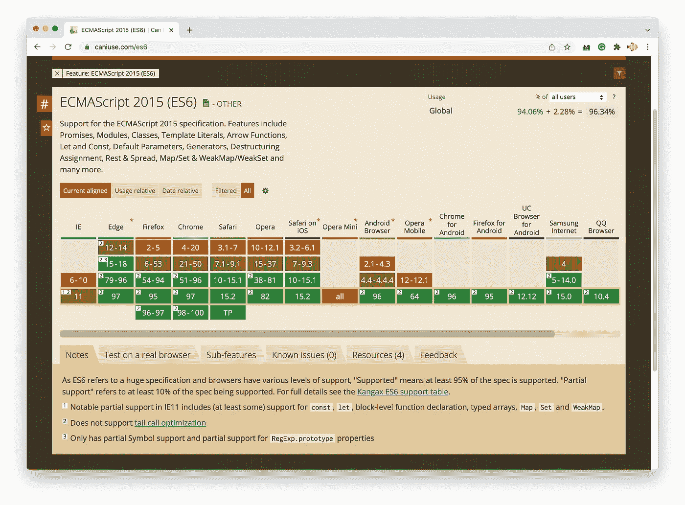

# 2022 年我们还需要把 ES6 的 JavaScript 代码编译成 ES5 吗？

> 原文：<https://betterprogramming.pub/do-we-still-need-to-compile-es6-javascript-code-into-es5-in-2022-f5ec70509e9b>

## 字节码级别的比较


为了兼容老浏览器，尤其是 IE 系列，我们经常需要使用 Bable 等编译工具将我们的 ES6+代码编译成 ES5- code。

但是 ES6 是 2015 年发布的，到现在已经 7 年了，我们还需要把它转换成 ES5 吗？可以直接用 ES6 吗？

根据[我能不能用](https://caniuse.com/es6)，94.06%的用户浏览器已经完全支持 ES6。



除了考虑浏览器支持，我们还需要考虑性能。让我们从它们的 V8 字节码的角度来比较一下原始代码和编译后的代码。

# 1.复制数组

在 ES6 中，我们可以使用扩展操作符`…`来复制一个数组:

```
const array1 = [1, 2, 3];let a2 = [...array1];
```

如果它被 Babel 编译成 ES5，它会使用`concat`函数来复制一个数组:

```
var array1 = [1, 2, 3];var a2 = [].concat(array1);
```

看起来这两个代码没有太大的区别。但实际上，如果我们看一下它们对应的 V8 字节码，就会看出区别。

```
0x3c140829374e @    0 : 79 00 00 25       CreateArrayLiteral [0], [0], *#37*0x3c1408293752 @    4 : c4                Star0 
0x3c1408293753 @    5 : 7a                CreateArrayFromIterable 
0x3c1408293754 @    6 : c3                Star1 
0x3c1408293755 @    7 : 0e                LdaUndefined 
0x3c1408293756 @    8 : a9                Return
```

上面的代码是第一段代码对应的 V8 字节码，只需要 6 条指令就可以完成。

与`var a2 = [].concat(array1);`对应的 V8 字节码需要 10 条指令:

```
0x3c1408293696 @    0 : 79 00 00 25       CreateArrayLiteral [0], 0x3c140829369a @    4 : c4                Star0 
0x3c140829369b @    5 : 7b 01             CreateEmptyArrayLiteral [1]
0x3c140829369d @    7 : c1                Star3 
0x3c140829369e @    8 : 2d f7 01 02       LdaNamedProperty r3, [1], [2]
0x3c14082936a2 @   12 : c2                Star2 
0x3c14082936a3 @   13 : 5e f8 f7 fa 04    CallProperty1 r2, r3, r0, [4]
0x3c14082936a8 @   18 : c3                Star1 
0x3c14082936a9 @   19 : 0e                LdaUndefined 
0x3c14082936aa @   20 : a9                Return
```

这主要是因为前者可以使用`CreateArrayFromIterable`指令，而后者是函数调用。

所以在这种情况下，使用数组扩展操作符(ES6 的一个特性)会比使用 ES5 `concat`函数更好。

# 2.可选捕捉参数

在 ES2019 中，我们可以省略 catch 语句中的 error 参数。

```
try {
  console.log(111)
} catch {  // omit error param
  console.error("Error");
};
```

如果编译成 ES5，Babel 会为我们生成一个未使用的错误变量`_unused`:

```
try {
  console.log(111);
} catch (_unused) {
  console.error("Error");
}
```

使用错误参数，V8 将生成一个`CatchContext`到`CreateCatchContext`，并将为 catch 块生成一个`CATCH_SCOPE`:

```
0x1937082936b6 @    0 : 19 ff fa          Mov <context>, r0
0x1937082936b9 @    3 : 61 03 00          CallUndefinedReceiver0 a0, [0]
0x1937082936bc @    6 : 8a 20             Jump [32] (0x1937082936dc @ 38)
0x1937082936be @    8 : c3                Star1 
0x1937082936bf @    9 : 82 f9 00          CreateCatchContext r1, [0]
0x1937082936c2 @   12 : c4                Star0 
0x1937082936c3 @   13 : 10                LdaTheHole 
0x1937082936c4 @   14 : a6                SetPendingMessage 
0x1937082936c5 @   15 : 0b fa             Ldar r0
0x1937082936c7 @   17 : 1a f9             PushContext r1
0x1937082936c9 @   19 : 21 01 02          LdaGlobal [1], [2]
0x1937082936cc @   22 : c1                Star3 
0x1937082936cd @   23 : 2d f7 02 04       LdaNamedProperty r3, [2], [4]
0x1937082936d1 @   27 : c2                Star2 
0x1937082936d2 @   28 : 13 03             LdaConstant [3]
0x1937082936d4 @   30 : c0                Star4 
0x1937082936d5 @   31 : 5e f8 f7 f6 06    CallProperty1 r2, r3, r4, [6]
0x1937082936da @   36 : 1b f9             PopContext r1
0x1937082936dc @   38 : 0e                LdaUndefined 
0x1937082936dd @   39 : a9                Return
```

省略错误参数时，不生成`CatchContext`:

```
0x19370829376a @    0 : 19 ff fa          Mov <context>, r0
0x19370829376d @    3 : 61 03 00          CallUndefinedReceiver0 a0, [0]
0x193708293770 @    6 : 8a 15             Jump [21] (0x193708293785 @ 27)
0x193708293772 @    8 : 10                LdaTheHole 
0x193708293773 @    9 : a6                SetPendingMessage 
0x193708293774 @   10 : 21 00 02          LdaGlobal [0], [2]
0x193708293777 @   13 : c2                Star2 
0x193708293778 @   14 : 2d f8 01 04       LdaNamedProperty r2, [1], [4]
0x19370829377c @   18 : c3                Star1 
0x19370829377d @   19 : 13 02             LdaConstant [2]
0x19370829377f @   21 : c1                Star3 
0x193708293780 @   22 : 5e f9 f8 f7 06    CallProperty1 r1, r2, r3, [6]
0x193708293785 @   27 : 0e                LdaUndefined 
0x193708293786 @   28 : a9                Return
```

此时，使用的指令更少。

# 3.幂算子

ES6 之后，我们可以使用`**`运算符直接计算功率。

```
var a = 3 ** 3   // 27
```

在 v8 引擎中，有一个指令叫做`Exp`，可以直接计算功率，所以对应的字节码非常简洁。

```
0xb75082936be @    0 : 0b 03             Ldar a0
0xb75082936c0 @    2 : 3e 03 00          Exp a0, [0]
0xb75082936c3 @    5 : a9                Return
```

如果您将此代码转换为 ES5，它将是:

```
var a = Math.pow(3, 3);
```

这是一个函数调用，需要更多指令:

```
0xb7508293652 @    0 : 21 00 00          LdaGlobal [0], [0]
0xb7508293655 @    3 : c3                Star1 
0xb7508293656 @    4 : 2d f9 01 02       LdaNamedProperty r1, [1], [2]
0xb750829365a @    8 : c4                Star0 
0xb750829365b @    9 : 5f fa f9 03 03 04 CallProperty2 r0, r1, a0, a0, [4]
0xb7508293661 @   15 : a9                Return
```

例子很多，不一一列举了。

# 结论

从浏览器支持和代码性能的角度来看，我建议你保持 ES6 语法，而不是转换成 ES5。除非你有很多客户使用旧的浏览器。