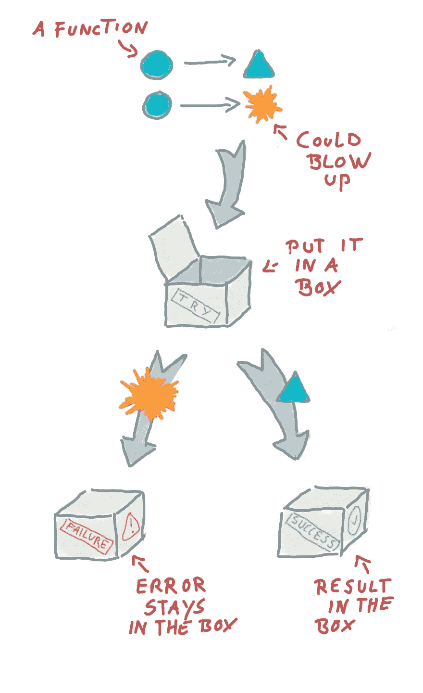
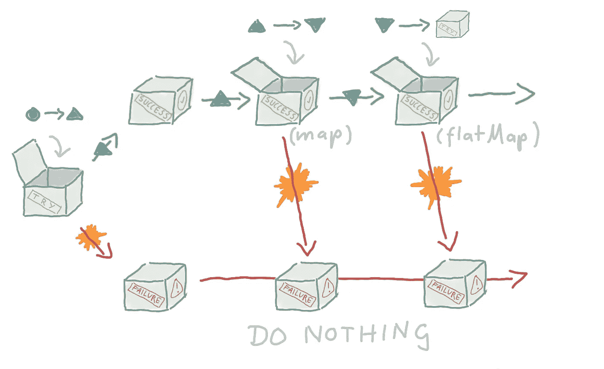
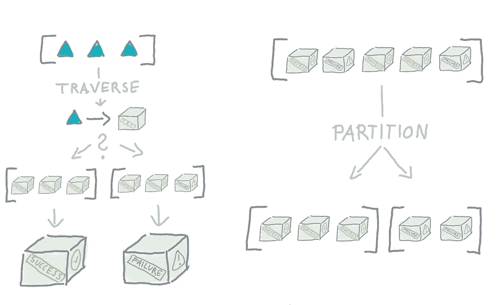

# 你试过吗？Kotlin 中的功能错误处理

> 原文：<https://betterprogramming.pub/do-you-even-try-functional-error-handling-in-kotlin-ad562b3b394f>

## 如何通过使用函数式编程中的概念来废除 try-catch 块并使您的代码更安全、更整洁


照片由[莎拉·基利安](https://unsplash.com/@rojekilian?utm_source=unsplash&utm_medium=referral&utm_content=creditCopyText)在 [Unsplash](https://unsplash.com/s/photos/error?utm_source=unsplash&utm_medium=referral&utm_content=creditCopyText) 上拍摄

我真的不喜欢 try-catch 块，也不喜欢许多面向对象编程语言中如何处理异常。

通常，函数的调用者甚至不知道它可能会抛出异常，这种引用透明性的缺乏使得代码更加难以理解，并可能导致无法预见的错误和问题。

为了处理异常，我们必须用 try-catch 块包围函数调用，这使代码变得混乱，通常只是为了执行日志记录或释放资源，然后重新抛出异常，甚至更糟，返回空值*。处理错误通常是一项麻烦的任务。*

当我第一次尝试用 Scala 进行函数式编程时，我记得我最喜欢的是这种语言如何让你处理空值和错误。

尽管您可以在 Scala 中编写一个常规的 try-catch 块，但是您也可以选择不这样做，我从来没有这样做过。该语言的标准库中有几个*代数* *数据类型*，其中一个为命令式 try-catch 块提供了替代，恰当地命名为`Try`。

基本的想法是，你包装一个你想执行的函数，但是这个函数可能会在一个`Try`中抛出一个错误。`Try` 执行函数，捕捉任何发生的错误并创建其两个子类型之一，一个`Success` 或一个`Failure`。

它们分别保存函数的结果值或可能产生的错误。

由于 Kotlin 对函数式编程范式有很好的支持，当我学习这门语言时，我做的第一件事就是试图模仿我从 Scala 学到的东西。

我喜欢 Kotlins 内置的带有特殊语法的`null-type`，Java 现在在标准库中也有了它的`Optional` 类型，但是两者都缺少一个对等的错误处理。

幸运的是，它实现起来非常简单，Kotlin 及其语言特性非常适合这个概念。



Try 包装一个可能失败的计算，并给出两种结果之一，成功或失败，包含结果或错误。除非您手动访问并重新引发异常，否则异常永远不会离开失败。

让我们看一个非常基本的例子，在 Kotlin 中实现了一个`Try` 。

在下面的代码中，我们试图分配包装在一个`Try`中的两个值，其中一个将因异常而失败。然而，分配`resultB`时抛出的异常不会终止该功能，打印操作都将被执行。

您将在控制台中看到的结果如下。不出所料，第一个是保存字符串值的`Success` ，第二个是包含异常的`Failure` 。要知道您处理的是哪一个，您可以执行类型检查。

```
Success("Hello, World")
Failure("Not Today!")
```

这为您提供了封装任何可能发生的错误并对潜在故障进行抽象的好处。

当使用`Try` 作为函数的返回类型时，它向调用者表明它可能会失败，结果可能是一个错误，因为，例如，通常为`String`的返回类型现在变成了`Try<String>`。

然而，这还不是全部，`Try` 还提供了一组高阶函数，允许转换它包含的值。

这样做的效果是，您可以继续使用`Try`，传递它并处理其中的数据，而不必确定您是在处理一个`Success` 还是一个`Failure` ，直到最终需要最终结果的最后一刻，有点像薛定谔的值。

在看实现之前，让我们看一个稍微复杂一点的例子，在 Kotlin 中使用一个`Try` 。

一个简单的工作尝试的例子

一个典型的练习，我们想从一个 CSV 文件中读取可能抛出各种 I/O 异常的行，通常，我们要么用一个 try-catch 包围它，要么让任何潜在的异常飞出并终止程序，或者如果有任何异常的话，跳到堆栈中更高的下一个 catch-block。

`Try` 封装了我们想要执行的操作并保存结果，`List`包含文件中的行。

通常，您会希望对数据执行操作，在本例中，我们希望将文件中的每一行转换成一个`Pet`对象，我们可以看到`toPet`函数包含一些可能失败的操作。

失败包括将字符串转换为整数以解析年龄，以及通过字符串查找枚举以获得`PetType`。

作为参考，我在这个练习中使用的文件的内容是这样的，我们可以看到上面的代码的最后两行会引起问题，`Rambo`没有年龄，`Mike`不是有效的`PetType`。

```
Spot,7,Dog
Alice,14,Cat
Rambo,,Dog
Mike,3,Raccoon
```

因为对`Try` 的`map` 操作也能捕捉到任何可能发生的错误，所以不会真的出错。稍后，当我们想知道我们的操作是否成功时，我们执行类型检查，要么从`Success`中提取结果值，要么从`Failure`中提取错误。

打印上述示例的结果将产生以下结果:请注意我们是如何收到发生的第一个错误的，这个错误发生在我们试图提取兰博的年龄时。在文件由于任何原因不可访问的情况下，`Failure`将包含一些 I/O 异常的消息。

```
Failure(For input string: "")
```

# 第一次尝试

如上所示的基本`Try` 很容易实现，让我们从最常见的情况开始，构造它，映射值，并将其与另一个`Try`组合。

Kotlin 中 Try 的简单实现

一个*数据类型*可以用 Kotlin 中的密封类实现，密封类是一个抽象类，只能在同一个文件中扩展。这保证了在其他地方不会有其他实现，因为一个`Try`只有两个子类型`Success` 和`Failure`。

密封的类`Try` 有一个实现`invoke`的伴随对象，它允许你调用`Try`，就像你调用它的构造函数一样，如上面的例子所示，这不是必须的，但使它更有表现力。

`invoke`包含您必须编写的最后一个 try-catch 块，它执行您传递给它的函数，并返回`Success` 或`Failure`。

`Try`还定义了`map` 和`flatMap` 操作的签名，这样无论我们最终使用哪种类型，我们都可以使用它们。

> “做或不做，没有尝试”——尤达

对于`Failure` 的情况，实现它非常简单，因为它只保留一个异常，否则，它现在不做任何事情，这两个操作只是再次返回`Failure` ，因为我们没有值可操作。

`Success` 保存实际值并可以操作它，`map` 只是简单地接受您传递给它的函数并提取值，包装在新的`Try`中，这也给了我们不变性。

`flatMap` 有点复杂，因为传入的函数也返回一个`Try` ，而你不想以一个`Try<Try<T>>`结束，而是以一个`Try<T>`结束，所以我们需要提取我们得到的运算结果，这允许将两个`Try` 合并成一个。

在下面的例子中，我们将看到为什么这是一个重要的操作。



一次尝试的工作流程。如果成功，则执行操作；否则，不执行任何操作，并跳到结尾。

# 没那么快！

如果你开始采用这种编程风格，你可能就不会有像`toPet`这样随机抛出异常的函数了。

毕竟，这个构造的一个目的是实现更多的引用透明性，因此，`toPet`函数可能会返回一个`Try<Pet>`。

此外，对`PetType`的查找也将返回一个`Try<PetType>`。这将使事情对调用者来说更清楚，使用起来更安全，但也使处理起来更复杂，因为我们现在有了所有这些包含我们数据的`Try` ，我们需要将它们组合起来。

当然，这就是我们进行`flatMap` 操作的原因。我们来看一个改编版的`toPet`。

拥有对`toPet`错误安全的每个调用有一个明显的优势，现在，如果出了问题，例如，你的文件中的一行没有工作，它不会终止你的计算，你也不会丢失所有其他的结果。相反，你有一个包含成功和失败的列表。

你可能已经意识到我们现在处理的是一个`Try<List<Try<Pet>>>`，这的确很糟糕，像这样的嵌套类型会让你头疼，但这是我选择这个例子的主要原因，因为它是一个非常真实的场景。

它还开始说明，当处理依赖值而不是简单的操作链时，我们会很快变得难以理解上面这样的嵌套 map 语句，但我们可以处理所有这些。

输出现在看起来像下面这样，我们看到尽管有错误，但我们很好地保存了结果和异常。

```
[Success(Pet(name=Spot, age=7, type=Dog)), 
Success(Pet(name=Alice, age=14, type=Cat)), 
Failure(For input string: ""), 
Failure(No Pet Type: Raccoon)]
```

你平时会怎么和`toPet`打交道？您会用 try-catch 包围这些操作，抑制所有错误并返回一个空值吗？或者您会让它抛出一个异常吗？或者您会使用一个`NullObject`模式吗？

# 带 Try 的集合

由于像`Try`这样的集合和构造的组合可能会有点烦人，所以一个`Try` 在野外的实现通常比一个`map` 和一个`flatMap` 拥有更多的功能，而是一系列的实用程序，它们涵盖了你在使用这种构造时会遇到的许多用例。

在上面的例子中，在处理集合时有一些方便的扩展，例如我们可以实现的`traverse` 或`partition` ，只是给你一个例子。

## 遍历集合

`Traverse`

反过来，这意味着您将再次丢失所有成功的结果，但通常我们并不在乎，它允许我们无缝地使用一个函数返回一个集合类型的`Try` 和。

我们可以实现如下的`traverse`:

带有`traverse` 的 pet 示例如下所示。

注意我们如何用`traverse` 操作替换列表映射，并使用`flatMap` 将来自`toPet`的内部`Try` 与来自读取文件的外部`Try` 组合成一个包含最终结果或错误的文件。

使用 traverse 将文件中的线条映射到 Pet 对象。

由于第一个错误发生在获取兰博的年龄时，我们得到了与第一个例子相同的输出，但是，因此，我们得到了一个非常简洁的易于处理的`Try<List<Pet>>`。

```
Failure(For input string: "")
```

## 划分集合

另一方面，一个`partition` *，*会给你一个带有两个列表的`Pair` ，一个带有所有成功的和一个带有所有失败的`Pair<List<Success>, List<Failure>>>`，这样一个`Pair<List<Success>, List<Failure>>>`，它允许你保存结果和错误，并根据你的需要分别处理它们。

注意我们在下面的代码中是如何为列表对引入一个类型别名的，如果你想让函数接受或返回这个类型，我推荐你这样做，只是为了可读性。

虽然一开始看起来不必要的复杂，但是我们可以为这种类型创建更容易使用的扩展方法，例如，在成功列表中映射值的函数。

这样，我们可以轻松有效地处理成功的结果，同时避免错误，而不必再想太多。

用谓词对列表进行分区会将谓词为真的所有值放在左边，将谓词为假的所有值放在右边。

当我们现在再次考虑我们最初的 pet 例子时，我们可以使用`partition`和`type`别名。

例如，我们通过使用我们的`ResultSet`类型的`map`方法，将所有成功导入的宠物的名字转换成大写字母，这隐藏了我们在这里实际处理的嵌套类型的笨拙。

不可否认，当首先使用这个抽象级别时，会有许多用例需要发现。

虽然开始时它看起来有点像兔子洞，但它有一个终点，结果是，有希望保存更安全和更干净的代码。

如上例所示，输出如下。我们可以看到，我们成功地转化了成功的，同时也保留了所有的失败。

```
([Success(Pet(name=SPOT, age=7, type=Dog)), 
Success(Pet(name=ALICE, age=14, type=Cat))], 
[Failure(No Pet Type: Raccoon), 
Failure(For input string: "")])
```



# 是时候恢复了

有时，一个错误并不是世界末日，在某些情况下，您可能不太在意，宁愿有一些默认值而不是错误消息，或者您可能发现异常产生的某个错误消息没有传达足够的信息。

与用于转换`Success`中的值的`map` 和`flatMap` 类似，您可以添加等效的方法，有时称为`recover` 和`recoverWith`，来转换`Failure`中的错误并执行一个动作来补偿错误。

`recover` 基本上允许您提供一个在异常情况下返回默认值的函数，而`recoverWith` 允许您提供一个替代的`Try` *。*

回到我们的宠物例子，假设我们对解析年龄时得到的错误消息不满意，而且业务需求已经改变，现在我们应该导入一个无效类型的宠物，将它们标记为`Invalid`。

让我们看看如何使用恢复来调整`toPet`以适应这些需求。

为了改变我们在年龄解析不成功时收到的错误消息，我们使用`recoverWith` 并用另一个包含“更好”错误消息的`Failure`替换`Failure`。

为了丢弃提取类型和使用`Invalid`作为默认`PetType`时出现的任何错误，我们简单地使用`recover`。

现在，当使用这个改编版本的`toPet`运行最后一个示例时，我们得到了一个不同的输出。

正如你所料，我们只有一个`Failure`，现在告诉我们，我们无法提取年龄，其中`Mike`现在被成功导入，并获得默认的宠物类型。

```
[Success(Pet(name=Spot, age=7, type=Dog)), 
Success(Pet(name=Alice, age=14, type=Cat)), 
Failure(Cannot extract age!), 
Success(Pet(name=Mike, age=3, type=Invalid))]
```

> "程序是对计算机施的咒语，将输入转化为错误信息."—匿名

# 一点糖

我不喜欢上面版本的`toPet`中嵌套的`flatMap` 和`map` 表达式，在 Scala 中，有一个特殊的 *for-expression* ，你可以在每一个支持这两种运算的代数数据类型上使用，这使得它更具表现力。

尽管 Kotlin 没有对应的语言，但它是一种非常强大的语言，允许很多恶作剧。我从 [Arrow](https://arrow-kt.io/) 库中借鉴了这种方法的思想，该库中所有的代数数据类型都有相似的语法，我想在结束之前介绍一下。

其思想是，按顺序计算的相关值可以简单地按顺序解包，出现的任何错误都会中断序列。

以命令式方式处理依赖类型

实际上，我很喜欢这个缩写，因为析构声明的括号也清楚地表明结果可能不会成功。

实现这一点相当简单，至少对于一个`Try`来说是这样，利用接收器对象和作用域扩展方法。

由于扩展方法只在`TrySequence`对象中可用，我们只能在以它为接收类型的 lambda 表达式中使用它。

最后，顺序操作和常规的`invoke` 在`Try`上区别不大。我们可以给它一个函数来产生一个值，然后我们把这个值提取到一个`Try`中。

唯一的区别是我们添加了扩展来析构一个`Try`，它将返回一个值或者抛出一个异常。这个异常终止了 lambda，但是被周围的`Try`捕获。

它除了为我们提供更富表现力的处理方式之外，别无它用。

# 最后的想法

无论函数式编程是否是您的难题，采用这种错误处理方式都有一些明显的优势。

向函数的调用者明确说明它可能会产生错误会给代码带来很大的好处。

包含错误而不抛出异常会使事情变得更加稳定和可预测，也使您的程序更容易推理，因为异常不再是发生在代码之外的事情，相反，错误处理的整个概念只是成为一种新的类型，可以按照您喜欢的方式进行扩展和控制。

异常本质上是有问题的，因为它们的运行时开销。Java 中的异常在创建时捕获其调用堆栈的快照，这是一个相当昂贵的操作，因此不建议使用异常和随后的`Try` 来控制程序流。

由于`Try`只与异常兼容，所以有一种更通用的代数数据类型，它以更通用的方式抽象了失败，因为它的错误情况并不局限于异常，例如，它允许您简单地使用字符串来传递错误消息，这种类型称为`Either` ，其工作方式非常类似。

另一方面的`Try` 作为处理异常的机制肯定有它的位置，因为在很多情况下，您没有选择，只需要处理异常。

这里开发和使用的`Try`的最终代码如下所示:

函数式编程的世界充满了许多这样的代数数据类型，还有更多概念和模式有待探索。

说到 Kotlin，似乎有一个或多或少全面的库，我在本文中提到过几次，名为 *Arrow，*如果您有兴趣进一步了解这个*，可能值得一试。*

[](https://github.com/arrow-kt/arrow) [## 箭头-kt/箭头

### rrow 是 Kotlin 中用于类型化函数编程的库。Arrow 的目标是提供一个界面和…

github.com](https://github.com/arrow-kt/arrow) 

仔细考虑你是要写你自己的代数数据类型库，还是修改现有的库。

请注意，如果您开始使用这种结构，它将很快遍布您的代码库。

由于您自己拙劣的实现或者因为您选择的库走了一条不同的路，并且刚刚否决了您最喜欢的数据类型，不得不进行重构，这肯定会令人头痛，但这是值得的。

非常感谢您的阅读！