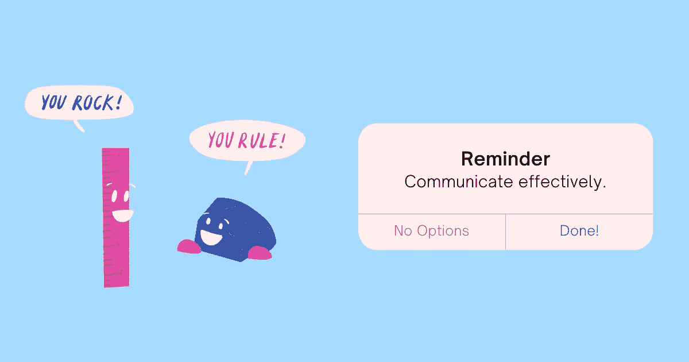

# 你有你团队的语言吗？

> 原文：<https://betterprogramming.pub/do-you-have-a-language-for-your-team-52fe0e6cb364>

## 共同的语言对于有效的团队沟通至关重要

鸣谢:作者

驾驭团队文化与其说是科学，不如说是艺术。不言而喻的期望、个人偏好、过去的经历以及团队成员之间的共同目标和关系感都在很大程度上决定了团队如何沟通和协作。

即使没有明确说明，每个团队都开发了自己的隐含语言来确定:

*   团队中的决策是如何制定的？
*   团队成员觉得畅所欲言安全吗？
*   当团队中的人被阻挡时，他们会做什么？
*   谁负责解决冲突？
*   人们是在增加价值的任务上工作，还是在无关紧要的活动中浪费时间？
*   向别人寻求帮助时，他们是什么感觉？
*   他们的紧迫感是什么？他们觉得哪些事情需要他们的关注？
*   团队中的人更被动还是更主动？
*   人们尊重自己和他人的时间吗？
*   人是为自己的行为负责还是责怪别人？
*   团队成员之间如何分享知识？
*   人们是从自我出发还是从贡献价值的愿望出发？

如果没有定义好的团队沟通是什么样的，团队成员要么适应现有的实践并随波逐流(不质疑他们的有效性)，要么当其他人忽视他们的建议时感到沮丧，因为他们试图给团队的沟通方式带来积极的变化而关闭他们。

想一想你自己的团队——你对你团队的沟通结构有什么贡献？你一开始做了哪些假设？你是如何区分什么是可以接受的，什么是不可以接受的，你在当前的合作方式中看到了什么问题？

让每个团队成员开发他们自己的沟通剧本不仅效率低下，还会留下很多解释。如果人们聚在一起解决这些分歧，并就一套共同的交流价值观达成一致，意见分歧是有益的。否则，它会导致期望不一致，不必要的冲突，以及团队内部的压力和焦虑。

在你看来是对的，在别人看来可能是错的。对你来说很自然的事情对他们来说可能会不舒服。对你来说有效的方法可能对你的团队没有吸引力:

*   你认为对于所有类型的问题，松散的信息是更好的沟通方式，而其他人更喜欢使用电子邮件进行非紧急沟通
*   你可能乐于解决自己的问题，并且会毫不犹豫地联系另一个跨职能团队的成员，而你的一些团队成员认为解决所有跨越团队边界的冲突是他们经理的工作
*   在安排会议时，你喜欢独立做决定或喜欢一小群人，而其他人可能会邀请所有人，即使是为了做小决定

> “不是金融。不是战略。不是技术。团队合作仍然是最终的竞争优势，因为它是如此强大和罕见……如果你能让一个组织中的所有人朝着同一个方向前进，你就能在任何时候、在任何行业、在任何市场、在任何竞争中占据主导地位。”—帕特里克·兰西奥尼

你如何建立这样一个团队？

一种共同的语言，一种关于如何有效沟通的协议，是一种约束力，可以通过共同的理解将团队中的人聚集在一起。“我们如何工作”指南有助于强化团队中的良好行为，让其他人承担责任，并花时间做真正的工作——而不是解决由于缺乏适当的沟通指南而出现的问题。

# 有效团队沟通的工作指南

虽然看起来为有效的团队沟通定义一个模板是经理的工作，但创建它不是他们的责任。他们应该充当促进者，向他们的团队提供建立这种语言的重要性的背景，要求他们思考常见的沟通挑战，然后就如何更好地合作的想法进行合作。

一旦团队成员就沟通方法达成一致，就可以将其汇编成工作指南。随着团队成员参与到决策过程中，他们会接受这些想法，并更愿意将它们付诸实践。简单地告诉人们做什么，即使这是正确的事情，也很难奏效。

一个好的团队沟通手册应该包括:

## 1.我们如何做决定？

建立决策边界使每个团队成员能够将他们可以独立做出的决策与需要与其他人(经理、另一个团队成员或跨职能部门)协作的决策区分开来。

遵循一个好的决策过程可以避免很多糟糕的决策。[这让团队能够做出自己的决定，同时承认自由带来的风险和责任。当人们为自己的决定承担责任时，他们更有可能努力去做正确的决定。](https://www.techtello.com/empowering-teams/)

**决策模板**

决策过程:

*   谁需要参与不同类型的决策？
*   需要收集哪些数据？
*   谁对结果负责？
*   应该如何记录决策？
*   谁需要知道？

示例:产品设计变更必须在文档中提交，由团队中的高级工程师审查和签署。进行变革的人应该完全负责从头到尾推动变革。一旦做出决定，必须通过每周变更总结电子邮件将变更传达给团队。如果变更跨越了团队边界，那么必须与其他团队一起评估其功能影响，并且必须制定适当的行动计划来与其他团队协作。

在不可逆转的决定的情况下，指导方针必须规定经理，可能的话，组织中的其他领导也必须参与。经理负责确定负责领导这一变革的人员，并且必须审查战略和战术以将这一决定付诸行动。

总之，有效的团队沟通始于良好的决策过程，在此过程中，团队成员对过程有清晰的认识，并对他们的决策负责。

## 2.你如何解决冲突？

讨论健康辩论和建设性分歧的重要性，使团队能够将冲突视为学习和成长的一种方式，而不是一种应该避免的事情。

> “艰难的对话几乎从来都不是关于正确的事实。它们是关于相互冲突的认知、解释和价值观。”道格拉斯·斯通

当团队中的人学会带着建立共同理解的愿望处理冲突时，心态就会从我的解决方案/你的解决方案转变为找到正确的解决方案。它不会消除表达异议带来的不适，但它确实提供了勇气去拥抱解决冲突过程中的不确定性和未知性。

**解决冲突的心态**

倚入与[的冲突漏洞](https://www.techtello.com/lead-with-vulnerability/):

*   把你的想法和你的身份分开
*   确定你解决冲突的动机——你想达到什么目的？
*   说出你的想法，但也要不加判断地倾听他人
*   通过使用不同的心智模型来验证你的思维过程
*   试着做正确的事情，而不是正确的
*   如果你错了，承认它，并表现出探索的好奇心
*   与其不满足，不如利用你的挫败感去发明

总之，有了正确的心态，团队中的人可以学会解决冲突，并带着增加价值的愿望进行交流。

## 3.你能做些什么来取得进步？

在团队中培养一种成长的心态，需要让人们从被问题阻碍到努力寻找自己的解决方案。一旦团队成员形成了成长心态，他们就会看到更加努力、实施新战略、面对挑战以及从错误中学习的价值。

对自己进步负责的明确期望防止他们推卸责任，并对打造自己的道路感到无助。

> "不管你的能力如何，努力才能点燃你的能力，并将其转化为成就."—卡罗尔·德韦克

**解锁自我清单**

不要把你的问题归咎于他人，而是承认它:

*   超越症状，找出根本原因。到底是什么阻碍了你？
*   记下你能想到的所有可能帮助你前进的解决方案。设定一个合理的时间限制来尝试每一个。
*   在尝试了所有方法后，如果你仍然受阻，联系你团队内部或外部能指导你的人
*   让依赖你进步的人了解情况。不应该要求任何人从你那里获取信息。你有责任向所有受你的进展影响的关键利益相关者提供信息。

总之，有效的团队沟通并不意味着消除他人的障碍。这需要对自己的进步负责。

## 4.我们对会议有什么期望？

我们都知道工作中最大的生产力杀手是什么。当团队中的人没有学会很好地管理他们的时间时，他们会从一个会议冲到另一个会议，而不会创造价值。没有明确议程和行动项目的无组织会议也会分散人们做实际工作的注意力。

通过帮助团队成员理解尊重彼此时间的重要性，建立会议纪律。定义什么使会议富有成效，并探索做出决策的替代方法。

**开有效的会议**

明智地利用时间:

*   思考会议的目的。你真的需要一次会面吗？或者这种事情可以通过电子邮件或一对一的互动来解决吗？
*   确定需要参与的人员。你不需要每个人，只需要那些能为谈话增加价值的人或受谈话决定影响的人。
*   在会议开始时清楚地陈述议程
*   将会议引向正确的方向。鼓励不同的观点。不要让任何人劫持讨论，在做决定时问一些好的、开放式的问题。
*   在会议结束时定义明确的行动——谁要做什么，什么时候做？

总之，会议不是达成一致的唯一途径。有其他方法来沟通和做出决定。

## 5.为什么你应该管理自己的优先事项

相互冲突的优先事项、无关紧要的活动和紧急情况都需要关注。如果没有人对它们进行正确的优先排序，它们会侵蚀团队实现重大成果的能力。

> “当我们真正知道什么对我们来说非常重要时，我们的生活会变得多么不同，并牢记这一点，我们每天都努力做真正最重要的事情。”—斯蒂芬·R·科维

通过让人们负责管理他们自己的优先事项，管理者可以花时间为他们的团队提供方向和清晰性。当团队中的人了解他们的目标以及这些目标如何适应组织的整体战略时，他们可以决定在哪里以及如何花费他们的时间。

**分清主次**

增加工作价值:

*   确保你完全清楚你的团队的方向，并能把你的目标和团队的成功联系起来。提问。
*   拒绝与你的目标不一致的活动
*   不要仅仅为了取悦他人而工作，要为创造价值而工作
*   确保你明白什么是真正紧急的，需要你关注的。如果你一直对紧急工作做出反应，你将永远无法完成重要的事情。
*   当你纠结于相互冲突的优先事项时，让合适的人来帮你做决定

总之，如果你不能处理好自己的优先事项，你就不能很好地沟通。

## 6.你对发展反馈丰富的文化的贡献

当团队中的人带着学习和成长的意图交流时，他们会毫不犹豫地接受和给出反馈。这创造了一个反馈丰富的环境，在这个环境中，人们不断思考他们如何才能更好地工作，共同提高。

一旦团队承诺开诚布公，他们就会避免很多误解，并让彼此承担责任，从而在工作中实现卓越。他们不仅仅依赖他们的经理，而是利用一切机会寻求反馈。虽然很难接受批评，但他们知道这是改进的唯一途径。

**分享反馈**

致力于学习:

*   分享建设性的批评，帮助他人改进
*   为自己的工作寻求反馈
*   保持您的反馈的具体性
*   对工作做出反馈——不要针对个人
*   努力改进您提供反馈的方式

总之，承担起改善团队沟通的责任。分享并寻求反馈。

## 7.对你的团队有什么期望

成功的团队作为一个整体一起工作。这并不意味着团队成员会在其他人没有做好自己的工作时收拾残局，或者隐藏他们的错误。它意味着为了一个共同的目标相互支持。

通过关注团队整体的成功，团队成员可以一起实现更多。他们不觉得被手头的任务束缚住了，并在超出他们分配的责任的贡献中找到了自由。

> “人类有一种与生俱来的内在动力，要求自主、自决和相互联系。当这种动力得到释放，人们会取得更多成就，过上更富裕的生活。”—丹尼尔·平克

**与团队合作**

连接以建立信任:

*   主动与你的团队成员开始对话——喝咖啡聊天或者出去吃午饭
*   要有礼貌和尊重——永远不要说别人的坏话
*   永远感激那些帮助你并给你时间的人
*   与您的团队成员分享知识
*   通过表现出好奇心和提出问题来建立新的技能
*   把你的目标和成功视为一个团队

总之，你的团队是你的支持结构。让它变强。

## 8.休假时

告诉人们他们需要休假，并制定明确的指导方针，这可能会给员工带来很大的压力。大多数时候，人们不确定休假时该如何表现:我应该查看邮件吗？我应该回复这条信息吗？我能错过我的每周电话吗？我应该如何对待我的客户？诸如此类。

一直开着而不花时间关掉会妨碍他们做有意义的工作，与家人共度美好时光，并给他们的大脑空间来形成创造性产出所需的新联系。

当你不在身边时

让它有价值:

*   通知你的经理、客户和与你一起工作的主要利益相关者
*   休假前完成你的承诺，除非是计划外的
*   如果你要请病假，优先考虑你的健康
*   如果你已经紧急请假，你不需要回应
*   如果是个人假期，那就断开连接，尽情享受吧。你应该休假。

总之，人们不希望休假后还在工作。即使外出也回复邮件和信息是不健康的。

## 9.学会使用正确的沟通渠道

向员工发送紧急问题的电子邮件并期望他们实时回复是非常低效的。当讨论更适合使用电子邮件这样的异步通信媒介时，使用 Slack 这样的实时通信工具同样要求很高。甚至为了小事直接打电话给别人也会分散他们对工作的注意力。

工作中最大的沟通问题是人们不知道哪种渠道更适合处理不同类型的问题。在不清楚的情况下，他们会使用对他们来说更方便的东西。

为每个沟通渠道定义预期行为的沟通协议可以帮助员工更快地解决问题，停止通过不断检查电子邮件来浪费时间，并专注于完成真正的工作。

**使用通讯频道**

使用正确的沟通渠道:

*   像电子邮件这样的异步交流工具最适合不紧急的讨论，在这种情况下你可以等待对方的回应。在 24 小时内确认或回复。
*   当有些事情需要立即关注或者你需要澄清才能继续时，使用实时交流，比如 Slack 或任何其他内部聊天应用程序
*   要解决紧急问题，直接打电话给那个人

# **总结**

为您的团队开发一种语言，这是一份有效团队沟通的工作指南:

1.  我们如何做决策:为可以独立做出的决策和需要协作的决策定义决策边界。
2.  你如何解决冲突:用正确的心态去关注冲突，希望建立一个共同的理解。
3.  你能做些什么来取得进步:不要责怪别人或感到无助——打造一条自己进步的道路。
4.  我们对会议的期望是什么:掌控会议，利用会议增加价值，而不是消耗你的时间。
5.  为什么你应该管理你自己的优先事项:负起责任来管理你自己的优先事项。学会说不。
6.  你对发展反馈丰富的文化的贡献:建设性的批评是学习和改进的唯一途径。抓住每一个机会给予和接受反馈。
7.  对你的团队有什么期望:你不需要许可来承担责任。帮助您的团队取得成功。
8.  请假的时候:请假的时候，不要想着工作。让它有价值。
9.  学会使用正确的沟通渠道:知道针对不同类型的问题进行沟通的正确媒介。

*原载于 2021 年 1 月 28 日* [*泰洛理工大学*](https://www.techtello.com/team-communication/) *。*