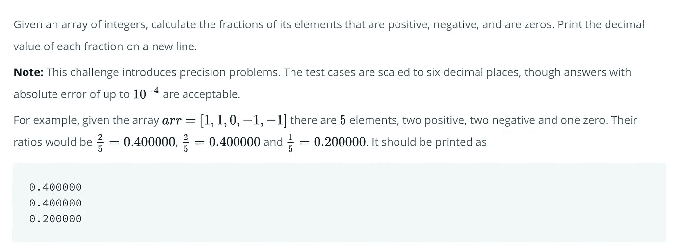
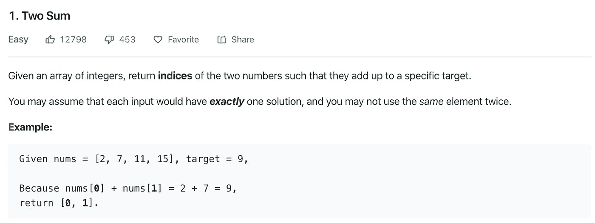
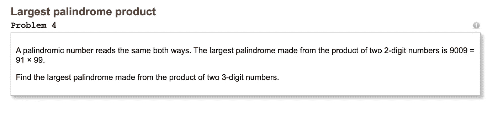
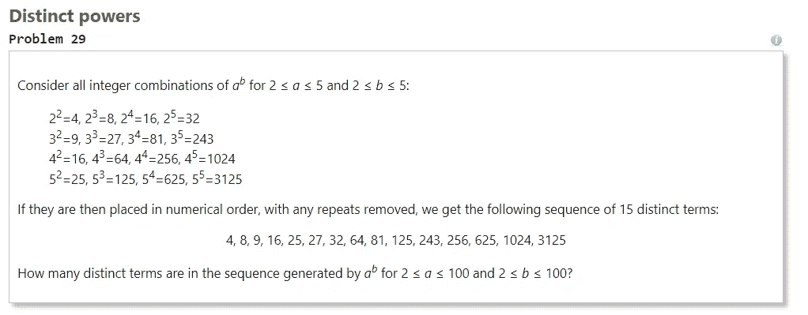
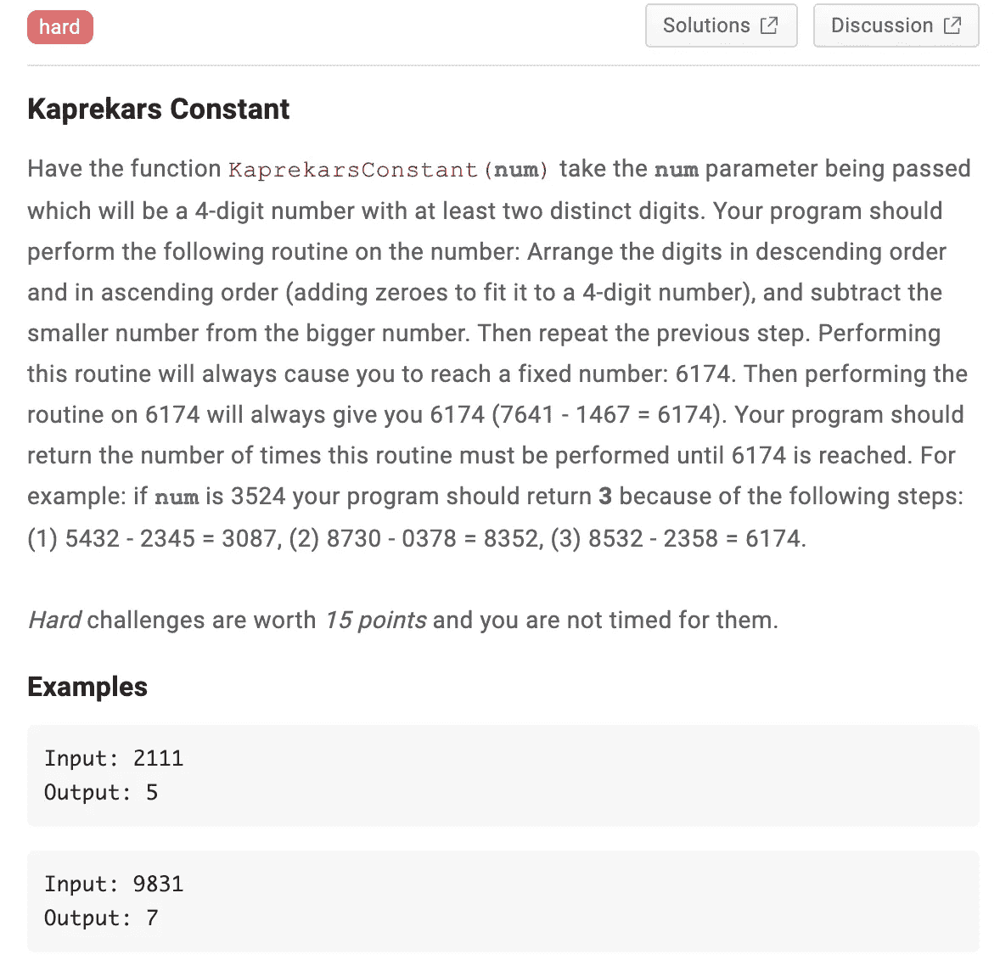
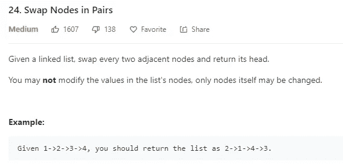
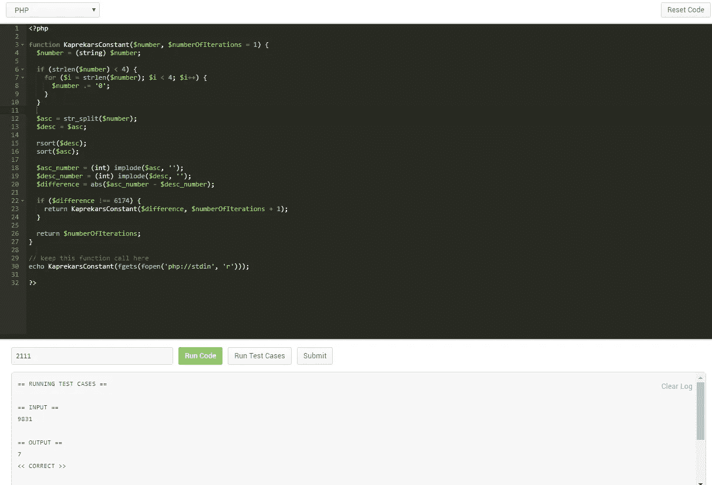
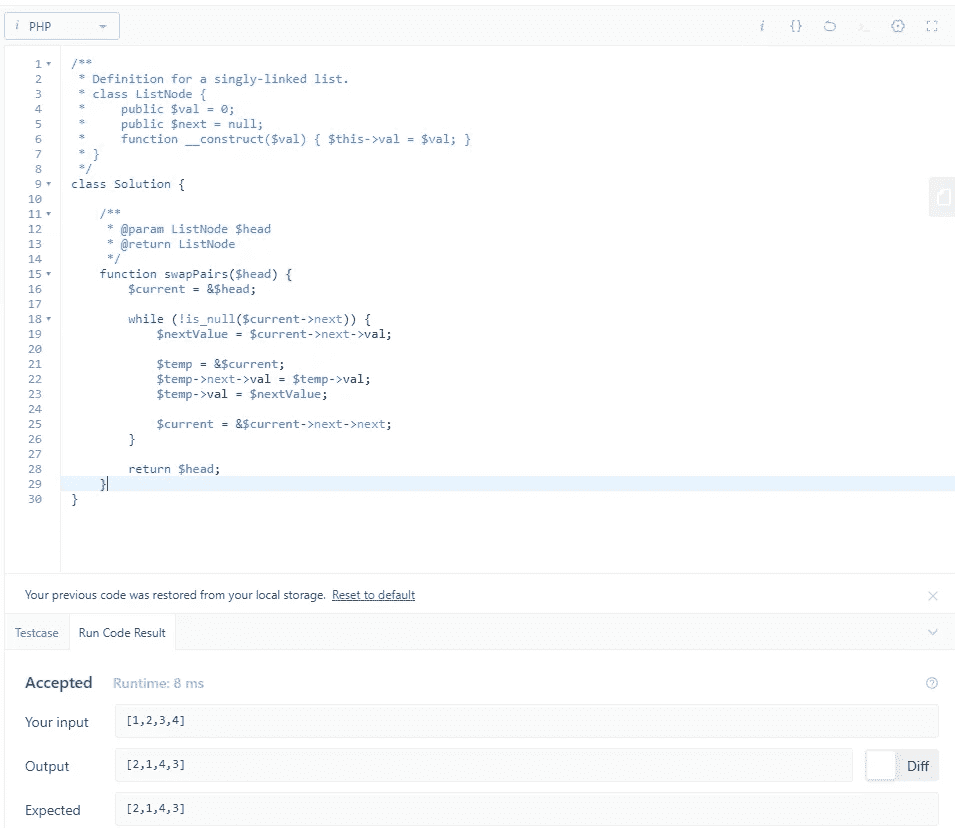

# 你知道如何解决这些编程问题吗？

> 原文：<https://betterprogramming.pub/do-you-know-how-to-solve-these-programming-problems-18d04defc05e>


照片由[弗莱彻·普莱德](https://unsplash.com/@fletcher_pride?utm_source=medium&utm_medium=referral)在 [Unsplash](https://unsplash.com?utm_source=medium&utm_medium=referral) 上拍摄

## 你能理解他们吗？

编程是为了解决问题。在这篇文章中，我列出了来自几个包含编程问题的站点的六个编程问题。这个列表中的问题是根据它们解决的难易程度来排序的——列表中的第一个问题是最容易解决的，第六个问题是最难解决的。你能理解他们吗？

我在本文末尾提供了这些编程问题的解决方案，用 PHP 编码。您可以选择自己喜欢的编程语言来解决这些问题。

祝你解决这些问题好运，祝你编码愉快！

# 挑战

## 1.正负

让我们从 [HackerRank](https://www.hackerrank.com/) 提供的一个相对简单的问题开始。这个挑战被归类为热身。



## 2.两个总和

这个挑战被认为很简单，由 [LeetCode](https://leetcode.com/problems/two-sum/) 提供。



## 3.最大回文乘积

这个问题是由[项目欧拉](https://projecteuler.net/problem=4)提供的，被认为是比较容易的问题之一。目前已有超过 45.5 万人解决了这个问题。

这就是问题所在:



## 4.不同的权力

来自[项目欧拉](https://projecteuler.net/problem=29)的另一个挑战。这个问题比上一个问题稍微难一点。大约有 10 万人解决了这个问题。



## 5.卡普雷卡尔常数

如果你已经做到了这一点:祝贺你！是时候开始第一次硬挑战了。此挑战由 [Coderbyte](https://www.coderbyte.com/editor/Kaprekars%20Constant:JavaScript) 提供。



## 6.成对交换节点

绝对是目前为止最艰难的挑战，这个挑战是由 [LeetCode](https://leetcode.com/problems/swap-nodes-in-pairs) 提供的。虽然它被认为是中等难度，但我发现这个问题比 Kaprekars 常数更难解决。这需要你知道链表是如何工作的。

但是，我们不要谈太多细节——挑战在这里:



# 解决方法

## 1.正负

这是一个非常大的问题，可以帮助你找到一个非常简单的解决方案。

```
<?phpfunction getFractionals($numbers) {
 $length = count($numbers);
 $results = [
  'positive' => 0,
  'negative' => 0,
  'zero' => 0,
 ];

 for ($i = 0; $i < $length; $i++) {
  if ($numbers[$i] < 0) {
   $results['negative'] += 1; 
  } else if ($numbers[$i] > 0) {
   $results['positive'] += 1; 
  } else {
   $results['zero'] += 1; 
  }
 }

 return [
  $results['positive'] / $length,
  $results['negative'] / $length,
  $results['zero'] / $length  
 ];
}print_r(getFractionals([1, 1, 0, -1, -1])); // [0.4, 0.4, 0.2]
print_r(getFractionals([-4, 3, -9, 0, 4, 1])); // [0.5, 0.3333, 0.16667]
```

## 2.两个总和

虽然这个问题比第一个问题稍微难一点，但是你应该不会有太多的困难来解决这个问题。我使用了一种简单的暴力方法。

```
<?phpfunction twoSum($numbers, $target) {
  for ($i = 0; $i < count($numbers); $i++) {
    for ($j = $i + 1; $j < count($numbers); $j++) {
      if ($numbers[$j] + $numbers[$i] === $target) {
        return [$i, $j];
      }
    }
  }
}print_r(twoSum([2, 7, 11, 15], 9)); // [0, 1]
print_r(twoSum([2, 7, 11, 15], 17)); // [0, 3]
```

## 3.最大回文乘积

我想出的解决方案有一个优点，它可以用来寻找最大的回文，它是任意两个数字的乘积。

我还添加了停止条件，以避免不必要的额外循环。

```
<?phpfunction isPalindrome($number) {
  return (string) $number === strrev((string) $number);
}function getBiggestPalindrome($digits) {
  $start = pow(10, $digits) - 1;
  $max = 0;for ($i = $start; $i > 0; $i--) {
    if ($i * $start <= $max) {
      break;  
    }for ($j = $start; $j > 0; $j--) {
      $product = $i * $j;if ($product < $max) {
        break;  
      }if ($product > $max && isPalindrome($product)) {
        $max = $product;
      }
    }
  }return $max;
}echo getBiggestPalindrome(2); // 9009
echo getBiggestPalindrome(3); // 906609, which is 993 * 913
```

## 4.不同的权力

我通过走蛮力路线解决了特异功能问题。

将每个结果添加到数组中，然后从数组中删除重复的结果。最后一步是对数组进行排序。

```
<?phpfunction distinctPowers($min, $max) {
 $numbers = [];

 for ($i = $min; $i <= $max; $i++) {
  for ($j = $min; $j <= $max; $j++) {  
   $numbers[] = pow($i, $j);
  }
 }

 $unique_numbers = array_unique($numbers);
 sort($unique_numbers);

 return $unique_numbers;
}echo print_r(distinctPowers(2, 5), 1); // [4, 8, 9, 16, 25, 27, 32, 64, 81, 125, 243, 256, 625, 1024, 3125]
echo print_r(count(distinctPowers(2, 100)), 1); // 9183 distinct terms
```

## 5.卡普雷卡尔常数

Kaprekars 常数问题比较难解决。这是列表中第一个需要递归来解决的问题。

```
function KaprekarsConstant($number, $numberOfIterations = 1) {
  $number = (string) $number;

  if (strlen($number) < 4) {
    for ($i = strlen($number); $i < 4; $i++) {
      $number .= '0';
    }
  }

  $asc = str_split($number);
  $desc = $asc;

  rsort($desc);
  sort($asc);

  $asc_number = (int) implode($asc, '');
  $desc_number = (int) implode($desc, '');
  $difference = abs($asc_number - $desc_number);

  if ($difference !== 6174) {
    return KaprekarsConstant($difference, $numberOfIterations + 1);
  }

  return $numberOfIterations; 
}echo KaprekarsConstant(2111); // 5
echo KaprekarsConstant(9831); // 7
```



通过所有测试用例的截图

## 6.成对交换节点

这个我花了一段时间才弄明白。我的解决方案中的诀窍是通过引用而不是通过值来传递变量。不过，这可能需要一段时间才能让你明白。

```
function swapPairs($head) {
    $current = &$head;

    while (!is_null($current->next)) {
        $nextValue = $current->next->val;

        $temp = &$current;
        $temp->next->val = $temp->val;
        $temp->val = $nextValue;

        $current = &$current->next->next;
    }

    return $head;
}
```



# 想自己解决更多编程问题？

如果你喜欢解决这些问题，去我在这篇文章中提到的一个网站。大多数网站提供大量免费的挑战，你可以尝试解决。

*   [LeetCode](https://leetcode.com/)
*   [项目欧拉](https://projecteuler.net/)
*   [黑客排名](https://www.hackerrank.com/)
*   [代码字节](https://www.coderbyte.com/)