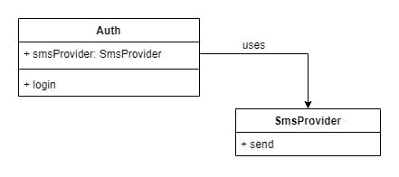
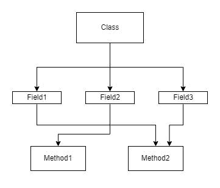
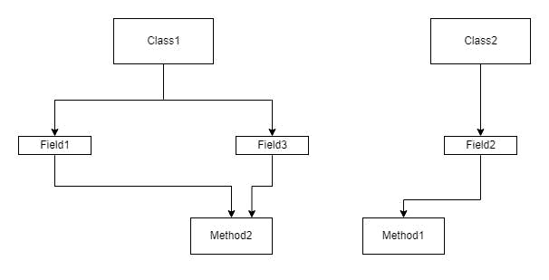

# 你真的知道什么是单一责任吗？

> 原文：<https://betterprogramming.pub/do-you-really-know-what-is-single-responsibility-5e5d9d59ea58>

## 单一责任原则很难遵循，但是为什么呢？让我们深入研究一下。

图片来自 [Freepik](https://www.freepik.com/free-vector/time-management-businessman_4663532.htm)

# 介绍

我相信每个开发人员都应该熟悉坚实的原则。坚实的原则由五个目标相同的原则组成:编写可理解的、可读的、可维护的和可测试的代码，尤其是许多开发人员可以合作开发的 OO 风格的代码。

SOLID 是一个有用的缩写词，你可以用它来记住五个基本原则:

*   单一责任原则
*   [开闭原理(OCP)](/open-closed-principle-the-hard-parts-34f142b64bc2)
*   [利斯科夫替代原理(LSP)](/liskov-substitution-principle-isnt-complex-just-give-it-a-try-d4f84093ca5f)
*   接口隔离原则(ISP)
*   从属倒置原则

# 我应该在何时何地使用坚实的原则？

在深入第一个原则之前，我们先了解一下什么是 PDD。

PDD 是痛苦驱动的开发。这意味着您应该尽可能简单地编写代码来解决特定的问题，而不是担心是否可靠。因为预先应用固体是不成熟的优化。

相反，随着应用程序的增长，在代码中寻找应用程序难以使用的地方。这种痛苦可能是由于耦合、许多重复或测试困难。

当你到达那里时，看看你是否可以应用任何可靠的原则来改进你的设计并减轻这种痛苦。

在本文中，让我们从坚实的第一原则，单一责任原则(SRP)开始。

# 什么是单一责任原则？

罗伯特·c·马丁(鲍勃大叔)将单一责任原则定义为:

> "每个软件模块应该有且只有一个改变的理由."

你可以认为这个定义很容易实现。或者对比一下，你可以想到一些问题比如模块到底是什么？改变的理由是什么？它和责任有什么关系？

老实说，这个定义对我来说非常棘手。我总是在想这些问题。所以我写这篇文章来分享我遵循这个原则的方法。

好的，首先你可以把一个模块想象成一个函数、类、组件，甚至是微服务。

为了更好地理解这个原则，我们必须记住另外两个原则，封装和委托。但是为什么呢？

我想我们都同意，我们越能区分一个类做什么和如何做，我们的软件设计就越好。这种分离可以使用封装和委托来完成。

一个类应该封装以特定的方式完成特定的任务。而当这个类是一个单一用途的时候，它完美地做到了这个目的，我们就可以轻松地使用它。

或者一个类可以将一个特定的任务委托给另一个类的实例，后者以抽象的方式封装了这个任务。

另一方面，当一个类是多用途的时候，它经常会把不应该相关的东西耦合在一起，使它更难使用。

作者的封装和委托

如您所见，`Auth`类有一个方法`login`,负责其业务逻辑，并在用户登录后向其发送短信。`Auth`类将 SMS 任务发送给另一个类`SmsProvider`，后者封装了它的实现，而`Auth`类不知道`SmsProvider`是如何实现的。

# 责任是什么？而改变的理由呢？

责任是如何做某事的问题的答案。

代码级别的职责可能是数据持久性、日志记录、验证、第三方集成或业务逻辑本身。分布式系统级别可能是缓存、消息队列、代理或负载平衡器。

SRP 建议每个模块都有一个改变的理由和一个责任。这些职责中的每一项都可能在未来发生变化。例如，数据持久性可以从文件更改为数据库，或者从一个数据库更改为另一个数据库。验证标准可能会改变。测井工具可以更换。商业逻辑通常是变化的。缓存类型可能会改变。或者可以更改消息队列工具。

是的，定义责任和改变的原因是棘手的。因此，您必须意识到任何可能违反代码中 SRP 的潜在变更请求。这些要求是改变的原因。它们可能是你的经理的要求，甚至是你认为的改进。

您对这些要求了解得越多，您就越能区分您的决策并完美地应用 SRP。

# 我们应该在多大程度上应用 SRP？

不幸的是，遵循 SRP 听起来容易做起来难。

一些开发人员将 SRP 发挥到了极致，只用一种方法创建了一个类。当他们编写实际代码时，他们必须注入许多类，使得代码更加复杂和不可读。

你不应该过分简化你的代码。你必须在常识中使用 SRP。如果只用一种方法创建每个类，没有任何好处。既然如此，为什么类会存在，为什么不回到过程化编程呢？

您必须在代码的过于简单和过于复杂之间定义一个平衡点。该点可以定义为:

*   问问自己，“这个模块的职责是什么？”。如果你的答案中有“和”这个词，你很可能违反了 SRP。
*   问问你自己，“改变这个模块的潜在原因是什么？”。如果您有许多相互不相关的原因，您可能违反了 SRP，并且您的模块是低内聚和紧耦合的。

照片由[丹·丹尼斯](https://unsplash.com/@cameramandan83)从 [Unsplash](https://unsplash.com/photos/9ycXTLGNMro) 拍摄

# SRP 与耦合、内聚和关注点分离的关系

SRP 与耦合的概念密切相关。当一个类执行许多不相关的细节时，这些细节是紧密耦合的。一个类的细节越多，改变的理由就越多。

一个松散耦合的类负责一些较高级别的关注点，并委托给其他类负责如何为这些关注点执行较低级别的操作的细节。这向我们介绍了另一个原则，关注点分离。

关注点的分离意味着一个程序应该被分成几个部分。每个部门都必须处理一个问题，并且不应该知道另一个部门如何完成特定的任务。

遵循关注点分离的一个关键好处是，高级代码不必处理低级代码，也不知道低级细节是如何实现的。

另一个与 SRP 密切相关的概念是凝聚力。内聚是指模块元素之间的关系有多强。一个模块的职责越多，它的元素之间的内聚力就越低。

看一下这个例子可以更好的理解这些原理，`Class`有三个字段和两个方法。`method1`只使用`field2`，不使用其他字段。`method2`使用`field1`，`field3`不使用`field2`。

紧密耦合和低内聚

这个图描述了`Class`可能是紧密耦合的，低内聚的，并且没有分离它的关注点。所以让我们试着用这些原则来重构它:

松散耦合和高内聚

现在，我们可以说`Class1`和`Class2`是高度内聚的，松散耦合的，关注点被完美分离。

# 我们为什么要应用 SRP？

现在，我们知道何时何地应该使用 SRP，但是我们为什么要自寻烦恼地应用它呢？

应用 SRP 有很多好处:

1.  我们知道需求会随着时间而变化。每个变化都会影响至少一个班级的责任。你的班级承担的责任越多，你改变的理由就越多。
2.  单一用途的模块更容易阅读、解释和理解。你可能还记得，当你不得不重构一个大类时，你感到多么沮丧。
3.  当然，分离的模块比许多负责的模块更加灵活和可配置。如果你有一个很大的类，并且想要添加一个新的特性或者使一个特性可配置，是的，你可以在类本身中做这些，但是只能通过增加类的大小和复杂性。
4.  单个负责的模块可能比许多负责的模块更容易重用。您可能会注意到，只有一个目的的方法很可能没有副作用，并且不依赖于类状态。是的，你想的没错。这是函数式编程。SRP 将我们推向函数式编程风格。
5.  测试和维护单一用途的模块要容易得多。
6.  只有一个目的的类和方法有助于容易地调查性能问题。更值得注意的是，在分布式系统中，只有一个目的的服务更容易监控负载和资源瓶颈，因此，可以独立地伸缩。
7.  如果你的类依赖于一个或多个类，这个类的任何变化都会影响它的依赖关系。您可能需要更新这些依赖项或重新编译它们，即使它们不会直接受到您的更改的影响。

来自 [Unsplash](https://unsplash.com/photos/-M_f3f8DGRg) 的 Nadine Shaabana 的照片

# 我确信，我会随时随地使用 SRP

在此之前，请记住以下几点:

1.  在分布式系统的层次上，你构建的服务越多，你得到的可靠性就越低。是的，有很多方法可以克服这一点，但你必须记住，每件事都有时间、精力和金钱的成本。
2.  正如我们所知，分离关注点会增加代码的大小，以及编写代码所需的精力和时间。然而，从长远来看，它减少了努力和时间。
3.  事实上，在代码中分离关注点会影响整体性能。然而，这一点在代码层面上可以忽略，但在分布式系统层面上，它影响很大。许多服务通过更高的延迟和网络问题直接影响系统性能。

# 让我们将 SRP 应用到一个例子中

让我们来介绍一个简单的例子，这个例子介绍了一个有很多原因需要更改的类，然后尝试对它应用 SRP。

首先，让我们进行调查并问自己:

*   这个班的职责是什么？你可能会说它只注册了一个用户。另一个可能更深入，说它负责日志记录、验证和持久性。好吧，如果你对识别感到困惑，那就跳到下一个测试。
*   改变这个类的潜在原因是什么？我想我们都同意我们可以改变日志记录机制、验证标准或者持久性方法，对吗？所以我们有很多理由去改变这个阶级。因此，重构您的类并应用 SRP 可能是一个警告。

结果。让我们牢记 SRP 来重构这个例子。

正如你所看到的，这个版本比以前的版本有更多的代码。没错，但是重构后的版本更容易测试、维护、更新和阅读。现在`Auth`类，也就是更高层的代码，不知道更低层的代码是怎么实现的。它只委托其他类封装它们的实现来完成特定的任务。

# 结论

归根结底，单一责任原则至关重要。但是使用的时候要小心。使用它只是为了在编写一些工作代码后通过改进您的设计来消除痛苦。不要过度简化你的代码。

SRP 帮助您实现高内聚、松散耦合和关注点分离。

最后，让你的模块尽可能的小和简单。给他们一个责任和一个改变的理由。这简化了您的可测试性、可维护性和可读性。

非常感谢你陪我到现在。我希望你喜欢阅读这篇文章。

如果你觉得这篇文章有用，看看下面这些:

*   [开合原理:硬部件](/open-closed-principle-the-hard-parts-34f142b64bc2)
*   [利斯科夫替代原理并不复杂。试一试吧](/liskov-substitution-principle-isnt-complex-just-give-it-a-try-d4f84093ca5f)
*   [策略 vs 状态 vs 模板设计模式](https://medium.com/illumination/strategy-vs-state-vs-template-design-patterns-29f187b0249b)
*   [Javascript 中处理异步操作的 4 种方法](https://javascript.plainenglish.io/4-ways-to-handle-async-operations-in-javascript-266ab51d8166)

# 资源

*   [c#开发人员的坚实原则](https://app.pluralsight.com/library/courses/csharp-solid-principles/table-of-contents)
*   [固体设计原则解释:单一责任原则](https://stackify.com/solid-design-principles/)
*   [单项责任原则解包](https://reflectoring.io/single-responsibility-principle/)

*最初发表于*[*【https://blog.mayallo.com】*](https://blog.mayallo.com/do-you-really-know-what-is-single-responsibility)*。*