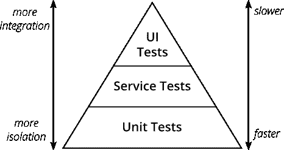

# 你的团队里还有 QA 工程师吗？

> 原文：<https://betterprogramming.pub/do-you-still-have-qa-engineers-on-your-team-65523bb0512f>

## 探索质量保证在现代软件开发中的作用

照片由 [Unsplash](https://unsplash.com?utm_source=medium&utm_medium=referral) 上的[agency followeb](https://unsplash.com/@olloweb?utm_source=medium&utm_medium=referral)拍摄

# 什么是质量保证？

《软件测试帮助》将质量定义为“满足需求和期望的东西”，将保证定义为“对产品或服务信心的积极声明”。当我们将两者结合起来时，我们得到了一个极好的定义:“QA 是一个关于服务质量或产品质量的积极声明，给人以信心。"

> 根据，*“软件质量保证(SQA)是一种监控软件工程过程和方法在项目中使用的手段和实践，以确保软件的适当质量。”*

软件质量保证一直是 SDLC 不可或缺的一部分。测试和 QA 的概念经受住了时间的考验，因为它从顺序(瀑布)开发风格过渡到迭代(敏捷，看板)开发风格。

我们都同意软件质量和交付一样重要，你不应该在这一点上妥协。最好和最受欢迎的产品和服务提供卓越的质量。它们从竞争中脱颖而出，这意味着您交付的代码没有缺陷、性能或 UI 问题。高质量的产品/服务会赢得客户的信任，并带来好评和购买意愿。

# QA 角色的演变

关于 QA 工程师和测试工程师之间的区别有一个长期的争论。我不打算深入讨论这个问题，因为每个组织都是不同的。我见过这两种角色互换使用的情况，人们同时扮演两种角色。对于本文，我不做区分，下面提到的几点对两者都有意义。

## 传统软件开发和手工测试时代

项目曾经是瀑布式的，预先收集了一组需求。每一个变化都被预先计划好的活动所反对。测试人员将接受需求，编写测试用例，并等待开发团队完成编码。一旦开发阶段结束，他们将执行测试(主要是手动的)。测试人员会发现错误，修复它们，重新测试，然后这个过程继续下去，以达到要求的质量水平。

最重要的是，开发人员和测试人员的角色和职责有明确的分离。这种划分造成了质量是测试人员的责任的印象。其中一个原因是测试过程。因为它主要是手工的，所以它需要某人完全投入他们的时间和精力来测试软件，并在捕获的需求的边界内评估它。

手动过程缓慢、容易出错、不可扩展、昂贵，并且严重依赖测试人员的技能。即使有了测试用例的编写和脚本，它也依赖于坐在桌子旁边的人按下按钮并获取结果。这种方法要求您让团队中的 QA/测试人员评估您的可交付产品的质量，并防止生产中出现问题。

## 现代软件开发和自动化测试的兴起

随着敏捷方法的出现，开发和测试之间的周转时间减少了，这就要求增加协作，并需要快速可靠地进行测试。随着时间的推移，开发人员和测试人员之间的界限开始模糊，测试在 SDLC 中转移。

成功的敏捷:使用 Scrum 的软件开发

Mike Cohen 的测试金字塔显示了测试的不同层次，并提供了每个层次测试的速度、数量和类型的方向。这个概念以最简单的方式创建了一个跨越所有软件开发角色的质量关卡。虽然它可能不适用于所有场景，但它使质量成为每个人角色的一部分。

> "品质不是一种行为，而是一种习惯."——亚里士多德

质量正成为一项共同的责任。交付的团队必须对产品的质量负责，不管个人的角色是什么。这种重心的转移催生了自动化的兴起。结合 DevOps 的力量，测试现在有了显著的不同，能够在没有人工干预的情况下一天测试多次。

在数字化和信息化的时代，计算机将接管重复性的工作，而测试是已经从中受益良多的一个领域。自动化测试(尤其是回归测试)的一致性、速度和可靠性大大减少了测试系统的时间，允许您的团队一个月部署几次(也就是几天)。

# 这是否意味着我们不需要 QA？

我知道你的第一个想法是，如果我们可以自动化，我们可以摆脱 QA 作为一种实践和角色。在您开始之前，让我们分析一下测试自动化。自动化测试很棒，但是很愚蠢，因为它们被编程为多次测试相同的东西。QAs 在分析了每个用户故事的需求和接受标准后，编写这些测试。

如果你从另一个角度来看，QAs 编写自动化代码非常接近于开发人员，除了他们处理不同的需求集。最终，他们都在编写代码来创建一个执行特定任务的系统。

自动化失败的一个领域是探索性测试。人类拥有的智力、创造力、观察力和理解力尚未完全传递给机器(可能通过 AI/ML 在某个地方发生)。不要忘记，由于项目的性质，仍然有团队依赖手工测试。

就个人而言，QA 的角色将是相关的，但是开发人员之间的界限越来越模糊。正确设计自动化测试与开发您正在测试的产品/服务一样重要。这项活动需要开发人员传统的技能和知识。

如果你是一名 QA 并拥有这一技能，你将很容易在这一转变中生存(甚至茁壮成长)。从好的一面来看，随着公司推动快速、轻松地发布，对 QA 的要求增加了，以自动化重复任务并更快地部署。

每个组织对这个话题都有不同的看法，他们的方式是正确的。一些公司已经停止雇佣 QA，将编写自动化程序的责任推给了开发人员；其他人有专职的 QA 负责开发自动化。

我觉得归结为一点:你会写代码吗？如果可以的话，现在和将来都有很多机会。总会有测试的角色，尽管自动化的角色比手工的角色多得多。

感谢阅读！

我希望你喜欢这篇文章。