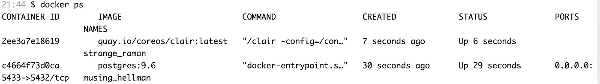
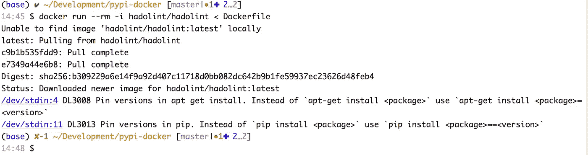

# Docker 最佳实践和反模式

> 原文：<https://betterprogramming.pub/docker-best-practices-and-anti-patterns-e7cbccba4f19>

## 如何构建生产就绪容器


照片由[马修·邝](https://unsplash.com/@mattykwong1?utm_source=unsplash&utm_medium=referral&utm_content=creditCopyText)在 [Unsplash](https://unsplash.com/s/photos/premier?utm_source=unsplash&utm_medium=referral&utm_content=creditCopyText) 上拍摄

使用 Docker 的大部分时间，我们并没有关注它的内部工作方式。仅仅因为你启动了 Docker 容器并且你的应用程序正在运行，并不意味着你已经实现了一个好的解决方案。有时，由于时间限制，我们陷入了复制粘贴 Docker 图像的陷阱，而没有理解实现细节和它是如何构建的细微差别。

在本文中，我们将研究 Docker 最佳实践和反模式。反模式是对一个重复出现的问题的常见反应——当我们实现无效且适得其反的解决方案时，会破坏我们的 Docker 堆栈。

让我们跳进去看看我们可能做错的一些事情。

# 我们需要那些标签

标签是必须的，可以让你传达关于你的 Docker 图片的有用信息。将标签视为 docker 图像 ID 的别名。它们可以与 Git 标签相比较，后者指的是您历史中的一个特定提交，允许您在不同的时间点对 Docker 映像进行版本控制。忘记标记是一件小事，但也有一些缺点。也就是说，如果没有指定标签，默认图像将使用最新的标签。

```
FROM your_image_name:latest
```

如果您经常这样做，您的图像可能实际上不是最新的，而可能引用的是旧版本。总是使用适当的标签并遵循版本化模式，比如[语义版本化](https://semver.org/)。这确保了 Docker 映像的用户可以保证兼容性，保持更新，并按预期使用正确的版本。

还有一件事你可能想避免。最新的默认标签是在 Dockfile 中使用`FROM python3:latest`从 Docker 注册表中获取最新的图像。乍一看，这似乎是一个好主意，但有一些意想不到的副作用——每次最新的拉可能会产生一个与前一次构建完全不同的 Docker 映像。试图解释是什么破坏了你的码头工人形象可能很难，因为从你的角度来看，你期望不变性。因此，有一个很好的例子来为一个图像使用一个特定的标签(例如:`python3:1.0.1`)。这将确保您的 docker 文件保持不变。

# 在同一个容器中运行多个服务

是的，无论如何，你可以做到这一点——很可能成功——但这是你可能不想走这条路的几个原因。当我们与码头服务公司合作时，单一责任是我们应该努力的目标。最佳实践是，组成您的应用程序的每个不同的服务都应该在它自己的容器中运行——无论如何，尝试将每个独立的功能打包到单独的独立容器映像中。

向一个 Docker 映像添加多个服务可能很诱人——但是也应该放弃将容器映像视为虚拟机的想法。在一个容器中包含多个服务会使应用程序难以水平扩展。Docker 容器的一个核心概念是它们是瞬态的，并且是为分发而设计的，这是现代 web 应用程序的理想选择，在现代 web 应用程序中，瞬态特性简化了伸缩性和并发性。添加多个服务增加了管理这种分布的难度。

此外，单个容器上的多个服务增加了管理安全性的难度。膨胀的图像大小可能会降低 CI/CD 的速度，如果您担心这一点的话。Docker [文档在进一步阐述这一点上做了很好的工作。](https://docs.docker.com/config/containers/multi-service_container/)

# 使用`LABEL to Catalog your Images`

这绝不是反模式，但我认为它值得一提。我在处理各种 Docker 图像时注意到的一件事是，有时这些图像的创建者没有`LABEL maintainer`标签。这个标签在事件中设置图像的`Author`字段——当事情出错或你需要澄清时，如果图像被公开共享，就更容易知道联系内部或外部的谁。

这绝不是你唯一可以用的标签。您可以根据需要定义各种标签，以对图像进行分类、记录许可信息或对自动化有用的标签。

除`maintainer`以外的多行标签:

```
# Set one or more individual labels
LABEL com.example.version="0.0.1-beta"
LABEL vendor1="RBTSB Incorporated"
LABEL vendor2=TIPTAPCODE\ Incorporated
LABEL com.example.release-date="202-04-02"
LABEL com.example.version.production="0.0.1"
```

docker 1.10 之前的单行标签会创建新的 Docker 层，因此如果您使用最新的 Docker 版本，您不必担心开销层。

```
LABEL vendor=ACME\ Incorporated \
      com.example.is-beta= \
      com.example.is-production="" \
      com.example.version="0.0.1-beta" \
      com.example.release-date="2015-02-12"
```

为了可追溯性、可见性和可维护性，向不可变的 Docker 图像中添加尽可能多的元数据总是一个好的做法。

# 避免构建特定于环境的图像

当我们构建 Docker 图像时，我们应该始终牢记不变性。不要使用标记为开发、测试、试运行和生产的不同映像，这是一个很好的实践，因为这违反了单一真实来源的原则。另一个问题是，在不同的环境中执行验证或调试时，无法保证映像在本质上是相似的。

# 为什么使用非根容器？

默认情况下，Docker 容器作为`root`运行。以 root 用户身份运行的 Docker 容器可以完全控制主机系统。出于安全考虑，这是不希望的。使用非根运行的 Docker 容器映像增加了一层额外的安全性，通常推荐用于生产环境。然而，因为它们作为非根用户运行，特权任务通常是禁止的。如果需要利用`USER`指令来指定非 root 用户，您需要进行一些上下文切换，如下例所示。

```
FROM python:3.6-slim-buster
LABEL maintainer="Timothy Mugayi <timothy.mugayi@gmail.com>"RUN apt-get update && apt-get install -y --no-install-recommends \
    wget && rm -rf /var/lib/apt/lists/*# Dumb init
RUN wget -O /usr/local/bin/dumb-init [https://github.com/Yelp/dumb-init/releases/download/v1.2.0/dumb-init_1.2.0_amd64](https://github.com/Yelp/dumb-init/releases/download/v1.2.0/dumb-init_1.2.0_amd64)
RUN chmod +x /usr/local/bin/dumb-initRUN pip install --upgrade pipWORKDIR /usr/src/appCOPY requirements.txt .RUN pip install -r requirements.txtCOPY helloworld.py .USER 1001ENTRYPOINT ["/usr/local/bin/dumb-init", "python3", "-u", "./helloworld.py"]
```

如果您使用的基本映像不是使用 root 生成的，并且您必须切换回来，您可以执行以下操作:

```
FROM <namespace>/<image>:<tag_version>
USER root
```

# 不要在一个容器中运行太多的进程

容器的美妙之处——也是容器相对于虚拟机的优势——在于为了组成一个完整的应用程序，很容易让多个容器相互交互。不需要在一个容器中运行完整的应用程序。相反，尽可能将您的应用程序分解成离散的服务，并将服务分布在多个容器中。这最大限度地提高了灵活性和可靠性。

是的，在一个容器中安装和运行一个完整的 Linux 操作系统是可能的。但是你应该这样做吗？

这可能不是个好主意。Docker 图像是用层的概念构建的，所以你添加到图像中的东西越多，它就越臃肿。一个成熟的操作系统会使 Docker 的理想用例失效。理想情况下，只安装容器中必需的基本组件。

为了充分利用容器，你希望每个容器都尽可能的精简。这最大限度地提高了性能，最小化了安全风险。因此，避免运行并非绝对必要的服务。例如，除非在容器内部运行 SSH 服务是绝对必要的，否则不要包含 SSH 服务，因为有其他方法可以登录到容器，比如 Docker exec 调用。

# 不要在容器中运行不必要的服务

当使用 Docker 时，有一种趋势是用 sonar 之类的工具来扩大我们的图像，以覆盖代码。

使用构建器模式 [Docker 多阶段构建](https://docs.docker.com/engine/userguide/eng-image/multistage-build/)——从 Docker CE 17.05+开始，您现在能够在一个 Docker 文件中拥有多个`FROM`阶段。短暂的构建器阶段容器将被丢弃，因此最终的运行时容器映像将是精简的。一个实际的用例是，当你需要从源文件编译一些二进制文件，然后在第二个数据上，将这些精简的二进制文件复制到你的最终映像。

## **衍生利益**

*   构建速度更快，也就是说，您的 CI/CD 流程可以通过更精简的映像进行改进，并且通过网络传输所需的时间也更少。
*   需要更少的存储空间。
*   冷启动(镜像拉动)更快。
*   潜在的攻击面更小。

## **弊端**

*   容器内的工具更少，但保持容器精简的代价很小。

# 在容器中包含 Oberservablity 工具

您可以在没有监控解决方案的情况下运行容器，但是您需要记住的是，您很难知道容器内部发生了什么——尤其是随着容器数量的增加。

Docker 开箱即用，通过 Docker 的远程 API 的/stats 端点，展示了每个运行容器的 CPU、内存、网络和 I/O 使用情况的非常详细的指标。举两个例子，App dynamics 和 Newrelic 都有现成的代理，可以与您的 Docker 映像预先打包在一起，为您提供更多的可见性，包括应用程序级的可见性，以了解您的应用程序和容器的执行情况。

# 爱恨随意的贱像

> “说真的，你知道是谁建立了这个图像，它被添加了什么吗？”

这都是关于可追溯性的。牢记安全性是所有软件开发人员都应该努力去做的事情。了解如何追踪 Docker 图像的来源并理解其内容。]

有几件事你需要记住:

*   图像是如何创建的。
*   验证它在创建后没有被更改。
*   验证图像的内容。
*   扫描安全漏洞。

有一些工具可以对容器进行静态分析。它们非常全面，远远超出了本文的范围，但是我建议您花一些时间来了解它们是如何工作的。

[Clair](https://github.com/coreos/clair) 是一个有趣的工具，它为你的 Docker 应用程序提供自动的容器漏洞和安全扫描。扫描基于通用漏洞和暴露(CVE)数据库。如果你在本地运行 Docker，你可以下载 Postgres 并链接 Clair 到它。下面是启动并运行该系统所需的最低配置:

```
$ mkdir $PWD/clair_config$ curl -L [https://raw.githubusercontent.com/coreos/clair/master/config.yaml.sample](https://raw.githubusercontent.com/coreos/clair/master/config.yaml.sample) -o $PWD/clair_config/config.yaml$ docker run -d -e POSTGRES_PASSWORD="" -p 5432:5432 postgres:9.6$ docker run --net=host -d -p 6060-6061:6060-6061 -v PWD/clair_config:/config quay.io/coreos/clair:latest -config=/config/config.yaml
```

如果您希望更改 Postgres 的端口，请确保您也更改了`config.yaml`文件。如果您的系统上已经运行了另一个`Postgres`，注意不要将 docker 端口改为 5432 以外的端口。

```
clair:
  database:
    *# Database driver* type: pgsql
    options:
      *# PostgreSQL Connection string
      #* [*https://www.postgresql.org/docs/current/static/libpq-connect.html#LIBPQ-CONNSTRING*](https://www.postgresql.org/docs/current/static/libpq-connect.html#LIBPQ-CONNSTRING)source: host=localhost port=5432 user=postgres password=123456 sslmode=disable statement_timeout=60000
```

一旦您的映像启动并运行，您就可以运行 Docker ps 来确保您的容器启动并运行



现在您已经了解了这一点，您需要知道 Clair 没有 web UI 或 CLI——使用它的唯一方法是通过它的 REST API 或第三方 CLI 工具。为了让你上路，在这里查看更多细节——如何使用 Clair 超出了本文的范围。

Bayan [Collector](https://github.com/banyanops/collector) 是一个轻量级应用程序，它允许您通过从注册表启动容器来执行[静态分析](https://searchwindevelopment.techtarget.com/definition/static-analysis)，运行任意脚本并收集有用的信息(例如，安装的包)，执行策略，验证映像中的不变量。更多细节请参见 GitHub 资源库。

[Docker Bench for Security](https://github.com/docker/docker-bench-security) 是 Docker 团队开发的一款工具，它可以在 Docker 主机上运行一份安全最佳实践清单，并标记它发现的任何问题。更多细节请参见 GitHub 资源库。

# 不要在容器映像中存储敏感数据

这是你想要避免的错误。如果您的 Docker 图像被公开共享，或者如果开发人员无意中将图像推送到公共 Docker 注册表，这可能会导致私人和敏感信息泄露给外界。你不应该在 docker 文件中对敏感信息使用`COPY`或```。

为了避免这种情况，请将敏感数据存储在容器可以连接的安全文件系统中。在大多数情况下，该文件系统将存在于容器主机上，或者通过块存储(如 [AWS 弹性块存储(EBS)](https://cloudacademy.com/course/aws-storage-fundamentals-2016/amazon-elastic-block-store-ebs-1/) )或对象存储服务(如 S3)可用。

此外，您应该避免在 Docker 映像中存储安全凭证。作为开发人员，我们有时倾向于走捷径，硬编码密码和密钥。养成在运行时使用 e-arguments 为 Docker 容器指定环境变量的习惯。

利用`on — env-file`，它也可以用来从文件中读取环境变量。通过`CMD`或`从第三方来源获取凭证的定制脚本也可以用于获取 docker 容器所需的相关凭证。

# 不要在容器中存储数据或日志

集装箱化改变了伐木的性质。容器是本质上短暂的无状态应用程序的理想选择，也就是短暂的。任何可能存储在运行中的容器中的数据本质上都是短暂的——正如您可能已经注意到的，当容器关闭时，您的数据就会丢失。因此将数据存储在 Docker 容器之外是有意义的。有一些工具可以帮助您提取 Docker 日志，并将其放入更永久的数据存储中。

在讨论如何用 Docker 处理日志记录时要记住:一个 Docker 安装至少有三个不同的日志记录级别；即 Docker 容器、Docker 服务和主机操作系统；您选择的日志记录方法应该能够提取所有层的日志。

# 不要写入容器的文件系统

每次你写东西到容器的文件系统，它激活[写时拷贝策略](https://docs.docker.com/engine/userguide/storagedriver/imagesandcontainers/#container-and-layers)。使用存储驱动程序(devicemapper、overlayfs 或其他)创建新的存储层。在主动使用时，它会给存储驱动程序带来大量负载，尤其是在 Devicemapper 或 BTRFS 的情况下。

确保您的容器只向卷写入数据。您可以对小的临时文件使用`tmpfs`—`tmpfs`是驻留在内存和/或交换分区中的临时文件系统。

# 不要运行 PID 1

这是一个大多数人可能都不知道的普遍问题。

Docker 不在一个特殊的 [init 进程下运行进程，该进程正确地获取子进程](http://en.wikipedia.org/wiki/Zombie_process)，所以容器可能以僵尸进程结束，这可能导致意想不到的问题出现。

## 使用 tini 或哑初始化

PID 1 在 UNIX 中很特殊，因此省略 init 系统通常会导致进程和信号的错误处理。这可能会导致一些问题，例如无法正常停止的容器，或者泄漏本应销毁的容器。

僵死进程是指已经停止运行但其进程表条目仍然存在的进程，因为父进程没有通过 wait syscall 检索它。从技术上讲，每个终止的进程在很短的时间内都是僵尸，但它们可以存活更长时间。

[Tini](https://github.com/krallin/tini) 或者 [dumb-init](https://github.com/Yelp/dumb-init) 可以用在你有一个产生新进程的进程，但是没有实现好的信号处理程序来捕捉子信号并且在你的进程应该停止的时候停止你的子进程。例如，Bash 脚本不能正确地处理和发出信号。

下面是一个如何运行哑 init 的示例，其中`prepare.sh`是一个 shell 脚本或命令来执行您的应用程序`:

```
RUN wget -O /usr/local/bin/dumb-init [https://github.com/Yelp/dumb-init/releases/download/v1.2.0/dumb-init_1.2.0_amd64](https://github.com/Yelp/dumb-init/releases/download/v1.2.0/dumb-init_1.2.0_amd64)RUN chmod +x /usr/local/bin/dumb-initENTRYPOINT ["/usr/local/bin/dumb-init", "/usr/bin/prepare.sh"]
```

或者，如果您选择`tini`，下面是一个示例，说明如果您正在使用 Python anaconda conda，如何设置它:

```
RUN conda install --yes -c conda-forge tiniENTRYPOINT["tini", "-g", "--", "/usr/bin/prepare.sh"]
```

最后，这里有一个不依赖于任何编程语言的更通用的方法:

```
FROM node:13.12.0-slim

MAINTAINER Timothy Mugayi <timothy.mugayi@gmail.com>

ENV TINI_VERSION='v0.13.0'

# Add tini init, see https://github.com/krallin/tini
ADD https://github.com/krallin/tini/releases/download/${TINI_VERSION}/tini /tini

RUN chmod +x /tini

# Set tini as entrypoint
ENTRYPOINT ["/tini", "--"]
```

# 将 DockerFile 林挺应用到您的配置项/CD 中

显然 Docker 也有短绒——就像你的编程语言一样。

利用 linters 有很多好处，因为口头上实施最佳实践是困难的。将林挺应用到您的 CI/CD 可以帮助您的团队避免常见错误，并在构建生产 Docker 映像时建立最佳实践。一个很好的起点是利用 [hadolint](https://github.com/hadolint/hadolint) ，这是一个 Haskell Dockerfile Linter，它将您的 docker 文件解析成一个 [AST](https://en.wikipedia.org/wiki/Abstract_syntax_tree) ，并在 AST 之上执行规则。

让我们看一个例子。要使用 Docker 执行林挺，您可以执行以下操作:

```
$ docker run --rm -i hadolint/hadolint < Dockerfile
```

lint 完成后，将显示以下结果，这些结果可能会因 docker 文件的性质而异。



hadolint lint 结果

上面说明的 DL3008 代码“在 apt get install 中锁定版本”基于 hadolint 代码描述声明。版本锁定强制构建检索特定的版本，而不管缓存中有什么。这种技术还可以减少由于所需包中的意外变化而导致的失败。

# 最后的想法

我们已经涵盖了很多—从安全性到简化您的 Docker 图像。

您可以做更多的事情来使您的 Docker 图像更好、更安全。希望这篇文章能让你对应该做或不应该做的事情有所了解，以及可以开始应用于内部或外部 docker 容器和图像的可能解决方案。

感谢您的阅读，如果您有任何其他建议，请在下面留下您的评论。如果你认为这些内容对下一个开发者有用，请分享。

保持安全，快乐码头形象建设！