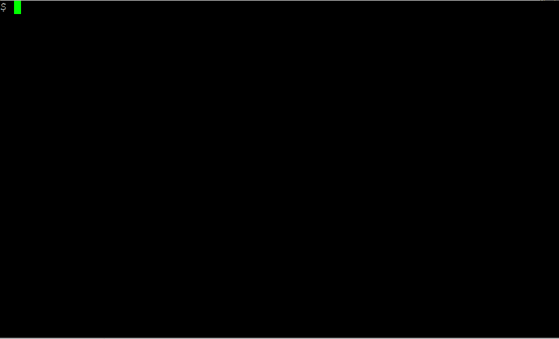
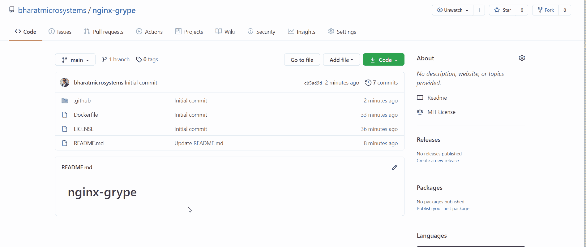

# 码头集装箱安全系统

> 原文：<https://betterprogramming.pub/docker-container-security-with-anchore-grype-6913bc926499>

## 对 CI/CD 管道中的容器映像运行漏洞扫描程序


[张家瑜](https://unsplash.com/@danielkcheung?utm_source=medium&utm_medium=referral)在 [Unsplash](https://unsplash.com?utm_source=medium&utm_medium=referral) 上拍照。

随着云和容器编排器的出现，容器变得越来越普遍。Docker 是我们使用的最流行的容器运行时之一，Docker 图像无处不在。然而，由于它是一项相对较新的技术，而且随着人们对左移的日益关注，容器安全性成了一个热门话题。

大多数企业关注运行时容器的安全性。然而，有时容器本身在构建时有一个未被专业人员发现的漏洞。

容器使用层，大多数容器都是从 Docker Hub 上提供的第三方基本映像构建的。因此，即使您的代码是安全和健壮的，您可能最终会在生产中部署一些由于易受攻击的基础映像而不应该部署的东西。

系统管理员通常在生产中强化操作系统映像，以确保您安全地运行应用程序。尽管如此，由于容器世界中的左移，这经常被开发人员忽略——我们不会责怪他们。他们知道如何很好地编码，而且他们做到了。传统上，安全是 SecOps 的责任，因此他们通常是管理安全的专家。

DevSecOps 专注于将安全性带到构建和发布自动化级别，有各种工具可用于在开发和构建周期的早期扫描漏洞。 [Anchore Grype](https://github.com/anchore/grype) 就是这样一个可以提供帮助的工具。

Anchore Grype 是一个容器漏洞扫描器，它使用一个易于安装和运行的简单 CLI 来帮助您扫描容器映像中的漏洞。最好的部分是，您可以在 CI/CD 管道中使用这个工具，并使跨越某个漏洞阈值的构建失败。

现在，让我们看看如何安装 Anchore Grype。

# 安装锚定 Grype

安装 Anchore Grype 很简单。下载最新的安装程序，并使用以下命令运行该程序以在系统路径中生成二进制文件:

```
$ curl -sSfL https://raw.githubusercontent.com/anchore/grype/main/install.sh | sh -s -- -b /usr/local/bin
```

安装 Grype 后，运行以下命令进行验证:

```
$ grype version
Application:          grype
Version:              0.7.0
BuildDate:            2021-01-28T14:03:23Z
GitCommit:            8344b8f0d3f61729cf0845c08b31f26103e21231
GitTreeState:         clean
Platform:             linux/amd64
GoVersion:            go1.14.14
Compiler:             gc
Supported DB Schema:  1
```

正如我们所看到的，Grype 已经成功地安装在我们的系统中。

现在，让我们运行一个漏洞扫描。

# 运行漏洞扫描

要运行 Docker 映像的漏洞扫描，请使用以下命令:

```
grype <image>
```

例如，如果我们想要运行 NGINX 映像的漏洞扫描，运行以下命令:



在响应中，我们获得列出的漏洞及其严重性。现在让我们在 CI/CD 管道中使用 Grype 工具。

# 在 CI/CD 管道中使用 Grype

我们将在这个活动中使用 GitHub 动作。这些操作将尝试在 NGINX 映像上运行容器构建，然后在将文件推送到容器注册表之前报告漏洞。

分叉以下 GitHub 存储库以获得一个工作示例:

```
[https://github.com/bharatmicrosystems/nginx-grype.git](https://github.com/bharatmicrosystems/nginx-grype.git)
```

如果在存储库中查找，您会看到以下 docker 文件:

```
FROM nginx
RUN echo 'This is a custom nginx image' > /usr/share/nginx/html/index.html
```

这是一个简单的 docker 文件，它获取 nginx 基本图像，并将“这是一个定制的 NGINX 图像”发送到`/usr/share/nginx/html/index.html`。因此，如果我们运行这个容器并访问它的 URL，我们将在主页上看到“这是一个自定义的 nginx 图像”。

为了构建这个容器，我们有以下 GitHub Actions 工作流文件:

构建 YAML 包括以下步骤:

*   登录 Docker Hub——它使用`secrets.DOCKER_USER`和`secrets.DOCKER_PASSWORD`变量登录你的 Docker Hub 账户。这些变量来源于 GitHub secrets，我们将在后面进行配置。
*   构建 Docker 映像—然后使用 Docker 文件构建 Docker 映像。
*   运行 Grype 漏洞扫描—它使用设置为高的失败标志对构建的映像运行 Grype 漏洞扫描。如果我们发现任何标记为高或更高的漏洞，那么构建应该会失败。
*   推送 Docker 映像——如果一切正常，它会将 Docker 映像推送至您的 Docker Hub 注册表。

要将`DOCKER_USER`和`DOCKER_PASSWORD`配置为 GitHub 机密，请访问您在 GitHub - >设置- >机密上的存储库，并配置以下两个机密:

```
DOCKER_USER=Your DockerHub username
DOCKER_PASSWORD=Your DockerHub password
```

现在，我们准备运行 CI/CD 管道。转到您的代码并编辑自述文件，以推动对 repo 的更改。然后转到 Actions 选项卡，查看正在构建的映像。



如我们所见，构建失败了。那是因为我们发现了一个严重性很高的漏洞。我们刚刚阻止了一些讨厌的东西投入生产！

您可以调整容器映像，删除包含漏洞的包，并重新构建代码。

# 结论

Anchore Grype 是一款功能强大的容器漏洞扫描器，它可以扫描 OCI 标准容器映像来查找已知的漏洞。它支持许多流行的操作系统包，如 Alpine、Busybox、CentOS / Red Hat、Debian 和 Ubuntu，还支持流行的特定语言包，如 Ruby Bundler、JARs (Java)、NPM/Yarn (JavaScript)、Egg/Wheel (Python)和 Python `pip/requirements.txt/setup.py`清单。

感谢阅读！我希望你喜欢这篇文章。