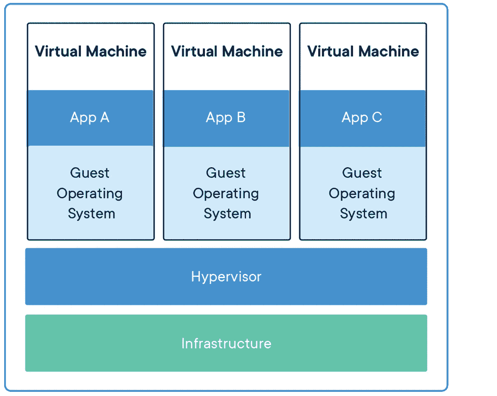
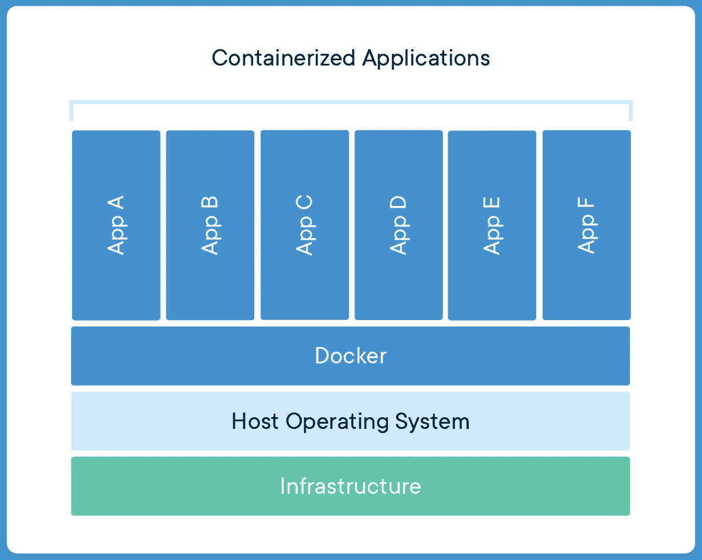

# Docker 容器与虚拟机

> 原文：<https://betterprogramming.pub/docker-containers-vs-virtual-machines-838022906016>

## 有什么区别？

我曾经认为 Docker 容器是轻量级的、精简的虚拟机。这种比较是有意义的，因为至少在 Docker 的最初营销中，它总是被与虚拟机相比较——例如，“Docker 启动所需的时间比 VM 少”，等等。

**但是 docker 容器*不是*虚拟机。**

让我们并排比较一下 Docker 容器和虚拟机。

# **虚拟机**

虚拟机(VM)是物理硬件的抽象，它将一台服务器变成多台服务器。虚拟机管理程序允许多个虚拟机在一台机器上运行。每个虚拟机都包含操作系统、应用程序以及必要的二进制文件和库的完整副本，占用数十 GB 的空间。虚拟机启动也可能很慢。

[**追随 devkube.blogsopt.com**](http://devkube.blogspot.com)

## **虚拟机架构**

让我们假设有许多层。当这些层连接在一起时，它们就形成了一个虚拟机。

虚拟机基础架构的底层大部分是虚拟机的硬件。

该硬件层主要是运行虚拟机所需的硬件池。它主要由 Ram 组成，可以是 SSD(通常是 SSD)，甚至是低性能的 HDD、CPU 等。

在这一层之上，运行着一个主机操作系统——通常是 Linux，有时是 Windows。在此之上，还有一层称为管理程序层**。**有两种类型的管理程序层。一种运行在硬件层，主要用于数据中心，另一种运行在操作系统之上，用于 VMware 或 VirtualBox 等程序。

在这个虚拟机管理程序层之上，运行着来宾操作系统块。假设您想要完全隔离地运行三种不同类型的应用程序，您需要启动三台独立的虚拟机。虚拟机管理程序直接控制这三个虚拟机。

但是现在想象一下，三台虚拟机都有各自的操作系统——Linux 或 windows。目前，假设他们有 Linux 操作系统，那么每个操作系统大约是 700mb。我们必须启动三台虚拟机，这将占用我们操作系统上大约 2.1GB 的存储空间。最重要的是，每个来宾操作系统都需要自己的一组 bin/库——Python 依赖项、节点模块等——来为运行应用奠定基础。

现在，最后，我们在此之上有我们的应用程序层，它通常是您构建的应用程序的源代码。

## **什么是容器？**

容器是应用程序层的抽象，它将代码和依赖项打包在一起。多个容器可以在同一台机器上运行，并与其他容器共享它们的操作系统内核，每个容器在用户空间中作为独立的进程运行。容器比虚拟机占用更少的空间(容器映像的大小通常为数十兆字节)，可以处理更多的应用程序，并且需要更少的虚拟机和操作系统。

[**追随 devkube.blogspot.com**](http://devkube.blogspot.com)

## **Docker 集装箱架构**

Docker 并不神奇——它需要一些基础硬件来运行。因此，第一层(硬件层)是虚拟机层基础架构所共有的。

在这之上，有一个主机操作系统。它可以是任何能够运行 Docker 的操作系统。Docker 支持所有主要的 Linux 发行版，并且有多种方法可以在 Windows 机器和 MAC 上运行 Docker。

现在是第三层。这里有些有趣的东西。Docker 守护程序取代了这一层，它是虚拟机架构中的管理程序层。它是一个在后台运行的服务，负责运行 Docker 容器。

然后 Bin/library 驻留在应用程序的容器中，并且有应用程序的源代码。Docker 守护进程管理容器的所有这些层。

因此，我们消除了对客户操作系统的需求，并节省了客户操作系统占用的内存量。在运行这些虚拟机时，我们还节省了机器上的负载。

在这里，每个应用程序都是相互隔离的，因为它们被托管在不同的容器中，但仍然在相同的主机操作系统上。