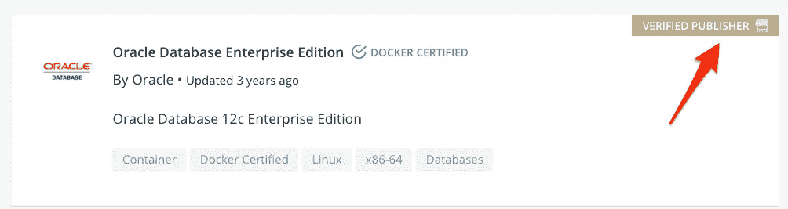
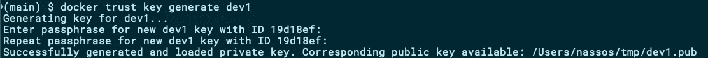
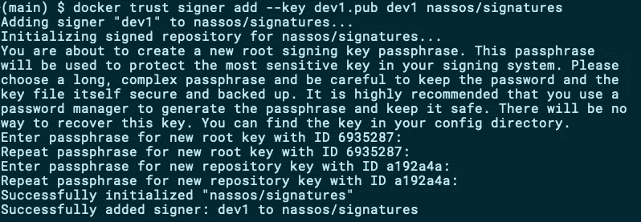
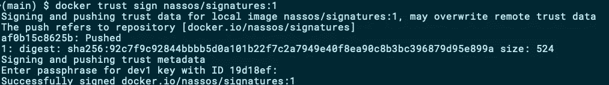
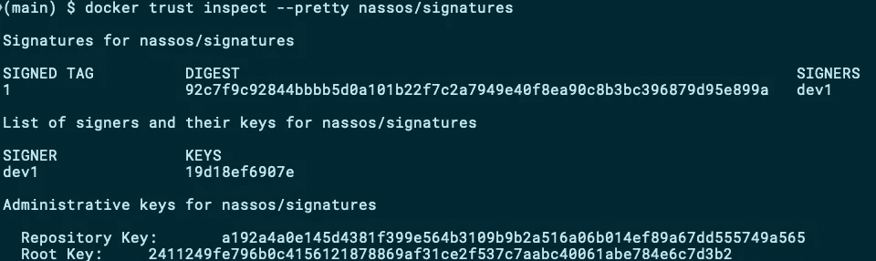
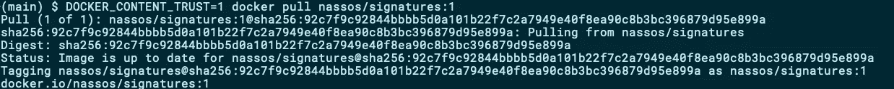
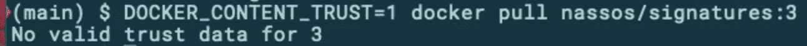
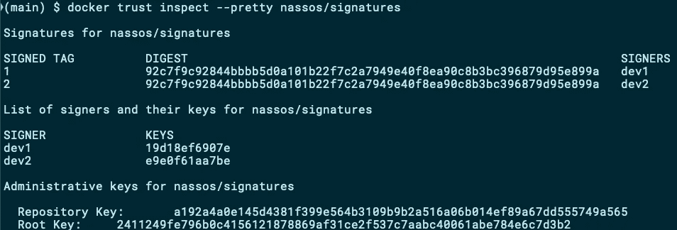

# 用签名保护您的 Docker 图像

> 原文：<https://betterprogramming.pub/docker-content-trust-security-digital-signatures-eeae9348140d>

## 如何对容器使用 Docker 内容信任


Brian McGowan 在 [Unsplash](https://unsplash.com?utm_source=medium&utm_medium=referral) 上拍摄的照片。

随着 Docker 主导交付工作流，您的容器图像必须可信。你的用户如何确定他们正在下载的图像内容是你创建的？你如何证明你确实是一幅图像的创造者？

在本文中，我们将探索信任在 Docker 中是如何工作的，我将向您展示如何安全地签署您的 Docker 图像。如果你需要快速了解公钥加密的基础知识，可以看看[我之前关于这个话题的文章](https://medium.com/better-programming/an-introduction-to-public-key-cryptography-3ea0cf7bf4ba)。

# Docker 注册中心和可信实体

尽管许多人将 Docker Hub 与 Docker 注册中心联系在一起，但 Docker 注册中心是一个独立的概念。简而言之，登记处是保存信息记录的地方。在 Docker 域中，你可以上传你的 Docker 图片并与他人分享。

有许多产品可以让你运行自己的私有或公共 Docker 注册表，Docker 在 [registry](https://hub.docker.com/_/registry) 中免费提供了一个默认实现。

目前，Docker Hub 拥有超过 600 万个存储库，总共有 1300 亿次图像提取。面对如此惊人的数字，几乎任何人都可以创建新的存储库并开始推送图像，信任成为一个问题。

对于知名的大出版商，信任问题由 Docker，Inc .负责，该公司人工审查选定的出版商:



Docker Hub 中经过验证的出版商(图片由作者提供)。

任何人都可以申请成为[认证发布者](https://info.mirantis.com/technology-partner-program)。然而，其背后的复杂性和相关成本可能会成为小型出版商的绊脚石。

幸运的是，我们有公钥加密技术，Docker Hub 支持上传图像中的数字签名。

让我们看看如何成为自己的认证发布者。

# Docker 内容信任

DCT 允许图像发布者使用数字签名，有效地允许用户提取他们的图像来验证:

*   图像的内容没有被篡改。
*   发布者的身份。

因为 DCT 是基于公钥加密的，所以任何人都可以创建一个免费的公钥/私钥对，并开始推送签名图像。发布者需要在上传每一张图片前签名，签名指的是他们图片的特定标签。这是要记住的重要一点。标记 1.0.0 被签名的事实并不一定意味着标记 1.0.1 也会被签名。这也意味着已签名的 1.0.0 标签可以被未签名的 1.0.0 标签覆盖。

为了安全起见，请确保每次提取图片时都在标签级别上验证所有图片。

这里值得注意的是，DCT 是你的图像的附加功能，不知道如何使用它的用户可以像以前一样继续拉你的图像。

准备好给我们的第一张照片签名了吗？让我们接下来做那件事。

# 签署 Docker 图像

在本节中，我们将看到:

*   如何生成签名密钥？
*   如何用公钥绑定 Docker 存储库？
*   如何给图像签名？
*   如何验证图像已签名？

## 先决条件

要签署一个图像，我们显然需要一个图像来开始。继续从 Docker Hub 中提取`hello-world`示例:

```
docker pull hello-world
```

接下来，您需要标记这个图像，以便可以将它放入您自己的存储库中。调整以下命令以匹配您在 Docker Hub 上的用户名，然后执行:

```
docker tag hello-world nassos/signatures:1
```

你现在有了自己的`hello-world`形象，我们准备好签字了。

## 生成签名密钥

要生成数字签名，您需要创建一个公钥/私钥对。你可以使用 Docker CLI 创建一个(如果你愿意，可以用你自己的名字替换`dev1`):

```
docker trust key generate dev1
```



使用 Docker 客户端生成密钥对(图片由作者提供)。

公钥将在您执行该命令的目录下创建，私钥将放在`~/.docker/private`下。

## 允许公钥签署图像

Docker 中内容信任的整个概念与 Docker [公证人](https://docs.docker.com/notary/getting_started/)协同工作:

> “公证人是一种发布和管理可信内容集合的工具。出版商可以对收藏进行数字签名，消费者可以验证内容的完整性和来源。这种能力建立在一个简单的密钥管理和签名界面上，以创建签名集合并配置可信发布者。”

Docker 公证人被绑定到 Docker 注册中心以提供其服务。对于 Docker Hub，已经有一个附加的公证服务器，Docker CLI 简化了与之交互的过程，因此您实际上不需要知道它的存在。

要开始签署图像，您应该将您的公钥添加到基础公证服务器。您可以通过执行以下命令来实现这一点:

```
docker trust signer add --key dev1.pub dev1 nassos/signatures
```



允许使用公钥对图像进行签名(图像由作者提供)。

用户`dev1`的公钥只允许对您指定的存储库，即`nassos/signatures`的图像进行签名。如果您需要该用户能够签署不同存储库上的图像，您需要以新存储库为目标重复上面的命令。

## 签署图像

将您的图像和密钥对准备好，并将您的公钥添加到存储库中后，您现在可以对您的第一个图像进行签名了:

```
docker trust sign nassos/signatures:1
```



签署和推送 Docker 图像(作者的图像)。

上面的命令对图像进行了签名，并自动将其推送到 Docker Hub。

## 检查签名图像

您可以使用以下命令查询 Docker Hub(实际上是 Docker registry 背后的公证人)关于存储库的签名和签名者状态:

```
docker trust inspect --pretty nassos/signatures
```



Docker 存储库的签名和签署者(图片由作者提供)。

此命令显示该存储库上的哪些标签已签名，以及该存储库附带有签名的人员列表(即可以签名图像的人员)。

# 使用签名图像

签名图像后的下一步是指导 Docker 处理签名图像。正如本文开头提到的，签名是图像的附加属性，如果您愿意，可以完全忽略它们。例如，您仍然可以尝试用一个`docker pull`来拉上面创建的签名图像`nassos/signatures:1`。

然而，如果你想只处理签名的图像，你可以使用`DOCKER_CONTENT_TRUST`环境变量指示你的 Docker CLI 只获取签名的图像:

```
DOCKER_CONTENT_TRUST=1 docker pull nassos/signatures:1
```



拉一个签名的图片(图片作者)。

Docker CLI 提取图像并验证签名，然后将其保存到本地存储中。

尝试提取没有附加签名的图像会导致错误:



图片作者。

如果您正在使用 Docker 的企业版，您还可以通过修改`/etc/docker/daemon.json`来配置底层 Docker 引擎，使其仅处理签名图像:

```
{
    "content-trust": {
        "mode": "enforced"
    }
}
```

# 与合作者一起工作

如果您的 Docker 存储库恰好是您与其他人共享的存储库(例如公司存储库)，Docker 内容信任允许您让多人推送签名图像。

首先，您的合作者需要创建一个密钥对:

```
docker trust key generate dev2
```

生成的`dev2.pub`公钥需要转发给您，以便添加到存储库的签名者列表中:

```
docker trust signer add --key dev2.pub dev2 nassos/signatures
```

您的合作者`dev2`现在可以像以前一样在存储库上推送图像。您可以再次检查存储库，这一次您将看到您自己以及新添加的协作者:



多个合作者签名图片(图片由作者提供)。

# 结论

在 Docker 主宰递送工作流程的时代，你必须信任 Docker 图片的来源。Docker 提供了一个全面的机制，用于在一个存储库 Docker Content Trust (DCT)下对多个协作者进行签名、验证和协作。您可以利用 DCT，这样图像的用户就可以确定他们将要使用的图像内容。

和往常一样，在使用公钥基础结构时，请确保正确备份了私钥。

感谢您阅读这篇文章。希望下一部能见到你。