# Docker:构建自定义 NGINX 映像，并将其推送到 AWS ECR 和 GitLab

> 原文：<https://betterprogramming.pub/docker-custom-nginx-image-pushed-to-aws-ecr-and-gitlab-99545ca7c583>

## 快速实践教程


[张艺](https://unsplash.com/@kencheungphoto?utm_source=medium&utm_medium=referral)在 [Unsplash](https://unsplash.com?utm_source=medium&utm_medium=referral) 上拍照

该项目将演示如何使用 Dockerfile 和 docker-compose.yml 文件通过 AWS Cloud9 构建自定义 NGINX Docker 映像。我们会将该图像推送到 AWS 弹性容器注册中心(ECR)。我们还会将映像推送到 GitLab，最后，我们会在 GitLab 中设置一个 CI/CD 管道。

**先决条件:**

*   具有 IAM 权限的 AWS 帐户
*   安装了 AWS CLI 的 AWS Cloud9 IDE
*   GitLab 帐户

首先，登录你的 AWS 控制台，进入 Cloud9 服务。创造新的环境。我将矿山命名为 ***Docker NGINX*** 。对于平台，选择 Ubuntu 服务器。保留其余设置的默认值。创造环境。

在网上搜索你的 IP 地址并复制下来。返回 AWS 控制台，找到 EC2 服务。选择正在运行的 Cloud9 实例，然后点击您的安全组。

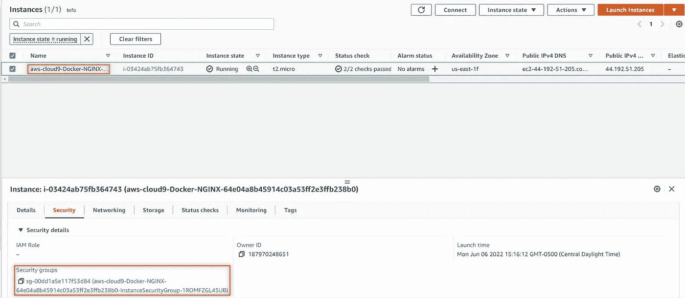

接下来，我们将编辑入站规则。添加所有流量并粘贴您的 IP 地址。选择具有 32 位地址的 cidr 模块。保存规则。

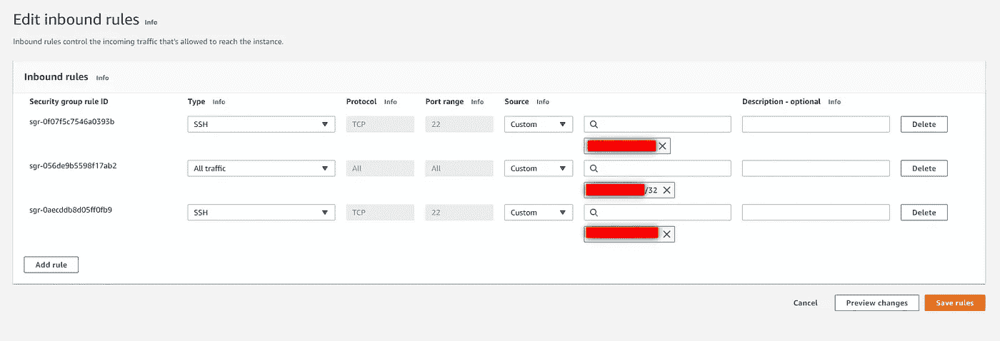

回到 Cloud9 环境，我们将设置我们的文件系统。让我们从 Dockerfile 文件开始。右键单击第一个环境文件夹，并创建一个新文件夹，名为 ***Docker。*** 在那个文件夹内，新建一个文件。该文件必须命名为 ***Dockerfile。*** 你现在应该看到文件旁边有个小 Docker whale。

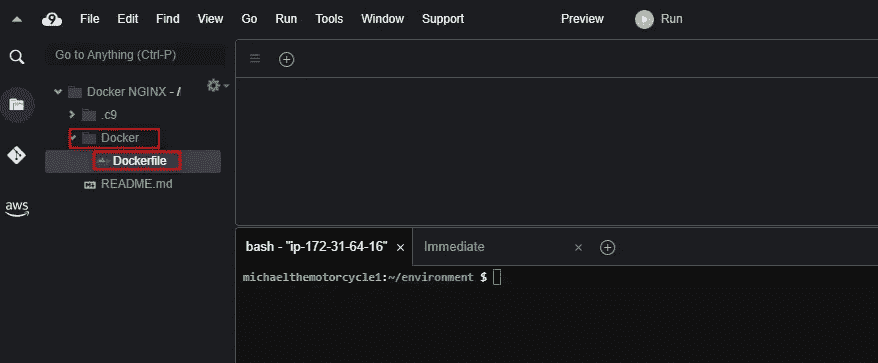

让我们继续通过添加一个 index.html 文件来创建文件，在这里我们将定制我们的图像来告诉我们容器部署的日期和时间。最后，添加一个`docker-compose.yml`文件，这样我们可以很容易地创建一个 NGINX 图像。

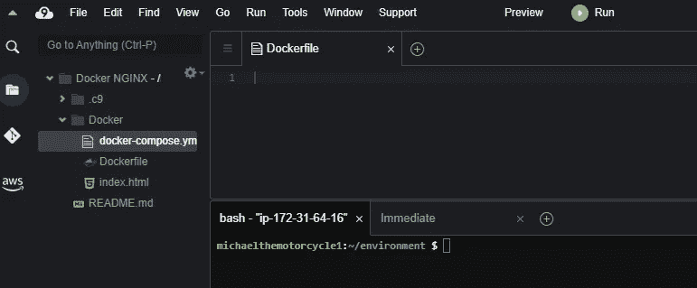

将目录更改到 Docker 文件夹中。开源容器化平台 Docker 安装在 AWS Cloud9 上。要查看版本，请键入:

```
docker --version
```

接下来，我们将安装 docker-compose。为此，请键入:

```
sudo apt install docker-compose
```

安装完成后，转到 docker-compose 文件。我们将编写以下代码在 Docker 容器中创建一个 NGINX 映像:

让我们看看能否创建并启动容器。我们将使用“-d”在分离模式下运行容器:

```
docker-compose up -d
```

不到一分钟，您的容器就会启动并运行。要验证容器是否正在运行，请执行以下操作:

```
docker ps
```

您的屏幕应该是这样的:

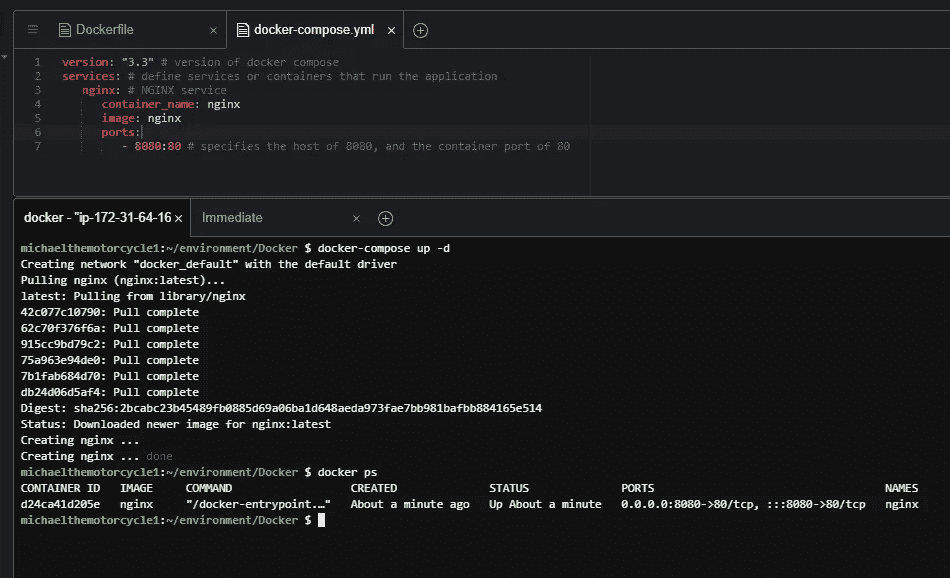

现在让我们卷曲本地主机:

```
curl localhost:8080
```

作为回报，您应该会看到类似这样的内容。我们将使用 html 内容并对其进行修改，以创建一个定制的 NGINX web 服务器:

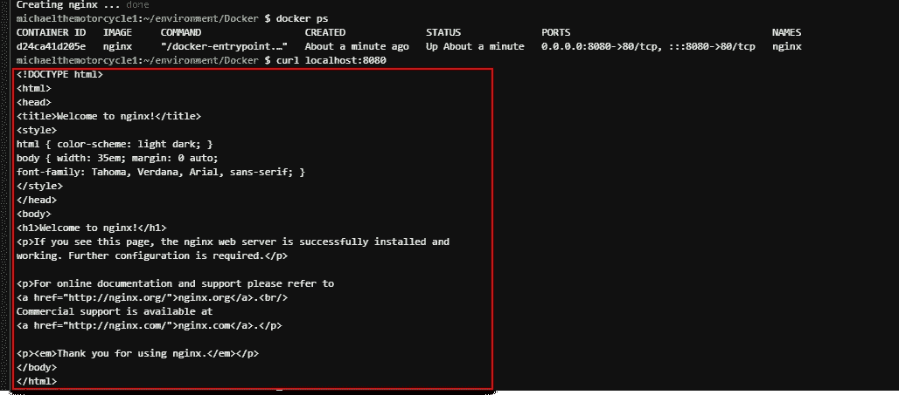

打开 index.html 的档案。我将输入以下内容，特别注明要显示的容器创建日期和时间:

现在我们去看看文档。我们将添加以下内容:

*   Nginx 在容器内部的`/usr/share/nginx/html`目录中查找要服务的文件。为此，我们将把`index.html`文件复制到`/usr/share/nginx/html` ***。***

我们将运行:

```
docker-compose down
```

这将删除 NGINX 容器。在再次启动之前，我们将编辑一些文件。Cloud9 预装了一些存储库。如果您键入:

```
docker images
```

你会看到我们这个项目有一些不必要的图像。

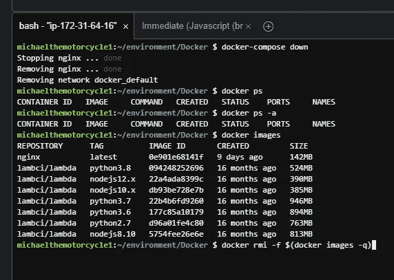

让我们删除所有的图像，让我们的自定义 NGINX 图像有一个新的开始。以下命令会将它们全部删除:

```
docker rmi -f $(docker images -q)
```

我们有清白的历史。让我们再次运行 docker-compose，但在此之前，请编辑 docker-compose 文件，如下所示:

“图像”部分现在被替换为“构建”这将作为我们的 docker 构建命令，它将访问 docker 文件。在我们运行 docker-compose 之前，请确保您位于所有文件所在的目录中。

运行以下命令创建并运行新的 docker 映像:

```
docker-compose up --build -d
```

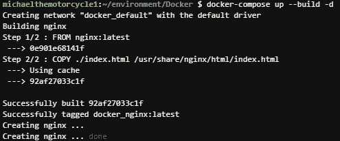

我可以看看正在运行的容器和图像:

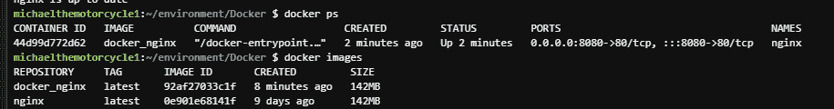

现在，让我们使用 Cloud9 IP 地址来访问容器，而不是 curl localhost 命令。为此，在 Cloud9 中找到 share 按钮，并复制 IP 地址:

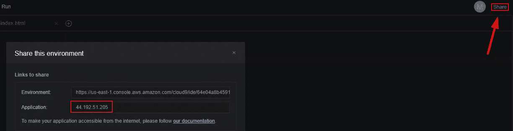

在新选项卡中，在地址栏中键入以下内容:

```
http://<Cloud9_IP_Address>:8080
```

这将带您到您的容器:


让我们把我们的新形象推向 AWS ECR。在 AWS 中找到弹性容器注册服务。创建存储库。我们将把可见性设置保留为私有。命名存储库:

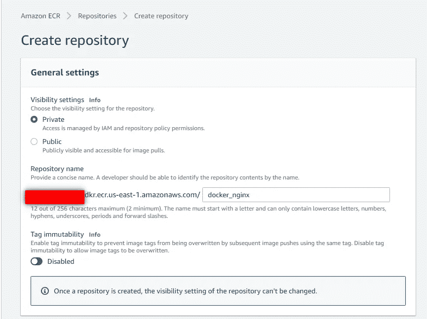

保持其余设置不变。创造它。应该会创建您的存储库。点击“查看推送命令”

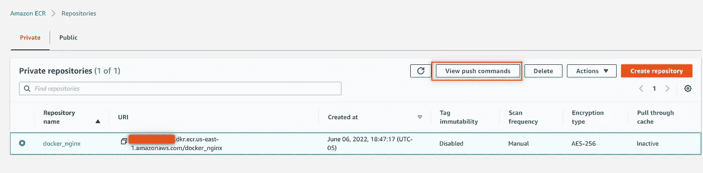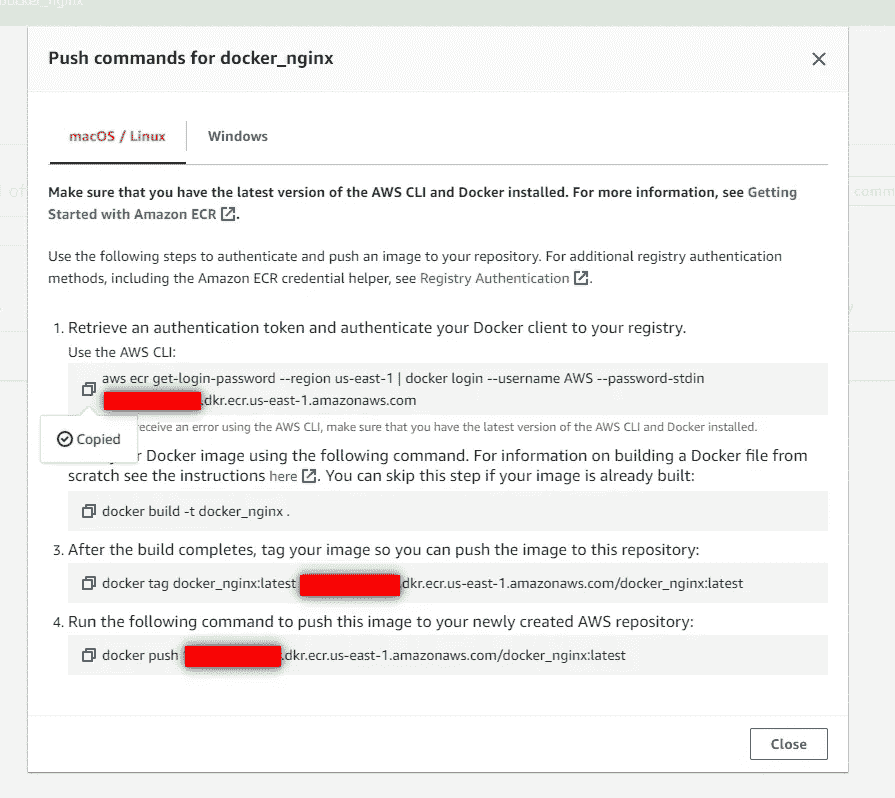

回到 Cloud9，如果您还没有安装 AWS CLI，请键入以下内容:

```
pip3 install awscli
```

您可能需要配置 AWS CLI 以及:

```
aws configure
```

接下来，从 push commands 页面输入以下命令#1:

```
aws ecr get-login-password --region us-east-1 | docker login --username AWS --password-stdin xxxxxxxxxxxx.dkr.ecr.us-east-1.amazonaws.com
```

您应该会收到以下内容:

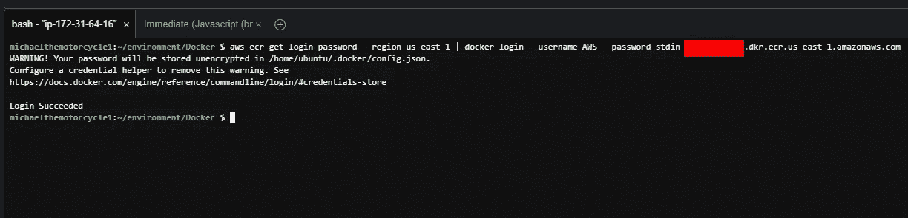

接下来，我们将输入命令#3。我们可以跳过#2，因为我们已经建立了我们的形象:

```
docker tag docker_nginx:latest xxxxxxxxxxxx.dkr.ecr.us-east-1.amazonaws.com/docker_nginx:latest
```

最后，我们将图像推送到 AWS ECR:

```
docker push xxxxxxxxxxxx.dkr.ecr.us-east-1.amazonaws.com/docker_nginx:latest
```

您的屏幕应该是这样的:

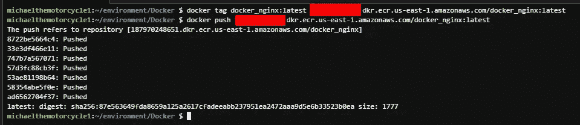

如果我们返回到 AWS ECR，单击您的存储库，您应该会看到您的图像:

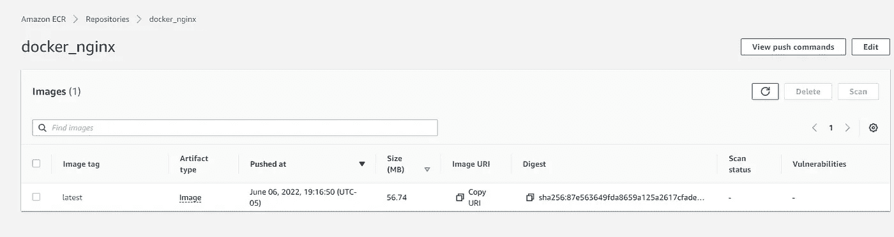

# GitLab

既然我们已经向 AWS 注册了容器，为什么不把它推到 GitLab，在那里我们可以在管道中运行 Docker 映像。

登录您的 Gitlab 帐户，或创建一个帐户，然后登录。点击“新建项目”您可能必须先创建一个组，然后才能创建项目。我的群叫`michael_docker`。命名您的项目，并取消选择“使用自述文件初始化存储库”。

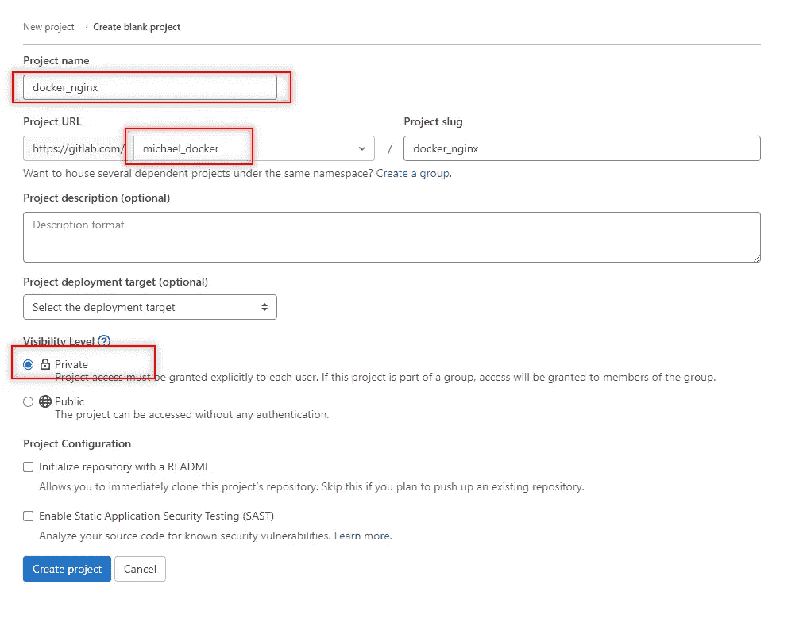

在我们做任何事情之前，我们将为 GitLab 概要文件创建 SSH 密钥。为此，在 Cloud9 中，键入以下命令:

```
ssh-keygen -t rsa -b 2048 -C "<comment>"
```

在输出后接受建议的文件名和目录。接下来，系统会提示您输入密码。

要查看您的公共 SSH 密钥，请键入:

```
cat /home/ubuntu/.ssh/id_rsa.pub
```

要查看私有 SSH 密钥:

```
cat /home/ubuntu/.ssh/id_rsa
```

回到 GitLab，在页面右上角找到你的用户名图标，点击“编辑个人资料”。接下来，单击左侧栏中的“SSH 密钥”。将您生成的公共 SSH 密钥添加到您的 GitLab 帐户，并将私有 SSH 密钥保存在安全的地方。添加密钥。

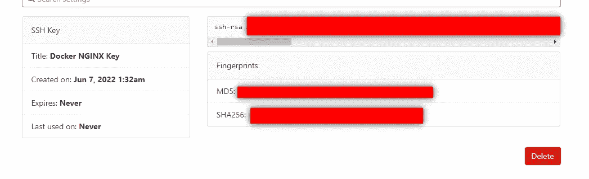

接下来，单击您的新项目，并转到左边的列。将鼠标悬停在
“包裹&注册处”上，点击“集装箱注册处”

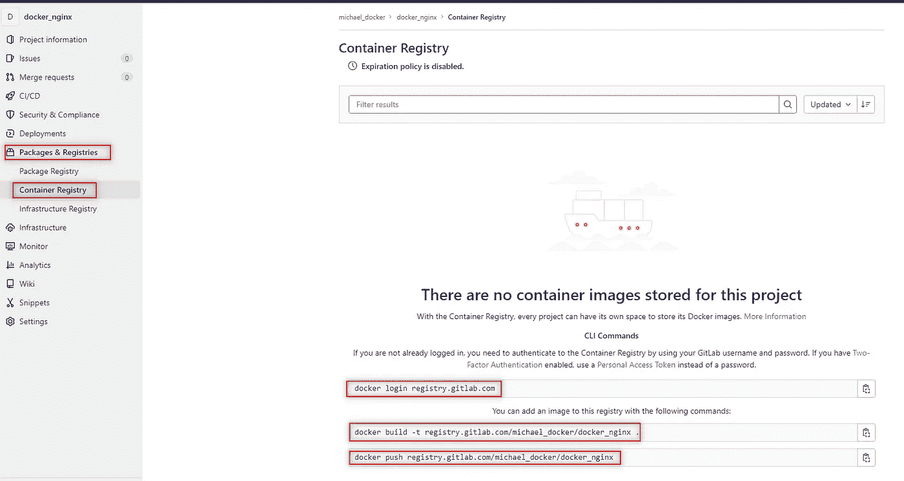

您可以看到一些登录注册表的命令。首先让 SSH 从 Cloud9 进入我们的 GitLab 帐户:

```
ssh -T [git@gitlab.com](mailto:git@gitlab.com)
```

输入您用 SSH 密钥创建的密码。您的屏幕应该是这样的:

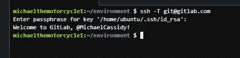

**故障排除提示:**

*   您可能需要输入以下命令来为您的 SSH 公钥创建一个密码存储文件夹，以便能够访问您的 GitLab 注册表:

```
sudo apt install pass
pass init "<SSH_PUBLIC_KEY>
```

现在，我们将在容器注册表页面上输入第一个命令:

```
docker login registry.gitlab.com
```

输入您在 GitLab 中显示的用户名，然后输入您的 GitLab 密码。

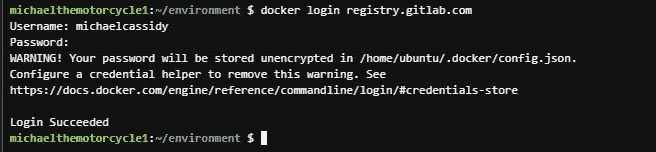

我在环境目录中，但是现在确保切换回 Docker 文件夹(如果您还不在那里),并在注册表中输入第二个命令:

```
docker build -t registry.gitlab.com/michael_docker/docker_nginx .
```

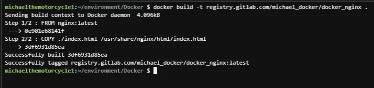

如果我们运行 docker images，我们将看到目前为止我们创建的所有图像:

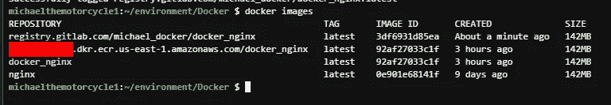

最后，我们将把图像推送到我们的 GitLab 注册表:

```
docker push registry.gitlab.com/michael_docker/docker_nginx
```

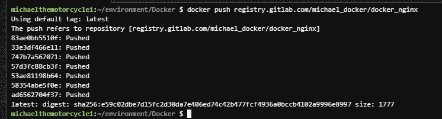

如果我们回到 GitLab，刷新容器注册表，我们会看到我们的图像在那里:

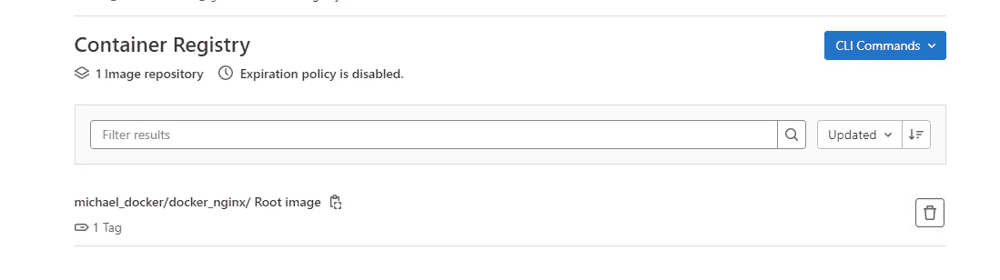

既然我们已经走到了这一步，让我们在 GitLab 中设置一个 CI/CD 管道。

根据 GitLab:

> GitLab CI/CD 是一个使用连续方法进行软件开发的工具。
> 
> 管道是持续集成、交付和部署的顶级组件。

下面是创建 CI/CD 管道所需的`.gitlab-ci.yml`文件:

回到 Cloud9，在 Docker 文件夹下创建一个名为`.gitlab-ci.yml`的新文件。将上面的代码粘贴到您的 Cloud9 文件中:

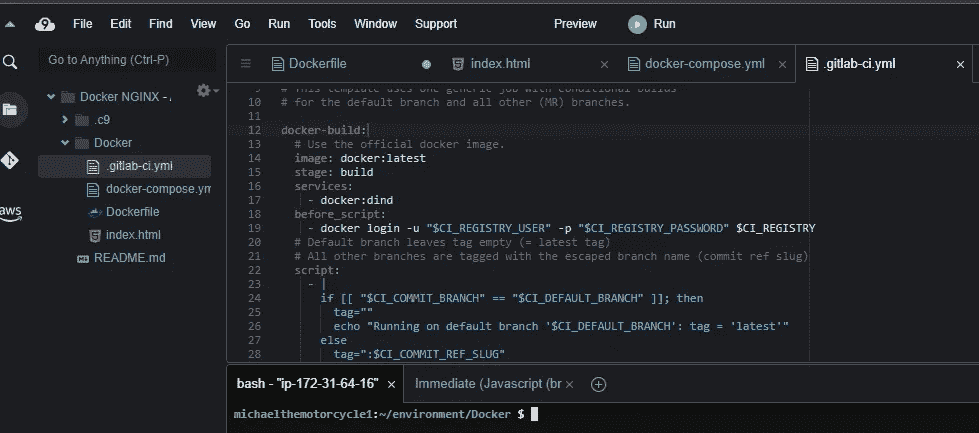

接下来，从 GitLab 输入全局用户命令:

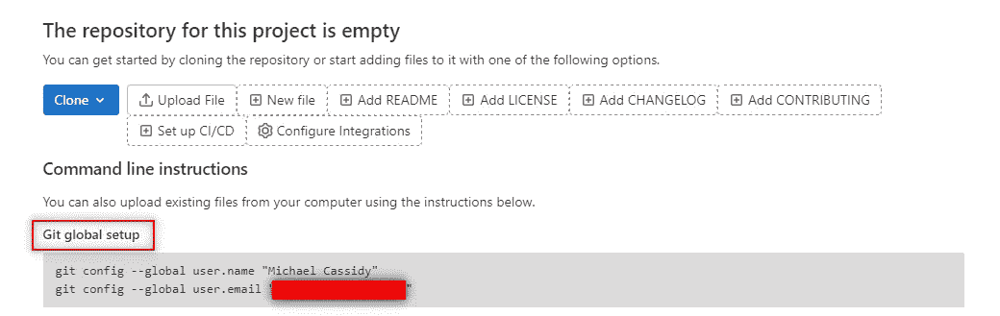

接下来，输入下面的命令。

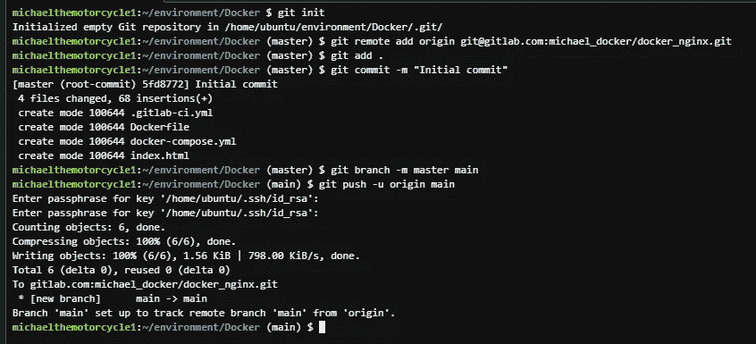

如果我们刷新我们的 GitLab 库，我们应该看到管道正在构建，然后最终通过！

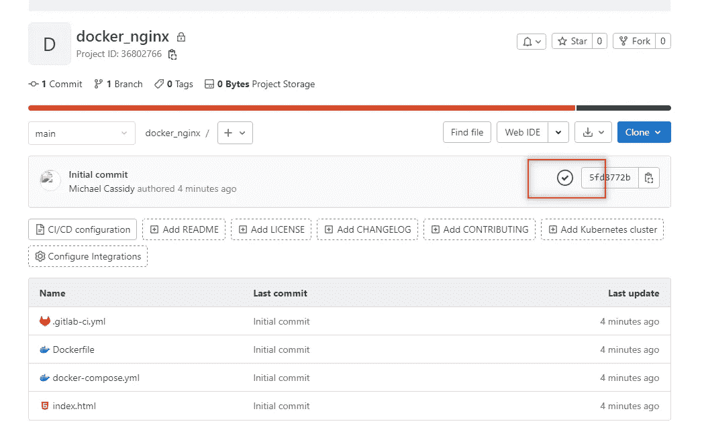

如果我们打开管道，你会看到它在建造，直到成功。

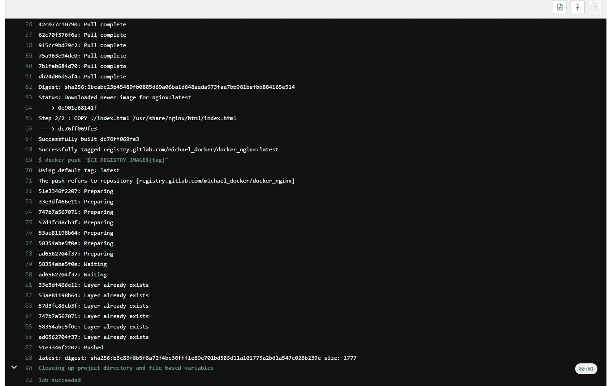

您可以从 Cloud9 中删除您的容器和图像。为此，请使用以下命令:

```
docker rm -f $(docker ps -a -q)
docker rmi -f $(docker images -q)
```

恭喜你。您创建了一个自定义 Docker 映像，并将其推送到 AWS ECR 和 GitLab。您还在 GitLab 中构建了一个 CI/CD 管道。