# 通过 AWS 自由层服务将您的堆栈部署到 Docker 群

> 原文：<https://betterprogramming.pub/docker-deploy-a-stack-to-a-swarm-af508e11cfa0>

## 快速、简单、廉价的部署

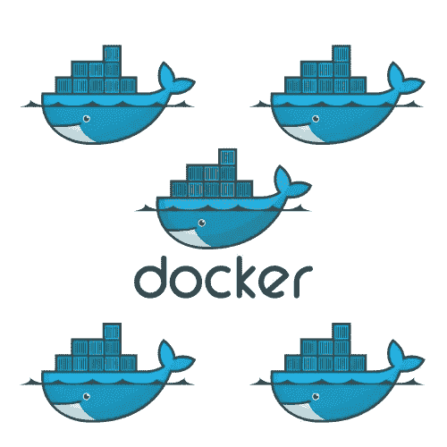

在本教程中，我将使用 AWS Cloud9 IDE 创建一个 Docker swarm。Docker Swarm 是一个容器编排平台，由 Docker 构建。

在使用 AWS 免费层服务的同时，这是一种快速简单的 Docker Swarm 实验方法。

我们将创建一群 Docker 引擎，在实践中，您可以通过跨多台主机的多个容器部署应用程序服务。我将使用 Docker Compose 在本地开发一个映像，并将该映像部署到任何节点都可以访问的集群中。

# **先决条件**

*   具有 IAM 权限的 AWS 帐户
*   AWS Cloud9 IDE。您需要创建三个环境。一个将用于群管理器，另外两个将作为工作节点。使用 Ubuntu 平台和 t2 微实例类型:

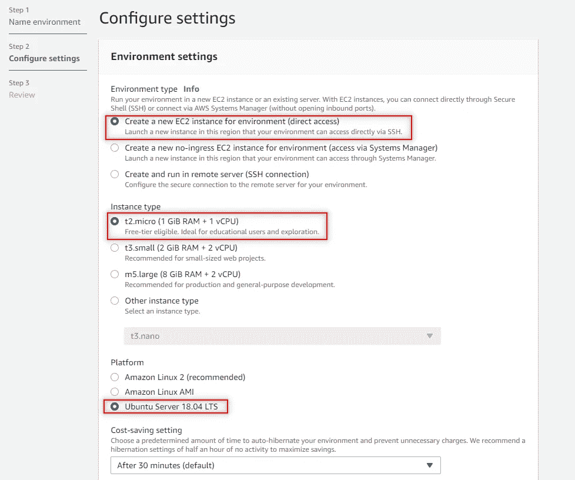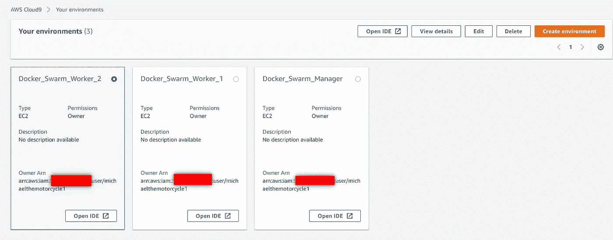

*   GitHub 帐户(如果您想将代码推送到 GitHub，这是可选的)

在我们进入 Cloud9 之前，我们需要添加一些入站安全规则。首先，在网上搜索你的 IP 地址并复制下来。

返回 AWS 控制台，找到 EC2 服务。选择每个正在运行的 Cloud9 实例，然后点击您的安全组。接下来，我们将编辑入站规则。添加所有流量并粘贴您的 IP 地址。选择具有 32 位地址的 cidr 模块。保存规则。

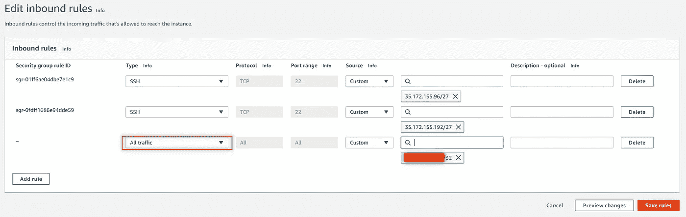

之后，我们将把 Swarm manager 安全组添加到每个 worker 节点入站规则中。我们需要蜂群能够互相交流。我们将把每个工作者节点的安全组添加到群组管理器的入站规则中。下面是经理的入站规则的一个示例:

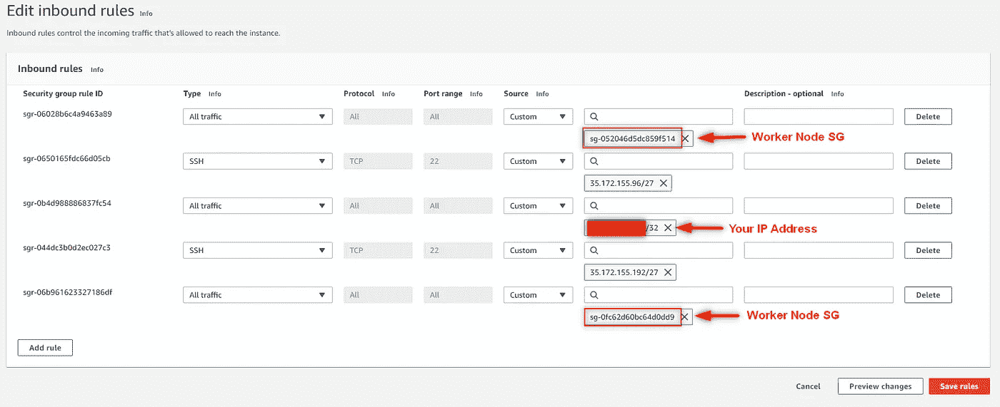

如果您想将我们创建的代码推送到 GitHub，请确保在开始之前克隆您的 GitHub 库并创建一个新的分支。

要开始使用 Cloud9，我们先来看看 Docker 的版本。

```
docker version
```

Docker 预装在 Cloud9 环境中，所以 Docker Swarm 模式也在那里。确保您在 swarm manager IDE 上，并键入以下命令来配置 manager 节点。

```
docker swarm init
```

您将看到下面的消息，我们将使用我们的 worker 节点上给出的命令将它们添加到群中。复制命令

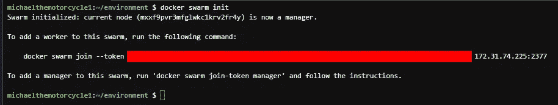

转到 worker 1 IDE，粘贴经理的命令:

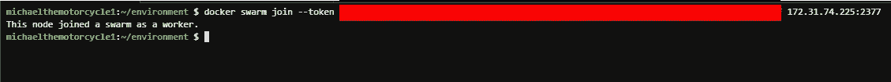

工人 1 已经加入了蜂群

对工人 2 重复该步骤，然后回到经理那里。键入以下命令以确保您的 swarm 已准备就绪并处于活动状态。

```
docker node ls
```

您应该会看到类似这样的内容:

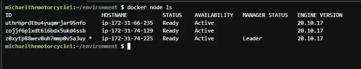

你可以看到我有一个经理和两个工人。

如果你写了这个命令，`docker images`你会看到我们可以去掉一些图像来释放空间。运行 a

`docker rmi -f $(docker images -q)`如果您愿意，可以去掉所有图像。

接下来，我们将安装 docker-compose。为此，请键入:

```
sudo apt install docker-compose
```

让我们创建一些将要使用的目录和文件。

我有一个目录，我把它命名为 ***Docker_Swarm*** 。我会把目录换成这个，并添加一个***docker-compose . yml***文件。我将使用以下命令:

```
touch docker-compose.yml
```

接下来，我们将创建另一个目录来存放一个`websales`文件，我们最终将把它分配给一个网络，并在我们的每个容器中为其创建卷。让我们把这个新文件夹叫做`webexport`，里面有一个文件叫做`websales.txt`。我们将在容器上创建一个名为 stored in `webvolume`的 Docker 卷，我们的 docker-compose 文件将指向`webexport`目录。我们创建的所有容器都将附加 Docker 卷。

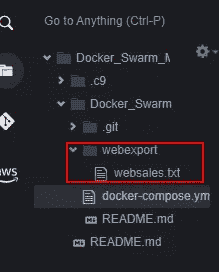

对于这个项目，我不会使用绑定挂载。根据 Docker 的说法，绑定挂载可能是有用的，但是最佳实践建议您在使用 Docker swarm 模式时不要使用它们来设计应用程序。以下是风险:

> 如果将主机路径绑定到服务的容器中，该路径必须存在于每个群节点上。Docker swarm 模式调度程序可以在任何满足资源可用性要求和所有约束条件以及您指定的布局偏好的机器上调度容器。
> 
> 如果服务容器变得不健康或不可达，Docker swarm 模式调度程序可以随时重新调度正在运行的服务容器。
> 
> 主机绑定装载是不可移植的。当您使用绑定挂载时，不能保证您的应用程序在开发中的运行方式与在生产中的运行方式相同。

现在让我们来看看 docker-compose 文件。您可以使用一个文本编辑工具，比如 vim，其中您可以使用来自`Docker_Swarm`目录的命令`vim docker-compose.yml`。我只需双击左栏中的文件。

*   我想指出的一点是，我第一次进行故障排除时，为了使用将 Docker 映像的副本分布到整个集群的放置首选项，我必须为我的每个 worker 节点创建一个节点标签。标签是`availability_zone`。我首先使用一个`docker node ls`来显示每个工作节点的主机名，然后使用命令

```
docker node update --label-add ***availability_zone*** <HOSTNAME>
```

*   一旦添加了该标签，就可以检查该节点

```
docker node inspect --pretty <HOSTNAME>
```

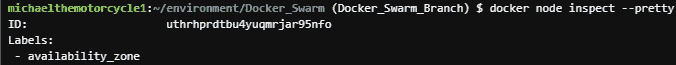

*   另一个注意事项是，我们不需要在 docker-compose 文件中打开任何端口。您可能希望容器的服务保持私有，或者只对同一个 Docker 网络中的其他成员开放。

让我们看看这一切是否行得通。在命令行中，键入:

```
docker stack deploy -c docker-compose.yml <NAME_YOUR_STACK>
```

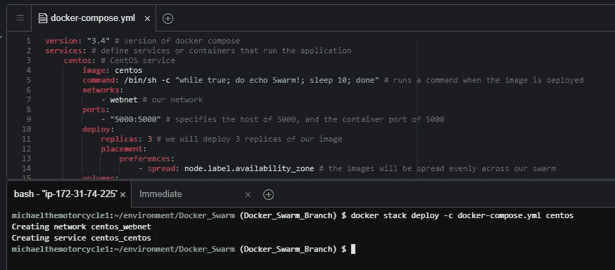

看起来那个堆栈正在被创建。要查看堆栈中运行的容器:

```
docker stack ps <STACK_NAME>
```

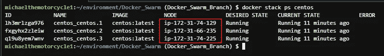

如您所见，我们在每个群节点上运行 centos 映像。

让我们来看看服务:

```
docker stack services <STACK_NAME>
```

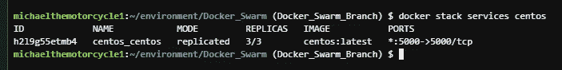

要查看卷是否已连接，我们可以输入以下命令:

```
docker volume ls
docker volume inspect <VOLUME_NAME>
```

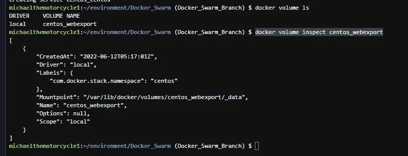

我们也可以在每个 worker 节点上运行`docker volume ls`:

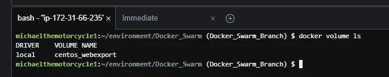

工人 1

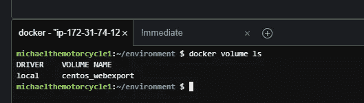

工人 2

我们还可以看到，我们在 docker-compose 文件中指定的网络存在于整个集群中:

```
docker network ls
docker network inspect <NETWORK_NAME>
```

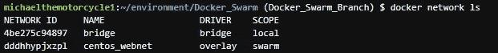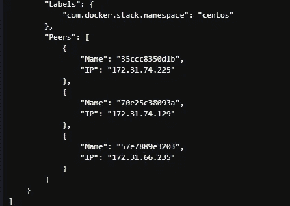

网络是附在蜂群上的

恭喜你。您已经成功地创建了一个 Docker 群组，并利用群组中的工作节点部署了一个带有副本的 Docker 堆栈。

如果你想把你的代码推送到 GitHub，现在是时候了。

确保移除您的堆栈:

```
docker stack rm <STACK_NAME> 
```

当我完成我的项目时，我喜欢移除所有的容器和图像。

```
docker rm -f $(docker ps -a -q) 
# removes all containersdocker rmi -f $(docker images -q)
# removes all docker images
```

感谢您的阅读！