# 面向前端开发人员的 Docker

> 原文：<https://betterprogramming.pub/docker-for-front-end-developers-c758a44e622f>

照片由[卡梅隆通风](https://unsplash.com/@cmventi20?utm_source=medium&utm_medium=referral)在 [Unsplash](https://unsplash.com?utm_source=medium&utm_medium=referral) 上拍摄

作为一名前端 web 开发人员有时很困难，但我们通常喜欢它。今天的前端开发几乎提供了太多的东西——有时它会让人不知所措地思考下一步该学什么。Docker 对我来说就是这样一种技术。虽然它已经存在了相当长一段时间，但我不愿意使用它。想知道我怎么想的吗？剧透:我喜欢。

# 介绍

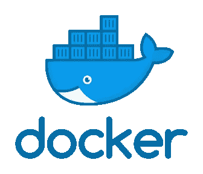

[Docker](https://www.docker.com/) 标志

> “Docker 是唯一一个独立的容器平台，支持组织在任何地方无缝地构建、共享和运行任何应用。”—通过 Docker 的[网站](https://www.docker.com/why-docker)

Docker 的口头禅是:建造，运输，运行。简单来说，它是一个跨平台工具，旨在减轻构建、共享和部署应用程序的痛苦。

# 为什么是 Docker？

在将时间投入到另一个工具之前，有必要先问一下为什么我们需要 Docker？它解决什么问题？

作为开发人员，如果我们在加入一家公司的第一天就可以专注于开发应用程序，而不是在安装/运行应用程序时花费数小时来解决一个愚蠢的版本问题，这不是很好吗？

如果只需要一个命令来构建和运行我们的整个项目，那不是很好吗？

Docker 解决了以下痛点:

*   开发/生产平价
*   跨不同操作系统运行应用程序的不同环境
*   从应用程序开发中分离基础设施
*   新开发人员的入职变得非常容易
*   应用隔离—将 DDoS 攻击限制在一个容器内，负载平衡
*   调试功能

# 码头建筑

Docker 高级体系结构

*   客户机-服务器体系结构
*   客户端命令行界面(CLI)与 Docker 守护程序(服务器)对话
*   守护进程构建、运行和管理 Docker 对象
*   守护进程和 Docker 客户端通过 Unix 套接字或网络接口使用 Rest API 进行通信
*   Docker 注册表存储 Docker 图像

## 码头引擎

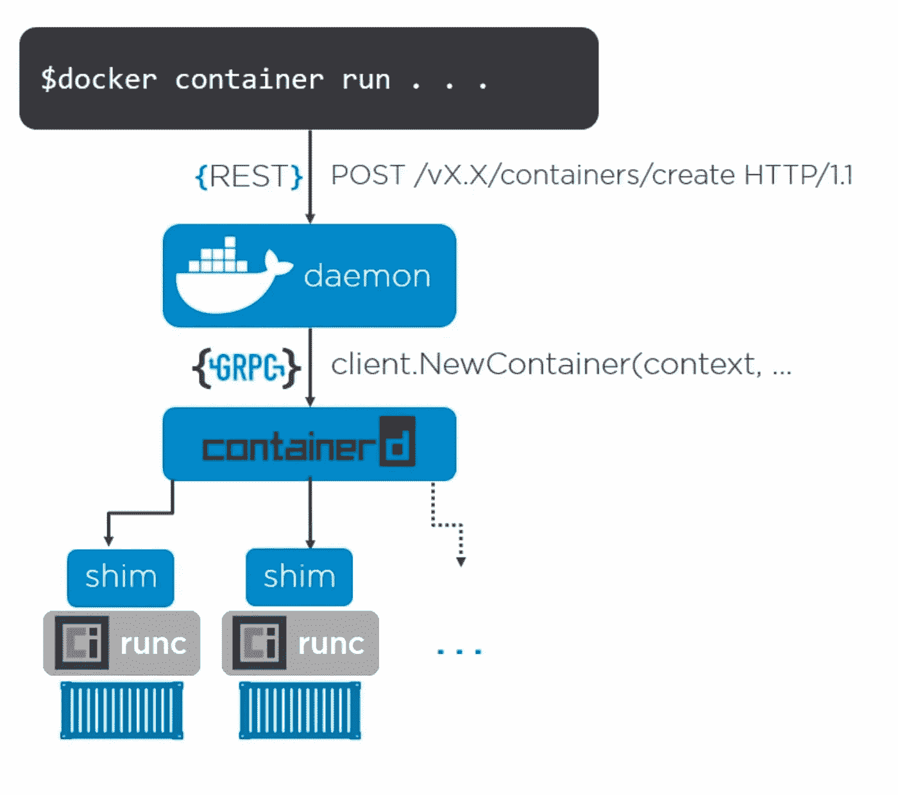

Docker 引擎架构

*   Docker CLI 客户机对 Docker 守护进程服务器进行 REST API 调用
*   Docker 对请求做出响应，并通过 gRPC 协议将消息传递给`containerd`流程，从而启动一个容器
*   `containerd` 管理图像和容器的生命周期:停止、暂停、开始、删除
*   `containerd`为新容器分叉`runc`的实例
*   `runc` 流程创建容器后退出
*   `shim`成为正在运行的容器的父容器

## Docker 与完全虚拟化

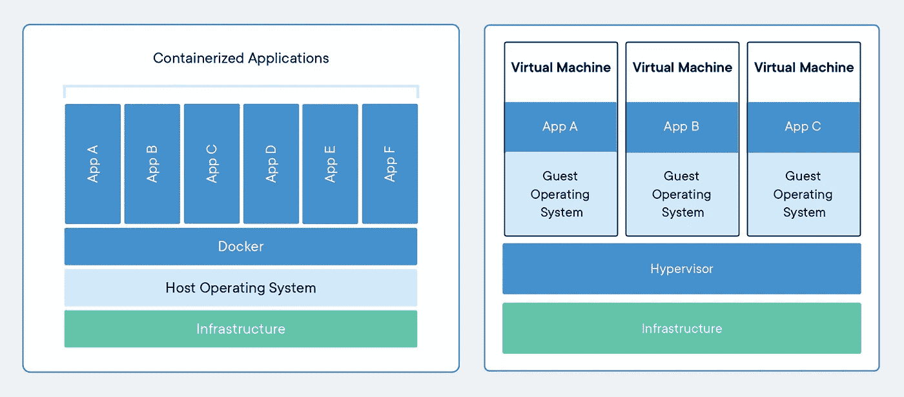

Docker 与完全虚拟化

Docker 使用的虚拟化技术是一种称为操作系统级虚拟化或基于容器的虚拟化，这与使用 VirtualBox 或 VMware 完成的模拟或完全虚拟化形成对比。

完全虚拟化完全在主机操作系统之上运行来宾操作系统。存在系统资源开销，因此，您将体验到缓慢的性能。

在基于容器的虚拟化中，现有主机操作系统的一部分用于隔离运行您的应用程序。这些部分被称为容器，非常轻量级，这意味着我们可以运行多个容器。他们中的每一个都将运行一个操作系统，包含基本的裸原语，没有内核代码或用户界面。

例如，在 Docker 中运行一个 Ubuntu 容器大约需要 188 MB(相比之下，全盛时期需要 800 MB)。尺寸的减小可以部分归因于删除了 Ubuntu 内核和 Ubuntu UI 的代码。Docker 将在主机操作系统上转发该容器中运行的所有命令。这使得 docker 变得非常轻便和高效。

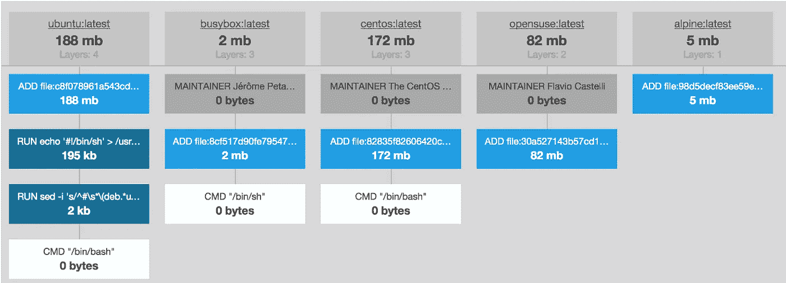

缩小尺寸的图像

# Docker 图像

*   用于创建容器的只读模板
*   一堆文件和一份清单
*   构建时构造
*   在删除图像的所有容器之前，无法删除图像
*   使用 Dockerfile 构建
*   多层:每一层都是前一层的延伸
*   每一层都有应用程序二进制文件、文件系统和库

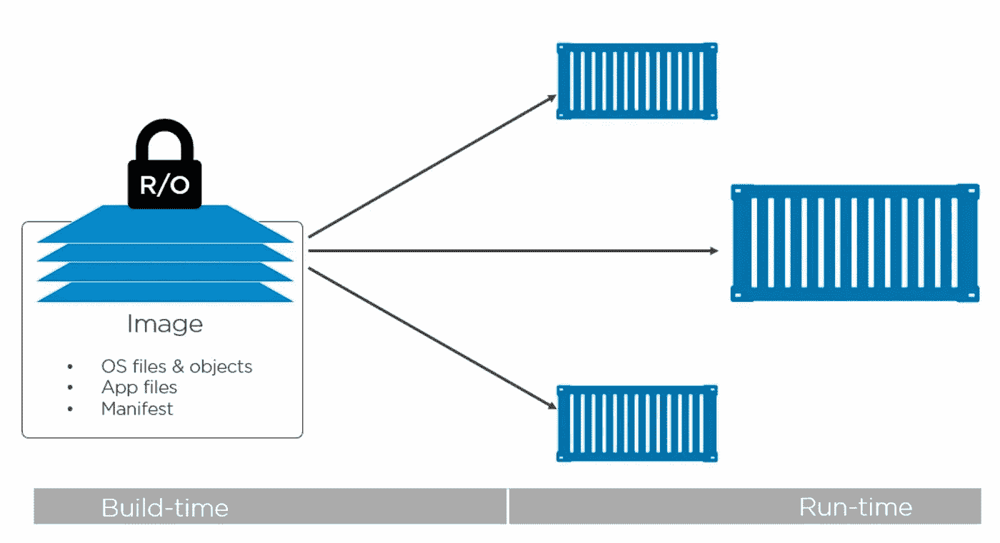

清单文件如下所示:

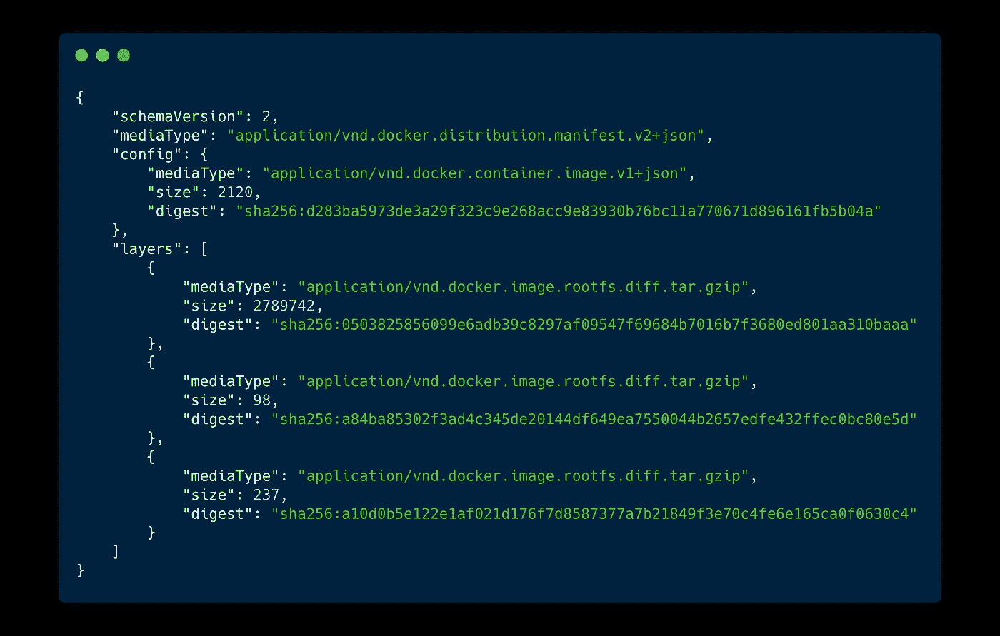

# 码头集装箱

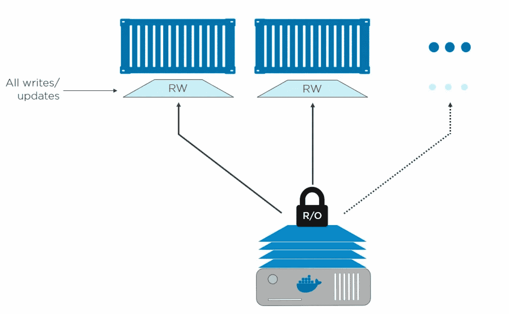

*   它们是我们的应用程序运行的运行时构造
*   容器在映像文件系统之上添加了一个运行时读写层
*   运行时所做的所有更改都是在顶部可写层中进行的
*   可以保存这些更改并提交以创建新的映像。

# 将应用程序容器化— Dockerfile

*   为应用程序创建 Dockerfile
*   使用它建立一个 Docker 映像
*   运行 Docker 映像来运行应用程序的容器

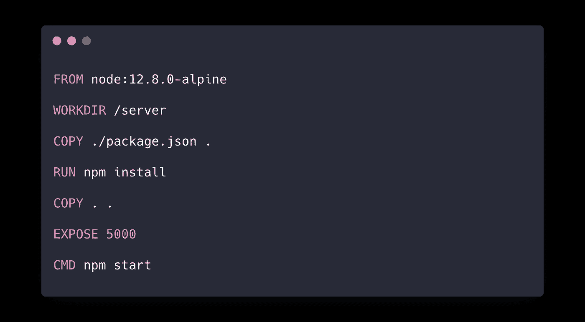

Dockerfile 文件

**解释**

*   `FROM`指令通常是 Dockerfile 文件中的第一条指令。它告诉 Docker 您想要在哪个基础图像上构建您的自定义图像。我们使用的是 [Alpine](https://alpinelinux.org/) ，一个非常轻量级的 Linux 发行版，上面安装了一个节点。
*   `WORKDIR`是一种非常方便的定义工作目录的方式。它将与后续的`RUN`、`CMD`、`ENTRYPOINT`、`COPY`和`ADD`指令一起使用。
*   `COPY` 命令只是将文件或目录从主机系统复制到正在构建的 Docker 映像。
*   `RUN`命令在构建映像时运行任何 shell 命令，并将结果(文件)作为一个层提交或添加到映像中。
*   `EXPOSE` 告诉用户当我们从这个映像运行一个容器时，我们的应用程序将在哪个端口上运行。我们可以在运行时映射到主机端口。
*   `CMD` 指令告诉从这个图像启动容器时运行哪个命令。与`**RUN**` 指令不同，它不会在映像构建步骤中执行。因此，像启动服务器或服务这样的事情将驻留在其中。

要从 Dockerfile 文件构建映像，请运行 build 命令，如下所示:

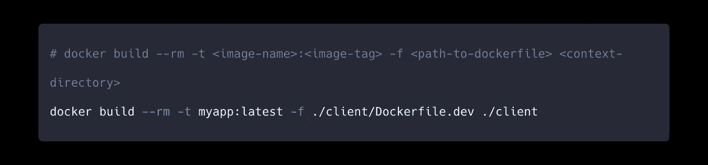

Docker 构建命令

*   `--rm`标志意味着删除由于 docker 文件中的任何`RUN`指令而运行的任何中间容器。在成功构建之后，他们致力于构建的形象。这个标志确保它们最终被删除。
*   `-t`标志用于指定正在构建的图像的名称和标签。默认情况下，如果`tagname`没有通过，则分配最新的
*   `-f`标志用于指定 Dockerfile 的路径。如果图像的名称不同于 Dockerfile，或者它存在于当前目录之外的某个目录中，这很有帮助。
*   最后，我们需要提供上下文目录的路径。这很重要，因为上下文目录中的所有内容都被复制或发送到 Docker 守护进程。

> ***提示:*** *在嵌套项目的情况下(比如 Lerna)，不要选择项目的根作为 Docker 上下文。它会不必要地复制整个项目，这会花费大量的时间和空间。明确你想从事的工作。*

另外，通过使用`**.dockerignore**` 文件，您可以选择哪些文件不要从 Docker 上下文复制到守护进程。这有助于加快构建时间，从而创建更小的图像。

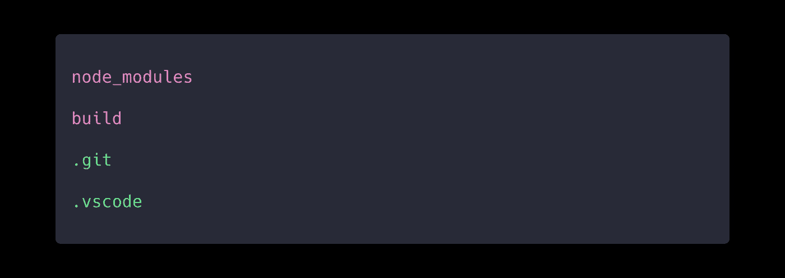

。dockerignore

## 运行容器

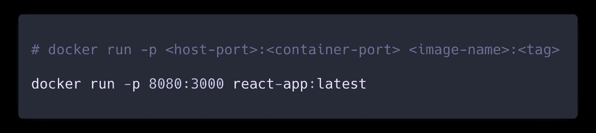

Docker `run`命令使用起来非常简单。`**-p**` 标志用于指定端口映射。这里，容器的 3000 端口将被映射到主机系统的 8080 端口。这意味着你可以在 mac 上访问`localhost:8080`上的应用程序。

要查看正在运行的容器列表，请运行`docker ps`。

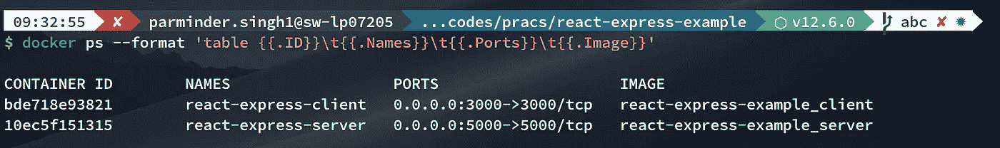

顺便说一下，如果您想登录到正在运行的容器的 shell 中，您可以使用带有`-it` 标志的 Docker execute 命令来实现。并且可以通过`sh`传递最后一个 ARG 作为想要使用的 shell。

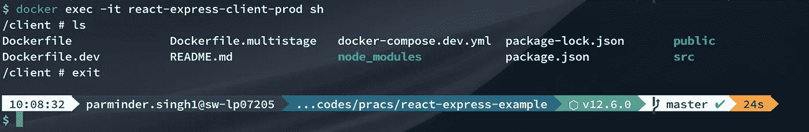

# Docker 撰写

*   用于定义和运行多容器 Docker 应用程序
*   用于启动、停止、暂停等的命令。一次所有容器

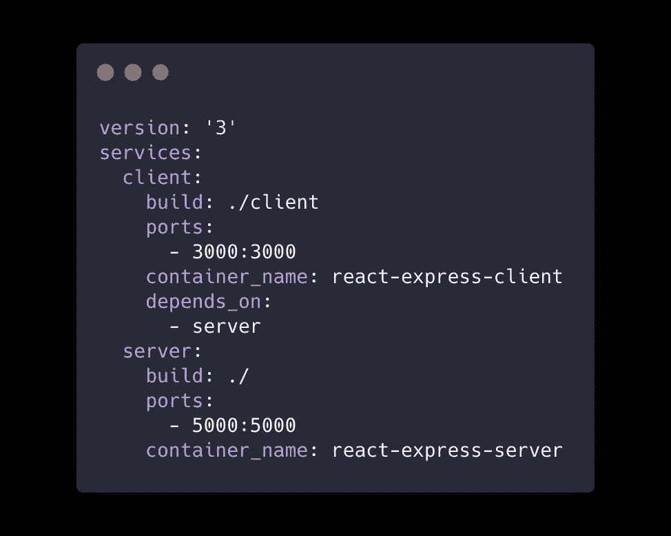

# Docker 卷

*   持久存储 Docker 容器生成和使用的数据的首选机制
*   将目录或文件从主机装载/映射到容器
*   为容器创建共享空间或目录

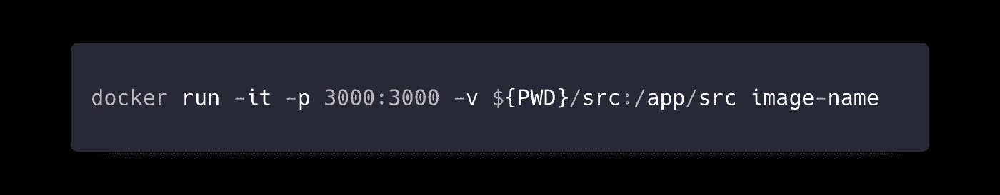

运行 Docker `run`命令时，将主机目录作为卷挂载到容器中

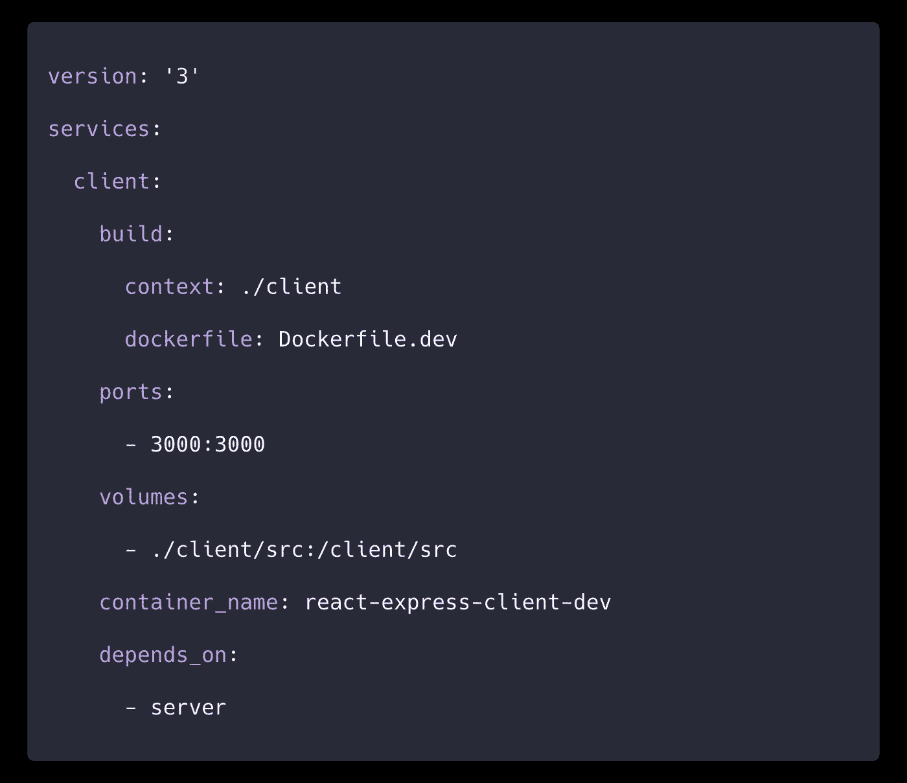

在 docker-compose.yml 文件中挂载 src 文件夹

当您在开发环境中运行您的应用程序以使用启用了热重载的 webpack-dev-server 时，这非常有用。您可以将应用程序的 src 目录映射到运行 webpack-dev-server 的容器。这样，您在主机中对 src 目录所做的任何更改都将覆盖该目录的内容，这将触发热模块更换(HMR)过程以进行热重装。

# 演示

工作演示可以在 GitHub 上找到:[https://github.com/paramsinghvc/react-express-docker](https://github.com/paramsinghvc/react-express-docker)

# 摘要

我们学到的还不止这些。有大量的选项和标志来运行/配置您的构建和容器。通过本指南，我们已经学会了如何在日常项目中使用 Docker。这就像添加一个 Dockerfile 文件、构建一个映像并在其中运行一个容器一样简单。请务必查看我在上面添加的演示链接，看看如何在开发环境中使用它。