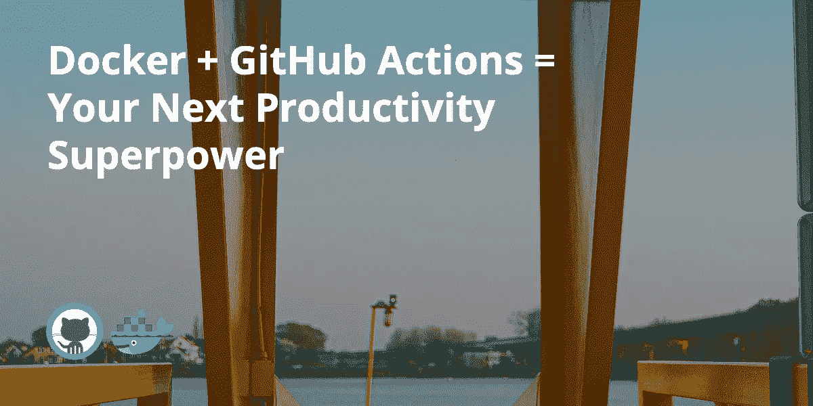
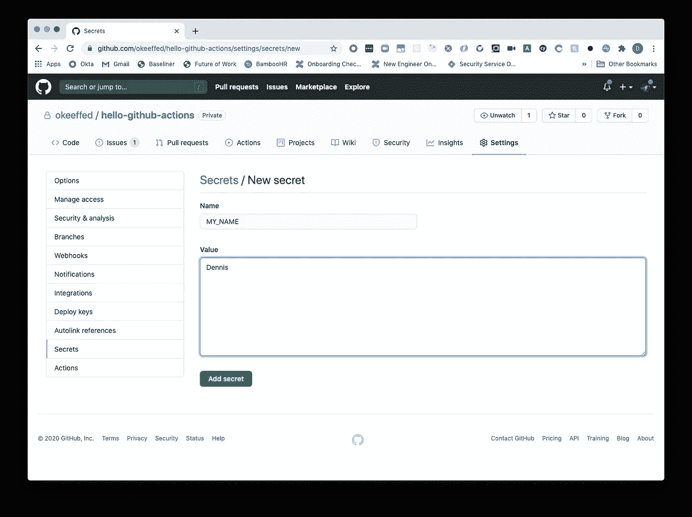
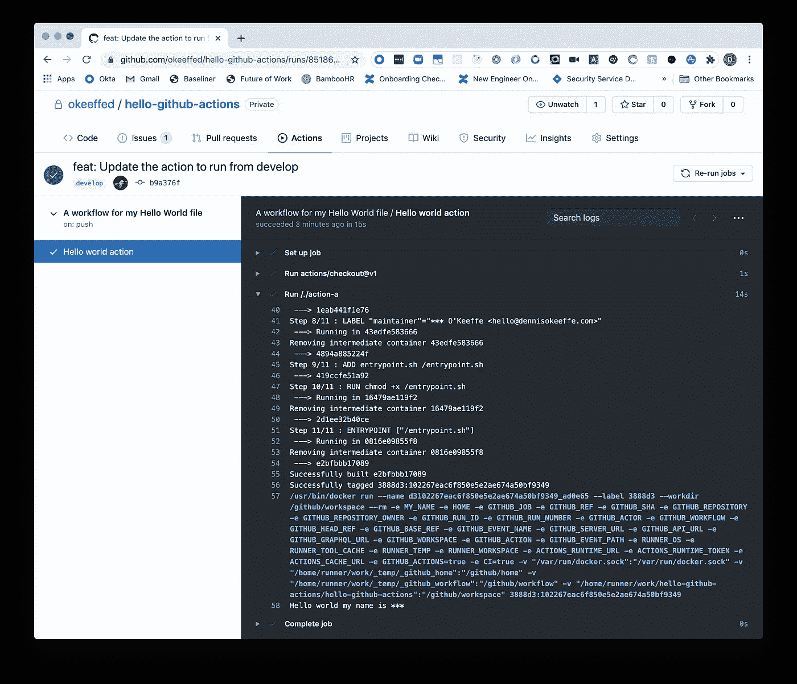

# Docker 和 GitHub 操作

> 原文：<https://betterprogramming.pub/docker-github-actions-your-next-productivity-superpower-8be1991d3db8>

## 你的下一个生产力超级大国

背景图片由[谁是德尼罗？](https://unsplash.com/photos/ZuRwJAJsEts)开[退溅](https://unsplash.com/)。

当 GitHub 引入 GitHub Actions 时，它为开发人员提供了一系列全新的机会来支持他们的项目。

借助 GitHub Actions 的强大功能，您可以运行一整套操作来保持您的代码库处于最佳状态。

从在部署到生产之前运行您的测试和林挺这样的保护性操作，到甚至做一些有趣的事情，如发送延迟通知或在 Twitter 上发布新内容，而不必做任何与您通常的 Git 流程不同的事情！

在今天的短文中，我们将介绍如何在 GitHub Actions 中启动并运行一个基本的 Docker 容器，并学习如何使用 GitHub Secrets！

# 设置工作流

首先，我们需要设置我们的`.github`文件夹和`workflows`。从项目目录根目录中，运行以下命令:

一旦我们有了自己的工作流程，我们可以将以下内容添加到`./github/workflows/main.yml`:

这里，我们给这个动作一个`name`，告诉它在每个`push`到我们的`develop`分支上运行。

我们拥有的最后一个顶级属性是`jobs`，在这里我们可以告诉我们的动作要运行什么！

在我们的工作中，我们正在创建一个名为`Hello world action`的动作。至于步骤，我们告诉它首先运行 GitHub 的`actions/checkout`库的`v1`。

从[回购信息](https://github.com/actions/checkout)中，该操作在`$GITHUB_WORKSPACE`下签出您的存储库，以便您的工作流可以访问它。

然后我们从一个`./action-a`目录运行第二个动作，并告诉它设置一个来自我们的秘密的环境变量！我们稍后将设置该秘密，但是首先让我们设置 Docker 操作！

# 创建我们的自定义 Docker 操作

现在，让我们从项目目录的根目录创建文件夹`action-a`和一些要添加到操作中的文件:

这里，我们正在创建一个文件夹(我们在工作流中引用了它)，然后添加一个 Dockerfile 供 GitHub 构建，我们将创建一个小的 shell 脚本来运行这个操作。最后，我们添加了运行脚本的用户权限，这样我们就可以在本地进行测试。

# 设置脚本

在`./action-a/entrypoint.sh`内，添加以下内容:

该脚本将基于`$MY_NAME`环境变量简单地输出`Hello world my name is …`！

既然我们已经添加了正确的权限，让我们运行操作！

正如你所看到的，上面正在做一些事情…但不完全是我们想要的！我们需要设置一个环境变量来添加到名称中。

让我们用运行时设置环境变量的名称来运行它:

甜蜜的胜利！

这个脚本中发生的事情不多，但没关系！我们只是想让一个行动开始运行！

保存这个文件，让我们继续讨论 docker 文件。

# 设置 Dockerfile 文件

在这里，我们补充以下内容:

对于那些不熟悉 docker 文件的人来说，这可能看起来有点奇怪。为了保持简洁，该文件执行以下操作:

1.  选择要构建的容器。这里，我们使用的是来自公共 [Docker 库](https://hub.docker.com/_/debian)的 Debian 的特定版本。
2.  给容器添加一些标签，以便我们将来引用(特别是如果我们在本地构建的话)。
3.  将`entrypoint.sh`文件复制到容器的根目录。
4.  向该文件添加执行权限。
5.  将该脚本设置为容器运行的入口点。

我们的期望是，我们可以复制我们上面所做的，并运行我们的脚本！最大的不同是我们将使用 [GitHub Secrets](https://docs.github.com/en/actions/configuring-and-managing-workflows/creating-and-storing-encrypted-secrets#creating-encrypted-secrets-for-a-repository) 来管理我们的`MY_NAME`变量！

# 向存储库添加机密

跟随 [GitHub 的文档](https://docs.github.com/en/actions/configuring-and-managing-workflows/creating-and-storing-encrypted-secrets#creating-encrypted-secrets-for-a-repository)，我们可以前往我们的 GitHub 并创建一个新的库。

一旦完成，在新的回购协议中，我们可以去`Settings > Secrets > Add a new secret`为我们的秘密添加一个名字和价值。

为 okeeffed/hello-github-actions 的 GitHub repo 添加机密。

完美！现在是收获我们所播种的东西的时候了。

# 运行我们的操作

在我们的本地存储库中，打开终端，设置 Git repo，并从 develop 分支进行推送。

我们将运行一个标准的 Git 工作流来初始化一个 Git 存储库，创建一个新的`develop`分支，检查该分支，提交所有内容，添加我们已经创建的远程 GitHub 存储库，然后推送到该存储库。

如果我们现在转到 GitHub 上的资源库中的`Actions`选项卡，我们可以看到我们的操作已经启动并运行了！

# 查看我们的行动

在动作内部，我们可以看到我们有一个运行我们创建的`actions/checkout@v1`和`action-a`动作的`Hello world action`！厉害！

如果我们单击操作的下拉菜单来显示详细信息，我们可以看到在构建 Docker 映像时操作运行的所有步骤，并且可以看到我们的脚本正在运行！

你的第一次码头行动。

但是，我们确实看到了下面这些:`Hello world my name is ***`。那不是`Hello world my name is Dennis`吗？这可能需要一些信念，但是 GitHub 正在帮助我们模糊我们的秘密，这样我们就不会不小心把它们泄露给世界了！他们真好。我们只要明白引擎盖下，`Hello world my name is Dennis`正在运行！

我们有必要把这种事保密吗？当然不是。然而，在这个简短的例子中这样做将会让你知道什么时候开始构建需要秘密访问令牌的操作，而你又不想让这些令牌泄露出去！

# 结论

今天，我们做了一个简单的 GitHub 动作，使用了 Docker 容器和 GitHub 秘密的力量！我们可以在存储库中构建我们想要的任意多的操作，这无疑是将 CI/CD 引入您的存储库的一个强大功能！

# 资源和进一步阅读

1.  [向 GitHub 库添加秘密](https://docs.github.com/en/actions/configuring-and-managing-workflows/creating-and-storing-encrypted-secrets#creating-encrypted-secrets-for-a-repository)
2.  [Docker hub — Debian](https://hub.docker.com/_/debian)
3.  [动作/检出](https://github.com/actions/checkout)
4.  [已完成项目](okeeffed/hello-github-actions)