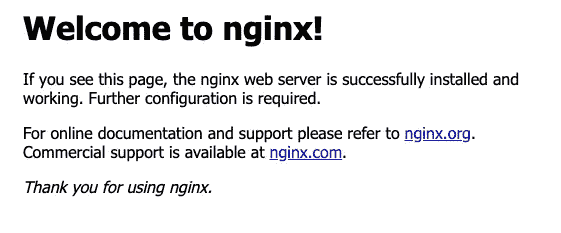
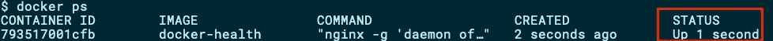
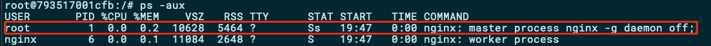
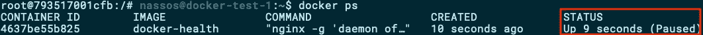
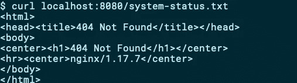
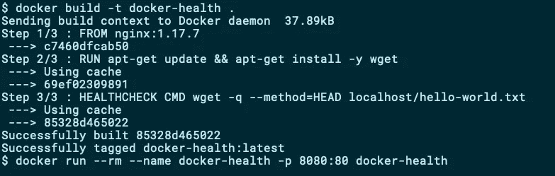
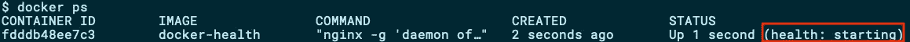
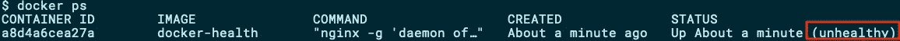
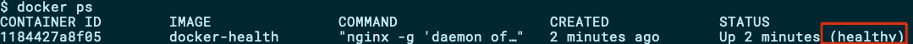

# 如何实施 Docker 健康检查

> 原文：<https://betterprogramming.pub/docker-healthchecks-eb744bfe3f3b>

## 如何判断你的应用程序运行是否正常


照片由[edu·劳顿](https://unsplash.com/@edulauton?utm_source=unsplash&utm_medium=referral&utm_content=creditCopyText)在 [Unsplash](https://unsplash.com/s/photos/happy?utm_source=unsplash&utm_medium=referral&utm_content=creditCopyText) 上拍摄

您的 docker 文件已创建，您的映像已构建，您已准备好投入生产。在一个快速的`docker run`之后，你的容器启动了，你急切地等待你的应用程序开始服务请求。

您等待几秒钟… `docker ps`报告您的容器正在运行，但是没有得到任何服务。发生了什么事？

# 集装箱朝上的半真半假

让我们从使用以下 Docker 文件创建最简单的 Docker 容器开始:

```
FROM nginx:1.17.7
```

构建映像，并启动一个容器:

```
docker build -t docker-health .
docker run --rm --name docker-health -p 8080:80 docker-health
```

NGINX 容器现在正在本地端口 8080 上运行和侦听。继续前进，通过发出`curl localhost:8080`来测试它，或者只是在你的浏览器中打开`[http://localhost:8080](http://localhost:8080)`:



NGINX 在 Docker 中运行(图片由作者提供)

该容器被报告为`Up`，运行几秒钟:



Docker 进程正在运行(图片由作者提供)

但是 Docker 检查什么来报告你的容器正在运行呢？让我们来看看容器内部运行的流程:



容器内运行的进程(图片由作者提供)

由 Dockerfile 的`ENTRYPOINT`或`CMD`启动的过程作为
PID 1 运行。PID 是进程标识号的首字母缩写，在创建时自动分配给每个进程。在任何类似 Unix 的系统上，每个进程都有一个唯一的 PID。在容器中作为 PID 1 运行的进程被特殊对待，因为它忽略任何信号，如`SIGINT`或`SIGTERM`，并且不会终止，除非它被编码为这样做。

只要 PID 1 启动并运行，Docker 引擎将继续报告容器也启动并运行。即使您通过`docker pause`暂停容器，容器仍然被报告为`Up`，但是带有`(Paused)`标志:



暂停的容器(作者图片)

Docker 引擎并不真正知道，也不关心一个容器化的应用程序在做什么。但是我们有。

让我们想象一下，我们基于 NGINX 的容器被创建来服务(除了别的以外)一些包含系统健康信息的静态`system-status.txt`文件。当容器最初启动时，这个文件可能不会立即可用，因为我们可能会以其他方式创建它。让我们尝试在创建容器后不久获取这个文件:



系统状态健康检查文件还不可用(图片由作者提供)

该文件不存在，我们得到了一个 404 错误。这是说集装箱好还是不好？毕竟，我们确实得到了 NGINX 的回复。

虽然这里使用了一个简单的静态文件示例，但是您的检查很可能是关于应用程序 API 的可用性。考虑到您的容器化应用程序可能需要几秒钟才能启动并使其 API 可用，您的容器将被报告为`Up`,尽管现在还不能提供任何服务。

类似地，如果应用程序遇到了导致其 API 端点不可访问的问题，PID 可能仍在运行，但没有客户端能够与之交互。事实上，你最终得到了一个`docker ps`报告运行良好的僵尸容器。

如果 Docker 提供一种方法来执行定制检查而不是它已经在做的过程检查，那不是更好吗？我们，应用程序开发人员，可以用定制的方式定义一个检查，本质上适合于在容器内运行的应用程序？

让我们看看如何做到这一点，并定义一个自定义的健康检查。

# 集装箱健康检查

从 1.12 版本开始，Docker 引擎提供了一种将自定义命令定义为健康检查的方法。虽然这项功能从 2016 年年中开始提供，但仍然看到许多 Docker 图像没有使用它，这令人非常惊讶。

使用`HEALTHCHECK`指令在 Dockerfile 文件中指定自定义健康检查。check 命令是在容器内部执行的，所以要确保它可用。至于它执行的检查类型，只要它返回适当的退出状态代码，它可以是您能想到的任何类型。根据 Docker 官方文档，这些退出代码可以是:

> “0:成功-容器运行正常，可以使用了
> 1:不正常-容器工作不正常
> 2:保留-不使用此退出代码”

在实践中，任何大于`0`的状态代码似乎都工作正常，表明一个失败的容器。

让我们尝试重写上例中使用的 Dockerfile，这次实现健康检查:

```
FROM nginx:1.17.7RUN apt-get update && apt-get install -y wgetHEALTHCHECK CMD wget -q --method=HEAD localhost/system-status.txt
```

首先，Dockerfile 补充了一个`RUN`命令来安装用于定义健康检查的`Wget`客户端。

其次，定义了`HEALTHCHECK`。健康检查包括一个调用，使用`wget`获取定制`system-status.txt`文件的特定 URL。如果找到该文件，该命令的退出代码将是`0`，如果没有找到，它将是`8`(根据 Wget 的官方[退出代码页](https://www.gnu.org/software/wget/manual/html_node/Exit-Status.html)，表示“服务器发出错误响应”)。

## 测试运行状况检查

使用上面的扩展 Dockerfile 文件，让我们构建一个新的映像并重新运行容器:



在启用健康检查的情况下构建和运行容器(图片由作者提供)

发出`docker ps`现在，我们可以看到 Docker 引擎除了报告其`UP`状态之外，还报告了容器的健康状态:



尚未执行健康检查的起始容器(图片由作者提供)

对于健康检查的默认配置，健康检查命令不会立即执行，所以您看到的初始状态是`(health: starting)`。这表明您的容器已经启动，但尚未执行任何健康检查。30 秒后，运行状况检查命令被执行，由于`system-status.txt`不存在，容器现在被报告为`unhealthy`:



不健康的容器(图片由作者提供)

让我们通过创建一个样本`system-status.txt`来修复容器:

```
docker exec docker-health sh -c \
'echo OK > /usr/share/nginx/html/system-status.txt'
```

在接下来的 30 秒内，集装箱应报告为`healthy`:



健康的容器(图片由作者提供)

## 健康检查参数

`HEALTHCHECK`命令也可用于四个不同的选项:

> -间隔=持续时间(默认值:30 秒)
> -超时=持续时间(默认值:30 秒)
> -开始-周期=持续时间(默认值:0 秒)
> -重试次数=N(默认值:3)

`interval`选项指定执行健康检查前最初等待的秒数，以及后续健康检查的执行频率。

`timeout`选项指定了 Docker 等待您的健康检查命令返回退出代码的秒数，然后将它声明为失败(并将您的容器声明为`unhealthy`)。

`start-period`选项指定容器需要引导的秒数。在此期间，退出代码大于零的健康检查不会将容器标记为`unhealthy`；然而，`0`的状态码会将集装箱标记为`healthy`。

`retries`选项指定将容器声明为`unhealthy`所需的连续健康检查失败次数。

## 码头工人群体行为

在 Docker Swarm 中运行容器时，健康检查的一个有用特性是，只要容器处于`unhealthy`或`(health: starting)`状态，路由就被禁用，根本没有请求到达容器。

# 结论

启动容器并不一定意味着应用程序已经启动或者其行为符合设计。Docker 健康检查可以非常容易地实施，并可以帮助您在不正常的行为成为真正的问题之前快速识别它。

下次创建 Dockerfile 文件时，考虑添加健康检查。