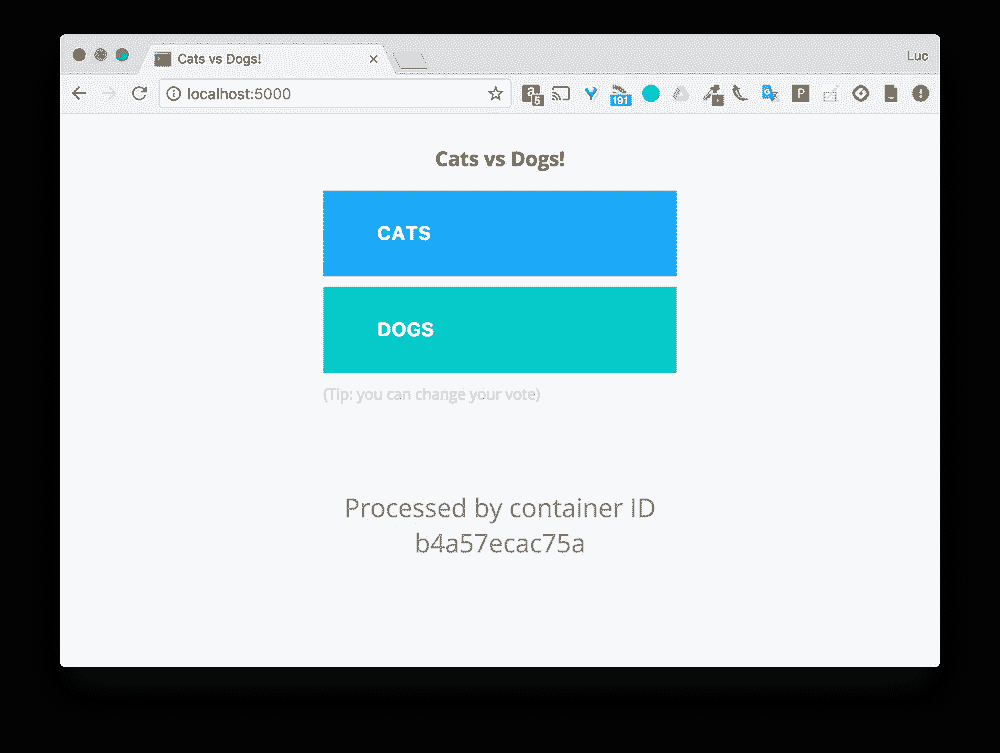
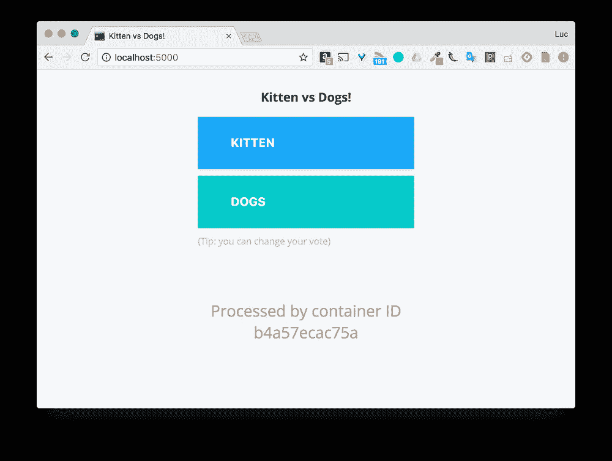
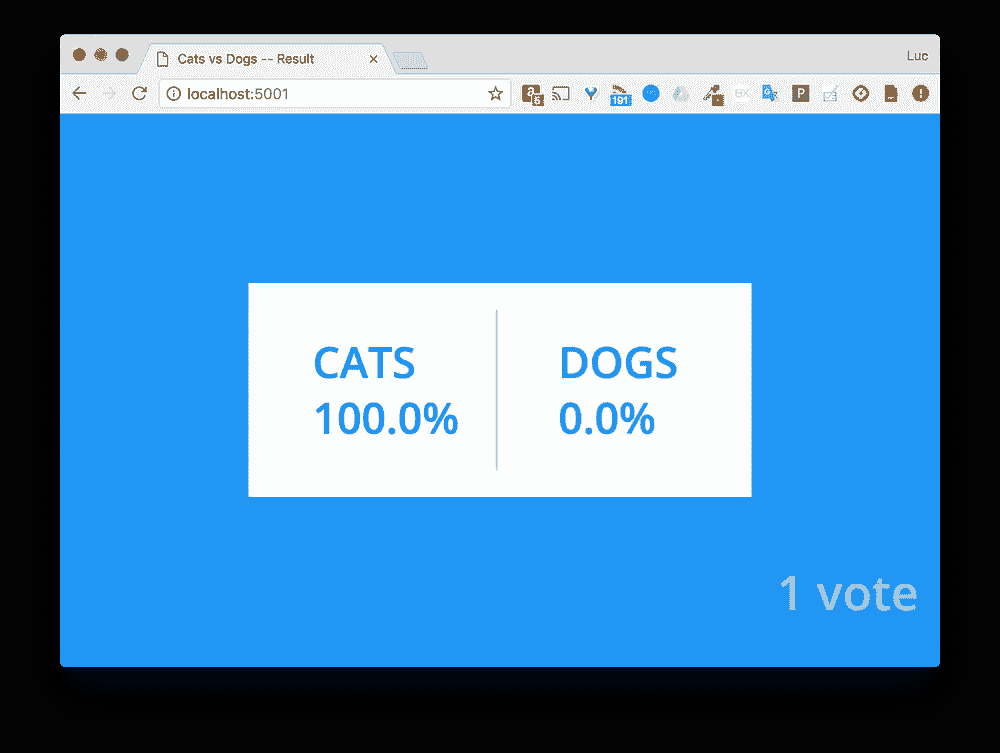
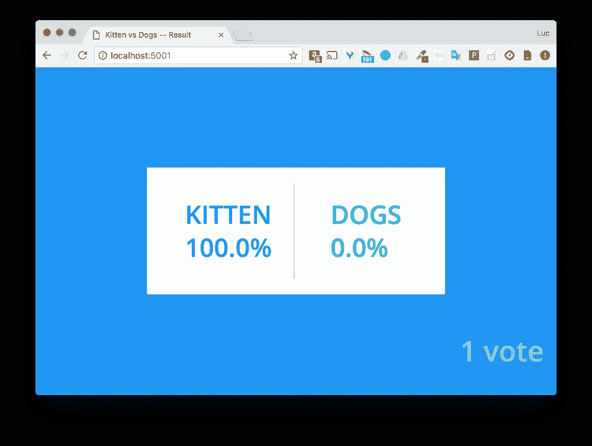

# Docker 提示:使用 Nodemon 进行开发

> 原文：<https://betterprogramming.pub/docker-in-development-with-nodemon-d500366e74df>

## 实时跟踪变化


照片由[杰佛森·桑多斯](https://unsplash.com/@jefflssantos)在 [Unsplash](https://unsplash.com/photos/V9sv7QrDUgc) 上拍摄

# TL；速度三角形定位法(dead reckoning)

在过去的几周里，我进行了几次码头工人培训，一些问题经常出现。例如:

*问:在开发我的应用程序时，我如何让我的更改在容器中自动生效？*

这个问题背后的想法是，对于开发人员来说，在他/她的本地 IDE (Atom、Visual Studio 代码、Eclipse、VI……)中进行更改，然后在运行的应用程序中实时查看这些更改。

通常，我会回答:

*R:在开发过程中，您需要在服务的容器中挂载本地源代码，并通过 nodemon 之类的实用程序启动主进程，它将监视文件，并在观察到一些变化时重启应用程序。*

我意识到这个答案值得一些额外的细节和例子。这就是这篇文章的全部内容。

# 示例应用程序

让我们考虑一下 [Docker](https://www.docker.com/) 投票应用程序。这个经常用于演示和演讲。

这个应用程序遵循微服务架构。如下图所示，它由 5 个服务组成。


Docker 的投票应用架构([https://github.com/docker/example-voting-app](https://github.com/docker/example-voting-app))

*   **投票**:使用户能够在猫和狗之间进行选择的前端
*   **redis** :存储选票的数据库
*   工作人员:从 redis 获取投票，并将结果存储在 postgres 数据库中
*   数据库:存储投票结果的 postgres 数据库
*   **结果**:前端显示投票结果

让我们克隆投票应用程序库:

```
git clone https://github.com/dockersamples/example-voting-app
```

正如我们所看到的，这里定义了几个 Docker 编写文件。在本文中，我们将使用默认名称`docker-compose.yml`。

```
version: "3.3"

services:
  vote:
    build: ./vote
    command: python app.py
    volumes:
     - ./vote:/app
    ports:
      - "5000:80"
    networks:
      - front-tier
      - back-tier

  result:
    build: ./result
    command: nodemon server.js
    volumes:
      - ./result:/app
    ports:
      - "5001:80"
      - "5858:5858"
    networks:
      - front-tier
      - back-tier

  worker:
    build:
      context: ./worker
    depends_on:
      - "redis"
    networks:
      - back-tier

  redis:
    image: redis:alpine
    container_name: redis
    ports: ["6379"]
    networks:
      - back-tier

  db:
    image: postgres:9.4
    container_name: db
    volumes:
      - "db-data:/var/lib/postgresql/data"
    networks:
      - back-tier

volumes:
  db-data:

networks:
  front-tier:
  back-tier:
```

## 结果服务上的插图

让我们仔细看看这个文件中定义**结果**服务的方式。

```
result:
  build: ./result
  command: nodemon server.js
  volumes:
    - ./result:/app
  ports:
    - "5001:80"
    - "5858:5858"
  networks:
    - front-tier
    - back-tier
```

这里有几件有趣的事情:

*   本地的`result` 文件夹被绑定到`/app`文件夹中
*   用于运行服务的命令是`nodemon server.js`

## 绑定安装源文件夹

本地源代码，也就是我们在最喜欢的 IDE 中不断修改的代码，将在服务的容器中按原样提供。换句话说，我们在本地所做的每一个改变都会反映到正在运行的应用程序中。但是，如果我们希望它被应用程序考虑，这个需要重新加载。输入 [*nodemon*](http://nodemon.io) ！

## 使用 nodemon 运行服务

Nodemon 是一款很棒的软件。看一下官方的描述。

> Nodemon 是一个实用程序，它将监视源代码中的任何更改，并自动重启服务器。非常适合开发。— [节点门](https://nodemon.io/)

换句话说，这个家伙在那里监督容器中运行的主进程，如果它检测到周围文件的一些变化，就重新启动它。

**结果**服务是用 [Node.js](https://nodejs.org/) 开发的，所以用 Nodemon 而不是缺省的 node 命令运行它非常容易。

正如我们看到的，在`docker-compose.yml`文件中定义的命令覆盖了 docker 文件中定义的命令。

```
// Command instruction in the Dockerfile
CMD [“node”, “server.js”]// Command instruction in the docker-compose.yml file
command: nodemon server.js
```

为了让 nodemon 对位于`views` 文件夹中的 html 文件的更改做出反应，我们将对在`docker-compose.yml`文件中指定的命令做一点修改，使它看起来像下面这样。

```
// Slight modification of the command instruction
command: nodemon --watch views -e js,html server.js
```

当然，为了让结果服务从 nodemon 开始，我们需要让它在容器中可用。将其安装在**结果**服务的 Dockerfile 中的指令如下。

```
RUN npm install -g nodemon
```

## 不是 Node.js 应用？

Nodemon 与 Node.js 应用程序集成得非常好，但是如果我们使用的应用程序是用另一种语言开发的呢？

没问题… nodemon 可以运行几种类型的应用程序。它还提供了开箱即用的几个选项来观察特定文件夹的变化，并允许提供文件扩展名。让我们在 **vote** 服务上演示一下，这是一个 python flask 应用程序。

*   首先要做的是确保 nodemon 在服务的映像中是可用的。为此，我们首先通过添加以下指令来更改服务的 Dockerfile:

```
# Install nodemon
RUN apk update && apk add nodejs && npm i -g nodemon
```

注 1:由于 [Alpine](https://alpinelinux.org/) 3.8，npm 没有安装 Node.js，需要在上面的命令中`nodejs`旁边添加`nodejsnpm` 包。感谢 Omar Quiroz 指出这一点。

注意 2:由于生产映像中不需要 nodemon，所以添加一个基于构建参数的条件会很好；它只能安装在 dev 中。

*   第二件事是覆盖用于运行服务的命令，以便它使用 nodemon。**投票**服务的定义可以改为:

```
services:
  vote:
    build: ./vote
    command: nodemon --watch template --exec "python" app.py
    volumes:
      — ./vote:/app
    ports:
      — "5000:80"
    networks:
      — front-tier
      — back-tier
```

我们为 nodemon 提供了一些额外的选项

*   -exec“python”:表示我们需要运行的应用程序的类型
*   -观察模板:在 app.py 脚本运行的顶部，我们希望观察模板文件夹中所做的更改

也可以通过一个 *-e* 标志提供我们需要监视的扩展列表。 [nodemon 文档](https://github.com/remy/nodemon#nodemon)提供了可用选项的列表。

## 让我们测试一下

我们现在可以构建 **vote** 服务，这样我们在 Dockerfile 中所做的更改就会生效，然后启动应用程序。

```
$ docker-compose build vote
$ docker-compose up
```

端口 5000 上有**表决**接口，端口 5001 上有**结果**接口。

*   修改**投票**服务的源代码

让我们修改选择选项，将`app.py` 文件中的**猫**改为**小猫**

```
option_a = os.getenv(‘OPTION_A’, “Kitten”)
option_b = os.getenv(‘OPTION_B’, “Dogs”)
```

我们可以在撰写日志中观察到**投票**的自动重新加载。

```
vote_1 | * Detected change in ‘/app/app.py’, reloading
vote_1 | * Restarting with stat
vote_1 | * Debugger is active!
vote_1 | * Debugger PIN: 161–189–800
```

重新加载 web 界面显示了更改



*   修改**结果**服务源代码

让我们也修改出现在**结果**服务的 web 界面中的标签。那些位于`views/index.html`文件中。

```
<head>
    <meta charset="utf-8">
    <title>**Kitten** vs Dogs -- Result</title>
    ...
</head>
<body ng-controller="statsCtrl" >
  ...
  <div id="content-container">
    <div id="content-container-center">
      <div id="choice">
        <div class="choice cats">
          <div class="label">**Kitten**</div>
          <div class="stat">{{aPercent | number:1}}%</div>
        </div>
        <div class="divider"></div>
      <div class="choice dogs">
      <div class="label">Dogs</div>
      <div class="stat">{{bPercent | number:1}}%</div>
    </div>
  </div>
</div>
...
```

我们可以在编写日志中观察到**结果**的自动重载。

```
result_1 | [nodemon] restarting due to changes…
result_1 | [nodemon] starting `node server.js`
```

重新加载 web 界面会显示更改。



# 摘要

在这篇文章中，我们看到了开发人员处理源代码所需的设置，并让它自动被应用到运行在容器中的应用程序中。

一旦我们对代码更改感到满意，我们就可以使用 docker-compose 来构建图像并将其推送到注册中心，从而触发 CI 管道。