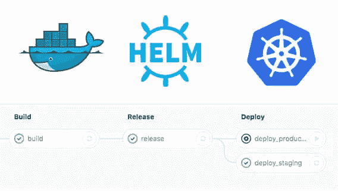
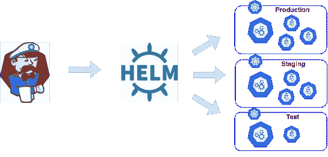

# Docker，Kubernetes 和 Helm

> 原文：<https://betterprogramming.pub/docker-kubernetes-and-helm-4b5a5a87bc8f>

## 它们是什么，为什么要使用它们？

小阿米尔在 [Unsplash](https://unsplash.com/s/photos/container?utm_source=unsplash&utm_medium=referral&utm_content=creditCopyText) 上的照片

您是否曾经将代码从一个环境部署到另一个环境，却不得不花费时间重新配置文件、重新下载库和重做工作，因为操作系统或一般环境与开发环境略有不同？

即使是将不同的应用移植到新环境中，过去也非常耗时。

不仅如此，应用程序可能会受限于它们可以运行的操作系统，并且需要更多的资源。

*注:基于* [*亚历山大·萨特米尼*](https://medium.com/u/dcc4d93339fd?source=post_page-----4b5a5a87bc8f--------------------------------) *问题。Docker 可在 Windows Server 2016 及更高版本上运行。在此之前，您必须在 Windows Server 2012 上的虚拟机上运行 docker。*

随着容器的普及，这种情况已经发生了很大的变化。

# 什么是集装箱和集装箱化？

简而言之，容器将代码及其依赖项打包，这样它就可以在不同的环境中可靠而高效地运行。容器化是指将应用程序与库、依赖项和配置文件捆绑在一起，以便在多个计算环境中高效运行。

## 集装箱化的好处

我们想讨论作为开发人员您可能会遇到的三种技术。但是首先，如果您以前没有使用过容器，让我们看看它们的一些好处:

*   **资源效率:**一个主要的好处是资源的效率。容器不需要单独的操作系统，所以它们占用的资源更少。有些人可能会认为容器为虚拟机提供了类似好处。然而，虚拟机的大小通常是千兆字节。容器通常在兆字节范围内。
*   **平台独立性:**容器的可移植性是另一个巨大的好处。应用程序的所有依赖项都被包装起来，允许您在公共和虚拟服务器的不同环境中轻松运行应用程序。这为组织提供了极大的灵活性，加快了开发过程，并允许开发人员轻松切换到其他云环境。
*   **有效的资源共享:**虽然容器运行在同一个服务器上，共享相同的资源，但是它们并不相互通信——如果一个应用程序崩溃，另一个将继续完美地运行。这种有效的资源共享加上隔离降低了安全风险——一个应用程序的负面影响不会传播到其他正在运行的容器。
*   **可预测的环境:**容器允许开发人员创建与其他应用程序隔离的可预测的环境。因此，容器化允许程序员在工作中保持一致性，无论应用程序部署在哪里。
*   **平滑缩放:**容器的另一个主要好处是水平缩放。在集群环境中工作时，您可以添加相同的容器来扩展整个流程。借助智能秤程序，您可以实时运行容器，并大幅降低资源成本。这也加速了您在使用容器时的投资回报。Twitter、网飞和谷歌等主要供应商已经在使用这一功能。

# 集装箱管理的演变:从码头工人到舵手

尽管容器提供了许多优势，但它们也带来了许多新的复杂性。尤其是微服务的概念越来越突出。

不仅需要创建容器，还需要更好地管理它们，这已经变得很重要。接下来，我们将讨论三种当前流行的容器和容器管理技术。

## **码头工人**

你不能谈论集装箱而不谈论 Docker。

许多人认为 Docker 是第一个容器技术，但事实并非如此。如果你想了解更多，Linux 学院有很棒的容器历史。

现在轮到 Docker 了。

Docker 是一个基于 Linux 容器的开源项目。这个容器引擎是在 Dotcloud 上开发的。Docker 让开发人员能够专注于编写代码，而不必担心应用程序将在哪个系统上运行。

Docker 有一个客户服务器架构。这意味着 Docker 服务器负责所有与容器相关的操作。该服务器使用 REST API 或 CLI 通过 Docker 客户端接收命令。

像 [docker run](https://docs.docker.com/engine/reference/run/) 或 [docker build](https://docs.docker.com/engine/reference/commandline/build/) 这样的命令。

还有更进一步的细微差别值得探究。我们推荐阅读 Stackify 的 Docker Image vs container，因为它很好地涵盖了其中一些内容。

 [## Docker 图像与容器:您需要知道的一切

### Docker 是创建和部署应用程序的强大工具。它简化了跨…部署应用程序

stackify.com](https://stackify.com/docker-image-vs-container-everything-you-need-to-know/) 

## 库伯内特斯

最初由 Google 开发的 Kubernetes 是一个开源系统，用于管理不同环境中的容器化应用程序。这个项目的主要目标是提供更好的方法来管理跨不同基础设施的应用程序的服务或组件。Kubernetes 平台允许您定义您的应用程序应该如何运行或如何与环境交互。作为用户，您可以方便地扩展服务和执行更新。

Kubernetes 系统是以分层的形式构建的，每一层都抽象出较低层次中的复杂性。首先，基础层通过共享网络将虚拟机和物理机带入集群。这里，其中一个服务器充当主服务器，并作为网关向客户端和用户公开 API。

从这里开始，有其他机器充当节点，从主节点获得如何管理不同工作负载的指令。每个节点都需要运行某种形式的容器软件，以确保它能够正确地遵循主节点提供的指令。为了更好地理解这个话题， [Digital Ocean 进一步阐述了这个话题](https://www.digitalocean.com/community/tutorials/an-introduction-to-kubernetes)。

## **掌舵**

Helm 是一个应用程序包管理器，可以在 Kubernetes 上运行。这个程序允许你通过舵图来描述应用程序的结构，通过简单的命令来管理。Helms 是一个巨大的转变，重新定义了服务器端应用程序的管理、存储甚至定义方式。这个管理器简化了微服务的大规模采用，因此您可以使用几个迷你服务而不是单一的应用程序。此外，您可以从现有的松散耦合的微服务中组合出新的应用程序。

该工具通过呈现模板和与 Kubernetes API 通信来简化 Kubernetes 应用程序的管理和安装。这个管理器可以很容易地存储在磁盘上，并通过诸如 RedHat packages 和 Debian 之类的图表库获取。

## Helm 是如何工作的？

Helm 将应用程序的逻辑组件分组到一个图表中，因此您可以在一段较长的时间内方便地部署和维护它们。每次图表被部署到集群时，Helm 的服务器端组件都会创建它的发布。该版本跟踪应用程序的部署情况。借助 Helm，您几乎可以部署任何东西，从 Redis 缓存到复杂的 web 应用。

# 结论

容器化并不是一个新概念，Docker 也不是唯一允许开发者轻松配置其容器的技术。然而，能够理解好处并知道如何使用容器产生了很大的影响。容器有助于简化部署和代码维护。

下面让我知道你的想法。