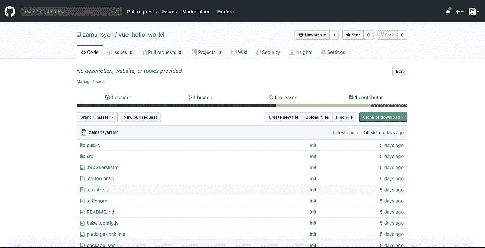
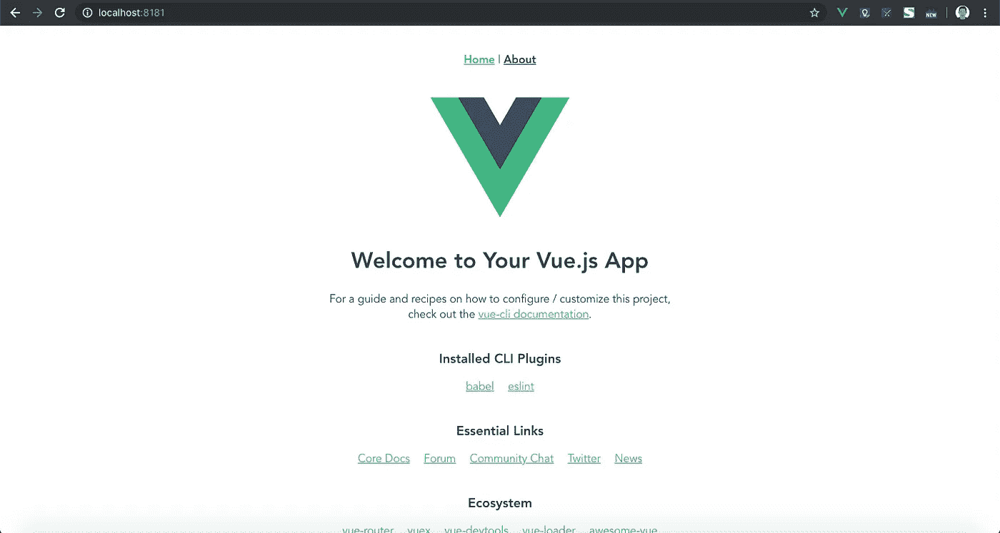

# Docker 多阶段构建

> 原文：<https://betterprogramming.pub/docker-multi-stage-build-build-from-one-image-copy-to-another-image-c76cdc62ba7e>

## 从一个映像构建，复制到另一个映像


图片由来自 [Pixabay](https://pixabay.com/?utm_source=link-attribution&utm_medium=referral&utm_campaign=image&utm_content=943245) 的[鲁迪和](https://pixabay.com/users/Skitterphoto-324082/?utm_source=link-attribution&utm_medium=referral&utm_campaign=image&utm_content=943245)彼得·斯皮特林拍摄

我现在就要清理我的服务器*。如果只是为了构建应用程序，为什么要安装 Node 呢？最后，Nginx 负责服务器端。*

*如果你像我一样懒，这篇文章是给你的！*

*在服务器上安装所有东西的日子已经一去不复返了。如果您有 10 台服务器会怎样？20 台服务器？40 台服务器？一个接一个地在服务器上安装所有东西是一个可怕的想法。*

*现在你所要做的就是确保每台服务器都已经安装了 Docker 和 Git，你就可以开始了！目标是部署最新的代码——我们所要做的就是 git pull 和 docker-compose up。整洁！*

*我们将把 [Vue](https://vuejs.org/) 项目编译成静态 html，并用 Nginx 服务它。首先，你需要有 Vue 项目——在这里克隆 hello world Vue。*

**

*hello world Vue*

*接下来进入 *vue-hello-world* 目录，创建新的两个文件并命名为 Dockerfile 和 docker-compose.yml。*

## *第一阶段*

*   *拉节点图像*
*   *将当前目录复制到节点映像中*
*   *安装项目依赖项*
*   *构建项目*

## *第二阶段*

*   *拉 Nginx 图像*
*   *将构建的项目文件夹从阶段 1 复制到 nginx*

```
*FROM node AS node
COPY . /root
WORKDIR /root
RUN npm install
RUN npm run build
RUN echo 'BUILD SUCCEEDED'FROM nginx:alpine
COPY --from=node /root/dist /usr/share/nginx/html
RUN echo 'ATTACHED TO NGINX'*
```

*如果您想知道， *npm run build* 将创建一个包含静态 html 的新的 *dist 目录*。Nginx 提供的就是这个静态 html。*

*然后，在 **docker-compose.yml** 中，我们需要编写 config 来构建镜像，并打开一个特定的端口向现实世界开放。*

```
*version: '3'
services:
  app:
    build: .
    ports:
    - "8181:80"
    command: 'nginx -g "daemon off;"'*
```

*搞定了。现在我们需要测试它。转到 *vue-hello-world* 目录并执行该命令:*

```
*docker-compose up*
```

**

*准备发球*

*Docker 现在将基于 Dockerfile 脚本构建映像。等待几分钟，您的应用程序将在 localhost:8181 上提供。*

**

*本地主机:8181*

*最后，当您的团队成员之一提交 repo 上的更改并想要部署时，您所要做的就是 git pull 和 docker-compose up。*