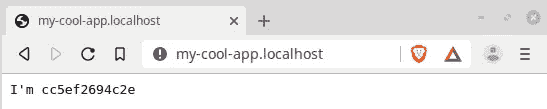
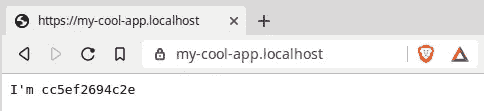

# 利用 HTTPS 和本地域名的 Docker 驱动的 Web 开发

> 原文：<https://betterprogramming.pub/docker-powered-web-development-utilizing-https-and-local-domain-names-a57f129e1c4d>

## 适用于 Linux、macOS 和 Windows 的独立于平台的解决方案


您是否正在寻找一个利用 HTTPS 交通、本地域名和灵活的服务基础设施的本地开发环境？本文概述了一个独立于平台的解决方案。

现代 web 应用程序开发中最大的挑战之一是传输层安全性。

是的，在公共 web 服务器上，这个问题很快就解决了——只需使用[让我们加密](https://letsencrypt.org/)或任何其他认证机构。

然而，如果您想在本地开发网络中实现 HTTPS，这仍然是复杂和耗时的。

另一个挑战是实现尽可能接近生产服务器条件的本地开发环境。如果这还不够，几个项目之后，开发人员必须处理一大堆 web 服务器和数据库——以及它们的各种版本。

项目 A 需要 [Apache](https://www.apache.org/) 和 [MySQL](https://www.mysql.com/) ，而项目 B 运行的是 [NGINX](https://www.nginx.com/) 和 [MongoDB](https://www.mongodb.com/) 。一个较老的项目 C 也需要 MongoDB，但是与其最新版本不兼容。

因此，作为开发人员，我们需要一个由本地服务器、数据库和运行时环境组成的网络，所有这些都通过 HTTPS 进行通信，并且可以通过本地域名到达。

我们希望有一种简单、快速、灵活的方式在几种这样的环境之间进行切换。

# **具有 **Docker** 的灵活**环境

输入 [Docker](https://www.docker.com/) :

> 操作系统级别的虚拟化开发和交付叫做容器的软件包(维基百科)。

有了 Docker，在所谓的容器中启动服务变得非常容易——并且在切换到另一个项目时快速停止它们。

任何项目都可以由几个容器组成，Docker 和一些第三方项目为我们提供了编排这些容器的工具。

这不是对 Docker 的介绍。为此，我参考了全面的 [Docker 文档](https://docs.docker.com/)。

这也不是对 HTTPS 或 SSL 的介绍。为此，我建议您去 Google 或当地的书店，因为您不仅需要介绍，还需要大量的文档来在您的特定系统中实现它。

或者，如果你想要一个快速的解决方案，请继续阅读。

这是一个关于如何实现本地 web 开发环境的介绍，在本地 web 开发环境中，服务器和客户端通过 HTTPS 进行通信，并且服务器和运行时环境很容易设置。

作为奖励，我们将在我们的服务中应用本地域名，如`my-cool-app.localhost`。

我会尽可能保持设置的通用性。如果我们想开发一个运行在 Apache/MySQL 上的 [WordPress](http://wordpress.org) 网站，或者为一个 [Nuxt](https://nuxtjs.org/) / [Vue.js](https://vuejs.org/) 客户端开发一个 [Node.js](https://nodejs.org/) API，这都没有关系。

概念基本上是相同的，我将用一个简单的例子来说明整个过程。

# **一个关键概念:反向代理**

在许多现代 web 应用程序中，一个关键概念是*反向代理*。

反向代理从客户端获取请求，并将其传输到内部网络中的服务器。因此，服务器对客户端是隐藏的。

我们的 web 服务运行在内部网络中，而通信通过反向代理进行。代理管理一切，还建立 HTTPS 端点。

这就是 Docker 的闪光点:它不仅是一个启动我们的服务器和数据库的工具，也是管理它们之间的网络的工具。

有 Docker 容器可用，不仅适用于几乎任何类型的服务器或数据库，也适用于我们的反向代理。我们只需要稍微配置一下。我保证，真的就一会儿。

# **先决条件**

1.  安装 Docker。你可能想要社区版。关于如何在 Linux、macOS 或 Windows 上安装 Docker，参见[官方文档](https://docs.docker.com/install/)。
    我们还将使用 Docker Compose 来配置我们的多容器应用程序。在 macOs 和 Windows 上，很可能已经安装了 Docker。对于 Linux [请参见文档](https://docs.docker.com/compose/install/)。
2.  安装 [OpenSSL](https://www.openssl.org/) 。创建自签名证书需要此工具。OpenSSL 几乎适用于所有操作系统。

# **我们的第一个集装箱栈**

一个流行的反向代理是 Jason Wilder 的 [nginx-proxy](https://github.com/jwilder/nginx-proxy) ，这是一个预配置的 Docker 容器，可以自动完成很多配置。

我们可以在任何运行 Docker 的系统上用一个命令启动它:

```
$ docker run -d -p 80:80 -v /var/run/docker.sock:/tmp/docker.sock:ro jwilder/nginx-proxy
```

然后启动附加服务，如下所示:

```
$ docker run -e VIRTUAL_HOST=my-funny-project.dev …
```

Nginx-proxy 会自动创建一个虚拟主机域`my-cool-app.localhost`并通过反向代理连接我们的服务。这再简单不过了。

然而，如果我们使用 Docker Compose，多容器应用程序的配置和启动将会更加简单。

服务及其所有设置都在一个名为`docker-compose.yml`的文件中进行配置:

使用以下命令在该文件夹中启动 Docker Compose:

```
docker-compose up
```

所有需要的 Docker 映像都被自动下载，从这些映像构建容器，然后启动。

我们的第一个多容器应用程序已经启动并运行——太神奇了。

但是在我们使用它之前，让我们来看看 docker-compose 配置文件的细节(上面的`docker-compose.yml`)。

每个服务都在它自己的部分中定义。在本例中，这些服务是 web 服务器和 ningx-proxy。对于每个服务，我们配置 Docker 映像、环境变量、端口、挂载的卷等。[参见文档](https://docs.docker.com/compose/compose-file/)了解所有选项。

代理只需要对主机系统的 Docker 套接字进行只读访问，以及关于它应该监听的端口的信息。该示例使用标准 web 端口 80，因此我们可以使用任何浏览器并打开`my-cool-app.localhost`:



回应来自我们新的网络服务器。在这个例子中，我们使用 Jason Wilder 的非常基本的 web 服务器 WhoAmI，它只返回运行它的 Docker 容器的 ID；服务已启动并正在运行的简单指示。

我们可以继续复制 web 服务器部分，将其命名为 *webserver2* ，并给它一个不同的本地域。

重启 Docker Compose 后，两台服务器都应该可以通过 nginx-proxy 使用。从现在开始，这只是向更复杂的具有真实服务的应用程序迈出的一小步，其中我们可以通过每个服务自己的本地域来访问每个服务。

然而，截图已经指向了我们的下一个挑战:URL 旁边是一个感叹号，表示浏览器不信任该连接(其他浏览器可能会有其他信号来警告)。

出现警告的原因是该页面是通过 HTTP 提供的，没有加密。因此，让我们让 HTTPS 为我们的服务。

# **本地 SSL 加密**

如果您喜欢上一节中本地域的简单配置，您会更喜欢这一部分。

要启用 HTTPS，我们只需在配置文件中添加两行:

这些行配置了额外的端口 443(HTTPS 的标准)和一个名为`.certs`的文件夹的安装，我们的 SSL 证书就在这个文件夹中。

如果证书名称中包含虚拟主机域，nginx-proxy 会自动配置每个连接使用相关的证书，并通过 HTTPS 提供服务——神奇！

唯一的问题是:我们很可能不拥有像`my-cool-app.localhost`这样的本地域的有效证书。但是我们可以创造一个。

在最后一部分，我们创建了一个*自签名证书*。我们成为自己的根证书颁发机构。这很酷——我们通过这样做学到了一些东西。

# **自签名证书的创建**

我们可以在文件夹`.certs`中执行所有后续步骤，也就是 nginx-proxy 也用于 HTTPS 配置的那个文件夹。

流程如下:

1.  首先，我们将创建一个*根 SSL 证书*，也称为 *CA 证书*或简称为*根 CA* 。这必须只做一次。
2.  然后，我们将为每个本地域生成一个证书，并用这个根 CA 进行签名。我写了一个 [bash 脚本](https://gist.github.com/OnnoGeorg/f717192ed92bf55725337358f4af5ab2)来自动化这个过程，但是现在，我们将一步一步地完成整个过程。

## **1。根 CA 的创建**

首先，我们为根 CA 生成一个私钥，一个名为`rootCA.key`的文件:

```
$ openssl genrsa -out rootCA.key 4096
```

这个密钥是*而不是*密码保护的(如果我们在命令中添加参数`-des3`就可能是这样)。

请注意，这里描述的过程只是针对您的本地开发环境。不要在生产中使用它！

现在，我们通过回答一些关于我们的问题对生成的密钥进行自签名:

```
$ openssl req -x509 -new -nodes -key rootCA.key -sha256 -days 1024 -out rootCA.crtYou are about to be asked to enter information that will be incorporated into your certificate request.
What you are about to enter is what is called a Distinguished Name or a DN.
There are quite a few fields but you can leave some blank.
For some fields, there will be a default value, If you enter '.', the field will be left blank.
-----
Country Name (2 letter code) [AU]:DE
State or Province Name (full name) [Some-State]:Berlin
Locality Name (eg, city) []:Berlin
Organization Name (eg, company) [Internet Widgits Pty Ltd]:My-Company
Organizational Unit Name (eg, section) []:Development
Common Name (e.g. server FQDN or YOUR name) []:My-Company
Email Address []:xxx@yyyy.zz
```

我们在这里输入什么并不重要。`Common Name`稍后会出现在我们的可信机构列表中，所以我们应该选择一个容易识别的名称。

现在我们拥有了成为我们自己的认证中心的一切。至少对于我们自己的目的来说是这样，因为世界上还没有浏览器知道我们的 CA。

为了让浏览器熟悉我们的根 CA，我们必须导入它。

*   在 macOS 上，我们可以将根 CA 添加到钥匙串中。
*   在 Linux 或 Windows 上，我们可以将根 CA 导入到浏览器中的可信机构。

每个浏览器都有不同的设置页面，所以请查看您的浏览器文档(或者搜索“在 chrome/firefox/edge/”中导入根 ca)。

## **2。为每个域创建一个证书**

下一步是为本地域创建证书，例如为`my-cool-app.localhost`。

同样，我们首先创建一个私钥:

```
$ openssl genrsa -out my-cool-app.localhost.key 2048
```

然后，我们为这个密钥创建一个签名请求:

```
$ openssl req -new -sha256 -key my-cool-app.localhost.key -out my-cool-app.localhost.csr
```

我们将再次被问到一些问题。重要的是关于通用名称的:这个*必须等于我们的本地域*(例如`my-cool-app.localhost`)。

最后一步是用根 CA 签署您的证书。

为此，我们需要一个名为`my-cool-app.localhost.v3.ext`的小配置文件:

```
authorityKeyIdentifier=keyid,issuer
basicConstraints=CA:FALSE
keyUsage = digitalSignature, nonRepudiation, keyEncipherment, dataEncipherment
subjectAltName = @alt_names
[alt_names]
DNS.1 = my-cool-app.localhost
```

这里重要的是最后一行，它也包含本地域。

对于这个域，我们现在可以用根 CA 签署证书:

```
$ openssl x509 -req -in my-cool-app.localhost.csr -CA my-cool-app.localhost.crt -CAkey my-cool-app.localhost.key -CAcreateserial -out my-cool-app.localhost.crt -days 1024 -sha256 -extfile my-cool-app.localhost.v3.ext
```

这最终创建了我们的证书:`my-cool-app.localhost.crt`。

`.certs`文件夹现在应该包含`my-cool-app.localhost`的密钥和证书。

重启 Docker Compose，nginx-proxy 现在应该可以通过 HTTPS 为我们的演示应用提供服务了:



# **结论**

我们已经用 Docker Compose 为多容器 web 应用程序建立了基本的框架。

服务运行在反向代理的后面，该代理不仅组织所有服务和客户端之间的通信，还为每个服务设置本地域名和通过 HTTPS 的 SSL 传输。

这个开发环境可以很容易地用我们需要的任何服务来扩展。