# 如何用 Docker 快速创建自定义图像

> 原文：<https://betterprogramming.pub/docker-quickly-create-a-custom-image-372cd1e2a450>

## 集装箱化的新手？你猜对了！

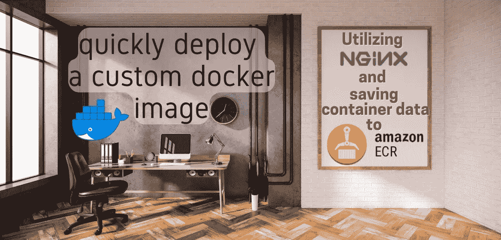

Docker 为用户提供了一种快速开发、发布和运行应用程序的方式。我只是刚刚开始了解这个平台的皮毛。

本演练面向像我一样对 Docker 和容器化相对陌生的人。本文的目的是介绍一种创建和部署 Docker 容器的简单方法，其中包含一个表示容器部署日期的文件。

# **先决条件和资源考虑**

*   我将利用 [**AWS Cloud9**](https://aws.amazon.com/cloud9/) 作为我的 IDE(集成开发环境)。这项服务非常适合那些需要快速管理无服务器工作流的 Docker 新手，他们可以专注于开发而不是安装必要的工具。它预先打包了流行的 SDK、插件、库和编程语言。如果你选择不使用 Cloud9，你将不得不[安装 Docker](https://docs.docker.com/get-docker/) ，以及其他必要的工具。

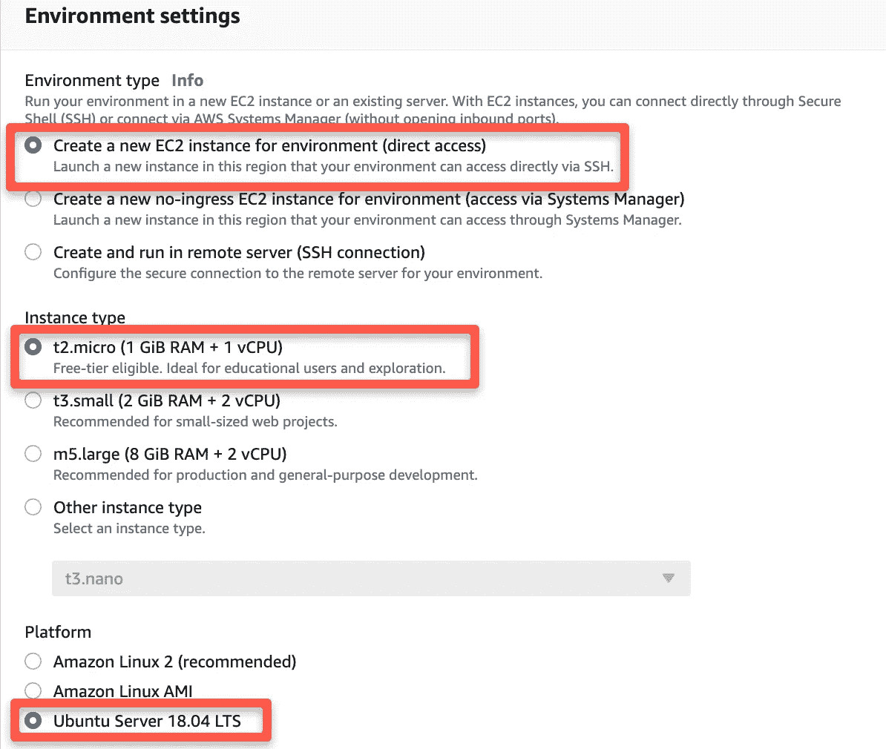

Cloud9 设置:Shell — **创建一个新的 EC2 实例**，实例类型— **t2.micro** ，平台— **Ubuntu 18.04 LTS**

一旦创建了 Cloud9 环境，向安全组添加一个入站规则，以允许实例访问端口 80。

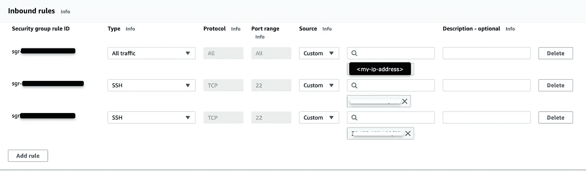

导航到 EC2 以识别 Cloud9 实例，然后从仪表板中选择“Security groups”以添加入站规则。

*   [**AWS 弹性容器注册表**](https://aws.amazon.com/ecr/?trk=d66ebef2-a56b-4c4d-9630-4d0838c2f114&sc_channel=ps&sc_campaign=acquisition&sc_medium=ACQ-P|PS-GO|Non-Brand|Desktop|SU|Containers|Solution|US|EN|DSA&ef_id=Cj0KCQjwheyUBhD-ARIsAHJNM-PSwubdCm0gDMZobSdceSiNSkrTNoBZ-oZqRM303XED7oPiD7cXDn0aAs3eEALw_wcB:G:s&s_kwcid=AL!4422!3!579408225584!!!g!!) ( **ECR** ) —创建自定义图像创建容器后，数据会保存到 ECR。这将提供一种安全、高可用性的方法来保存和发布容器图像。

# **使用 Dockerfile 文件创建容器**

一个 [Dockerfile](https://docs.docker.com/engine/reference/builder/) 是一个简单的文本文件，包含了组装一个定制图像所需的所有指令。Dockerfile 易于复制且高效，允许开发人员快速创建容器，而无需在 CLI 中使用长字符串。

1.  在 Cloud9 中，使用下面的命令打开一个终端来提取 NGINX 映像:`$ docker pull nginx:latest`。要确认图像已被提取，请运行命令`$ docker images`。

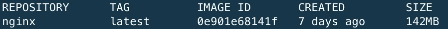

Dockerfile 将在创建容器的命令中引用这个图像。

2.在您想要的目录中创建 Docker 文件，确保保持大写以便 Docker 能够识别它。(* *如果使用终端，确保使用`$ cd ,name-of-directory>`进入所需目录，并使用命令`$ touch Dockerfile`创建文件。)创建完成后，打开文件。

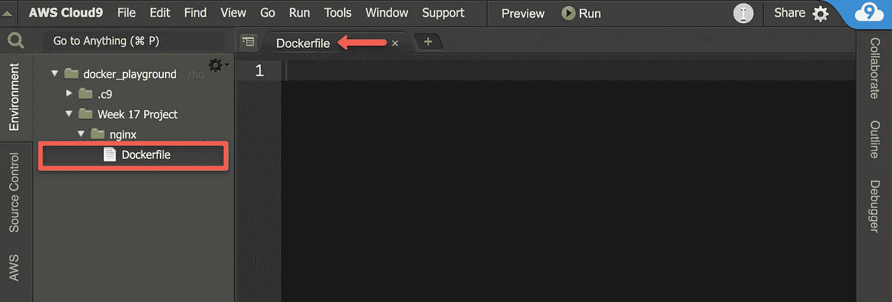

我在 Cloud9 的环境窗格中直接创建了 Dockerfile，以确保它位于正确的目录中。

3.在 docker 文件中，您希望根据[文档](https://docs.docker.com/engine/reference/builder/)为您想要构建的映像提供说明。出于本演练的目的，我们将使用一个 **NGINX** 基本映像，使用**端口 8080** ，以及一个包含容器部署日期的文件。

此外，您将需要创建一个 index.html，其中包含提供容器部署日期的代码。

对于 index.html，请随意查看其他方法来更改代码，使网页独特，如改变颜色和字体！

4.在包含 Dockerfile 文件的目录中，使用`$ docker build -t nginx1 .`构建新的映像。( *我将这张图片命名为* `nginx1` *以区别于我从资源库中提取的图片。)*

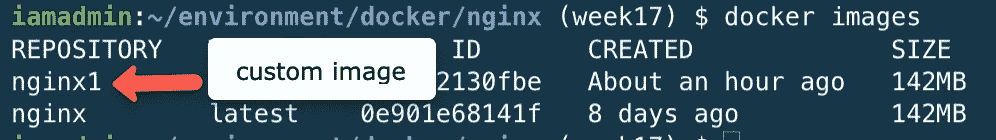

确认图像是使用$ docker 图像构建的

使用`$ docker run -d --name <container-name> -p 8080:80 nginx1`从这个新的定制图像创建容器。该命令将创建具有自定义名称的容器(—如果不包括`--name`选项，将随机为容器分配一个名称)，在后台运行容器(`-d`，在端口 80 将容器的端口 8080 暴露给公共互联网(`-p 8080:80`，并使用自定义映像(`nginx`)。

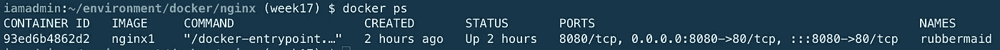

确认已经使用$ docker ps 创建了容器

5.使用`$ curl localhost:8080`确认容器文件能够通过指定端口(8080)访问互联网。

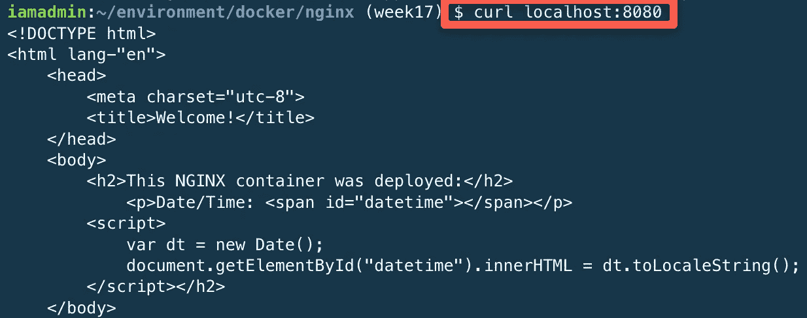

如果成功，输出应该如上所示，并显示 index.html 页面代码。

由于我们使用的是 Cloud9，我们需要使用运行环境的 EC2 实例的公共 IP，通过将`<public-ip-address-of-instance>:8080`粘贴到搜索栏来在浏览器中进行测试。

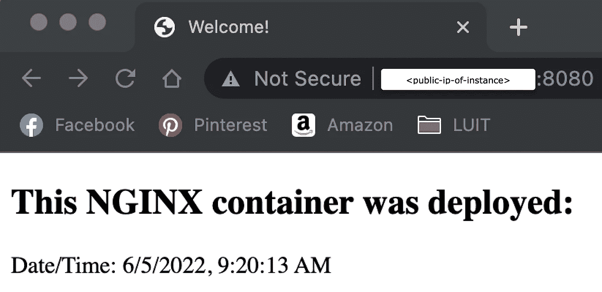

页面根据 Dockerfile 指令正确运行脚本！

***提示*** *:让页面变得有创意，在 html 中改变颜色和样式，以获得一些不同的东西..*

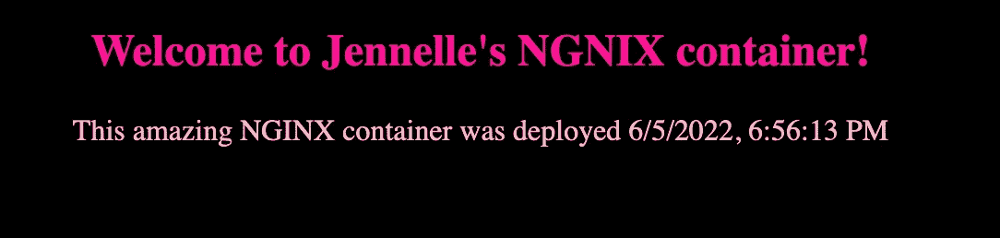

这张图片是使用一些样式选项的 index.html 的另一个视图。

# 通过将集装箱数据推送到 AWS ECR 来保存集装箱数据

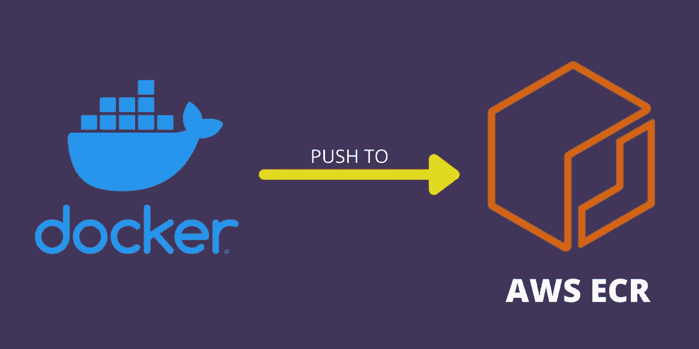

1.  从 **AWS 管理控制台**，导航到**弹性容器注册→创建库→** *选择* **“开始”**。

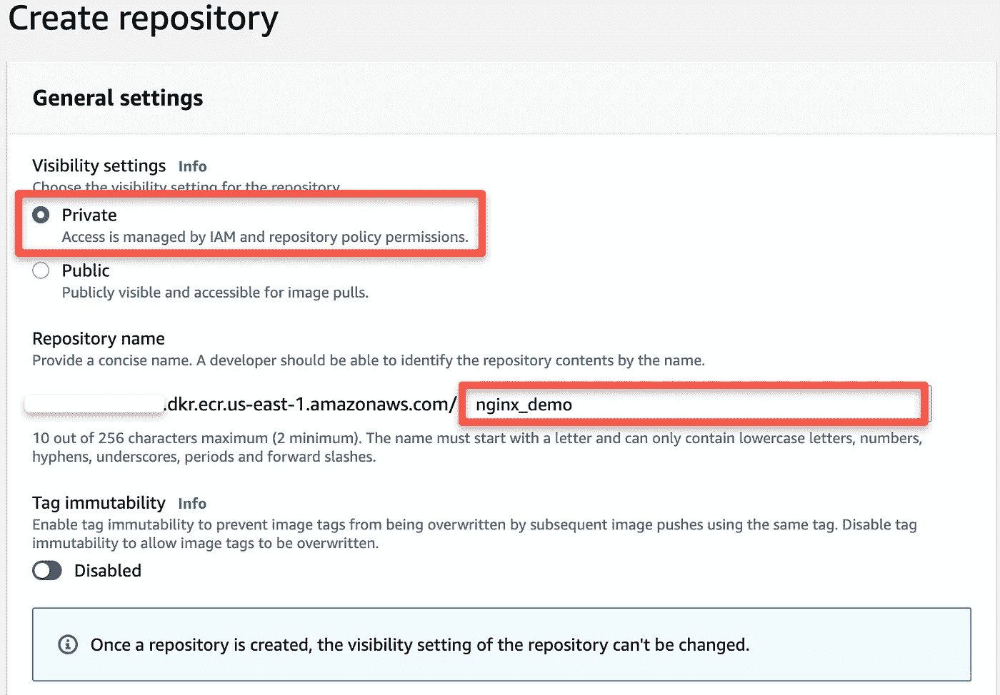

选择所需的可见性设置和存储库名称，保留其他默认设置，然后单击“**创建存储库**”。

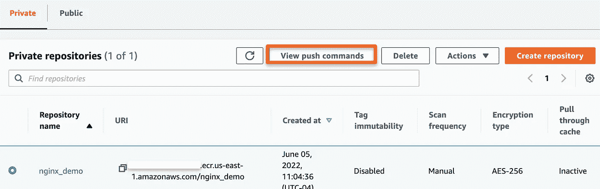

选择**查看推送命令**以访问弹出窗口，该窗口将提供用于将容器数据推送到存储库的 CLI 命令。

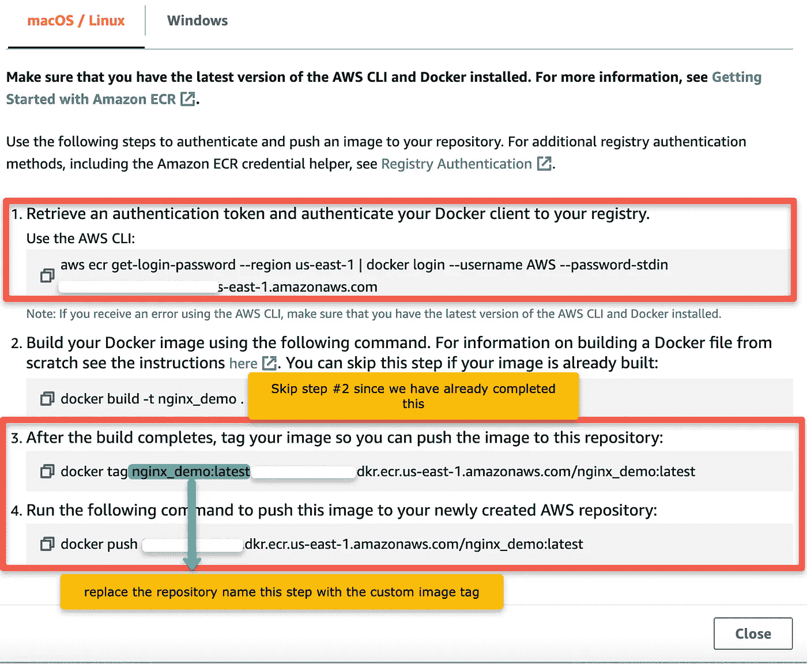

复制步骤 1 的命令，并在终端中运行它。跳过步骤 2，因为映像已经构建好了。对于第 3 步，修改命令以在“docker tag”后包含 image 标记，而不是 repo 名称。

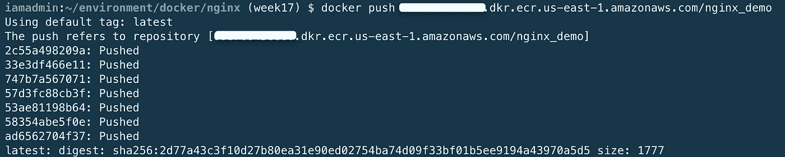

步骤 4 的输出应该如上图所示。

完成推送命令后，您创建的自定义图像应该出现在 ECR 中的**图像**中。

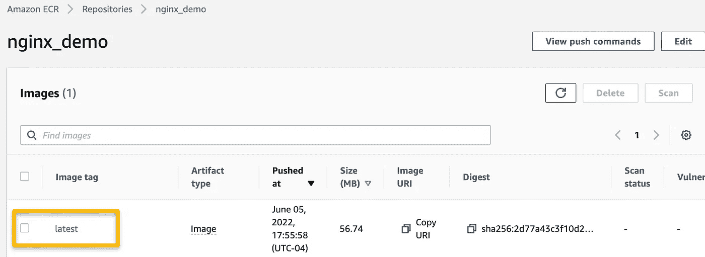

上图显示 push 命令成功地将自定义映像推送到 ECR 存储库。

确保使用`$ docker rm -f $(docker ps -a -q)`(用于容器)和`$ docker rmi -f $(docker images -a -q)`(用于创建的任何图像)移除终端中的容器和图像。

现在图像存储在 ECR 中，可以提取以备将来使用！