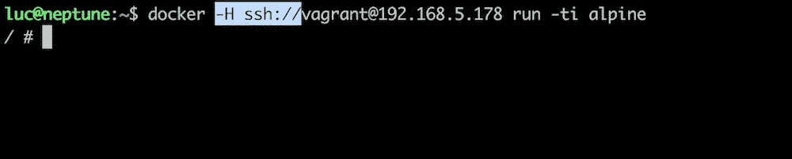

# Docker 提示:通过 SSH 访问 Docker 守护进程

> 原文：<https://betterprogramming.pub/docker-tips-access-the-docker-daemon-via-ssh-97cd6b44a53>

## 从 Docker 18.09 开始，可以通过 ssh 访问该守护进程



# 客户端/服务器通信

Docker 客户端通常通过 unix 套接字`/var/run/docker.sock`在本地与守护进程通信，或者通过 TCP 套接字在网络上与守护进程通信。下面是启动时提供给 Docker 守护进程的选项的典型示例。

```
**$ ps aux | grep dockerd**
root 2900 0.1 4.4 388008 45424 ? Sl 09:28 0:01 /usr/local/bin/dockerd -g /var/lib/docker 
**-H unix:// 
-H tcp://0.0.0.0:2376** 
--label provider=virtualbox 
--tlsverify 
--tlscacert=/var/lib/boot2docker/ca.pem
--tlscert=/var/lib/boot2docker/server.pem
--tlskey=/var/lib/boot2docker/server-key.pem
--storage-driver aufs
```

这里有两个与客户机/服务器通信相关的重要标志:

*   `-H unix://` *，*指本地 unix 套接字`/var/run/docker.sock`。在本地，Docker 客户机使用这个套接字与守护进程通信。
*   `-H tcp://0.0.0.0:2376`通过端口 2376 上的任何网络接口使守护程序可用。这个端口需要在安全组中打开(如果可能，限制为 IP 地址的白名单)，这样远程客户端就可以访问守护程序。

由于 SSH 被广泛使用，并且通常是默认允许的协议之一，所以通过 SSH 直接访问 Docker 守护进程可能会很方便。Docker 18.09 让这成为可能，我们来测试一下。

# 虚拟机的创建

我们将首先创建一个新的 Docker 主机，并确保它运行最新的 Docker 版本。我们使用[vagger](https://www.vagrantup.com/)，一个来自 [Hashicorp](https://www.hashicorp.com/) 的伟大工具，在 [VirtualBox](https://www.virtualbox.org/) 上供应和配置本地虚拟机。在新文件夹中，我们运行以下命令:

```
$ vagrant init ubuntu/bionic64
```

这将生成一个名为“浮动文件”的文件，该文件定义了虚拟机应该如何设置。我们稍微修改了一下，看起来像这样:

```
# -*- mode: ruby -*-
# vi: set ft=ruby :Vagrant.configure(“2”) do |config|
  config.vm.box = “ubuntu/bionic64” # Bridge network configuration
  config.vm.network “public_network” config.vm.provision “shell”, inline: <<-SHELL
    # Install last version of Docker
    curl -fsSL [https://test.docker.com](https://test.docker.com) -o test-docker.sh
    sh test-docker.sh # helper script installs the beta package # Add default user in docker group
    usermod -aG docker vagrant
  SHELL
end
```

基本上，我们告诉流浪者:

*   基于 [Ubuntu Bionic64](https://app.vagrantup.com/ubuntu) 创建一个虚拟机。
*   使用桥接网络，以便可以从主机访问虚拟机。
*   安装 Docker 的最新测试版本。
*   将默认的`vagrant`用户添加到`docker`组(每个命令上不再有`sudo`)

然后，我们可以使用以下命令创建虚拟机:

```
$ vagrant up
```

虚拟机启动后，我们通过 SSH 连接并检查网络接口，以获取它在 LAN 上的 IP 地址(在本例中是 192.168.5.178)。

```
**$ vagrant ssh****vagrant@ubuntu-bionic:~$ ip a**
...
3: enp0s8: <BROADCAST,MULTICAST,UP,LOWER_UP> mtu 1500 qdisc fq_codel state UP group default qlen 1000
 link/ether 08:00:27:75:93:48 brd ff:ff:ff:ff:ff:ff
 inet **192.168.5.178/24** brd 192.168.5.255 scope global dynamic enp0s8
 valid_lft 4242sec preferred_lft 4242sec
 inet6 fe80::a00:27ff:fe75:9348/64 scope link
 valid_lft forever preferred_lft forever
```

# 通过 SSH 访问守护程序

在 VM 设置期间创建了一个额外的文件夹`.vagrant`。这一个包含 VM 元数据和私有密钥，允许默认的流浪者用户进行无密码的 SSH 连接。我们使用以下命令将这个密钥添加到身份验证代理中(这样我们就不必在每次使用它时都指定它的路径):

```
**$ ssh-add -k .vagrant/machines/default/virtualbox/private_key**
Identity added: .vagrant/machines/default/virtualbox/private_key (.vagrant/machines/default/virtualbox/private_key)
```

我们现在可以通过 SSH 发出 Docker 命令，使用`-H`标志，后跟 SSH 连接字符串。

```
**$ docker -H ssh://vagrant@192.168.5.178 run -ti alpine echo “hello”**
Unable to find image ‘alpine:latest’ locally
latest: Pulling from library/alpine
4fe2ade4980c: Pull complete
Digest: sha256:621c2f39f8133a3a94dbdf0d5ca81102b9e57c0dc184cadaf5528
Status: Downloaded newer image for alpine:latest
**hello**
```

当然，为了避免每个命令都使用这个标志，可以使用环境变量`DOCKER_HOST`。

```
**$ export DOCKER_HOST=ssh://vagrant@192.168.5.178****$ docker image ls**
REPOSITORY TAG IMAGE ID CREATED SIZE
alpine latest 196d12cf6ab1 4 weeks ago 4.41MB
```

注意:“alpine*”*是主机上唯一可用的映像，它是在我们运行容器时下载的。