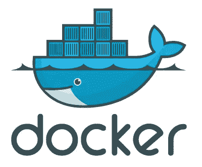
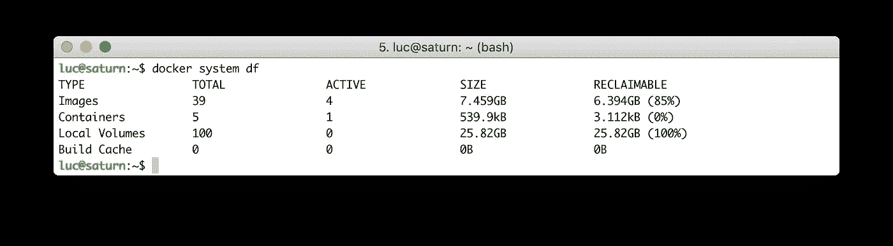
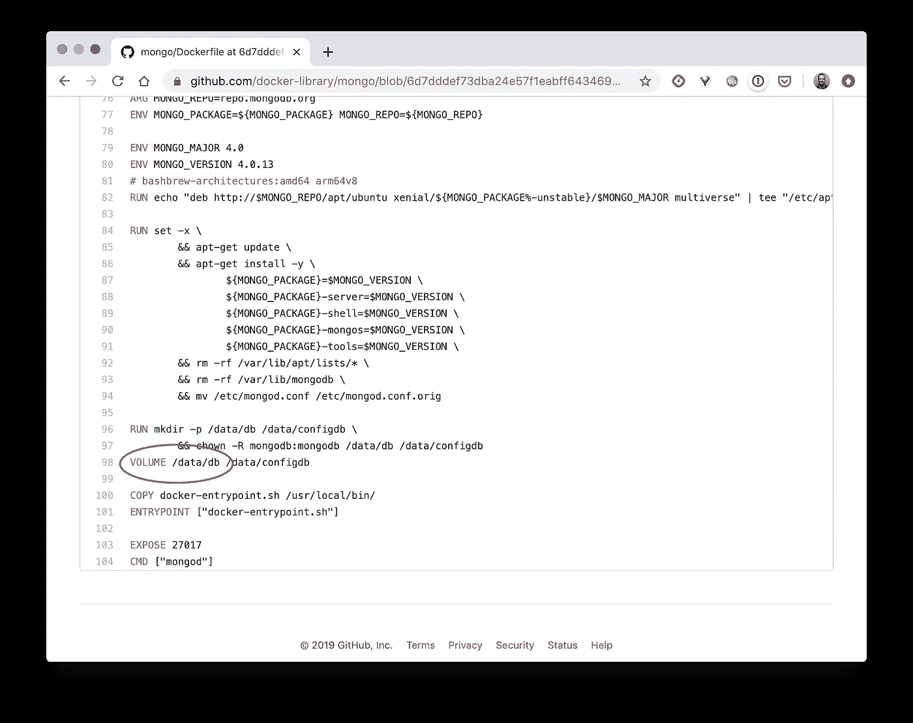

# Docker 提示:清理你的本地机器

> 原文：<https://betterprogramming.pub/docker-tips-clean-up-your-local-machine-35f370a01a78>

## 了解磁盘空间使用情况并回收未使用的部分



来源:[Flickr 上的 x modulo](https://www.flickr.com/photos/xmodulo/14098888813)

在这篇文章中，我们将回到基础。我们将了解 Docker 如何使用主机的磁盘空间，以及当它不再被使用时如何回收它。



# 总消费量

Docker 很棒，这一点毋庸置疑。几年前，它通过普及容器的使用和极大地简化其生命周期的管理，提供了一种构建、运送和运行任何工作负载的新方法。

它也给开发者带来了运行任何应用程序而不污染本地机器的能力。但是，当我们运行容器、提取映像、部署复杂的应用程序堆栈以及构建我们自己的映像时，主机文件系统上的内存占用可能会显著增加。

如果我们有一段时间没有清理我们的本地机器，我们可能会对这个命令的结果感到惊讶:

```
$ docker system df
```


Docker 在主机文件系统上的足迹示例

该命令显示 Docker 的磁盘使用情况，分为几类:

*   **图像**:从注册表中提取的图像和本地构建的图像的大小。
*   **容器**:系统上运行的容器所占用的磁盘空间，即每个容器读写层的空间。
*   **本地卷**:持久存储在主机上，但在容器的文件系统之外。
*   **构建缓存**:镜像构建过程生成的缓存(仅当使用 BuildKit 时，可从 Docker 18.09 获得)。

从上面的输出中，我们可以看到相当多的磁盘空间可以回收。换句话说，由于 Docker 没有使用它，所以可以将其交还给主机。

# 容器磁盘使用

每次创建一个容器，都会在主机上的 */var/lib/docker* 下创建几个文件夹和文件。其中包括:

*   */var/lib/docker/containers/ID*文件夹(ID 是容器的唯一标识符)。如果容器使用默认的日志记录驱动程序，那么它的所有日志都将保存在这个文件夹中的一个 JSON 文件中。在这种情况下，生成太多日志可能会影响主机的文件系统。
*   */var/lib/docker/overlay2*中的一个文件夹，包含容器的读写层(overlay 2 是大多数 Linux 发行版上首选的存储驱动程序)。如果容器将数据保存在自己的文件系统中，这些数据将被存储在主机上的*/var/lib/docker/overlay 2*下。

假设我们有一个全新的系统，刚刚安装了 Docker。

```
$ docker system df
TYPE           TOTAL      ACTIVE     SIZE       RECLAIMABLE
Images         0          0          0B         0B
Containers     0          0          0B         0B
Local Volumes  0          0          0B         0B
Build Cache    0          0          0B         0B
```

首先，我们启动一个 NGINX 容器:

```
$ docker container run --name www -d -p 8000:80 nginx:1.16
```

再次运行`df`命令，我们现在可以看到:

*   一张大小为 126MB 的图像。这是我们投放集装箱时拉的 NGINX *:1.16* 一个。
*   一个容器——从 NGINX 映像运行的 *www* 容器。

```
$ docker system df
TYPE           TOTAL      ACTIVE     SIZE       RECLAIMABLE
Images         1          1          126M       0B (0%)
Containers     1          1          2B         0B (0%)
Local Volumes  0          0          0B         0B
Build Cache    0          0          0B         0B
```

由于容器正在运行且映像当前正在使用中，因此还没有可回收的空间。由于容器(2B)的大小可以忽略不计，因此不容易在文件系统上跟踪，让我们在容器的文件系统中创建一个 100MB 的空文件。为此，我们在 *www* 容器中使用方便的 [dd](https://en.wikipedia.org/wiki/Dd_(Unix)) 命令。

```
$ docker exec -ti www \
  dd if=/dev/zero of=test.img bs=1024 count=0 seek=$[1024*100]
```

该文件是在与该容器相关联的读写层中创建的。如果我们再次检查`df`命令的输出，我们现在可以看到容器现在占用了一些额外的磁盘空间。

```
$ docker system df
TYPE           TOTAL      ACTIVE     SIZE       RECLAIMABLE
Images         1          1          126M       0B (0%)
Containers     1          1          104.9MB    0B (0%)
Local Volumes  0          0          0B         0B
Build Cache    0          0          0B         0B
```

该文件位于主机上的什么位置？让我们来看看:

```
$ find /var/lib/docker -type f -name **test.img**
/var/lib/docker/overlay2/83f177...630078/merged/test.img
/var/lib/docker/overlay2/83f177...630078/diff/test.img
```

无需深入细节，这个文件是在由 overlay2 驱动程序管理的容器读写层中创建的。如果我们停止容器，容器使用的磁盘空间就可以回收。让我们来看看:

```
# Stopping the www container
$ docker stop www# Visualizing the impact on the disk usage
$ docker system df
TYPE           TOTAL      ACTIVE     SIZE       RECLAIMABLE
Images         1          1          126M       0B (0%)
Containers     1          0          104.9MB    104.9MB (100%)
Local Volumes  0          0          0B         0B
Build Cache    0          0          0B         0B
```

这个空间怎么回收？通过删除容器，这将删除关联的读写容器的层。

以下命令允许我们一次删除所有停止的容器，并回收它们正在使用的磁盘空间:

```
$ docker container prune
WARNING! This will remove all stopped containers.
Are you sure you want to continue? [y/N] y
Deleted Containers:
5e7f8e5097ace9ef5518ebf0c6fc2062ff024efb495f11ccc89df21ec9b4dcc2Total reclaimed space: 104.9MB
```

从输出中，我们可以看到容器不再使用空间，并且由于不再使用映像(没有容器在运行)，它在主机文件系统上使用的空间可以回收:

```
$ docker system df
TYPE           TOTAL      ACTIVE     SIZE       RECLAIMABLE
Images         1          0          126M       126M (100%)
Containers     0          0          0B         0B
Local Volumes  0          0          0B         0B
Build Cache    0          0          0B         0B
```

注意:一旦一个映像被至少一个容器使用，它所使用的磁盘空间就无法回收。

我们上面使用的`prune`子命令删除停止的容器。如果我们需要删除所有容器，运行的和停止的，我们可以使用以下命令之一(两者是等效的):

```
# Historical command
$ docker rm -f $(docker ps -aq)# More recent command
$ docker container rm -f $(docker container ls -aq)
```

注意:在运行一个容器时使用`--rm`标志通常是有用的，这样当它的 PID 1 进程停止时它会被自动删除，从而立即释放未使用的磁盘。

# 图像磁盘使用

几年前，每个图像有几百 MB 是很常见的。微软的 Ubuntu 大约是 600MB。网络图片重达数 GB(真实故事)。此时，即使这些层在映像之间共享，仅拉取几个映像也会很快影响主机的磁盘空间。这在今天不太真实——基础图像要轻得多——但是经过一定时间后，如果我们不小心，堆积图像肯定会产生影响。

终端用户无法直接看到几种图像:

*   中间映像被其他映像(子映像)引用，无法删除
*   悬挂图像是不再被引用的图像。它们占用一些磁盘空间，因此可以被删除

以下命令列出了系统中现有的悬挂图像:

```
$ docker image ls -f dangling=true
REPOSITORY  TAG      IMAGE ID         CREATED             SIZE
<none>      <none>   21e658fe5351     12 minutes ago      71.3MB
```

为了去除悬挂的图像，我们可以走长路:

```
$ docker image rm $(docker image ls -f dangling=true -q)
```

或者我们可以使用 *prune* 子命令:

```
$ docker image prune
WARNING! This will remove all dangling images.
Are you sure you want to continue? [y/N] y
Deleted Images:
deleted: sha256:143407a3cb7efa6e95761b8cd6cea25e3f41455be6d5e7cda
deleted: sha256:738010bda9dd34896bac9bbc77b2d60addd7738ad1a95e5cc
deleted: sha256:fa4f0194a1eb829523ecf3bad04b4a7bdce089c8361e2c347
deleted: sha256:c5041938bcb46f78bf2f2a7f0a0df0eea74c4555097cc9197
deleted: sha256:5945bb6e12888cf320828e0fd00728947104da82e3eb4452fTotal reclaimed space: 12.9kB
```

如果我们需要一次移除所有图像(不仅仅是悬挂的图像),我们可以运行下面的命令。这将无法删除容器当前使用的图像，尽管:

```
$ docker image rm $(docker image ls -q)
```

# 卷磁盘使用情况

卷用于存储容器文件系统之外的数据。例如，当一个容器运行一个有状态的应用程序时，我们希望数据在容器之外持久化，这样它们就与容器生命周期分离了。还使用卷，因为容器内繁重的文件系统操作对性能不利。

假设我们运行一个基于 [MongoDB](https://hub.docker.com/_/mongo) 的容器，然后用它来测试我们之前做的备份(在本地的 *bck.json* 文件中可用):

```
# Running a mongo container
$ docker run --name db -v $PWD:/tmp -p 27017:27017 -d mongo:4.0# Importing an existing backup (from a huge bck.json file)
$ docker exec -ti db mongoimport \
  --db 'test' \
  --collection 'demo' \
  --file /tmp/bck.json \
  --jsonArray
```

备份文件中的数据将存储在主机上的 */var/lib/docker/volumes* 文件夹中。为什么这些数据没有保存在容器的图层中？因为在 mongo 映像的 Dockerfile 中，位置*/data/db*(mongo 默认存储数据的位置)被定义为一个卷。



用于构建 MongoDB 容器映像的 Dockerfile 文件的摘录

注意:许多映像通常与有状态应用程序相关，它们定义卷来管理容器层之外的数据。

完成备份测试后，我们停止或移除容器。但是卷并没有被删除——除非我们明确地删除它，否则它会留在那里消耗磁盘空间。要删除不再使用的卷，我们可以采用更长的方法:

```
$ docker volume rm $(docker volume ls -q)
```

或者我们可以使用`prune`子命令:

```
$ docker volume prune
WARNING! This will remove all local volumes not used by at least one container.
Are you sure you want to continue? [y/N] y
Deleted Volumes:
d50b6402eb75d09ec17a5f57df4ed7b520c448429f70725fc5707334e5ded4d5
8f7a16e1cf117cdfddb6a38d1f4f02b18d21a485b49037e2670753fa34d115fc
599c3dd48d529b2e105eec38537cd16dac1ae6f899a123e2a62ffac6168b2f5f
...
732e610e435c24f6acae827cd340a60ce4132387cfc512452994bc0728dd66df
9a3f39cc8bd0f9ce54dea3421193f752bda4b8846841b6d36f8ee24358a85bae
045a9b534259ec6c0318cb162b7b4fca75b553d4e86fc93faafd0e7c77c79799
c6283fe9f8d2ca105d30ecaad31868410e809aba0909b3e60d68a26e92a094daTotal reclaimed space: 25.82GB
luc@saturn:~$
```

# 构建缓存磁盘使用

Docker 18.09 版本通过 [BuildKit](https://github.com/moby/buildkit) 引入了对构建过程的增强。使用此工具可以提高性能、存储管理、特性功能和安全性。在本文中，我们不会详细介绍 BuildKit，而只是看看如何启用它以及它如何影响磁盘使用。

让我们考虑下面的虚拟节点。Js 应用程序及其关联的 Dockerfile 文件:

*index.js* 文件定义了一个简单的 HTTP 服务器，该服务器公开了“/”端点，并为收到的每个请求回复一个字符串:

```
var express = require('express');
var util    = require('util');
var app = express();
app.get('/', function(req, res) {
  res.setHeader('Content-Type', 'text/plain');
  res.end(util.format("%s - %s", new Date(), 'Got Request'));
});
app.listen(process.env.PORT || 80);
```

*package.json* 定义了依赖关系:这里只有 expressjs，用来设置 HTTP 服务器:

```
{
  "name": "testnode",
  "version": "0.0.1",
  "main": "index.js",
  "scripts": {
    "start": "node index.js"
  },
  "dependencies": {
    "express": "^4.14.0"
  }
}
```

*Dockerfile* 定义了如何从上面的代码构建图像:

```
**FROM** node:13-alpine
**COPY** package.json /app/package.json
**RUN** cd /app && npm install
**COPY** . /app/ **WORKDIR** /app
**EXPOSE** 80
**CMD** ["npm", "start"]
```

让我们像往常一样构建一个映像，不启用 BuildKit:

```
$ docker build -t app:1.0 .
```

如果我们检查磁盘使用情况，我们只看到基本映像(*节点:13-alpine* 在构建开始时提取)和构建的最终映像( *app:1.0* ):

```
$ docker system df
TYPE           TOTAL      ACTIVE     SIZE       RECLAIMABLE
Images         2          0          109.3MB    109.3MB (100%)
Containers     0          0          0B         0B
Local Volumes  0          0          0B         0B
Build Cache    0          0          0B         0B
```

现在让我们使用 BuildKit 构建映像的 2.0 版本。我们只需要将 DOCKER_BUILDKIT 设置为 1:

```
$ DOCKER_BUILDKIT=1 docker build -t app:2.0 .
```

如果我们再次检查磁盘使用情况，我们可以看到 build-cache 已创建:

```
$ docker system df
TYPE           TOTAL      ACTIVE     SIZE       RECLAIMABLE
Images         2          0          109.3MB    109.3MB (100%)
Containers     0          0          0B         0B
Local Volumes  0          0          0B         0B
Build Cache    11         0          8.949kB    8.949kB
```

要删除构建缓存，我们可以使用以下命令:

```
$ docker builder prune
WARNING! This will remove all dangling build cache.
Are you sure you want to continue? [y/N] y
Deleted build cache objects:
rffq7b06h9t09xe584rn4f91e
ztexgsz949ci8mx8p5tzgdzhe
3z9jeoqbbmj3eftltawvkiayiTotal reclaimed space: 8.949kB
```

# 一次清洗所有东西

正如我们在上面的例子中看到的，每个容器、映像和卷命令都提供了`prune`子命令来回收磁盘空间。`prune`子命令在 Docker 的系统级可用，因此它可以一次回收所有未使用的磁盘空间:

```
$ docker system prune
WARNING! This will remove:
  - all stopped containers
  - all networks not used by at least one container
  - all dangling images
  - all dangling build cacheAre you sure you want to continue? [y/N]
```

偶尔运行这个命令来清理磁盘是一个好习惯。