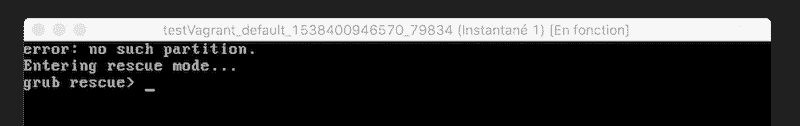
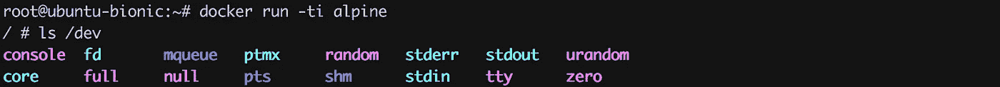
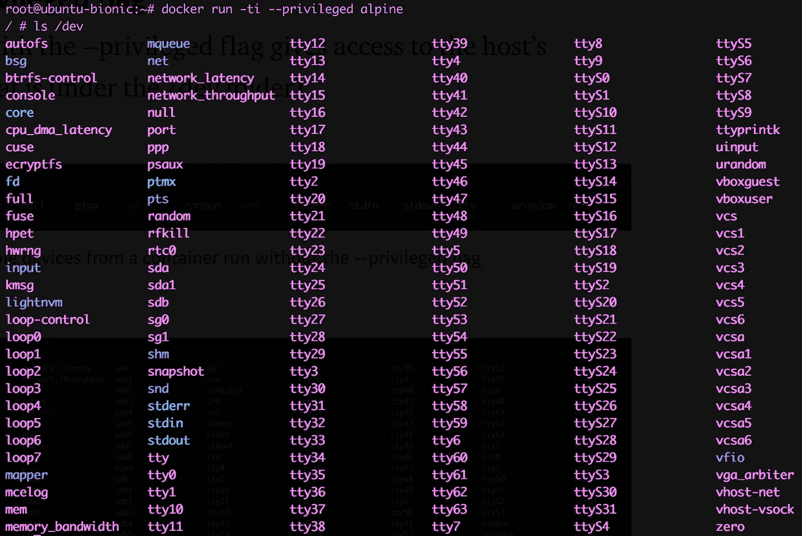
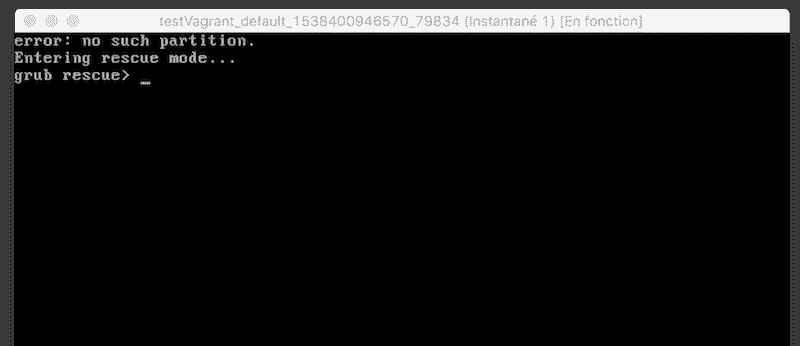

# 码头工人提示:小心“特权”标志

> 原文：<https://betterprogramming.pub/docker-tips-mind-the-privileged-flag-d6e2ae71bdb4>

## 确保有意使用它，以避免权限泄露


弗洛里安·伯杰在 [Unsplash](https://unsplash.com/s/photos/key?utm_source=unsplash&utm_medium=referral&utm_content=creditCopyText) 上拍摄的照片

如果您在运行容器时使用了`--privileged`标志，请确保您知道自己在做什么。在这篇文章中，我们将展示其使用可能引发的意想不到的影响。



# 设置测试环境

首先，我们在 VirtualBox 上使用[vagger](https://vagrantup.com)创建一个虚拟机。

注意:如果你不知道这个来自 [Hashicorp](https://hashicorp.com) 的伟大工具，我建议你试一试，因为它超级方便。

```
# Init the vagrant box (based on bionic64)
$ vagrant init ubuntu/bionic64# Launch the VM
$ vagrant up# ssh in the newly created VM
$ vagrant ssh
```

下一个(非常方便的)命令在我们新创建的 Linux 机器上安装 Docker。

```
$ curl [https://get.docker.com](https://get.docker.com) | sh
```

# **特权标志的用途**

运行带有`--privileged`标志的容器会赋予容器所有的功能，还可以访问主机的设备(所有东西都在`/dev`文件夹下)。我们来看看这个。



不使用- privileged 标志运行的容器中的可用设备列表



使用- privileged 标志运行的容器中的可用设备列表

这意味着容器可以访问连接到主机的硬盘驱动器。因为许多容器是以完全特权根用户运行的，所以后果可能是灾难性的。

# **做着龌龊的事情**

让我们在基于 alpine 的容器中运行一个 shell，并用`--privileged`标志为它提供一些额外的功能。

```
$ docker run -ti --privileged alpine
```

一旦进入容器，让我们使用对主机设备的访问来做一些非常糟糕的事情，比如删除磁盘分区。首先，我们使用`fdisk`工具列出现有的分区。

```
/ # fdisk -l
Disk /dev/sda: 10 GB, 10737418240 bytes, 20971520 sectors
4209 cylinders, 106 heads, 47 sectors/track
Units: cylinders of 4982 * 512 = 2550784 bytesDevice  Boot StartCHS    EndCHS        StartLBA     EndLBA    Sectors  Size Id Type
/dev/sda1 *  0,32,33     281,105,47        2048   20971486   20969439  9.9G 83 Linux
Disk /dev/sdb: 10 MB, 10485760 bytes, 20480 sectors
10 cylinders, 64 heads, 32 sectors/track
Units: cylinders of 2048 * 512 = 1048576 bytesDisk /dev/sdb doesn't contain a valid partition table
```

接下来，我们删除第一个分区。

```
/ # fdisk /dev/sdaThe number of cylinders for this disk is set to 4209.
There is nothing wrong with that, but this is larger than 1024,
and could in certain setups cause problems with:
1) software that runs at boot time (e.g., old versions of LILO)
2) booting and partitioning software from other OSs
   (e.g., DOS FDISK, OS/2 FDISK)Command (m for help): d
Selected partition 1Command (m for help): w
The partition table has been altered.
Calling ioctl() to re-read partition table
fdisk: WARNING: rereading partition table failed, kernel still uses old table: Resource busy
```

然后，我们退出容器并重启主机。

```
root@ubuntu-bionic:/home/vagrant# reboot
```

如果我们看看 Virtualbox 控制台，似乎发生了不好的事情:虚拟机无法启动了。



我们在这里快速演示了如何在特权容器中手动使用`fdisk`实用程序来损害我们的主机。但是如果这个任务是在我们不知道的情况下在一个容器中自动完成的呢？其他磁盘工具，如`parted`或 `sfdisk` **，**可以使这种自动化变得非常简单。

# 摘要

如果您运行的图像不是来自可信来源，请小心它是否需要`--privileged`标志。当然，有些情况下需要这个标志，例如在 Raspberry Pi 这样的设备上运行容器时。它确实用于访问 GPIO 接口，并能够与外部世界进行交互(并使 LED 闪烁)。