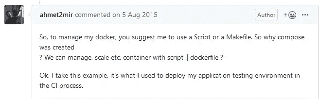
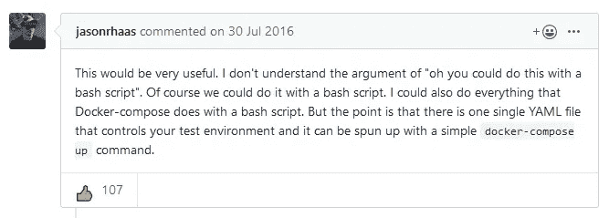
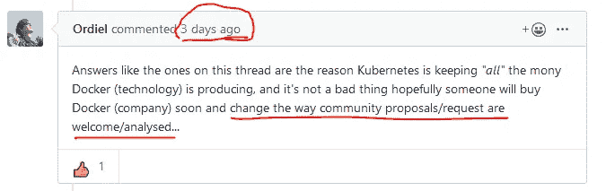

# 如何在 Ubuntu 18.04 中通过 Docker Compose 将容器时区与主机同步

> 原文：<https://betterprogramming.pub/docker-tips-synchronize-container-timezone-with-host-machine-via-docker-compose-in-ubuntu-18-04-6f01615efc24>

## 经过几个小时的阅读和调试，Ubuntu Server 18.04 的一个工作解决方案


图片来源:作者

痛苦的真实故事…

在编写几个容器的过程中，我发现需要将其中一些容器的时区与主机同步。因为我希望创建一个通用图像，并在运行过程中调整其设置，所以我决定通过`docker-compose.yml`执行相应的操作。

**在网上找到的第一个建议**没有给出任何好处:通过在`docker-compose.yaml`中添加这个指令，将容器文件`/etc/localtime`映射到本地文件 `/etc/localtime`:

```
services:
  my_service:
    ...
    volumes:
      ...
      - /etc/localtime:/etc/localtime:ro
```

运行`docker-compose up`后看到的区别:

```
dockeradmin@dockerhost:~/my_service$ ls -l /etc/localtime
lrwxrwxrwx 1 root root 31 Nov 2 16:30 /etc/localtime -> /usr/share/zoneinfo/Europe/Moscow
dockeradmin@dockerhost:~/my_service$ docker exec -it my_service /bin/bash -c “ls -l /etc/localtime”
lrwxrwxrwx 1 root root 27 Nov 4 11:43 /etc/localtime -> /usr/share/zoneinfo/Etc/UTC
dockeradmin@dockerhost:~/my_service$
```

**在网上找到的第二个** **推荐**也没有给任何利润，只是用了一种更高明的方式。在这种情况下，有些人建议给`docker-compose.yml`添加下一个命令:

```
services:
  my_service:
    ...
    command:
      - /bin/bash -c "ln -snf /usr/share/zoneinfo/$$TZ /etc/localtime && dpkg-reconfigure -f noninteractive tzdata"
```

跑完`docker-compose up`后看到的:

```
ERROR: for 21844dd33556_my_service  Cannot start service my_service: OCI runtime create failed: container_linux.go:346: starting container process caused "exec: \"/bin/bash -c \\\"ln -snf /usr/share/zoneinfo/$TZ /etc/localtime && dpkg-reconfigure -f noninteractive tzdata\\\"\": stat /bin/bash -c \"ln -snf /usr/share/zoneinfo/$TZ /etc/timezone && dpkg-reconfigure -f noninteractive tzdata\": no such file or directory": unknown
```

**没有这样的文件或目录**——在几次调试和搜索迭代之后，我决定检查一下`command`指令是否会在我的容器中运行任何二进制文件:

```
services:
  my_service:
  ...
  command:
    - /bin/bash -c "echo Hello world"
```

而这是运行`docker-compose up`的结果:

```
ERROR: for 21844dd33556_my_service  Cannot start service my_service: OCI runtime create failed: container_linux.go:346: starting container process caused "exec: \"/bin/bash -c \\\"echo Hello world\\\"\": stat /bin/bash -c \"echo Hello world\": no such file or directory": unknown
```

简单的`echo`命令没有在容器内部运行。经过几个小时的额外调试，我在 Docker Compose GitHub 中找到了这个线程。我只把最重要的帖子放在这里:

[](https://github.com/docker/compose/issues/1809#issuecomment-128073224) [## 运行问题#1809 docker/compose 后执行命令

### 嗨，这将是非常有帮助的，像“onrun”在 YAML 能够运行命令后运行…

github.com](https://github.com/docker/compose/issues/1809#issuecomment-128073224) 

因此，多年来，只有两种方法来执行这项(以及类似的)任务:

*   您可以通过`Dockerfile`来完成，并接收更少的通用图像(并为任务的每一部分构建不同的图像)。
*   您可以编写 bash 脚本，在创建容器后执行一些 Docker exec 命令(因此您需要两个工具来处理一个 Docker Compose)。

我最终的解决方案是编写这个 bash 脚本:

```
#!/bin/bash
###################################################
#                  Run containers                 #
###################################################
docker-compose up -d
###################################################
#                  Set timezone                   #
###################################################
docker exec -it container1 /bin/bash -c "ln -snf /usr/share/zoneinfo/Europe/Moscow /etc/localtime && dpkg-reconfigure -f noninteractive tzdata"
docker exec -it container2 /bin/bash -c "ln -snf /usr/share/zoneinfo/Europe/Moscow /etc/localtime && dpkg-reconfigure -f noninteractive tzdata"
```