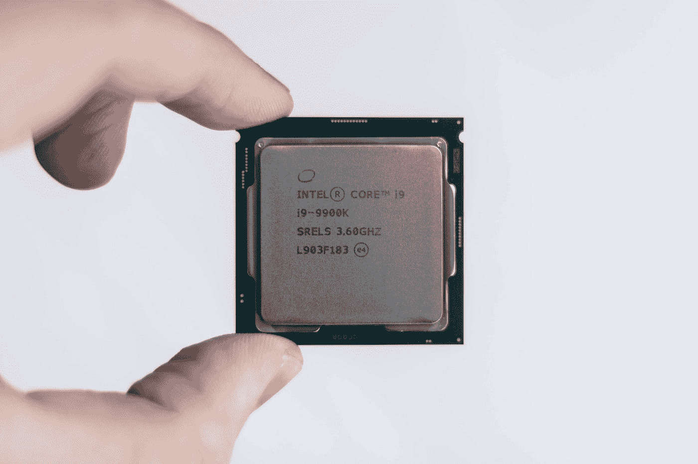
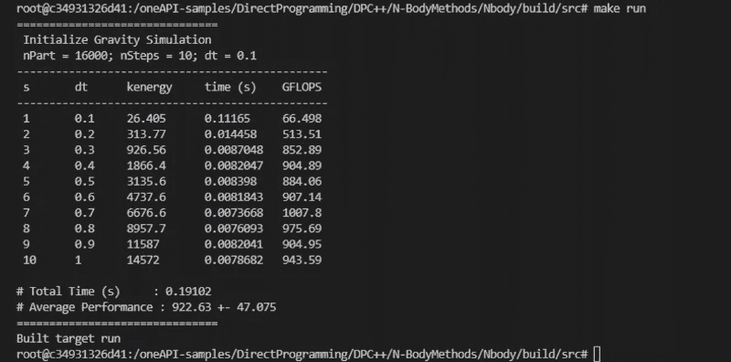
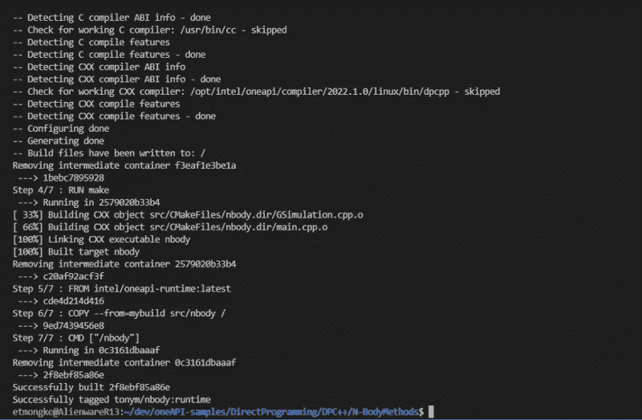
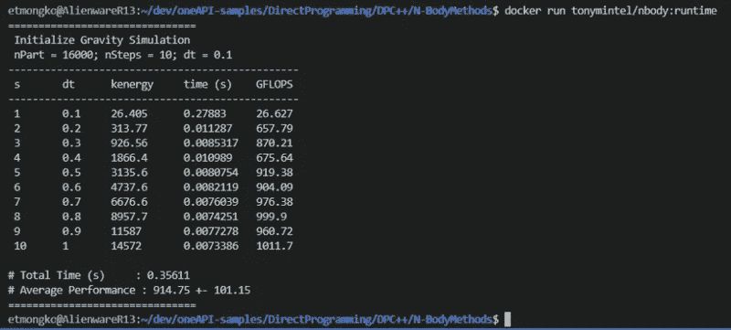
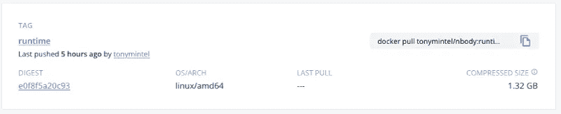
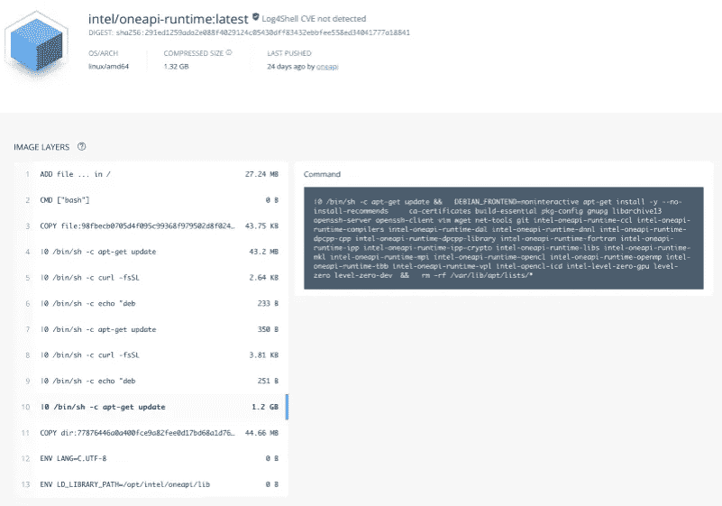
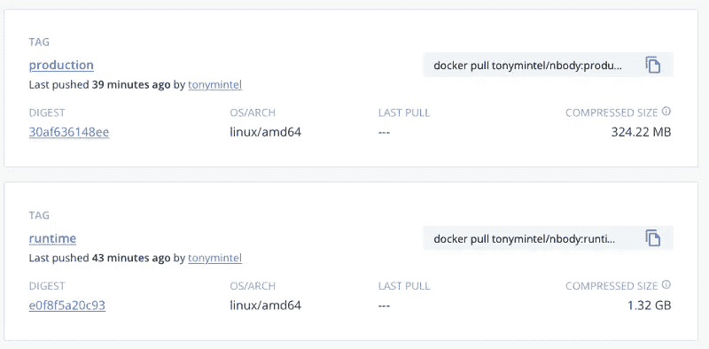

# Docker、WSL 和 oneAPI——快速操作指南

> 原文：<https://betterprogramming.pub/docker-wsl-and-oneapi-a-quick-how-to-guide-d7db3363b303>

## 优化用于部署的容器化 oneAPI 工作负载



克里斯蒂安·威迪格在 [Unsplash](https://unsplash.com?utm_source=medium&utm_medium=referral) 上拍摄的照片

# **什么是容器？**

在我的上一篇博客中，我花了一些时间谈论为什么作为一名开发人员高效对我很重要。容器技术的发展可以极大地帮助我们实现这个目标。

首先，让我们快速地为那些不知道的人介绍一下容器是什么。Docker 是最常见的容器化解决方案，所以我将从他们的[网站](https://www.docker.com/resources/what-container)上获取容器的定义:

> 容器是一个标准的软件单元，它将代码及其所有依赖项打包，以便应用程序能够快速可靠地从一个计算环境运行到另一个计算环境。Docker 容器映像是一个轻量级的、独立的、可执行的软件包，包括运行应用程序所需的一切:代码、运行时、系统工具、系统库和设置。

容器可以在 Windows 或 Linux 系统上运行，相对容易设置和部署，并且容易共享或分发给其他人(通过像 [Docker Hub](https://hub.docker.com/) 这样的服务)。

当然，使用容器也有一些限制。你必须在每一个你想运行容器的系统上设置一个容器运行时，容器会变得很大，如果你经常上传和下载它们，这可能是一个问题，而且它们不像虚拟机(VM)那样在底层系统上提供硬的资源分离。尽管有这些限制，对于许多用例来说，容器是一种很棒的方式，所以让我们谈谈它如何帮助我们这些开发人员。

# **这对开发者意味着什么？**

使用容器作为我们开发过程的一部分意味着您可以创建和维护一个稳定的、可重复的环境来开发软件。如果您曾经破坏了您的开发环境，只需启动容器的另一个实例就可以获得一个干净的工作环境。

另一件很酷的事情是你可以在一个系统上创建和运行多个开发和测试环境(也就是多个 Linux 版本)。最重要的是，您通常不必担心搞乱您的主机系统，因为容器隔离了大多数资源。

对于客户使用容器的开发人员来说，将应用程序放在容器中可以让您在一个更可控的环境中运行。这有助于减少 bug，减少您的测试表面积，并提高您的上市时间(TTM)，这对您和您的客户都有好处。

还有其他选项可用于解决一些“多开发环境”问题，例如基于虚拟机(VM)的解决方案。您可以创建一个基本的 Windows Subsystem for Linux (WSL)实例，在其中配置开发环境，并多次部署该实例。您还可以使用更强大的企业解决方案，如 VMware 虚拟桌面基础架构(VDI)。然而，这些解决方案并不适用于所有平台上的每个人，因此出于这篇博客的目的，我将重点关注利用容器来帮助使用 oneAPI 开发和部署软件。

# **使用 oneAPI 开发容器**

为了利用 oneAPI 开发容器来提供前面提到的稳定的开发环境，我们首先需要在我们的开发系统上设置 Docker。一般来说，你可以去 Docker 的网站，按照他们的安装说明进行操作。您可能还记得我以前的博客，我在开发中使用了 WSL 环境，所以有点复杂。

我本打算就此写一篇简单的文章，但幸运的是，在我之前已经有许多人这样做了。我发现如果你想遵循这种方法，ferarias[story](https://medium.com/@ferarias/docker-in-windows-11-using-wsl2-8e30faddc32c)是最容易理解的。

一旦 Docker 设置完成，您就可以从 Docker Hub 获取最新、最棒的 oneAPI 开发容器。

有用于在 CentOS8、Ubuntu 18.04 或 Ubuntu 20.04 上开发 oneAPI 代码的 oneAPI 开发容器。对于这个例子，我将构建并打包一些简单的 SYCL 代码，因此我将提取 oneAPI 基础工具包 Ubuntu 20.04 映像。使用 Docker 命令行，我只需运行:

```
> docker pull intel/oneapi-basekit:devel-ubuntu20.04
```

这会将容器下载到我的本地系统。要进入开发环境，您可以使用以下命令运行容器:

```
> docker run -ti --name=ubuntu-dev-20.04 intel/oneapi-basekit:devel-ubuntu20.04
```

`-ti`标志告诉 Docker，一旦它启动并运行，就在容器中为我提供一个交互终端。name 标志将我们的运行容器命名为 ubuntu-dev-20.04。

# **构建一些代码**

为了使事情简单一点，我将利用 oneAPI 示例。我去了 oneAPI 示例 Github:

[](https://github.com/oneapi-src/oneAPI-samples) [## GitHub-oneapi-src/oneAPI-Samples:英特尔 oneAPI 工具包示例

### oneAPI 样本库为英特尔 oneAPI 工具包提供代码样本。我们建议查看特定的…

github.com](https://github.com/oneapi-src/oneAPI-samples) 

…并在我的开发容器中克隆了 repo。我将使用位于`DirectProgramming->DPC++->N-BodyMethods->Nbody`文件夹中的`Nbody`样本。

使用开发容器的好处是我不必运行

```
> source /opt/intel/oneapi/setvars.sh
```

正如我在上一个例子中所做的那样，因为 oneAPI 开发容器在构建时已经运行了这个命令。我只需转到`Nbody`文件夹，按照说明构建并运行`Nbody`示例:

```
> mkdir build
> cd build
> cmake ..
> make
> make run
```

以下是我的英特尔 i9 阿尔德湖外星人 R13 系统的输出:



# **创建生产容器**

现在我们知道我们的代码是在开发容器中构建的，让我们看看如何将它放在容器中交付给客户，让他们在自己的系统上运行。

Docker 将使用 [Dockerfile](https://docs.docker.com/engine/reference/builder/) 格式构建一个新容器。对于那些不熟悉如何使用 Docker 文件的人，请查看 Docker 的[入门](https://docs.docker.com/compose/gettingstarted/)指南。

我将利用 Docker [多阶段构建](https://docs.docker.com/develop/develop-images/multistage-build/)功能告诉 Docker 构建过程在一个容器中构建我的代码，然后将其复制到另一个容器中。这允许我在一个地方拥有整个构建和打包工作流，同时还允许我在没有所有开发工具的情况下发布一个容器。这是我的生产容器 Dockerfile 文件:

您将看到，对于生产容器，我使用了`intel/oneapi-runtime:latest`容器作为基础，因为它提供了运行任何基于 oneAPI 的工作负载所需的所有运行时。

下一步是获取这个 Dockerfile，我将其命名为`Dockerfile.runtime`，并运行 docker build 命令来创建我的新容器。

```
> docker build . -f Dockerfile.runtime -t tonymintel/nbody:runtime
```

这个命令告诉 Docker 使用当前路径构建我的`Dockerfile.runtime`文件，并将图像标记为`tonym/nbody:runtime`。



一个成功的 docker 构建！耶！

容器的快速运行显示，我们的构建成功完成，并按照我们的要求用完了代码。



现在，我只需要包装好我的集装箱，并将其运送给我的客户。我可以将它上传到 Docker Hub，或者使用 docker save 命令将图像保存在我的本地系统上并发送文件。

就我而言，我只是将它推送到 Docker Hub:

```
> docker push tonymintel/nbody:runtime
```

这会将图像推送到我的`tonymintel` Docker Hub 帐户，并使用标签 runtime 将其保存到`nbody`存储库中。现在，任何能够访问`tonymintel/nbody` Docker Hub 库的人都可以通过常规的 Docker 命令获取并运行代码。



Docker Hub 上标记的 nbody repo

# 将我的生产容器缩小了 4 倍

正如高效的开发人员对我来说很重要一样，拥有高效的解决方案对我们应用程序的用户来说也很重要。正如我的同事詹姆斯·莱因德斯所说，我们需要确保带给他们“跳出盒子的快乐”。

从我的截图，你可以看到我上传的容器是 1.32GB。这是一个非常大的 Docker 容器，供我的客户下载。

我的生产容器基于 intel/oneapi-runtime 容器，它为构建 oneapi 代码的所有工具包提供了所有运行时。这不一定是件坏事。oneAPI 提供了各种我可能想要与我的代码集成的库，所以拥有一个我知道会运行我的代码的运行时包是很棒的。然而，因为我是开发人员，我知道我使用了什么库，所以让我们看看是否可以优化我们的生产容器，使它变得更小。



英特尔/oneapi-运行时:截至 2022 年 6 月的最新 Docker Hub 文件

经过一番检查后，我创建了一个新的 Dockerfile.prod，如下所示:

这里有很多文本，所以让我试着解释一下发生了什么:

1.  第 1–9 行和第 32–34 行在两个 docker 文件中是相同的。他们构建我们的二进制文件，并在容器启动时运行它
2.  第 11–30 行主要是样板代码，用于设置英特尔的 apt 库，然后通过 APT 安装一些英特尔包。这些行摘自`oneapi-runtime`docker 文件，可在此处找到:

[](https://github.com/intel/oneapi-containers) [## GitHub -英特尔/oneapi-容器

### 英特尔 oneAPI 产品将提供跨标量、矢量部署应用和解决方案所需的工具

github.com](https://github.com/intel/oneapi-containers) 

我的`Dockerfile.prod`中的关键线路是 28 线。如果你去看原始的`intel/oneapi-runtime` Dockerfile ( [点击这里](https://hub.docker.com/r/intel/oneapi-runtime/tags)并点击一个摘要 SHA 并找到最大的图像层)，它为所有可能的运行时包做了一个 apt-get。在我的例子中，我知道我只使用了 DPC++，所以我的`Dockerfile.prod`只包含那个`intel-oneapi-runtime-dpcpp-cpp`包。

现在，我只需构建我的新 Dockerfile，验证它像以前一样工作，并将其推送到云中。

```
> docker build . -f Dockerfile.prod -t tonymintel/nbody:production
> docker run -it tonymintel/nbody:production
> docker push tonymintel/nbody:production
```

现在，我看到我的客户的下载量提高了约 4 倍……希望有更多的惊喜。



你可能会问，我还能做得更好吗？为了避免悬念，答案是肯定的，但是它涉及到进入并提取单个文件以省略各种未使用的运行时组件。这有点麻烦，但这是可能的。如果你好奇的话，它最终使这个包大约 250MB，性能提高了 5 倍。

我认为这是一个巨大的胜利，因为它可以真正影响您客户的体验。显然，如果您的客户需要通过标准的互联网连接下载容器，这是一个巨大的成功。在像数据中心或云环境这样的大规模环境中，这可能更有价值，因为在数十或数百个节点上部署相同的 pod 非常常见，并且网络使用、饱和和延迟始终是一个问题。也许最重要的是，如果您的客户为部署他们的容器支付网络或存储费用，他们会感谢您(或至少不会抱怨)让他们花费更多的容器。:)

# **结论**

作为开发人员，容器是帮助我们构建和测试代码的有用技术。根据我们的客户(也就是他们是否会使用容器)，它还可以真正帮助我们向客户交付更可靠的代码。

学习所有的技术肯定需要做一些工作，但在很多情况下这绝对是值得的。我希望这有助于您了解如何利用容器以及如何为您的客户优化这些容器。

下次见！

```
**Want to Connect?**If you want to see what random tech news I’m reading, you can [follow me](https://twitter.com/tonymongkolsmai) on Twitter.Tony is a Software Architect and Technical Evangelist at Intel. He has worked on several software developer tools and most recently led the software engineering team that built the data center platform which enabled Habana’s scalable MLPerf solution.Intel, the Intel logo, and other Intel marks are trademarks of Intel Corporation or its subsidiaries.
```