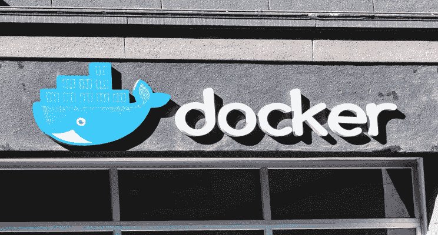
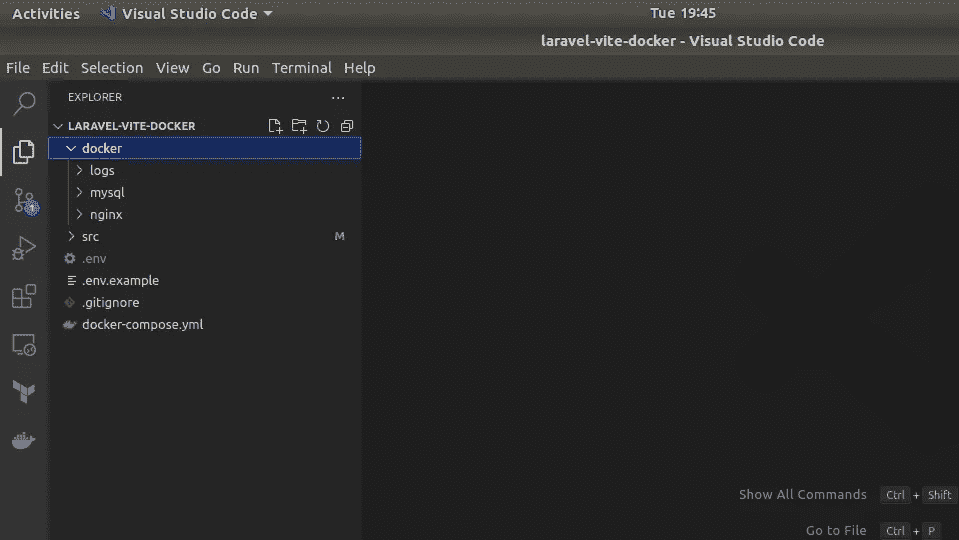
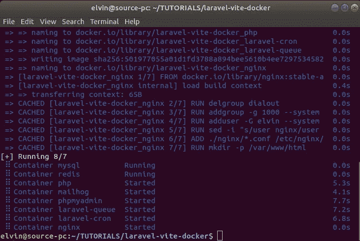
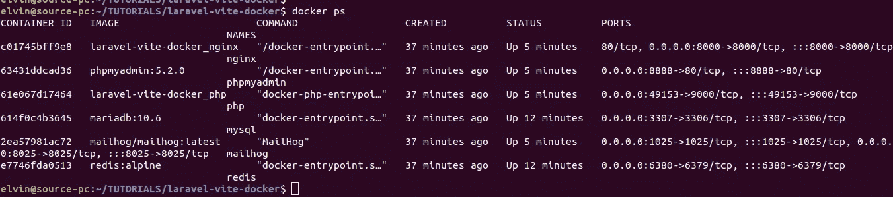
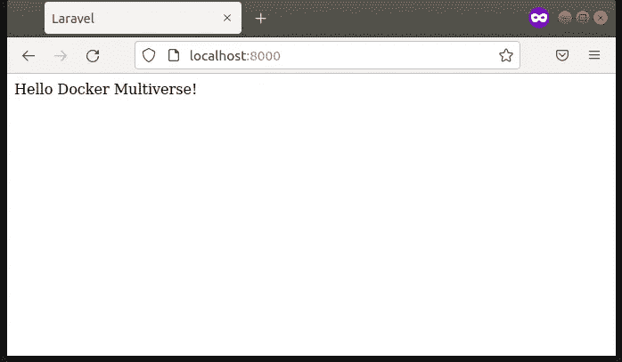
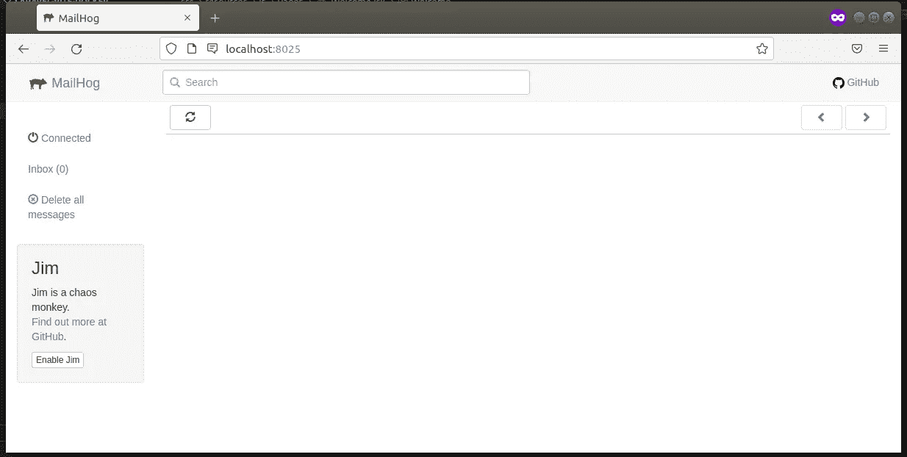
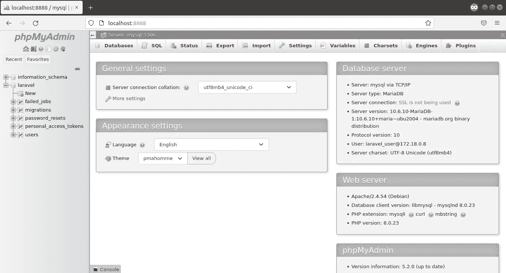

# 开发环境中的 Dockerize Laravel-Vite + React 应用程序

> 原文：<https://betterprogramming.pub/dockerize-laravel-vite-react-application-in-your-development-environment-a118aea4a02d>

## 使用 artisan 命令、composer 命令、npm 命令、cron 作业、队列、数据库和 redis 缓存容器



(来源: [shutterstock](https://www.shutterstock.com/image-photo/nov-2-2019-san-francisco-ca-1557785567) )

# 目录

```
[1\. Introduction](#2b4b)
[2\. Prerequisites for this guide](#1ff9)
[3\. Set up git](#b38d)
[4\. Download and install docker and docker-compose](#c63f)
[5\. Clone laravel application and create root folders](#3d32)
[6\. Create .env, .env.example and .gitignore files](#9c2e)
[7\. Docker compose yaml file](#5610)
[8\. Main containers](#3f69)
[9\. Utility containers](#633a)
[10\. Configuring Vite asset bundler and InertiaJS](#7de4)
[11\. Starting your containers](#1aac)
[12\. Pushing code to github](#da51)
[13\. Resources/Links](#e157)
[14\. Conclusion](#5123)
```

# 1.介绍

本指南将向您展示如何使用 Docker 建立一个 Laravel-React 堆栈开发环境，并结合一些额外的实用程序容器来完善您的设置。

这种设置与操作系统无关，除了 Docker 和 Docker Compose 之外没有任何依赖关系。只要安装了 Docker 和 Docker compose，就可以在所有主流操作系统上运行，比如微软的 Windows、苹果的 macOS、Linux。

这个设置允许您根据自己的喜好混合和匹配服务的版本，只需编辑一两行即可。例如，您可以将 PHP 7.4、8.0、8.1 或 8.2 与 Laravel 7、8 或 9 结合使用。

我们将容器化一个 Laravel 9 应用程序，并允许它与其他主/实用程序容器通信，形成一个完整的 dockerized 开发环境。

下表显示了我们将在 Docker 环境中运行的服务(容器)。我把它们分成两类(主容器和实用容器)。

*   主容器—启动后持续运行，除非停止，否则通常会在出现故障时重新启动。
*   实用程序容器—这些容器运行命令来定制和优化整个应用程序。容器在运行命令后被销毁。

主要容器

实用集装箱

# 2.本指南的先决条件

1.  您应该意识到构建容器的必要性以及它们是如何工作的。
2.  需要熟悉 ReactJS 并了解 Laravel 的工作原理。

现在让我们深入研究代码和 docker 命令。

# 3.设置 Git

要在命令行上使用 Git，您需要在您的计算机上设置 Git。您将使用 Git 来克隆 Laravel 9 应用程序。在本指南的最后，我将向您展示如何使用 Git 将整个设置代码推送到 GitHub 存储库。

如果您的本地机器上没有配置 Git，请按照本[教程](https://docs.github.com/en/get-started/quickstart/set-up-git)设置 Git。

# 4.下载并安装 Docker 和 docker-compose

从[这里](https://docs.docker.com/get-docker/)下载并安装 Docker。您可以使用 Docker 桌面客户端或 Docker CLI 客户端。从[这里](https://docs.docker.com/compose/install/)下载并安装 docker-compose。

# 5.克隆 Laravel 应用程序并创建根文件夹

转到您要在本地存储项目的文件夹，并在下面的列表中创建以下文件夹/子文件夹。你可以从 [Visual Studio IDE](https://visualstudio.microsoft.com/downloads/) (VS 代码)中打开你的项目文件夹，然后创建你所有的文件夹和文件。

*   码头工人/日志
*   docker/mysql
*   docker/nginx

我们将使用 docker/logs 文件夹存储容器日志，docker/mysql 存储 mysql 数据，docker/nginx 用于 nginx 配置文件。如果没有设置这些文件夹，容器运行时生成的数据会在每次重启时被销毁。

从项目文件夹的根目录，使用 Git 将 Laravel 存储库克隆到一个名为 src 的文件夹中。在 VS 代码中，切换终端并粘贴下面的命令。

```
git clone [https://github.com/laravel/laravel.git](https://github.com/laravel/laravel.git) src
```

**注意**:删除`src`内的`.github`和`.git`文件夹。`.github`包含 laravel 的默认 GitHub 动作，而`.git`有 Laravel 的存储库细节。我们将从项目目录的根目录创建一个新的 git 存储库。我们还将在后面的教程中创建自定义 GitHub 动作。

# 6.创造。环境、环境示例和。git 忽略文件

将. env.example 从`src`文件夹复制到项目目录的根目录下。这个文件只是一个例子。环境文件。您可以对该文件进行版本控制。

在同一目录中，创建一个. env 文件。您的应用程序的配置变量将存储在这里。当作为一个团队在一个项目中工作时，这个文件对于不同的服务器和不同的开发人员可能有不同的值。因此，它不应该被版本化。

创建一个. gitignore 文件，并添加以下代码:

```
.env
docker/logs/*
docker/mysql/*
```

# 7.码头工人撰写 YAML 文件

> Compose 是一个定义和运行多容器 Docker 应用程序的工具。使用 Compose，您可以使用 YAML 文件来配置应用程序的服务。然后，只需一个命令，您就可以从您的配置中创建并启动所有服务。— [Docker 撰写](https://docs.docker.com/compose/)

我们的`docker-compose.yml`文件结构如下所示:

```
version: '3'networks:
  laravel:services:
  ... services go here
```

`version: '3'`指的是 Docker 编写版本。相比版本 2，版本 3 是 Swarm 兼容的；因此，如果你以后决定使用 Docker Swarm orchestrator，你不必做任何改变。

在`networks:`段下配置了一个名为`laravel`的网络。加入此网络的容器将可被网络上的其他容器到达。它们也可以在与容器名称相同的主机名上被发现。

`services:`表示图像的实例，例如，数据库服务、Redis 服务、PHP 服务等。

在项目的根目录下创建一个`docker-compose.yml`文件，并将以下代码放入其中:

docker-compose.yml 文件

不要担心这个文件中的细节；我们将在本指南的后面部分详细介绍它们。

项目的文件夹结构现在如下所示:



项目文件夹-结构

# 8.主要容器

## 8.1.NGINX 服务

设置将作为 web 服务器本身的容器。它将接收来自最终用户的 HTTP 请求，并将它们发送到 PHP 容器，该容器将处理我们的 Laravel 代码。

以下是 NGINX 服务代码:

nginx 服务

## 故障

*   `build` —定义 Compose 应用于构建 Docker 映像的配置选项。
*   `context` —定义 Nginx dockerfile 文件的路径。
*   `dockerfile` —这是用于创建 Nginx 映像的 Dockerfile，从上下文解析而来。
*   `args` —定义构建参数，即`nginx.dockerfile` `ARG`值，如下一节所示。
*   `restart` —定义容器的重启策略。
*   `container_name` —定义容器名称。
*   `ports` —将主机的端口映射到容器的端口。
*   `volumes` —将项目目录内容挂载到容器`/var/www/html`目录，并将`.env`文件挂载到容器位置`/var/www/html/.env`。在主机上进行的任何项目内容更改都会反映在容器中，反之亦然。
*   `depends_on` —这定义了在构建此服务之前对另一个要运行的服务的依赖性。
*   `networks` —服务将直接与`laravel`网络中的其他服务通信。

## nginx.dockerfile

这个文件的上下文是项目的 docker 文件夹。下面是我们的`nginx.dockerfile`文件。它基于 [nginx:stable-alpine](https://hub.docker.com/layers/library/nginx/stable-alpine/images/sha256-5bc90c961f2ef45c7ed6057e5c55e09d5f6b700a9d2e7e824c5e3709f329a61d?context=explore) 图像，非常轻量级，大小只有~5MB。

nginx.dockerfile 文件文件

在上面的 docker 文件中，我们将`default.conf`文件从项目的 nginx 目录复制到容器的目录中。它将覆盖默认的 Nginx 配置。

下面是我们的`default.conf`文件:

default.conf 文件

允许 Nginx 容器将请求传递给 PHP FPM (FastCGI 进程管理器)的配置是`fastcgi_pass php:9000`。这些请求通过端口`9000`传递给名为`php` 的容器。

## 8.2.PHP 服务

与 Apache web 服务器不同，Nginx 必须使用 PHP-FPM 作为单独的进程来处理 PHP 客户端请求。

下面是 PHP 服务部分:

PHP 服务

## 故障

这里我们使用一个名为`php.dockerfile`的定制 dockerfile 文件。`container_name`是`php`，这个容器只能由其他容器通过端口`9000`在内部访问。

## php.dockerfile

这个文件的上下文也是项目的 docker 文件夹。下面是我们的`php.dockerfile`文件。它是基于阿尔卑斯山的形象(它是轻量级的)`php:8.1-fpm-alpine`。

php.dockerfile 文件

## 8.3.Mysql 服务

对于我们运行 Mysql 的数据库容器，我们将在我们的`docker-compose.yml`文件中直接使用 DockerHub 的 [MariaDB 官方映像](https://hub.docker.com/_/mariadb)。它是预先配置好的，并得到采用最佳实践的社区的支持。

它看起来是这样的:

MySQL 服务

在这个服务中，我们必须定义环境变量:`${DB_DATABASE}`、`${DB_USERNAME}`和`${DB_PASSWORD}`。它们是从我们之前创建的`.env`文件中定义的。下面是一个示例`.env`配置。

```
DB_CONNECTION=mysql
DB_HOST=mysql
DB_PORT=3306
DB_DATABASE=laravel
DB_USERNAME=laravel_user
DB_PASSWORD=%6larav31
```

通常，在 Laravel 中，`DB_HOST`通常被配置为数据库 IP 地址，即`DB_HOST=127.0.0.1`。然而，在这种情况下，我们将使用 mysql 服务名，即`DB_HOST=mysql`。

MySQL 服务可以由内部的其他容器通过端口`3306`访问，该端口已经在端口`3307`暴露给主机。

为了避免在容器重启时丢失数据库数据，卷`./docker/mysql`被安装到容器内的`/var/lib/mysql`。因此，Mysql 数据将保存在主机的`./docker/mysql`目录下。

## 8.4.Redis 服务

我们将添加一个基于`redis:alpine`图像的 Redis 服务来让 Redis 工作。该服务将如下所示:

Redis 服务

我们还需要更新我们的`.env`文件来使用这个 redis 服务进行队列和会话管理。更新`.env`文件的以下部分。我们使用我们的 redis 服务名作为 Redis 主机，`REDIS_HOST=redis`。

```
QUEUE_CONNECTION=redis
SESSION_DRIVER=redisREDIS_HOST=redis
REDIS_PASSWORD=null
REDIS_PORT=6379
```

## 8.5.Cron 就业服务

该服务将基于我们之前创建的`php.dockerfile`。

以下是服务文件:

拉勒韦尔-克朗服务公司

我们使用`schedule:work`命令代替`schedule:run`在前台运行，并每分钟调用一次调度程序。容器运行时执行`entrypoint`命令。

## 8.6.队列服务

这个服务也是基于`php.dockerfile`。服务配置将如下所示:

排队服务

该服务的`entrypoint`将运行 Laravel 命令`php artisan queue:work`。这个命令运行 Laravel 的基本[队列服务](https://laravel.com/docs/9.x/queues)，它处理所有排队的作业。这是 Laravel 中处理队列的默认方式。也可以设置[地平线](https://laravel.com/docs/9.x/horizon)代替使用。

Horizon 为您的 Laravel 支持的 Redis 队列提供了一个漂亮的仪表板和代码驱动的配置。当使用 Horizon 时，您将把入口点更新为`entrypoint: ['php', '/var/www/html/artisan', 'horizon']`。

## 8.7.邮件猪服务

[Mailhog](https://github.com/mailhog/MailHog) 是一个很好的工具，可以确认你的邮件在开发环境中是否像预期的那样工作。它有一个基于网络的用户界面，你可以在那里查看你的电子邮件。

邮件猪服务

此服务基于`mailhog/mailhog:latest`图像。这不是一个官方的图像，但是 Mailhog 团队支持它，所以你可以放心。与官方图像不同，官方图像的图像存储库被指定为{repository}:{tag}。这里我们还必须标识用户，{user}/{repository}:{tag}。

默认情况下，Mailhog 存储日志。这些对我们没有用，所以我们将把`logging driver`设置为 none。

端口`8025`用于连接用户界面仪表板，而端口`1025`用于连接邮件服务器。您可以通过主机上的`[http://localhost:8025](http://localhost:8025)`访问仪表板。

## 8.8.PhpMyAdmin 服务

PhpMyAdmin 将为我们提供一个 GUI 来管理我们的数据库，而不必通过 shell/终端来访问它。以下是其服务配置:

PhpMyAdmin 服务

该服务基于`phpmyadmin:5.2.0`，T5 是预先配置的[官方码头形象](https://hub.docker.com/_/phpmyadmin)。

Compose 将从我们的`.env`文件中自动选择环境变量`${DB_HOST}`、`${DB_USERNAME}`、`${DB_PASSWORD}`和`${DB_PORT}`。该服务依赖于`mysql`，因此数据库需要在启动我们的 GUI 之前运行。主机使用端口`8888`连接到我们的接口。您可以通过`[http://localhost:8888](http://localhost:8888)`访问 PhpMyAdmin 仪表板。

# 9.实用集装箱

当使用命令`docker-compose up`启动 docker 容器时，`docker-compose.yml`文件中的所有服务都将被启动。但是，您应该只在需要时运行实用工具容器。

为了只启动主容器，我们使用命令`docker-compose up build nginx`。这将确保只有`nginx service`依赖的容器才会启动。这些是在`nginx service`的`depends_on`部分列出的容器。

我们还将使用`[profiles](https://docs.docker.com/compose/profiles/)`来锁定实用程序服务，以便它们仅在个人配置文件被激活或使用`docker-compose run service_name`运行特定服务时才启动。

运行工具容器时，使用命令`docker-compose run --rm`而不是`docker-compose up`。服务/容器参数被附加在末尾。`run`用于对服务运行一次性命令，而`--rm`在运行命令后移除容器。如果需要连接到其他 docker 容器，使用`--service-ports`选项。比如`docker-compose run --rm --service-ports service_name argument`。

## 9.1.迁移种子服务

该服务运行迁移和种子程序。也是基于`php.dockerfile`。

laravel-迁移-种子服务

当容器启动时，该服务的入口点将依次运行命令`php artisan migrate`和`php artisan db:seed`。

## 运行 laravel-migrate-seed 命令

```
docker-compose run --rm laravel-migrate-seed
```

## 9.2.作曲家服务

Composer 是 PHP 的依赖管理器。Composer 服务用于运行 composer 命令。它使用一个名为`composer.dockerfile`的定制 docker 文件，其上下文是我们项目的 docker 文件夹。

以下是服务配置:

作曲家服务

## composer.dockerfile

composer.dockerfile

这个 docker 文件基于 [composer:2](https://hub.docker.com/_/composer) 映像，这是一个官方的预构建 composer 版本 2 docker 映像文件。

## 运行编写器命令

使用命令`docker-compose run --rm` 启动编写器命令，并在末尾添加编写器参数。查看下表中的示例:

编写器命令

## 9.3.工匠服务

该服务运行 Laravel artisan 命令。它基于`php.dockerfile`。

工匠服务

## 运行 artisan 命令

像 composer 命令一样，artisan 命令使用命令`docker-compose run --rm` 开始，并在末尾加上 artisan 参数。以下是一些例子:

artisan 命令

## 9.4.Npm 服务

我们将使用此服务来运行 npm 命令。是基于官方[节点:阿尔卑斯](https://hub.docker.com/layers/library/node/alpine/images/sha256-1cdf154f10cf19a7eac49b44bce405791e0dc972484ec4a9c3d18cb75938999e?context=explore) docker 形象。

npm 服务

## 运行 npm 命令

npm 命令也是使用命令`docker-compose run --rm` 开始的，并在末尾加上 NPM 参数。然而，当运行`npm run dev`时，需要在这个 npm 容器和 PHP 容器之间建立通信，以便进行热重装。因此，我们在命令中包含了`--service-ports`选项。

npm 命令的示例:

npm 命令

# 10.配置 Vite 资产捆绑器和惯性工具

从 Laravel 9 开始，通过引入前端资产捆绑器 [**Vite**](https://vitejs.dev) ，开发者体验得到了改善。此前，Laravel 使用 [webpack](https://webpack.js.org/) 作为其默认的资产捆绑器。在本指南中，我们将使用 Vite 将 ReactJS 集成到 Laravel 中。

[InertiaJS](http://inertiajs.com) 将帮助我们在一个项目中包含 React 和 Laravel 堆栈。你可以把它看作是把我们的前端和后端栈粘在一起的胶水。通过在终端中键入以下命令来安装 InertiaJS:

```
docker-compose run --rm composer require inertiajs/inertia-laravel
```

让我们使用下面的 artisan 命令在我们的项目中安装惯性中间件:

```
docker-compose run --rm artisan inertia: middleware
```

转到`src/app/Http`目录，然后在`Kernel.php`文件中，在`$middlewareGroups[]`数组的`web[]`数组中添加下面一行。

```
'web' => [
  // ...
  \App\Http\Middleware\HandleInertiaRequests::class,
],
```

当用 JavaScript 而不是 blade 渲染时，为了在前端识别我们的路线，我们将使用一个名为 [ziggy](https://github.com/tighten/ziggy) 的特殊包。让我们使用 composer 安装它。

```
docker-compose run --rm composer require tightenco/ziggy
```

因为我们要创建一个单页面应用程序(SPA)，我们需要为我们的应用程序的 UI 设置一个`blade`入口点。

让我们创建一个新的刀片文件`app.blade.php`。这将是我们的切入点。将以下代码放入文件中:

`@vite()`和`@viteReactRefresh`告诉 Laravel 应用程序，Vite 正在编译我们的资源(JS 和 CSS 文件),我们将使用 JSX 作为我们的前端。CSS 文件也可以通过添加行`@vite('resources/css/app.css')`从这个文件中调用。然而，从`resources/js/app.jsx`文件中调用它并在`blade`中调用这个文件是理想的，如上图所示。

## 设置 React 前端

我们将使用`npm container`来安装我们的前端依赖项。

在您的终端上运行以下命令:

```
docker-compose run --rm npm i react react-dom @inertiajs/inertia @inertiajs/inertia-react jsconfig.json @inertiajs/progress
```

上面的命令将安装 React、react-dom、惯性前端依赖项、用于页面加载的惯性进度条和一个`jsconfig.json`文件。

接下来，我们将为 React 添加 vite 插件。

```
docker-compose run --rm npm add @vitejs/plugin-react
```

转到`src/resources/js/app.js`文件，在`import "./bootstrap"`语句下面添加以下脚本。然后将文件重命名为`app.jsx`。正如你所看到的,`app.css`从这个文件中被导入。

最后，我们需要告诉 Vite 我们正在使用 React 并指定我们的入口点文件。我们将把我们的配置放在`src/vite.config.js`中，这是一个默认安装在 Laravel 9 中的文件。让我们来看看，修改并添加以下代码行:

`input: "resources/js/app.jsx",`行指定了我们的 JSX 入口点。`server settings`指定`npm container`地址和服务端口。如我们的 docker 文件所示，可以通过端口`3000`访问`npm container`。

## 创建欢迎页面和欢迎路线

现在让我们为欢迎页面创建路线。转到文件`src/routes/web.php`并添加下面几行，让 Laravel 知道到我们欢迎页面的路径。

```
Route::get('/', function () {
   return inertia('Welcome');
}
```

然后，我们将创建我们的前端欢迎页面。创建一个新文件夹`Pages`并将一个`Welcome.jsx`文件添加到`src/resources/js/`目录中。将以下代码放入文件中。

```
export default function Welcome () {
    return (
        <>
            <div>Hello Docker Multiverse!</div>
        </>
    );
}
```

# 11.启动您的容器

## 运行迁移

通过运行以下命令创建数据库表:

```
docker-compose run --rm laravel-migrate-seed
```

它将创建在 Laravel 迁移文件中配置的默认数据库表。

## 启动主容器

要启动`main containers`,请转到项目目录的根目录并运行以下命令:

```
docker-compose up --build nginx -d
```

我们正在运行上面的命令，而不是仅仅运行`docker-compose up --build -d`，因为我们只想启动`main containers`。我们的`nginx container`依赖于所有其他主要容器；因此，它将首先启动它们。

`-d`参数以守护模式静默运行命令，而不在终端上输出日志。

在 docker 映像构建之后，容器将一个接一个地上线。



启动主容器

您可以通过在终端上运行命令`docker ps`来检查正在运行的容器，如下图所示。



运行容器

## Laravel 应用程序配置

通过运行以下命令，使用 composer 安装 PHP 软件包:

```
docker-compose run --rm composer install
```

让我们通过设置应用程序键并清除任何缓存的配置文件来结束我们的应用程序配置。我们可以通过运行以下命令来实现这一点。

```
docker-compose run --rm artisan key:generate
docker-compose run --rm artisan optimize
```

当 artisan 和 composer 容器启动时，我们的本地应用程序代码被装载到这些容器中。因此，运行上面的命令将会更新容器的代码和机器本地的代码，就像在本地运行命令一样。

## 运行 React 前端

我们将使用下面的命令在开发模式下运行 React 前端，并启用热重装。

```
docker-compose run --rm  --service-ports npm run dev
```

**注意**:确保您更新了应用程序的`.env`文件，以反映正确的`APP_URL`。暴露的端口决定了我们的`nginx service`中指定的 URL。在我们的例子中，我们使用端口`8000`。我们将把`APP_URL`更新为`APP_URL=http://localhost:8000`。

## 现在让我们来看看我们的应用程序:

在您的浏览器中插入以下任意 URL。

应用—[http://localhost:8000](http://localhost:8000)

应该会呈现出`src/resources/js/Pages/Welcome.jsx`页面。



申请欢迎页面

**麦猪**——`[http://localhost:8025](http://localhost:8025/)`



邮件猪页面

**PhpMyAdmin**——`[http://localhost:8888](http://localhost:8888/)`



phpMyAdmin 页面

# 12.将代码推送到 GitHub

为了能够跟踪项目，我们将把它推送到 GitHub。

## 创建本地存储库

*   进入我们项目的父目录。
*   类型`git init`。
*   键入`git add .`添加所有相关文件。在`.gitignore`中指定的文件将被忽略。
*   类型`git commit -m “first commit”`。

## 将存储库连接到 GitHub

*   去 [GitHub](https://github.com/) 。
*   登录您的帐户。
*   点击右上角的[新建存储库](https://github.com/new)按钮，初始化一个空存储库。
*   单击“创建存储库”按钮。
*   复制存储库的 URL。
*   在您的终端上，在项目目录的根目录下，键入下面的命令，并用您的 URL 替换存储库 URL。

```
git remote add origin [https://github.com/](https://github.com/elvinlari/test-we.git)[username/](https://github.com/elvinlari/test-azk)new_repo[.git](https://github.com/elvinlari/test-we.git)
git branch -M main
git push -u origin main
```

*   最后，您可以添加一个许可证文件和一个自述文件来描述项目。您可以直接从 GitHub 完成这项工作，也可以在本地创建文件并将更改推送到 GitHub。

# 13.资源/链接

[GitHub](https://github.com/elvinlari/laravel-vite-docker) —具有预配置 Docker 设置的 Laravel 9 plus React 项目。

# 结论

我希望这是一个有用的指南。感谢您的阅读！