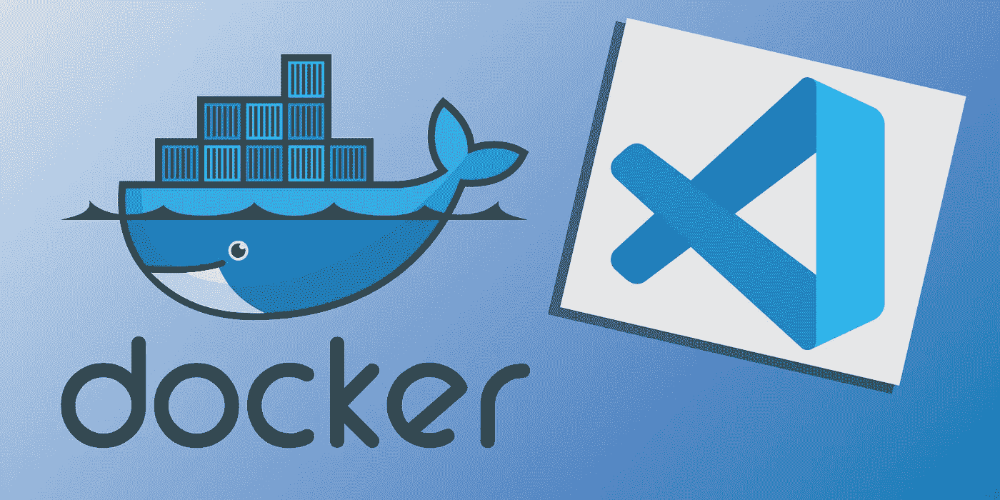
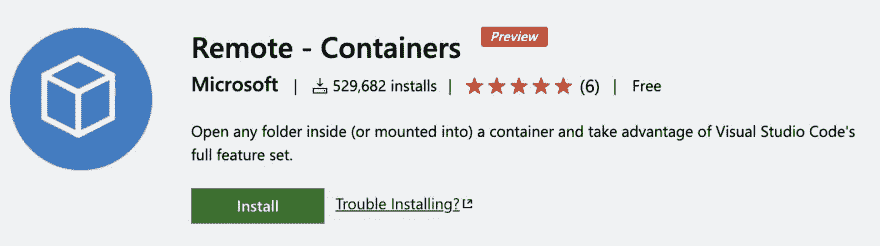
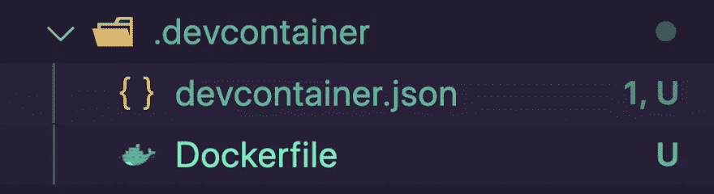
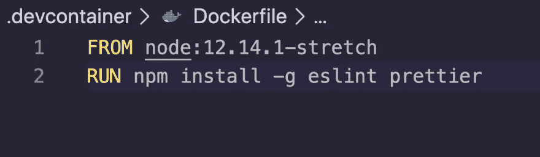
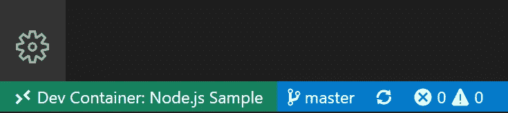
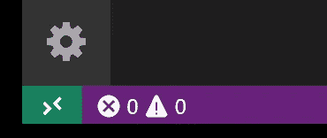
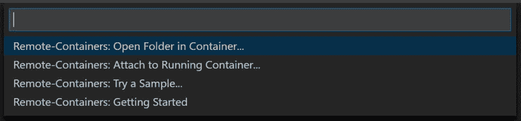
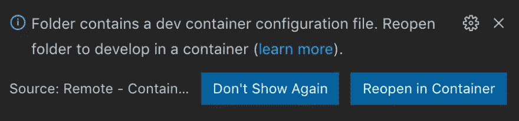

# 用 VS 代码将你的开发环境文档化

> 原文：<https://betterprogramming.pub/dockerize-your-development-environment-in-vs-code-d55ba8d705a9>

## 将 Node.js 环境容器化



图片来源:作者

在我上一份工作中，我在团队中遇到的一个问题是跨多个操作系统一致地运行项目。我花了几周时间尝试破解 Docker 文件，这将为团队提供本地一致的工作流，但后来我发现 Visual Studio 代码只需一个插件就可以轻松完成。

本指南结合了 [Visual Studio 代码](https://code.visualstudio.com/)和 [Docker](https://www.docker.com/) 来模拟您的生产设置，并创建跨开发环境的一致性。要使用本指南，需要安装 Docker 和 Visual Studio 代码。

本指南是为使用 Create React App 的节点环境编写的，但是无论所选环境需要什么，步骤都可以更改。

你甚至可以在你的开发容器中进行热重装。

在 Visual Studio 代码中，安装以下插件:



这里可以找到:[https://marketplace.visualstudio.com/items?itemName = ms-vs code-remote . remote-containers](https://marketplace.visualstudio.com/items?itemName=ms-vscode-remote.remote-containers)

这允许我们在容器中运行 Visual Studio 代码。

在项目的根目录下，需要创建一个名为`.devcontainer`的文件夹。这是我们将存储环境设置的地方。

然后在这个文件夹中创建两个文件，`devcontainer.json`和一个`Dockerfile`。

命名很重要，因为 Visual Studio 代码希望我们使用文件夹和文件名来成功运行容器。

您的文件夹结构应该与此匹配:



在`Dockerfile`中，我们选择镜像，并在安装镜像后选择`RUN`任何需要的命令(比如全局安装)。

`Dockerfile`

```
FROM node:12.14.1-stretch
RUN npm install -g eslint prettier
```



然后在`devcontainer.json`中，我们可以配置所有的设置。

`devcontainer.json`基本上是一个配置文件，它决定了你的开发容器如何构建和启动。

`devcontainer.json`

```
{
  "name": "Node.js Sample",
  "dockerFile": "Dockerfile",
  "appPort": 3000,
  "extensions": ["dbaeumer.vscode-eslint"],
  "settings": {
    "terminal.integrated.shell.linux": "/bin/bash"
  },
  "postCreateCommand": "yarn install",
  // Comment out the next line to run as root instead. Linux users, update
  // Dockerfile with your user's UID/GID if not 1000.
  "runArgs": ["-u", "node"]
}
```

*   Option Description `dockerfile` Relative —指向您希望用作图像的 docker 文件的路径。
*   `appPort` —容器运行时应在本地可用的端口或端口阵列
*   `extensions` —扩展 id 数组，指定创建容器时应该安装在容器内的扩展
*   `settings` —将默认的`settings.json`值添加到容器/机器特定的设置文件中
*   `postCreateCommand` —创建容器后运行的命令字符串或命令参数列表
*   `runArgs` —运行容器时应使用的 Docker CLI 参数数组

这里是`[devcontainer.json](https://code.visualstudio.com/docs/remote/containers#_devcontainerjson-reference)` [选项](https://code.visualstudio.com/docs/remote/containers#_devcontainerjson-reference)的完整列表。


## 支票

一旦容器运行并且您连接上了，您应该在状态栏的左下方看到您的远程上下文的变化:



安装了 Remote-Containers 扩展后，您将在最左侧看到一个新的状态栏项目。



远程状态栏项目可以快速显示代码在哪个上下文中运行(本地或远程),单击该项将显示远程容器命令。



选择在容器中重新打开。



## 等待容器构建完成

如果这是您第一次连接，将会下载并构建一个 Docker 映像，并启动一个运行 VS 代码服务器副本的容器。第一次连接可能需要几分钟，但是以后的连接只需要几秒钟。


## 检查您的环境

在容器中开发的一个好处是，您可以使用应用程序需要的特定版本的依赖项，而不会影响您的本地开发环境。

```
node --version; 
npm --version
```

# 如果您想要本指南的视频版本: