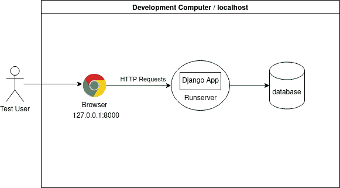
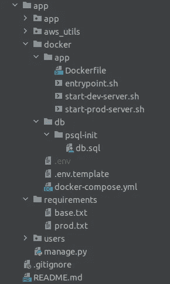
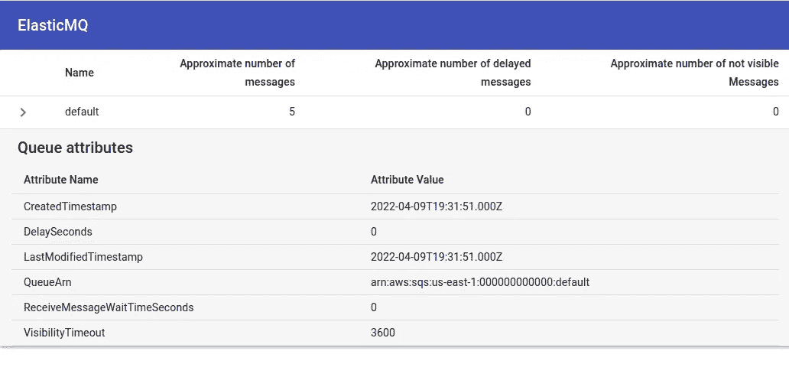

# 将你的 Django 应用归档

> 原文：<https://betterprogramming.pub/dockerize-your-django-apps-428189407c69>

## 从本地开发到生产


在 [Unsplash](https://unsplash.com/s/photos/guide?utm_source=unsplash&utm_medium=referral&utm_content=creditCopyText) 上由 [Fern M. Lomibao](https://unsplash.com/@jlcruz_photography) 拍摄的照片

将你的 Django 应用程序归档不仅有助于环境的标准化，还会使云中的扩展变得非常容易。

# **为什么是码头集装箱？**

在开发和生产过程中使用 Docker 有几个好处:

## **开发中**

*   跨多个平台的环境标准化:您只需定义一次开发环境，并与您的团队共享。那么每个人都可以使用相同的环境，不管他们的本地设置如何。例如，有人可能使用 macOS，另一个是 Ubuntu，其他人甚至可能在他们的开发工作站上使用 Windows。只要他们能够运行 Docker，他们就能够启动并运行相同的开发环境。
*   新开发人员的最短设置时间:只需几个命令，新开发人员就可以在几分钟内建立并运行一个完整的环境，包括数据库、队列或任何其他所需的服务。
*   保持本地工作站的整洁:由于您的环境是作为一组隔离的容器运行的，所以除了 Docker 或 docker-compose 之外，不会在本地安装任何东西。另外，您可以在工作站上安装不同的环境，并轻松管理它们。例如，假设您正在使用 Python 3.8、Django 3.3 和 PostgreSQL 12 处理一个项目，然后您开始使用 Python 3.10、Django 4.0 和 PostgreSQL 13 处理一个新项目。没问题，您可以在需要时启动一个或另一个环境。

## **生产中**

*   隔离:由于你的应用程序运行在一个隔离的容器中，没有什么可以破坏它的环境。如果您的应用程序在服务器或虚拟机上运行，意外破坏环境并不需要太多的努力(例如，安装或更新一些可能破坏某些依赖关系的包，编辑或删除一些配置文件等)。).
*   可再现性:一旦环境被定义，它可以在任何时候被重新创建。
*   弹性:Docker 使添加或删除系统组件或服务的实例变得非常容易。如果出于某种原因，您的容器进入了不健康的状态(例如，它不再响应请求)，可以很容易地停止它，并启动一个新的实例来替换它。
*   可伸缩性:如果您需要支持更大的工作负载，您可以添加更多的实例。一旦工作量减少，您可以删除一些实例。
*   性能:Docker 容器的启动和停止速度比普通服务器或虚拟机快得多。它需要几秒或几分钟，而不是几分钟或几小时。
*   资源优化:容器比虚拟机更轻，因此它们需要更少的 CPU 和/或 RAM 来运行。

## **Docker vs Virtualenv**

您可能想知道，如果您已经有了一个使用 virtualenv 的隔离 Python 虚拟环境，为什么还需要 Docker。virtualenv 隔离了您的 Python 依赖项，Docker 则更进一步，还隔离了您的操作系统和操作系统级包。一个典型的例子是在 Django 中使用 PostgreSQL 数据库。

您可以在 virtualenv 上安装 psycopg2(一个 Python 适配器),但是还需要在主机环境中安装 OS 级的包，比如 PostgreSQL 客户机。Docker 允许你把你的应用和操作系统以及所有需要的包打包在一起。实际上，在使用 Docker 时不再需要使用 virtualenv，即使它可能有一些用例。

## **码头工人基础知识**

*   Dockerfile:它是一个文本文件，包含一个构建应用程序映像的方法。在这里，您将添加所有的依赖项，从操作系统和操作系统级包到 Python 包，还有应用程序源代码和运行它所需的任何东西。
*   image:docker file 用于构建一个映像，其中包含所有需要的东西。图像大小从几兆字节到几千兆字节不等，建议保持较小的大小，只添加需要的内容。图像也可以从其他基础图像开始，所以你不需要从零开始。
*   注册表:它是 docker 图像的存储库。DockerHub 是一个公共注册中心，在这里你可以找到大多数操作系统和编程语言的[官方图片](https://docs.docker.com/docker-hub/official_images/)。
*   layers:docker 文件中的指令从上到下执行，每一行向图像添加一层。层被缓存，因此如果没有被修改，它们将在下一次构建中被重用。但是指令顺序很重要。如果您修改了 docker 文件中的一行，该层及其下的所有层都将被重建。因此，您应该首先添加您希望更改频率较低的层，然后添加可以更改频率较高的层，以优化构建时间。
*   阶段:使用多阶段构建，可以从一个 docker 文件中构建多个工件。此外，一个阶段的代码和/或任何生成的工件可以在另一个阶段重用，从而减少重复并使 docker 文件更易于维护。
*   容器:它是一个图像的运行实例。您可以从同一个图像或不同的图像旋转多个容器。
*   绑定挂载:它们允许在容器中挂载部分主机文件系统来共享文件。您可以将它们视为共享文件夹。它们在开发过程中和某些用例中是有用的，但是您应该在生产中避免它们，因为它们打破了容器隔离。
*   卷:它们就像容器的虚拟硬盘。它们使用主机文件系统中的某个目录来保存数据，但是这些数据只能从 docker 容器中访问。

# **动手操作:将 Django 应用程序归档**

## **先决条件**

安装 docker 和 docker-compose:

[查看如何在公文中安装 docker。](https://docs.docker.com/get-docker/)

[查看如何在正式文档中安装 docker-compose](https://docs.docker.com/compose/install/)。

## 代码

您可以在 [GitHub](https://github.com/marianobrc/scalable-django-apps) 中找到这个示例项目的完整代码。

## **定义系统组件**

开始将系统装箱的第一步是确定要装箱的系统组件或服务。开发中的 Django 应用程序的典型架构如下所示:



因此，我们可以确定图表中的两个主要组件:

*   Django app:通常由 [runserver](https://docs.djangoproject.com/en/4.0/ref/django-admin/#django-admin-runserver) 提供服务，它是与 Django 打包在一起的开发服务器。
*   数据库:Django 支持多种数据库，例如 PostgreSQL、MySQL 和 SQLite。

## Docker 作曲作为您的本地管弦乐队

Docker compose 是一个用于定义和运行多容器 Docker 应用程序的工具，我们将在本地使用它来定义和运行我们的开发环境。

## **项目结构**



这个例子中的 Django 项目叫做`app`。我们将在根级别为所有 docker 相关文件创建一个`docker/` 目录。我们将放入的第一个文件是名为`docker-compose.yml`的 YAML 文件。在 docker-compose 文件中，我们将定义两个服务。每个服务都需要一些引导和配置文件，所以让我们通过在`docker/` 目录中创建子目录`app/`和`db/`来命名这些文件。

`docker-compose.yml`

现在我们将定义我们的两个服务:

`db`:包含 PostgreSQL 数据库服务器。

*   `image`:在这种情况下，我们设置 image 来告诉 docker-compose 使用 docker-hub 中预先构建的[映像，该映像包含 PostgreSQL server 版本 13。Postgres 维护着随时可用的官方映像，因此在这种情况下，不需要定义 docker 文件，也不需要手动构建。](https://hub.docker.com/_/postgres)
*   `restart`:每当容器停止时(例如，如果容器内存不足并退出)，它将自动重新启动
*   `ports`:我们将数据库端口暴露给主机，以防我们稍后想要通过一些本地 psql 客户端应用程序连接到数据库。这是可选的，我们这样做只是为了开发，因为它可以用于检查数据库。
*   `environment`:这里，我们将环境变量(又名 env vars)传递给数据库容器。因为我们不想在 repo 中提交敏感数据，如数据库凭证，所以我们还从主机环境变量中获取值。我们需要在旋转容器之前在本地设置这些 env 变量，我们将在后面看到。
*   `volumes`:第一行添加了一个 bind mount，用于将脚本 db.sql 复制到容器中的特定文件路径，当容器启动时，数据库服务器会检查该路径。这是 Postgres 映像的一个特性，如果它不存在，我们就用它来创建数据库。数据库名称、用户名和密码取自 env 变量。第二行添加了一个持久卷，用于在主机文件系统中保存数据库数据。

`app`:包含我们的 Django 应用。

*   `build`:在这种情况下，我们告诉 docker-compose 从我们的自定义 docker 文件构建图像。由于我们使用多阶段构建，我们还需要设置目标来告诉 docker compose 构建什么样的映像。我们将选择 dev 在这里构建我们的开发映像。
*   `restart`:容器停止后会自动重启。例如，如果应用程序中有一个未处理的异常，容器将会停止，并由 docker-compose 再次启动。
*   `depends_on`:Django 应用需要数据库运行，所以这里我们告诉 docker-compose，在启动这个容器之前，需要先启动`db`容器。
*   `environment`:我们在本地开发期间设置 Django 应用程序所需的 env 变量。
*   我们使用绑定挂载在主机和容器之间共享源代码。这样，每次我们编辑一些源代码时，它都会被复制到容器中。这也将触发 runserver 自动重载，这样我们就不需要在开发过程中每次代码改变后都重新构建容器。
*   `ports`:我们将应用程序运行的端口暴露给主机，这样我们就可以使用浏览器或主机上的其他应用程序与我们的 web 应用程序进行交互。
*   `volumes`:注意在 YAML 文件的根层有第二个卷部分，引用名为`postgres_data`的卷。卷声明可确保数据库容器的数据在容器停止时仍保存在主机的文件系统中。

## **db 文件说明:**

`docker/db/psql-init/db.sql`

这个文件为 Django 应用程序创建数据库和一个专用的 Postgres 用户帐户，用于数据库事务。它在`db`容器初始化期间执行，但是只有当数据库不存在时才执行。从 env 变量中读取数据库名称、用户名和密码。稍后在 Django 应用程序设置中使用相同的 env 变量。

注意:在运行 Django 单元测试时，创建测试数据库需要创建其他数据库的权限。

## **app 文件说明**

`docker/app/Dockerfile`

这是用于构建 Django 应用程序映像的 docker 文件。我们将为开发和生产构建两个略有不同的映像。两者将共享相同的基本操作系统和一些公共包，但正如我们将看到的那样，应用程序的服务方式和源代码复制到容器的方式会有所不同。由于它们共享一个公共库，我们使用 docker 多级构建和 docker 构建工具包来保存一个 docker 文件以避免重复。

## **基础阶段**

`FROM python:3.10 as base`:我们基于 docker hub 上的[官方 Python 镜像，选择版本`3.10`。该映像将在构建时从 docker hub 中提取，它基本上基于 Debian，包括 Python 3.10 和其他常见的操作系统级包，如`apt`，这将允许我们安装额外的包，如 postgress 客户端。我们将这个阶段命名为“base ”,以便以后重用。](https://hub.docker.com/_/python)

`ENV PYTHONDONTWRITEBYTECODE`/`PYTHONUNBUFFERED`:`ENV`指令用于在构建过程中设置环境变量。在本例中，我们禁用了字节码的生成，并确保 stdout 和 stderr 直接发送到容器日志中，这样我们就可以实时看到我们的应用程序日志。

`RUN addgroup .. && adduser ..`:默认情况下，大多数基本 docker 映像使用 root 用户，但是以 root 用户身份运行您的 web 应用程序存在一些安全风险。例如，如果有人利用某种漏洞入侵容器，他们将获得 root 访问权限。所以，使用非 root 用户是一个很好的做法。

`RUN apt-get update && apt-get install`:RUN 指令允许在 shell 中执行命令。在这里，我们使用 debian 软件包管理器`apt`来安装其他需要的 OS 级软件包。我们安装了一些 Python 构建实用程序和 Postgres 数据库客户端，它是 psycopg2 的一个依赖项。

`USER web`:切换到我们的非 root 用户。我们将只在需要的时候使用根用户。

`WORKDIR /home/web/code/`:该指令设置工作路径，创建代码/子目录。在这个指令之后，我们可以在其他指令中使用相对路径，比如`COPY`和`RUN`。

`COPY --chown=web:web ./requirements/base.txt requirements/base.txt`:我们将需求文件从本地文件系统复制到工作目录中的`requirements/`子目录中。我们有一个包含两个需求文件的`requirements/`目录:`base.txt`和`prod.txt`。`base.txt`文件列出了在开发或生产环境中运行我们的应用程序所需的常见 Python 包，例如 Django 和 psycopg2，而`prod.txt`列出了一些只在生产环境中需要的额外包。

因为我们正在构建本地基础环境，所以我们只需要基础要求。`--chown`选项将名为`web`的非 root 用户设置为文件的所有者。如果没有添加，`COPY`指令默认设置所有者为`root`。

`USER root`:我们切换到 root 用户，在系统级安装 Python 包。

我们现在安装了开发环境所需的所有 Python 包。注意，我们不需要使用 virtualenv，因为整个操作系统和文件系统是隔离的，所以可以在操作系统级别安装软件包。

`COPY --chown=web:web ./docker/app/entrypoint.sh /usr/local/bin/entrypoint.sh`:我们复制了一个 entrypoint 脚本，它将在容器中执行任何其他命令之前检查 db 是否准备好。我们将脚本复制到一个已知的路径中，该路径适合放置 debian 中的用户级可执行文件。

`RUN chmod +x /usr/local/bin/entrypoint.sh`:授予执行权限。

`USER web`:切换回我们的非 root 用户。

`ENTRYPOINT [“entrypoint.sh”]`:我们声明这个脚本将在稍后定义的任何其他 CMD 之前首先执行。

`docker/app/entrypoint.sh`

我们基本上尝试使用 psycopg2 打开一个连接。如果失败，我们每隔一秒就重试一次。如果成功，我们执行作为参数接收的命令。

## **显影图像说明:**

`FROM base as dev`:我们为开发定义了一个镜像，命名为`dev`，它继承了`base`阶段的基础 OS 和公共包。

`COPY --chown=web:web ./docker/app/start-dev-server.sh /usr/local/bin/start-dev-server.sh`:我们复制运行开发服务器的脚本。

`USER root`:我们切换到 root 用户，授予对前面脚本的执行权限。

`RUN chmod +x /usr/local/bin/start-dev-server.sh`:我们授予执行权限。

`USER web`:切换回我们的非 root 用户。

`CMD [“start-dev-server.sh”]`:容器启动时，开发服务器默认启动。请注意，这是作为非 root 用户运行的。

还要注意，这里没有将应用程序代码复制到容器中。我们使用之前在 docker compose 中添加的绑定挂载来同步主机和容器之间的代码。

`docker/app/start-dev-server.sh`

我们确保应用了迁移，然后使用内置的 Django 命令`runserver`启动开发服务器。

runserver 支持在检测到源文件中的任何更改后自动重新加载。这与卷相结合，使我们可以看到在容器内运行的应用程序中反映的源代码的任何变化，而无需重建映像。我们将在开发中这样做，因为以这种方式使用卷也会打破容器隔离，我们不想在生产中这样做。

## **使用 docker compose 运行开发环境**

首先，在一个`.env`文件中设置您的 env 变量(docker compose 将从那里获取它们)。您可以复制 [.env.template](https://github.com/marianobrc/scalable-django-apps/blob/master/app/docker/.env.template) 并设置您的值。然后，所有的服务都可以通过一个简单的命令启动:`docker-compose up`，如下所示:

```
$ COMPOSE_DOCKER_CLI_BUILD=1 DOCKER_BUILDKIT=1 docker-compose up
Creating network "docker_default" with the default driver
Creating volume "docker_postgres_data" with default driver
Pulling db (postgres:13)...
13: Pulling from library/postgres
5eb5b503b376: Pull complete
...
Building app
[+] Building 206.5s (17/17) FINISHED                                                                                      
 => [internal] load build definition from Dockerfile                                                                 ...
 => [base 1/9] FROM docker.io/library
...
 => exporting to image                                                                                               ...
Successfully built 
...
Creating docker_db_1 ... done
Creating docker_app_1 ... done
Attaching to docker_db_1, docker_app_1
db_1   | The files belonging to this database system will be owned by user "postgres".
db_1   | This user must also own the server process.
...
db_1   | 2022-02-17 13:29:11.276 UTC [1] LOG:  database system is ready to accept connections
app_1  | Trying to connect to database 'db_dev' on host 'db'..
app_1  | Postgres is up - continuing...
app_1  | Running migrations..
app_1  | Operations to perform:
app_1  |   Apply all migrations: admin, auth, contenttypes, sessions, users
app_1  | Running migrations:
app_1  |   Applying contenttypes.0001_initial... OK
...
app_1  | Performing system checks...
app_1  | 
app_1  | System check identified no issues (0 silenced).
app_1  | February 17, 2022 - 13:29:16
app_1  | Django version 4.0.2, using settings 'app.settings.local'
app_1  | Starting development server at [http://0.0.0.0:8000/](http://0.0.0.0:8000/)
app_1  | Quit the server with CONTROL-C.
```

注意我们在运行中设置了一些环境变量`COMPOSE_DOCKER_CLI_BUILD=1 DOCKER_BUILDKIT=1`。这允许使用 docker [BuildKit](https://docs.docker.com/develop/develop-images/build_enhancements/) (如果您使用的是最新的 docker 引擎版本，这可能是默认启用的)。这将使构建更快，并且它还允许构建特定的目标，例如构建`dev`图像而不构建`prod`图像。在这两种情况下都会自动构建`base`图像，因为它是一个依赖项。

第一次需要花费更多的时间，因为需要构建映像，并且需要从注册表中提取基础映像。然后图像被缓存，这样下次会更快。

成功启动后，您将看到:

*   后端在`http://127.0.0.1:8000`可用(端口暴露在 docker-compose)
*   Django 管理面板位于`[http://127.0.0.1:8000/admin/](http://127.0.0.1:8000/admin/)`

## 如何在构图过程中重建图像

因为我们使用绑定挂载来与容器共享主机上的源代码，所以我们不需要在代码更改时重建应用程序映像。但是如果您添加了一些 Python 依赖项，或者在 docker 文件中做了任何更改，您将需要重新构建映像来查看容器中的更改。您可以告诉 docker-compose 添加`--build`标志来重建图像。

```
$ COMPOSE_DOCKER_CLI_BUILD=1 DOCKER_BUILDKIT=1 docker-compose up --build 
```

已经是最新的图像不会被重建，所以你可以安全地添加这个标志。

## 查看日志

`docker-compose up`命令聚集每个容器的输出。当命令退出时，所有容器都将停止。运行`docker-compose up -d`在后台启动容器，并让它们继续运行。因此，要查看单个服务的日志，您可以运行:`docker-compose logs [-f] <service>`

```
$ docker-compose logs -f appAttaching to docker_app_1
app_1  | Trying to connect to database 'db_dev' on host 'db'..
app_1  | could not connect to server: Connection refused
app_1  |  Is the server running on host "db" (172.19.0.2) and accepting
app_1  |  TCP/IP connections on port 5432?
app_1  | 
app_1  | Postgres is unavailable - sleeping
app_1  | Trying to connect to database 'db_dev' on host 'db'..
app_1  | Postgres is up - continuing...
app_1  | Running migrations..
app_1  | Operations to perform:
app_1  |   Apply all migrations: admin, auth, contenttypes, sessions, users
app_1  | Running migrations:
app_1  |   Applying contenttypes.0001_initial... OK
app_1  |   Applying contenttypes.0002_remove_content_type_name... OK
...
app_1  |   Applying sessions.0001_initial... OK
app_1  | Starting server..
app_1  | Watching for file changes with StatReloader
app_1  | Watching for file changes with StatReloader
app_1  | Performing system checks...
app_1  | 
app_1  | System check identified no issues (0 silenced).
app_1  | February 17, 2022 - 18:02:46
app_1  | Django version 4.0.2, using settings 'app.settings.local'
app_1  | Starting development server at [http://0.0.0.0:8000/](http://0.0.0.0:8000/)
app_1  | Quit the server with CONTROL-C.
```

## 如何在运行中的容器中运行命令

使用 docker-compose: `docker-compose exec <service> <command>`

这将在一个新的终端中运行已经运行的容器中的命令。

```
# Apply migrations
$ docker-compose exec app python manage.py migrate# Open a bash shell inside the container
$ docker-compose exec app bash# Create an admin user
$ docker-compose exec app python manage.py createsuperuser
Username: admin
Email address: [admin@myapp.com](mailto:admin@testapp.com)
Password: 
Password (again): 
Superuser created successfully.
$
```

## **如何在容器中运行需要文件写权限的命令:**

当您在容器中执行一个命令时，它将在我们之前定义的非根用户网站上运行。但是因为我们使用绑定挂载将源代码放入容器，所以这些文件实际上是由主机上的用户拥有的。如果你试图运行任何试图写文件的命令，比如`startapp` 或`makemigrations` ，你会得到一个权限错误:

```
$ docker-compose exec app python manage.py startapp books
CommandError: [Errno 13] Permission denied: ‘/home/web/code/books’
```

为了解决这个问题，我们需要告诉 docker compose 使用拥有文件和目录的主机用户来运行这些命令。我们通过传递用户 id 和组 id 来做到这一点，这可以使用 id 命令获得。

```
# Open a bash shell inside the container
$ docker-compose exec -u $(id -u):$(id -g) app python manage.py startapp books
```

## 一些其他有用的命令

检查每个服务的状态:

```
$ docker-compose ps 
Name                  Command                State             Ports         
---------------------------------------------------------------------------------
docker_app_1   /entrypoint.sh /start-dev- ...   Exit 137                         
docker_db_1    docker-entrypoint.sh postgres    Up 0.0.0.0:5432->5432/tcp
```

停止所有服务:

```
$ docker-compose down
Stopping docker_app_1 ... done
Stopping docker_db_1  ... done
Removing docker_app_1 ... done
Removing docker_db_1  ... done
Removing network docker_default
```

停止单个服务:

```
$ docker-compose stop app
Stopping docker_app_1 ... done
```

重置数据库:

```
$ docker-compose down --volumes
Stopping docker_db_1 ... done
Removing docker_app_1 ... done
Removing docker_db_1  ... done
Removing network docker_default
Removing volume docker_postgres_data
$ docker-compose up
```

## 生产图像解释

`FROM base as prod`:我们现在定义一个生产映像，命名为“prod”，它继承了来自*基础阶段*的基础操作系统和公共包。构建此映像时，将首先自动构建基础映像。

`COPY --chown=web:web ./requirements/prod.txt requirements/prod.txt`:我们可能有额外的生产依赖项，所以我们将生产需求文件复制到容器中。

`USER root`:我们切换到 root 用户，在系统级安装 Python 包。

我们安装生产依赖项。

`USER web`:切换回我们的非 root 用户。

`COPY --chown=web:web ./docker/app/start-prod-server.sh /usr/local/bin/start-prod-server.sh`:我们复制脚本，该脚本将服务于我们的生产应用程序。

`USER root`:我们切换到 root 用户，授予对前面脚本的执行权限。

`RUN chmod +x /usr/local/bin/start-prod-server.sh`:我们授予执行权限。

`USER web`:切换回我们的非 root 用户。

`COPY --chown=web:web . ./`:我们把主机上的源代码复制到镜像的工作目录下。我们再次使用— `chown`选项，让非 root 用户成为这些文件的所有者。请注意，我们在生产中不使用卷。我们希望保持生产环境的隔离和无状态。下一次您想要发布一个包含代码变更的新版本时，您将需要重新构建映像并重新部署它。我们将在下一章看到如何在不停机的情况下做到这一点。

`CMD [“start-prod-server.sh”]`:容器启动时，生产应用服务器默认启动。请注意，这是作为非 root 用户运行的。

使用生产就绪的应用服务器:Gunicorn

虽然 runserver 非常适合本地开发和快速测试，但它不适合生产。为了在生产中服务我们的 Django 应用，我们将使用 [gunicorn](https://gunicorn.org/) 。

`docker/app/start-prod-server.sh`

`python manage.py migrate`:确保首先应用任何新的迁移。

`python manage.py collectstatic — noinput`:将静态文件复制到最终目的地，从那里开始生产。提供静态文件(如图像、css、js)会消耗处理时间和资源。因此，在生产中，建议从 CDN 或专用服务器为他们提供服务。

`gunicorn app.wsgi — bind 0.0.0.0:8000 — timeout 60 — access-logfile — — error-logfile -` : Gunicorn 是一个用于 Python 应用程序的生产就绪应用服务器。它使用一个 fork 前工作器模型来并行处理应用程序的几个实例，并且能够高效地处理大量并发请求。Gunicorn 要求 Python 应用程序实现 [WSGI 接口](https://wsgi.readthedocs.io/en/latest/learn.html)，这样它就可以接收 HTTP 请求。

Django 被设计成可以开箱即用地使用 WSGI，因此当您创建一个项目时，Django 会自动创建一个名为`<projectname>.wsgi`的配置文件，其中包含最少的默认 WSGI 配置。我们需要将 wsgi 配置文件的路径作为第一个参数传递给 gunicorn。然后我们还设置了`--bind`告诉 gunicorn 在`port 8000`上服务 app。

一旦我们将应用程序部署到生产环境中，我们还将添加一个负载平衡器，它将接收 HTTP/S 请求，并将它们转发到端口 8000 上的应用程序实例，我们将在下一章中看到。我们还将`--timeout`设置为 60，这样，如果一个工作者没有响应或者某个请求花费的时间超过 60，那么这个工作者将被杀死并重新启动，以便能够继续处理其他请求。

我们还将`--access-logfile`和`--error-logfile`设置为`-`，告诉 gunicorn 将所有日志发送到 stdout，而不是写入日志文件。因为我们不想使用卷，并且我们想让我们的容器保持无状态，所以我们不想写任何文件。但是我们稍后将能够在 AWS 中可视化日志，我们将在下一章中看到。

## **测试生产图像**

我们不打算将`docker-compose`用于生产，但是我们可以使用普通的 docker 命令来运行我们的生产映像的测试构建。

```
$ DOCKER_BUILDKIT=1 docker build -t app_prod:latest --target prod -f ./docker/app/Dockerfile  .
```

注意，我们在这里再次使用 docker BuildKit 将目标设置为 prod。这将告诉 docker 只构建生产映像，而开发映像将被跳过。

# 添加队列和工作人员

如果您使用队列和工人来运行异步任务，那么您可能希望在本地复制您的架构，以便在与生产环境尽可能相似的环境中进行集成测试或端到端测试。

对于这个例子，我们将使用[芹菜](https://docs.celeryq.dev/en/stable/)和[亚马逊 SQS](https://docs.aws.amazon.com/AWSSimpleQueueService/latest/SQSDeveloperGuide/welcome.html) 作为[经纪人](https://docs.celeryq.dev/en/stable/getting-started/backends-and-brokers/sqs.html)。

**先决条件** : [将芹菜添加到您的 Django 项目](https://docs.celeryq.dev/en/stable/django/first-steps-with-django.html)中。

## **更新项目结构**


首先，我们添加一个脚本来启动一个名为`start-celery-worker.sh`的芹菜工人。我们将它放在`app/`目录中，因为芹菜工人将与应用程序共享同一个 docker 映像。

此外，由于我们的代理容器需要一些配置文件，我们在`docker/` 目录中创建了一个名为`broker/`的新子目录。

## 更新 docker-compose 配置

我们添加了两个新服务，一个用于代理，一个用于工人。

`broker`:它是运行 SQS 实例的容器。

*   `image`:我选择使用 DockerHub 的[software mill/elastic MQ-native](https://hub.docker.com/r/softwaremill/elasticmq-native/)镜像。还有其他图像，如 [roribio16/alpine-sqs](https://hub.docker.com/r/roribio16/alpine-sqs/) 和[local stack/local stack](https://hub.docker.com/r/localstack/localstack)(local stack 允许在本地运行 sqs 和其他 aws 服务)，但在撰写本文时，softwaremill 的图像是唯一一个对我来说没有问题的图像。它有很好的性能，GitHub 上有一个 [descent 文档](https://github.com/softwaremill/elasticmq)，一个简单但很好的用户界面用于监控，并且它正在被积极地维护。
*   `ports`:出于测试/调试的目的，我们公开了端口`9324`和`9325`，但这是可选的。我们在端口`9324`上公开了 SQS API，以防我们想要从我们的主机连接。我们在端口`9325`中公开 UI，以便能够监控队列和消息。
*   `volumes`:我们使用绑定挂载将配置文件复制到容器中。

## **工人-默认**

*   `build`:工作者将使用与 Django 应用相同的图像。
*   `image`:对于此服务，我们只是将图像重命名为 worker-default
*   `command`:我们重写了启动 celery worker 的命令，它将处理`default`队列中的消息。
*   `depends_on`:在启动 worker 之前，我们需要运行代理，以便 worker 可以从队列中读取消息。此外，我们需要数据库运行，以防我们想要进行任何查询来检索上下文数据或保存结果。
*   `environment`:worker 容器将与应用程序具有相同的 env 变量，因为它使用相同的图像。
*   `volumes`:我们还使用与应用程序相同的绑定挂载将应用程序代码复制到容器中。

## 工人

`docker/app/start-celery-worker.sh`

这个脚本启动一个 celery worker 来处理队列中的消息。队列名作为第一个参数传递，`-A`选项设置包含 celery 应用程序对象的模块名，`-l`选项设置日志级别。

## **更新 Dockerfile**

我们只需要在基本映像中添加两个 likes 来复制将运行 celery worker 的脚本，并授予执行权限:

```
COPY --chown=web:web ./docker/app/start-celery-worker.sh /usr/local/bin/start-celery-worker.sh                             
RUN chmod +x /usr/local/bin/start-celery-worker.sh
```

## **更新后的 Dockerfile**

## **经纪人配置**

SQS 映像需要一个配置文件，因此我们将在之前创建的`broker/`目录中添加一个`custom.conf`文件。

`docker/broker/custom.conf`

`node-address`部分的第一组设置定义了 SQS 端点 URL 和端口。这需要与 Django 应用程序中定义的[芹菜设置](https://docs.celeryq.dev/en/stable/userguide/configuration.html#broker-settings)相匹配。例如，如果端口是`9324`，服务在 docker 网络中被命名为`broker`(在 docker-compose 设置中定义)，那么`CELERY_BROKER_URL`应该是`[sqs://broker:9324/](http://broker:9324/000000000000/defaul)`

然后，在`queues`部分，我们创建一个名为`default`的队列，它将被用作[芹菜默认队列](https://docs.celeryq.dev/en/stable/userguide/configuration.html#std-setting-task_default_queue)(在 Django 应用程序设置中定义)。正确设置`defaultVisibilityTimeout`以避免芹菜任务 ETAs 的[问题也很重要。](https://docs.celeryq.dev/en/stable/getting-started/backends-and-brokers/sqs.html#caveats)

`aws`部分中的其他设置不需要真实，但它们用于构建一些 URL。例如，队列 URL 中使用了`accountId`，因此使用此设置的`default` 队列的最终 URL 将是:`[http://broker:9324/000000000000/default](http://broker:9324/000000000000/default.)`

关于这些设置的更多细节，请查阅[官方文档](https://github.com/softwaremill/elasticmq#installation-stand-alone)。

## **监控**

只需打开浏览器并导航至`[http://127.0.0.1:9325](http://broker:9324/000000000000/default.)`



# 下一步是什么？

是时候规模化了！查看如何[在 AWS](/design-an-auto-scalable-architecture-for-your-django-apps-in-aws-850ca5ec63a1) 中为您的 Django 应用程序设计一个可自动扩展的架构。

感谢阅读！